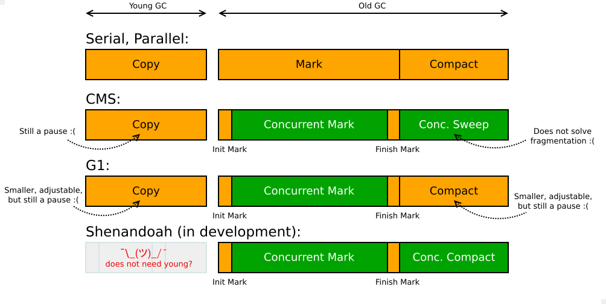

### GC LandScape

图1.*OpenJDK GC landscape. Yellow are stop-the-world phases, green are concurrent phases.*

- Serial + Parallel
  - 全程阻塞
- CMS
  - YGC --> Copy STW
  - OLD
    - 初始标记  --> STW
    - 并发标记 --> Concurrent
    - 完成标记 --> STW
    - 并发清理 --> Concurrent，但会有**`内存碎片`**
- G1 
  - YGC --> Copy STW, 相比 CMS 停顿事件更短更可调整
  - OLD
    - 初始标记  --> STW
    - 并发标记 --> Concurrent
    - 完成标记 --> STW
    - 清理        --> STW 停顿时间更短+可控