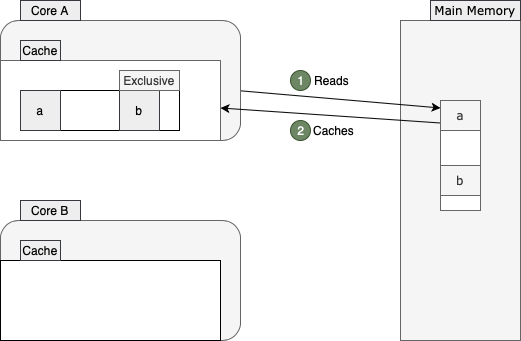

### 缓存行 - Cache Line

> CPU 读取主存目标数据到缓存中，往往会顺带读取目标数据地址附近的数据

#### 多核 CPU 缓存间的缓存一致性协议(以 MESI 为例)

> MESI --->  **`Modified`**  **`Exclusive`**   **`Shared`**   **`Invalid`**

发生过程：



```
1. CoreA 读取变量 a 到自己的缓存行，顺带着读取到了变量 b，此时是 Exclusive 状态
```


```
2. 此时 CoreB 读取变量 b 到自己的缓存行中，顺带着读取到了变量 a，变成了 Shared 状态
```


```
3. CoreA 此时修改了自己缓存中 a 的值，变为 Modified 状态，并通知了 CoreB，此时 CoreB 会将自己的缓存行置为 Invalid 状态
```


```
4. 这时 CoreB 要想操作 b 的化就要重新从内存中读取 b，而 b 和 a 也在 CoreA 的缓存行中，需要 CoreA 把它的缓存行数据刷新到主存中
```


```
5. 以上现象就是伪共享，即使处理的是不同数据，因为在同一个缓存行中而导致 cache miss，增加了两次 CPU 与主存的交互
```


### @Contended 注解

- 缓存行填充注解，注解在字段上，会使对应字段只出现在自己的缓存行里(加 padding).注解在类上，会给类的所有字段加 padding
- 默认只对 JDK 内部的类生效，可以通过 VM 参数  **`-XX:-RestrictContended`** 来解除这个限制
- 默认 **padding** 大小是 **128 bytes**,也可以通过 VM 参数  **`-XX:ContendedPaddingWidth=XX`** 来指定，值在 **[0 - 8192]** 之间
- 禁用缓存行填充： **`-XX:-EnableContended`**


### 使用示例

- **Striped64**
- **Thread** 中实现 **ThreadLocalRandom** 的几个关键字段
- **ForkJoinPool**
- **ConcurrentHashMap**
- **Exchanger**


> 参考

[java-false-sharing-contended](https://www.baeldung.com/java-false-sharing-contended)