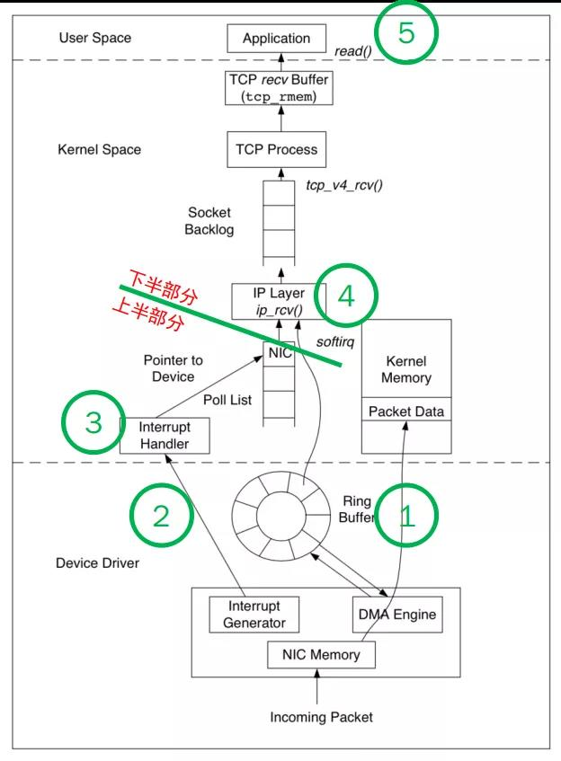

[TOC]

## 阻塞 IO

**代码**
``` java
listenfd = socket();   // 打开一个网络通信端口
bind(listenfd);        // 绑定
listen(listenfd);      // 监听
while(1) {
  connfd = accept(listenfd);  // 阻塞建立连接
  int n = read(connfd, buf);  // 阻塞读数据
  doSomeThing(buf);  // 利用读到的数据做些什么
  close(connfd);     // 关闭连接，循环等待下一个连接
```

**代码阻塞过程（accept 函数和 read 函数）**


**read 函数阻塞过程**


**阻塞 IO 整体流程如下**


****

## 非阻塞 IO
**优化点**

	read 函数的第一阶段

**优化内容**

> 操作系统层面优化 read 函数，在没有数据到达时（到达网卡并拷贝到了内核缓冲区），**立即返回一个错误值（-1），而不是阻塞等待**。操作系统提供了这样的功能，**只需要在调用 read 前，将文件描述符设置为非阻塞即可**。

**代码**

```java
fcntl(connfd, F_SETFL, O_NONBLOCK);
int n = read(connfd, buffer) != SUCCESS);
// 需要用户线程循环调用 read，直到返回值不为 -1，再开始处理业务
```

**非阻塞 read 函数阻塞过程**


> 注意：此处的**非阻塞是指 read 的第一阶段，即网卡数据到达之前，第二阶段将网卡数据拷贝到内核还是阻塞的**
>
> **`缺点：`**会消耗 CPU 资源

**非阻塞 IO 整体流程如下**


****

## IO 多路复用

**优化**

每 accept 一个客户端连接后，将这个文件描述符（connfd）放到一个数组里。

``` java
fdlist.add(connfd);
```

然后弄一个新的线程去不断遍历这个数组，调用每一个元素的非阻塞 read 方法。

``` java
// 这样就成功用一个线程处理了多个客户端连接
while(1) {
  for(fd <-- fdlist) {
    // read 就是一次系统调用，耗性能
    if(read(fd) != -1) {
      doSomeThing();
    }
  }
}
```


### select


**优化**

select 是操作系统提供的系统调用函数，可以把一批文件描述符发给操作系统，**让操作系统去遍历，确定哪个文件描述符可以读写，然后告诉用户程序处理**。


**select 系统调用的函数定义如下**

``` java
int select(
    int nfds,
    fd_set *readfds,
    fd_set *writefds,
    fd_set *exceptfds,
    struct timeval *timeout);
// nfds:监控的文件描述符集里最大文件描述符加 1
// readfds：监控有读数据到达文件描述符集合，传入传出参数
// writefds：监控写数据到达文件描述符集合，传入传出参数
// exceptfds：监控异常发生达文件描述符集合, 传入传出参数
// timeout：定时阻塞监控时间，3 种情况
//  1. NULL，永远等下去
//  2. 设置timeval，等待固定时间
//  3. 设置timeval里时间均为 0，检查描述字后立即返回，轮询
```


**服务端代码处理**

首先一个线程不断接收客户端连接，并把 socket 文件描述符放到一个 list 里：

``` java
while(1) {
  connfd = accept(listenfd);
  fcntl(connfd, F_SETFL, O_NONBLOCK);
  fdlist.add(connfd);
}
```

然后**另一个线程不再自己遍历而是调用 select，将这批文件描述符 list 交给操作系统遍历**：

``` java
while(1) {
  // 把一堆文件描述符 list 传给 select 函数
  // 有已就绪的文件描述符就返回，nready 表示有多少个就绪的
  nready = select(list);
  ...
}
```

当 select 函数返回(会将准备就绪的文件描述符做上标识)后，用户依然需要遍历刚刚提交的 list：

``` java
while(1) {
  nready = select(list);
  // 用户层依然要遍历，只不过少了很多无效的系统调用
  for(fd <-- fdlist) {
    if(fd != -1) {
      // 只读已就绪的文件描述符
      read(fd, buf);
      // 总共只有 nready 个已就绪描述符，不用过多遍历
      if(--nready == 0) break;
    }
  }
}
```


**select 细节**

1. select 调用需要传入 fd 数组，需要**拷贝一份到内核，高并发场景下这样的拷贝消耗的资源是惊人的** --> 可优化为不复制
2. select 在内核层仍然是通过遍历的方式检查文件描述符的就绪状态，是个同步过程，只不过**无系统调用切换上下文的开销** --> 内核层可优化为异步事件通知
3. select 仅仅**返回可读文件描述符的个数**，具体哪个可读还是要用户自己遍历 --> 可优化为只返回给用户就绪的文件描述符，无需用户做无效的遍历


**select 整体流程**


可以看到，这种方式，既做到了一个线程处理多个客户端连接（文件描述符），又减少了系统调用的开销（多个文件描述符只有一次 select 的系统调用 + n 次就绪状态的文件描述符的 read 系统调用）。


### poll

**poll 函数**

``` java
int poll(struct pollfd *fds, nfds_tnfds, int timeout);

struct pollfd {
  intfd; /*文件描述符*/
  shortevents; /*监控的事件*/
  shortrevents; /*监控事件中满足条件返回的事件*/
};
```


**与 select 的区别**

主要区别：去掉了 **select 只能监听 1024 个文件描述符的限制。**


### epoll

**针对 select 三个细节的优化**

1. **内核中保存一份文件描述符集合，无需用户每次都重新传入，只需告诉内核修改的部分即可。**
2. **内核不再通过轮询的方式找到就绪的文件描述符，而是通过异步 IO 事件唤醒。**
3. **内核仅会将有 IO 事件的文件描述符返回给用户，用户也无需遍历整个文件描述符集合。**


**相关函数**

第一步，创建一个 epoll 句柄

``` java
int epoll_create(int size);
```

第二步，向内核添加、修改或删除要监控的文件描述符

``` java
int epoll_ctl(
  int epfd, int op, int fd, struct epoll_event *event);
```

第三步，类似发起来 select() 调用

``` java
int epoll_wait(
  int epfd, struct epoll_event *events, int max events, int timeout);
```


**epoll 的限制**

> epoll 在应对大量网络连接时，只有**活跃连接很少的情况下才能表现的性能优异**。换句话说，epoll 在处理大量非活跃的连接时性能才会表现的优异。

**epoll 的处理步骤(以网卡接收数据为例)**



1. NIC 接收到数据，通过 DMA 方式写入内存(Ring Buffer 和 sk_buff)。

2. NIC 发出中断请求（IRQ），告诉内核有新的数据过来了。

3. driver 的 napi_schedule 函数响应 IRQ，并在合适的时机发出软中断（NET_RX_SOFTIRQ）

4. driver 的 net_rx_action 函数响应软中断，从 Ring Buffer 中批量拉取收到的数据。并处理协议栈，填充 Socket 并交给用户进程。

5. 系统切换为用户态，多个用户进程切换为“可运行状态”，按 CPU 时间片调度，处理数据内容。

   一句话概括就是：等着收到一批数据，再一次批量的处理数据。


### epoll 相比 select 和 poll 的优化

- epoll 在内核中通过 **红黑树** 管理海量的连接，所以在调用 **epoll_wait** 获取 **IO就绪** 的
  socket时，不需要传入监听的socket文件描述符。从而避免了海量的文件描述符集合在 **用户空间** 和 **内核空间** 中来回复制。

  > select，poll 每次调用时都需要传递**全量的**文件描述符集合，导致大量**频繁的拷贝**操作。

- epoll 仅会通知 **IO就绪** 的 socket。避免了在 **用户空间** 遍历的开销

  > select，poll 只会在 IO就绪 的socket上**打好标记，依然是全量返回**，所以在用户空间还需要用户程序在一次遍历全量集合找出具体 IO就绪 的socket。

- epoll 通过在 socket 的等待队列上注册回调函数 **ep_poll_callback** 通知用户程序 **IO就绪** 的 socket，避免了在内核中轮询的开销。

  > 部分情况下 socket 上并不总是 IO活跃 的，在面对海量连接的情况下， select，poll 采用内核轮询的方式获取 IO活跃 的socket，无疑是性能低下的核心原因。

****

**来源**

[你管这破玩意叫 IO 多路复用？](https://blog.csdn.net/qq_42046105/article/details/115649083?spm=1001.2014.3001.5501)

[深入理解 epoll](https://mp.weixin.qq.com/s/_G9KRzIl7B7cPWKiMsZzOA)