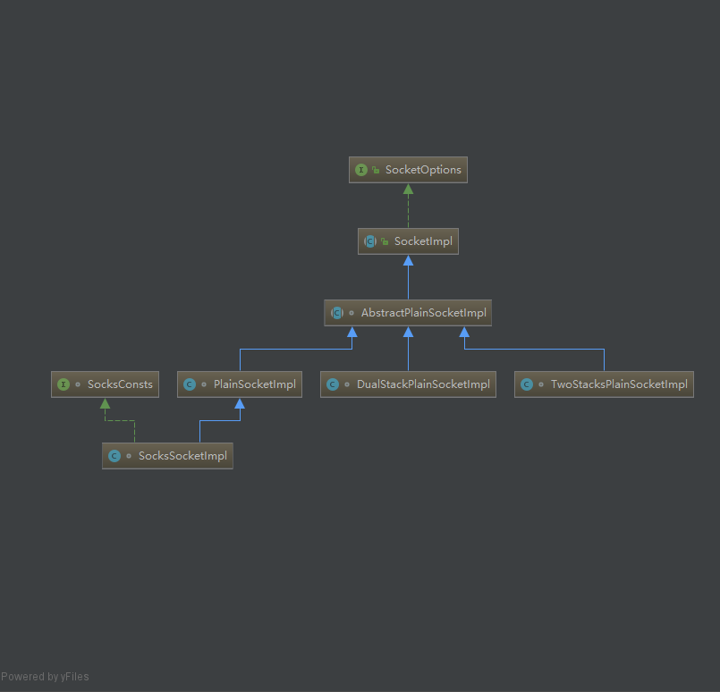

## new ServerSocket(PORT) 做了什么？

### java.net.ServerSocket.java

```java
/**
* Params:
* 	port: 端口号，如果是 0 会随机分配端口
* 	backlog: 请求等待队列最大长度，默认 50
* 	bindAddr: 绑定到的本地地址 InetAddress
*/
public ServerSocket(int port, int backlog, InetAddress bindAddr) throws IOException {
    // 设置具体的 Socket 实现类，此处是 SocksSocketImpl
    setImpl();
    if (port < 0 || port > 0xFFFF)
        throw new IllegalArgumentException(
                "Port value out of range: " + port);
    if (backlog < 1)
      // 设置 backlog - request 请求连接队列的最大长度
      backlog = 50;
    try {
        // 绑定 ip 和 port
        bind(new InetSocketAddress(bindAddr, port), backlog);
    } catch(SecurityException e) {
        close();
        throw e;
    } catch(IOException e) {
        close();
        throw e;
    }
}

private void setImpl() {
    if (factory != null) {
        impl = factory.createSocketImpl();
        checkOldImpl();
    } else {
        // No need to do a checkOldImpl() here, we know it's an up to date
        // SocketImpl!
        impl = new SocksSocketImpl();
    }
    if (impl != null)
      impl.setServerSocket(this);
}

public void bind(SocketAddress endpoint, int backlog) throws IOException {
    if (isClosed())
        throw new SocketException("Socket is closed");
    if (!oldImpl && isBound())
        throw new SocketException("Already bound");
    if (endpoint == null)
        endpoint = new InetSocketAddress(0);
    if (!(endpoint instanceof InetSocketAddress))
        throw new IllegalArgumentException("Unsupported address type");
    InetSocketAddress epoint = (InetSocketAddress) endpoint;
    if (epoint.isUnresolved())
        throw new SocketException("Unresolved address");
    if (backlog < 1)
        backlog = 50;
    try {
        SecurityManager security = System.getSecurityManager();
        if (security != null)
            security.checkListen(epoint.getPort());
        // 端口绑定，最终调用 AbstractPlainSocketImpl 的 
        // abstract void socketBind(InetAddress address, int port) 方法
        getImpl().bind(epoint.getAddress(), epoint.getPort());
        // 端口监听，最终调用 AbstractPlainSocketImpl 的
        // abstract void socketListen(int count) 方法
        getImpl().listen(backlog);
        bound = true;
    } catch(SecurityException e) {
        bound = false;
        throw e;
    } catch(IOException e) {
        bound = false;
        throw e;
    }
}
```

### java.net.AbstractPlainSocketImpl 抽象类

```java
// 定义了一系列抽象方法由子类去实现，不同平台有不同实现，由实现去调用 native 方法
abstract void socketCreate(boolean isServer) throws IOException;
abstract void socketConnect(InetAddress address, int port, int timeout)
    throws IOException;
abstract void socketBind(InetAddress address, int port)
    throws IOException;
abstract void socketListen(int count)
    throws IOException;
abstract void socketAccept(SocketImpl s)
    throws IOException;
abstract int socketAvailable()
    throws IOException;
abstract void socketClose0(boolean useDeferredClose)
    throws IOException;
abstract void socketShutdown(int howto)
    throws IOException;
abstract void socketSetOption(int cmd, boolean on, Object value)
    throws SocketException;
abstract int socketGetOption(int opt, Object iaContainerObj) throws SocketException;
abstract void socketSendUrgentData(int data)
    throws IOException;
```

### AbstractPlainSocketImpl 的实现类

### Linux 平台

> **PlainSocketImpl**   实现了父类 AbstractPlainSocketImpl 的抽象方法，定义为 native 方法

```java
native void socketCreate(boolean isServer) throws IOException;
native void socketConnect(InetAddress address, int port, int timeout)
    throws IOException;
native void socketBind(InetAddress address, int port)
    throws IOException;
native void socketListen(int count) throws IOException;
native void socketAccept(SocketImpl s) throws IOException;
native int socketAvailable() throws IOException;
native void socketClose0(boolean useDeferredClose) throws IOException;
native void socketShutdown(int howto) throws IOException;
static native void initProto();
native void socketSetOption0(int cmd, boolean on, Object value)
        throws SocketException;
native int socketGetOption(int opt, Object iaContainerObj) throws SocketException;
native void socketSendUrgentData(int data) throws IOException;
```


> **SocksSocketImpl** 又继承了 PlainSocketImpl，作为 Socket 的默认实现



### Windows 平台

> **DualStackPlainSocketImpl** 实现了父类 AbstractPlainSocketImpl 的抽象方法，定义为 native 方法

```java
static native void initIDs();
static native int socket0(boolean stream, boolean v6Only) throws IOException;
static native void bind0(int fd, InetAddress localAddress, int localport,
                             boolean exclBind)
    throws IOException;
static native int connect0(int fd, InetAddress remote, int remotePort)
    throws IOException;
static native void waitForConnect(int fd, int timeout) throws IOException;
static native int localPort0(int fd) throws IOException;
static native void localAddress(int fd, InetAddressContainer in) throws SocketException;
static native void listen0(int fd, int backlog) throws IOException;
static native int accept0(int fd, InetSocketAddress[] isaa) throws IOException;
static native void waitForNewConnection(int fd, int timeout) throws IOException;
static native int available0(int fd) throws IOException;
static native void close0(int fd) throws IOException;
static native void shutdown0(int fd, int howto) throws IOException;
static native void setIntOption(int fd, int cmd, int optionValue) throws SocketException;
static native int getIntOption(int fd, int cmd) throws SocketException;
static native void sendOOB(int fd, int data) throws IOException;
static native void configureBlocking(int fd, boolean blocking) throws IOException;
```

> **SocksSocketImpl** 又继承了 PlainSocketImpl，作为 Socket 的默认实现

### native 加载的类库

> ClassLoder 类加载查找类库中的 native 方法

```java
// Invoked in the VM class linking code.
// name 形如：Java_java_net_PlainSocketImpl_socketBind
static long findNative(ClassLoader loader, String name) {
    // 如果 loader 为 null 就从默认加载的系统 native 库中查找
    Vector<NativeLibrary> libs =
        loader != null ? loader.nativeLibraries : systemNativeLibraries;
    synchronized (libs) {
        int size = libs.size();
        for (int i = 0; i < size; i++) {
            NativeLibrary lib = libs.elementAt(i);
            long entry = lib.find(name);
            if (entry != 0)
              return entry;
        }
    }
    return 0;
} 
```

> Linux 中上述方法查找的本地 native 库如下(以 adopt-openjdk-1.8.0_292 为例)：

- [JAVA_HOME]/jre/lib/amd64/libzip.so
- [JAVA_HOME]/jre/lib/amd64/libinstrument.so
- [JAVA_HOME]/jre/lib/amd64/libnio.so
- [JAVA_HOME]/jre/lib/amd64/libnet.so