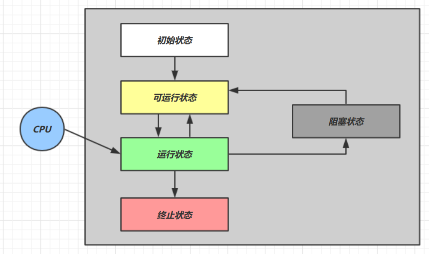

# 无锁并发

## 1. 问题提出

有如下需求，保证 `account.withdraw` 取款方法的线程安全

```java
package cn.itcast;

import java.util.ArrayList;
import java.util.List;

interface Account {
    // 获取余额
    Integer getBalance();

    // 取款
    void withdraw(Integer amount);

    /**
     * 方法内会启动 1000 个线程，每个线程做 -10 元 的操作
     * 如果初始余额为 10000 那么正确的结果应当是 0
     */
    static void demo(Account account) {
        List<Thread> ts = new ArrayList<>();
        long start = System.nanoTime();
        for (int i = 0; i < 1000; i++) {
            ts.add(new Thread(() -> {
                account.withdraw(10);
            }));
        }
        ts.forEach(Thread::start);
        ts.forEach(t -> {
            try {
                t.join();
            } catch (InterruptedException e) {
                e.printStackTrace();
            }
        });
        long end = System.nanoTime();
        System.out.println(account.getBalance() 
                           + " cost: " + (end-start)/1000_000 + " ms");
    }
}
```

原有实现并不是线程安全的

```java
class AccountUnsafe implements Account {
    private Integer balance;

    public AccountUnsafe(Integer balance) {
        this.balance = balance;
    }

    @Override
    public Integer getBalance() {
        return balance;
    }

    @Override
    public void withdraw(Integer amount) {
        balance -= amount;
    }
}
```

执行测试代码

```java
public static void main(String[] args) {
    Account.demo(new AccountUnsafe(10000));
}
```

某次的执行结果

```
330 cost: 306 ms
```

### 1.1 为什么不安全

`withdraw` 方法

```java
public void withdraw(Integer amount) {
    balance -= amount;
}
```

对应的字节码

```java
ALOAD 0                                                          // <- this
ALOAD 0
GETFIELD cn/itcast/AccountUnsafe.balance : Ljava/lang/Integer;   // <- this.balance
INVOKEVIRTUAL java/lang/Integer.intValue ()I                     // 拆箱
ALOAD 1                                                          // <- amount
INVOKEVIRTUAL java/lang/Integer.intValue ()I                     // 拆箱
ISUB                                                             // 减法
INVOKESTATIC java/lang/Integer.valueOf (I)Ljava/lang/Integer;    // 结果装箱
PUTFIELD cn/itcast/AccountUnsafe.balance : Ljava/lang/Integer;   // -> this.balance
```

多线程执行流程

```
ALOAD 0                                     // thread-0 <- this
ALOAD 0
GETFIELD cn/itcast/AccountUnsafe.balance    // thread-0 <- this.balance
INVOKEVIRTUAL java/lang/Integer.intValue    // thread-0 拆箱
ALOAD 1                                     // thread-0 <- amount
INVOKEVIRTUAL java/lang/Integer.intValue    // thread-0 拆箱
ISUB                                        // thread-0 减法
INVOKESTATIC java/lang/Integer.valueOf      // thread-0 结果装箱
PUTFIELD cn/itcast/AccountUnsafe.balance    // thread-0 -> this.balance
    
    
ALOAD 0                                     // thread-1 <- this
ALOAD 0
GETFIELD cn/itcast/AccountUnsafe.balance    // thread-1 <- this.balance
INVOKEVIRTUAL java/lang/Integer.intValue    // thread-1 拆箱
ALOAD 1                                     // thread-1 <- amount
INVOKEVIRTUAL java/lang/Integer.intValue    // thread-1 拆箱
ISUB                                        // thread-1 减法
INVOKESTATIC java/lang/Integer.valueOf      // thread-1 结果装箱
PUTFIELD cn/itcast/AccountUnsafe.balance    // thread-1 -> this.balance
```

* 单核的指令交错
* 多核的指令交错

### 1.2 解决思路-锁

首先想到的是给 Account 对象加锁

```java
class AccountUnsafe implements Account {
    private Integer balance;

    public AccountUnsafe(Integer balance) {
        this.balance = balance;
    }

    @Override
    public synchronized Integer getBalance() {
        return balance;
    }

    @Override
    public synchronized void withdraw(Integer amount) {
        balance -= amount;
    }
}
```

结果为

```
0 cost: 399 ms
```

### 1.3 解决思路-无锁

```java
class AccountSafe implements Account {
    private AtomicInteger balance;

    public AccountSafe(Integer balance) {
        this.balance = new AtomicInteger(balance);
    }

    @Override
    public Integer getBalance() {
        return balance.get();
    }

    @Override
    public void withdraw(Integer amount) {
        while (true) {
            int prev = balance.get();
            int next = prev - amount;
            if (balance.compareAndSet(prev, next)) {
                break;
            }
        }
        // 可以简化为下面的方法
        // balance.addAndGet(-1 * amount);
    }
}
```

执行测试代码

```java
public static void main(String[] args) {
    Account.demo(new AccountSafe(10000));
}
```

某次的执行结果

```
0 cost: 302 ms
```

## 2. volatile 与 CAS

前面看到的 `AtomicInteger` 的解决方法，内部并没有用锁来保护共享变量的线程安全。那么它是如何实现的呢？

```java
public void withdraw(Integer amount) {
    // 需要不断尝试，直到成功为止
    while (true) {
        // 比如拿到了旧值 1000
        int prev = balance.get(); 
        // 在这个基础上 1000-10 = 990
        int next = prev - amount; 
        /*
        compareAndSet 正是做这个检查，在 set 前，先比较 prev 与当前值
        - 不一致了，next 作废，返回 false 表示失败
           比如，别的线程已经做了减法，当前值已经被减成了 990
           那么本线程的这次 990 就作废了，进入 while 下次循环重试
        - 一致，以 next 设置为新值，返回 true 表示成功         
        */
        if (balance.compareAndSet(prev, next)) {
            break;
        }
    }
}
```

其中的关键是 compareAndSet，它就是 CAS 的简称（也有 Compare And Swap 的说法），它必须是原子操作。

> **注意**
>
> 其实 CAS 的底层是 `lock cmpxchg` 指令（X86 架构），在单核 CPU 和多核 CPU 下都能够保证【比较-交换】的原子性。
>
> * 在多核状态下，某个核执行到带 lock 的指令时，CPU 会让总线锁住，当这个核把此指令执行完毕，再开启总线。这个过程中不会被线程的调度机制所打断，保证了多个线程对内存操作的准确性，是原子的。


### 2.1 慢动作分析

```java
@Slf4j
public class SlowMotion {

    public static void main(String[] args) {
        AtomicInteger balance = new AtomicInteger(10000);
        int mainPrev = balance.get();
        log.debug("try get {}", mainPrev);

        new Thread(() -> {
            sleep(1000);
            int prev = balance.get();
            balance.compareAndSet(prev, 9000);
            log.debug(balance.toString());
        }, "t1").start();


        sleep(2000);
        log.debug("try set 8000...");
        boolean isSuccess = balance.compareAndSet(mainPrev, 8000);
        log.debug("is success ? {}", isSuccess);
        if(!isSuccess){
            mainPrev = balance.get();
            log.debug("try set 8000...");
            isSuccess = balance.compareAndSet(mainPrev, 8000);
            log.debug("is success ? {}", isSuccess);
        }

    }


    private static void sleep(int millis) {
        try {
            Thread.sleep(millis);
        } catch (InterruptedException e) {
            e.printStackTrace();
        }
    }
}
```

输出结果

```
2019-10-13 11:28:37.134 [main] try get 10000
2019-10-13 11:28:38.154 [t1] 9000
2019-10-13 11:28:39.154 [main] try set 8000...
2019-10-13 11:28:39.154 [main] is success ? false
2019-10-13 11:28:39.154 [main] try set 8000...
2019-10-13 11:28:39.154 [main] is success ? true
```

### 2.2 为什么无锁效率高

* 无锁情况下，即使重试失败，线程始终在高速运行，没有停歇，而 synchronized 会让线程在没有获得锁的时候，发生上下文切换，进入阻塞。打个比喻
* 线程就好像高速跑道上的赛车，高速运行时，速度超快，一旦发生上下文切换，就好比赛车要减速、熄火，等被唤醒又得重新打火、启动、加速... 恢复到高速运行，代价比较大
* 但无锁情况下，因为线程要保持运行，需要额外 CPU 的支持，CPU 在这里就好比高速跑道，没有额外的跑道，线程想高速运行也无从谈起，虽然不会进入阻塞，但由于没有分到时间片，仍然会进入可运行状态，还是会导致上下文切换。



- 【可运行状态】指该线程已经被创建（与操作系统线程关联），可以由 CPU 调度执行
- 【运行状态】指获取了 CPU 时间片运行中的状态
  - 当 CPU 时间片用完，会从【运行状态】转换至【可运行状态】，会导致线程的上下文切换
- 【阻塞状态】
  - 如果调用了阻塞 API，如 BIO 读写文件，这时该线程实际不会用到 CPU，会导致线程上下文切换，进入【阻塞状态】
  - 等 BIO 操作完毕，会由操作系统唤醒阻塞的线程，转换至【可运行状态】
  - 与【可运行状态】的区别是，对【阻塞状态】的线程来说只要它们一直不唤醒，调度器就一直不会考虑调度它们


- `RUNNABLE` 当调用了 `start()` 方法之后，注意，**Java API** 层面的 `RUNNABLE` 状态涵盖了 **操作系统** 层面的【可运行状态】、【运行状态】和【阻塞状态】（由于 BIO 导致的线程阻塞，在 Java 里无法区分，仍然认为是可运行）
- `BLOCKED`，`WAITING`，`TIMED_WAITING` 都是 **Java API** 层面对【阻塞状态】的细分，后面会在状态转换一节详述

### 2.3 volatile

获取共享变量时，为了保证该变量的可见性，需要使用 volatile 修饰。

#### 为什么需要 volatile？

先来看一个现象，main 线程对 run 变量的修改对于 t 线程不可见，导致了 t 线程无法停止：

```java
static boolean run = true;

public static void main(String[] args) throws InterruptedException {
    Thread t = new Thread(()->{
        while(run){
            // ....
        }
    });
    t.start();

    Thread.sleep(1000);
    run = false; // 线程 t 不会如预想的停下来
}
```

为什么呢？分析一下：

1. 初始状态， t 线程刚开始从主内存读取了 run 的值到工作内存。


2. 因为 t 线程要频繁从主内存中读取 run 的值，JIT 编译器会将 run 的值缓存至自己工作内存中的高速缓存中，减少对主存中 run 的访问，提高效率


3. 1 秒之后，main 线程修改了 run 的值，并同步至主存，而 t 是从自己工作内存中的高速缓存中读取这个变量的值，结果永远是旧值


#### 可见性

volatile（易变关键字）

它可以用来修饰成员变量和静态成员变量，他可以避免线程从自己的工作缓存中查找变量的值，必须到主存中获取它的值，线程操作 volatile 变量都是直接操作主存。即一个线程对 volatile 变量的修改，对另一个线程可见。

> **注意**
>
> volatile 仅仅保证了共享变量的可见性，让其它线程能够看到最新值，但不能解决指令交错问题（不能保证原子性）

CAS 必须借助 volatile 才能读取到共享变量的最新值来实现【比较并交换】的效果

### 2.4 CAS 的特点

结合 CAS 和 volatile 可以实现无锁并发，适用于竞争不激烈、多核 CPU 的场景下。

- CAS 是基于乐观锁的思想：最乐观的估计，不怕别的线程来修改共享变量，就算改了也没关系，我吃亏点再重试呗。
- synchronized 是基于悲观锁的思想：最悲观的估计，得防着其它线程来修改共享变量，我上了锁你们都别想改，我改完了解开锁，你们才有机会。
- CAS 体现的是无锁并发、无阻塞并发，请仔细体会这两句话的意思
  - 因为没有使用 synchronized，所以线程不会陷入阻塞，这是效率提升的因素之一
  - 但如果竞争激烈，可以想到重试必然频繁发生，反而效率会受影响

## 3. 原子整数

JUC 并发包提供了：

- AtomicBoolean
- AtomicInteger
- AtomicLong

以 AtomicInteger 为例

```java
AtomicInteger i = new AtomicInteger(0);

// 获取并自增（i = 0, 结果 i = 1, 返回 0），类似于 i++
System.out.println(i.getAndIncrement());

// 自增并获取（i = 1, 结果 i = 2, 返回 2），类似于 ++i
System.out.println(i.incrementAndGet());

// 自减并获取（i = 2, 结果 i = 1, 返回 1），类似于 --i
System.out.println(i.decrementAndGet());

// 获取并自减（i = 1, 结果 i = 0, 返回 1），类似于 i--
System.out.println(i.getAndDecrement());

// 获取并加值（i = 0, 结果 i = 5, 返回 0）
System.out.println(i.getAndAdd(5));

// 加值并获取（i = 5, 结果 i = 0, 返回 0）
System.out.println(i.addAndGet(-5));

// 获取并更新（i = 0, p 为 i 的当前值, 结果 i = -2, 返回 0）
// 其中函数中的操作能保证原子，但函数需要无副作用
System.out.println(i.getAndUpdate(p -> p - 2));

// 更新并获取（i = -2, p 为 i 的当前值, 结果 i = 0, 返回 0）
// 其中函数中的操作能保证原子，但函数需要无副作用
System.out.println(i.updateAndGet(p -> p + 2));

// 获取并计算（i = 0, p 为 i 的当前值, x 为参数1, 结果 i = 10, 返回 0）
// 其中函数中的操作能保证原子，但函数需要无副作用
System.out.println(i.getAndAccumulate(10, (p, x) -> p + x));

// 计算并获取（i = 10, p 为 i 的当前值, x 为参数1, 结果 i = 0, 返回 0）
// 其中函数中的操作能保证原子，但函数需要无副作用
System.out.println(i.accumulateAndGet(-10, (p, x) -> p + x));
```

## 4. 原子引用

为什么需要引用类型？

- AtomicReference
- AtomicMarkableReference
- AtomicStampedReference

有如下方法

```java
public interface DecimalAccount {
    // 获取余额
    BigDecimal getBalance();

    // 取款
    void withdraw(BigDecimal amount);

    /**
     * 方法内会启动 1000 个线程，每个线程做 -10 元 的操作
     * 如果初始余额为 10000 那么正确的结果应当是 0
     */
    static void demo(DecimalAccount account) {
        List<Thread> ts = new ArrayList<>();
        for (int i = 0; i < 1000; i++) {
            ts.add(new Thread(() -> {
                account.withdraw(BigDecimal.TEN);
            }));
        }
        ts.forEach(Thread::start);
        ts.forEach(t -> {
            try {
                t.join();
            } catch (InterruptedException e) {
                e.printStackTrace();
            }
        });
        System.out.println(account.getBalance());
    }
}
```

试着提供不同的 DecimalAccount 实现，实现安全的取款操作

### 4.1 不安全实现

```java
class DecimalAccountUnsafe implements DecimalAccount {
    BigDecimal balance;

    public DecimalAccountUnsafe(BigDecimal balance) {
        this.balance = balance;
    }

    @Override
    public BigDecimal getBalance() {
        return balance;
    }

    @Override
    public void withdraw(BigDecimal amount) {
        BigDecimal balance = this.getBalance();
        this.balance = balance.subtract(amount);
    }
}
```

### 4.2 安全实现-使用锁

```java
class DecimalAccountSafeLock implements DecimalAccount {
    private final Object lock = new Object();
    BigDecimal balance;

    public DecimalAccountSafeLock(BigDecimal balance) {
        this.balance = balance;
    }

    @Override
    public BigDecimal getBalance() {
        return balance;
    }

    @Override
    public void withdraw(BigDecimal amount) {
        synchronized (lock) {
            BigDecimal balance = this.getBalance();
            this.balance = balance.subtract(amount);
        }
    }
}
```

### 4.3 安全实现-使用 CAS

```java
class DecimalAccountSafeCas implements DecimalAccount {
    AtomicReference<BigDecimal> ref;

    public DecimalAccountSafeCas(BigDecimal balance) {
        ref = new AtomicReference<>(balance);
    }

    @Override
    public BigDecimal getBalance() {
        return ref.get();
    }

    @Override
    public void withdraw(BigDecimal amount) {
        while (true) {
            BigDecimal prev = ref.get();
            BigDecimal next = prev.subtract(amount);
            if (ref.compareAndSet(prev, next)) {
                break;
            }
        }
    }
}
```

测试代码

```java
DecimalAccount.demo(new DecimalAccountUnsafe(new BigDecimal("10000")));
DecimalAccount.demo(new DecimalAccountSafeLock(new BigDecimal("10000")));
DecimalAccount.demo(new DecimalAccountSafeCas(new BigDecimal("10000")));
```

运行结果

```
4310 cost: 425 ms
0 cost: 285 ms
0 cost: 274 ms
```

### 4.4 ABA 问题及解决

#### ABA 问题

```java
@Slf4j
public class TestABA {

    public static void main(String[] args) throws InterruptedException {
        AtomicReference<String> ref = new AtomicReference<>("A");

        log.debug("main start...");
        String prev = ref.get();

        new Thread(() -> {
            log.debug("change A->B {}", ref.compareAndSet("A", "B"));
            // 盲区
            log.debug("do sth unknown...");
            log.debug("change B->A {}", ref.compareAndSet("B", "A"));
        }).start();

        // 1s 后
        Thread.sleep(1000);

        // 认为 prev 仍为 A, 打印 true
        log.debug("change A->C {}", ref.compareAndSet(prev, "C"));
    }
}
```

输出

```
2019-10-13 15:01:53.276 [main] main start...
2019-10-13 15:01:53.276 [Thread-1] change A->B true
2019-10-13 15:01:53.283 [Thread-1] do sth unknown...
2019-10-13 15:01:53.283 [Thread-1] change B->A true
2019-10-13 15:01:54.284 [main] change A->C true
```


总的解决思路是，使用 CAS 修改前想办法检查，`别人动过没 ? 修改失败 : 修改成功`，怎么检查别人动过没呢？不能光比较 A，还要进行一个额外的检查

#### AtomicStampedReference

```java
@Slf4j
public class TestABAAtomicStampedReference {
    public static void main(String[] args) throws InterruptedException {
        AtomicStampedReference<String> ref = new AtomicStampedReference<>("A", 0);

        log.debug("main start...");
        String prev = ref.getReference();
        int mstamp = ref.getStamp();
        log.debug("版本为: {}", mstamp);

        new Thread(() -> {
            // 每次都得在上一个版本的基础上更新，更新成功版本 +1
            int stamp = ref.getStamp();
            log.debug("change A->B {}", ref.compareAndSet("A", "B", stamp, stamp + 1));

            // 不再是盲区
            log.debug("do sth unknown...");

            // 每次都得在上一个版本的基础上更新，更新成功版本 +1
            stamp = ref.getStamp();
            log.debug("change B->A {}", ref.compareAndSet("B", "A", stamp, stamp + 1));
        }).start();

        // 1s 后
        Thread.sleep(1000);

        // 每次都得在上一个版本的基础上更新，更新成功版本 +1
        // 这时 prev 虽然仍为 A, 但版本已经增长至 2
        log.debug("change A->C {}", ref.compareAndSet(prev, "OK", mstamp, mstamp + 1));
    }
}
```

输出为

```
2019-10-13 21:20:11.848 [main] main start...
2019-10-13 21:20:11.853 [main] 版本为: 0
2019-10-13 21:20:11.865 [Thread-1] change A->B true
2019-10-13 21:20:11.865 [Thread-1] do sth unknown...
2019-10-13 21:20:11.865 [Thread-1] change B->A true
2019-10-13 21:20:12.864 [main] change A->C false
```


AtomicStampedReference 可以给引用加上版本号，追踪引用的整个变化过程，如：
`A -> B -> A -> C`，通过AtomicStampedReference，我们可以知道，引用变量中途被更改了几次。

但是有时候，并不关心引用变量更改了几次，只是单纯的关心**是否更改过**，所以就有了 AtomicMarkableReference

#### AtomicMarkableReference

```java
class GarbageBag {
    String desc;

    public GarbageBag(String desc) {
        this.desc = desc;
    }

    public void setDesc(String desc) {
        this.desc = desc;
    }

    @Override
    public String toString() {
        return super.toString() + " " + desc;
    }
}
```


```java
@Slf4j
public class TestABAAtomicMarkableReference {
    public static void main(String[] args) throws InterruptedException {
        GarbageBag bag = new GarbageBag("装满了垃圾");
        // 参数2 mark 可以看作一个标记，表示垃圾袋满了
        AtomicMarkableReference<GarbageBag> ref = new AtomicMarkableReference<>(bag, true);

        log.debug("主线程 start...");
        GarbageBag prev = ref.getReference();
        log.debug(prev.toString());

        new Thread(() -> {
            log.debug("打扫卫生的线程 start...");
            bag.setDesc("空垃圾袋");
            while (!ref.compareAndSet(bag, bag, true, false)) {}
            log.debug(bag.toString());
        }).start();

        Thread.sleep(1000);
        log.debug("主线程想换一只新垃圾袋？");
        boolean success = ref.compareAndSet(prev, new GarbageBag("空垃圾袋"), true, false);
        log.debug("换了么？" + success);

        log.debug(ref.getReference().toString());
    }
}
```

输出

```
2019-10-13 15:30:09.264 [main] 主线程 start...
2019-10-13 15:30:09.270 [main] cn.itcast.GarbageBag@5f0fd5a0 装满了垃圾
2019-10-13 15:30:09.293 [Thread-1] 打扫卫生的线程 start...
2019-10-13 15:30:09.294 [Thread-1] cn.itcast.GarbageBag@5f0fd5a0 空垃圾袋
2019-10-13 15:30:10.294 [main] 主线程想换一只新垃圾袋？
2019-10-13 15:30:10.294 [main] 换了么？false
2019-10-13 15:30:10.294 [main] cn.itcast.GarbageBag@5f0fd5a0 空垃圾袋
```

可以注释掉打扫卫生线程代码，再观察输出

## 5. 原子累加器

### 5.1 累加器性能比较

```java
private static <T> void demo(Supplier<T> adderSupplier, Consumer<T> action) {
    T adder = adderSupplier.get();

    long start = System.nanoTime();

    List<Thread> ts = new ArrayList<>();
    // 10 个线程，每人累加 10 万
    for (int i = 0; i < 10; i++) {
        ts.add(new Thread(() -> {
            for (int j = 0; j < 100000; j++) {
                action.accept(adder);
            }
        }));
    }
    ts.forEach(t -> t.start());
    ts.forEach(t -> {
        try {
            t.join();
        } catch (InterruptedException e) {
            e.printStackTrace();
        }
    });

    long end = System.nanoTime();
    System.out.println(adder + " cost:" + (end - start)/1000_000);
}
```

比较 AtomicLong 与 LongAdder

```java
for (int i = 0; i < 5; i++) {
    demo(() -> new LongAdder(), adder -> adder.increment());
}

for (int i = 0; i < 5; i++) {
    demo(() -> new AtomicLong(), adder -> adder.getAndIncrement());
}
```

输出

```
1000000 cost:43
1000000 cost:9
1000000 cost:7
1000000 cost:7
1000000 cost:7

1000000 cost:31
1000000 cost:27
1000000 cost:28
1000000 cost:24
1000000 cost:22
```

性能提升的原因很简单，就是在有竞争时，设置多个累加单元，Therad-0 累加 Cell[0]，而 Thread-1 累加 Cell[1]... 最后将结果汇总。这样它们在累加时操作的不同的 Cell 变量，因此减少了 CAS 重试失败，从而提高性能。


### 5.2 LongAdder 原理分析

LongAdder 是并发大师 @author Doug Lea 的作品，设计的非常精巧

LongAdder 类有几个关键域

```java
// 累加单元数组, 懒惰初始化
transient volatile Cell[] cells;

// 基础值, 如果没有竞争, 则用 cas 累加这个域
transient volatile long base;

// 在 cells 创建或扩容时, 置为 1, 表示加锁
transient volatile int cellsBusy;
```

其中 Cell 即为累加单元

```java
// 防止缓存行伪共享
@sun.misc.Contended 
static final class Cell {
    volatile long value;
    Cell(long x) { value = x; }
    
    // 最重要的方法, 用来 cas 方式进行累加, prev 表示旧值, next 表示新值
    final boolean cas(long prev, long next) {
        return UNSAFE.compareAndSwapLong(this, valueOffset, prev, next);
    }
    // 省略不重要代码
}
```

#### 伪共享问题

速度比较


| 从 cpu 到 | 大约需要的时钟周期               |
| --------- | -------------------------------- |
| 寄存器    | 1 cycle (4GHz 的 CPU 约为0.25ns) |
| L1        | 3~4 cycle                        |
| L2        | 10~20 cycle                      |
| L3        | 40~45 cycle                      |
| 内存      | 120~240 cycle                    |

因为 CPU 与 内存的速度差异很大，需要靠预读数据至缓存来提升效率。

而缓存以缓存行为单位，每个缓存行对应着一块内存，一般是 64 byte（8 个 long）

缓存的加入会造成数据副本的产生，即同一份数据会缓存在不同核心的缓存行中

CPU 要保证数据的一致性，如果某个 CPU 核心更改了数据，其它 CPU 核心对应的整个缓存行必须失效


因为 Cell 是数组形式，在内存中是连续存储的，一个 Cell 为 24 字节（16 字节的对象头和 8 字节的 value），因此缓存行可以存下 2 个的 Cell 对象。这样问题来了：

* Core-0 要修改 Cell[0]
* Core-1 要修改 Cell[1]

无论谁修改成功，都会导致对方 Core 的缓存行失效，比如 Core-0 中 `Cell[0]=6000, Cell[1]=8000 `  要累加 ` Cell[0]=6001, Cell[1]=8000 `，这时会让 Core-1 的缓存行失效

@sun.misc.Contended 用来解决这个问题，它的原理是在使用此注解的对象或字段的前后各增加 128 字节大小的 padding，从而让 CPU 将对象预读至缓存时占用不同的缓存行，这样，不会造成对方缓存行的失效


累加主要调用下面的方法

```java
public void add(long x) {
    // as 为累加单元数组
    // b 为基础值
    // x 为累加值
    Cell[] as; long b, v; int m; Cell a;
    // 进入 if 的两个条件
    // 1. as 有值, 表示已经发生过竞争, 进入 if
    // 2. cas 给 base 累加时失败了, 表示 base 发生了竞争, 进入 if
    if ((as = cells) != null || !casBase(b = base, b + x)) {
        // uncontended 表示 cell 没有竞争
        boolean uncontended = true;
        if (
            // as 还没有创建
            as == null || (m = as.length - 1) < 0 ||
            // 当前线程对应的 cell 还没有
            (a = as[getProbe() & m]) == null ||
            // cas 给当前线程的 cell 累加失败 uncontended=false ( a 为当前线程的 cell )
            !(uncontended = a.cas(v = a.value, v + x))
        ) {
            // 进入 cell 数组创建、cell 创建的流程
            longAccumulate(x, null, uncontended);
        }
    }
}
```
add 流程图


```java
final void longAccumulate(long x, LongBinaryOperator fn,
                              boolean wasUncontended) {
    int h;
    // 当前线程还没有对应的 cell, 需要随机生成一个 h 值用来将当前线程绑定到 cell
    if ((h = getProbe()) == 0) {
        // 初始化 probe
        ThreadLocalRandom.current();
        // h 对应新的 probe 值, 用来对应 cell
        h = getProbe();
        wasUncontended = true;
    }
    // cell 为 true 表示需要扩容
    boolean collide = false;                
    for (;;) {
        Cell[] as; Cell a; int n; long v;
        // 已经有了 cells
        if ((as = cells) != null && (n = as.length) > 0) {
            // 还没有 cell
            if ((a = as[(n - 1) & h]) == null) {
                // 为 cellsBusy 加锁, 创建 cell, cell 的初始累加值为 x
                // 成功则 break, 否则继续 continue 循环
            }
            // 有竞争, 改变线程对应的 cell 来重试 cas
            else if (!wasUncontended)
                wasUncontended = true;
            // cas 尝试累加, fn 配合 LongAccumulator 不为 null, 配合 LongAdder 为 null
            else if (a.cas(v = a.value, ((fn == null) ? v + x : fn.applyAsLong(v, x))))
                break;
            // 如果 cells 长度已经超过了最大长度, 或者已经扩容, 改变线程对应的 cell 来重试 cas
            else if (n >= NCPU || cells != as)
                collide = false;
            // 确保 collide 为 false 进入此分支, 就不会进入下面的 else if 进行扩容了
            else if (!collide)
                collide = true;
            // 加锁
            else if (cellsBusy == 0 && casCellsBusy()) {
                // 加锁成功, 扩容
                continue;
            }
            // 改变线程对应的 cell
            h = advanceProbe(h);
        }
        // 还没有 cells, 尝试给 cellsBusy 加锁
        else if (cellsBusy == 0 && cells == as && casCellsBusy()) {
            // 加锁成功, 初始化 cells, 最开始长度为 2, 并填充一个 cell
            // 成功则 break;
        }
        // 上两种情况失败, 尝试给 base 累加
        else if (casBase(v = base, ((fn == null) ? v + x : fn.applyAsLong(v, x))))
            break;
    }
}
```


longAccumulate 流程图

每个线程刚进入 longAccumulate 时，会尝试对应一个 cell 对象（找到一个坑位）


获取最终结果通过 sum 方法

```java
public long sum() {
    Cell[] as = cells; Cell a;
    long sum = base;
    if (as != null) {
        for (int i = 0; i < as.length; ++i) {
            if ((a = as[i]) != null)
                sum += a.value;
        }
    }
    return sum;
}
```


## 6. Unsafe

### 6.1 概述

Unsafe 对象提供了非常底层的，操作内存、线程的方法，Unsafe 对象不能直接调用，只能通过反射获得

```java
public class UnsafeAccessor {
    static Unsafe unsafe;

    static {
        try {            
            Field theUnsafe = Unsafe.class.getDeclaredField("theUnsafe");
            theUnsafe.setAccessible(true);
            unsafe = (Unsafe) theUnsafe.get(null);
        } catch (NoSuchFieldException | IllegalAccessException e) {
            throw new Error(e);
        }
    }

    static Unsafe getUnsafe() {
        return unsafe;
    }
}
```


### 6.2 Unsafe CAS 操作

```java
@Data
class Student {
    volatile int id;
    volatile String name;
}
```


```java
Unsafe unsafe = UnsafeAccessor.getUnsafe();
Field id = Student.class.getDeclaredField("id");
Field name = Student.class.getDeclaredField("name");
// 获得成员变量的偏移量
long idOffset = UnsafeAccessor.unsafe.objectFieldOffset(id);
long nameOffset = UnsafeAccessor.unsafe.objectFieldOffset(name);

Student student = new Student();
// 使用 cas 方法替换成员变量的值
UnsafeAccessor.unsafe.compareAndSwapInt(student, idOffset, 0, 20);  // 返回 true
UnsafeAccessor.unsafe.compareAndSwapObject(student, nameOffset, null, "张三"); // 返回 true

System.out.println(student);
```

输出

```
Student(id=20, name=张三)
```


使用自定义的 AtomicData 实现之前线程安全的原子整数 Account 实现

```java
class AtomicData {
    private volatile int data;
    static final Unsafe unsafe;
    static final long DATA_OFFSET;

    static {
        unsafe = UnsafeAccessor.getUnsafe();
        try {
            // data 属性在 DataContainer 对象中的偏移量，用于 Unsafe 直接访问该属性
            DATA_OFFSET = unsafe.objectFieldOffset(AtomicData.class.getDeclaredField("data"));
        } catch (NoSuchFieldException e) {
            throw new Error(e);
        }
    }

    public AtomicData(int data) {
        this.data = data;
    }

    public void decrease(int amount) {
        int oldValue;
        while(true) {
            // 获取共享变量旧值，可以在这一行加入断点，修改 data 调试来加深理解
            oldValue = data;
            // cas 尝试修改 data 为 旧值 + amount，如果期间旧值被别的线程改了，返回 false
            if (unsafe.compareAndSwapInt(this, DATA_OFFSET, oldValue, oldValue - amount)) {
                return;
            }
        }
    }

    public int getData() {
        return data;
    }
}
```

Account 实现

```java
Account.demo(new Account() {
    AtomicData atomicData = new AtomicData(10000);
    @Override
    public Integer getBalance() {
        return atomicData.getData();
    }

    @Override
    public void withdraw(Integer amount) {
        atomicData.decrease(amount);
    }
});
```

