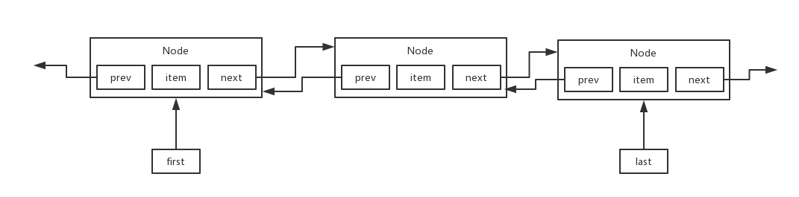
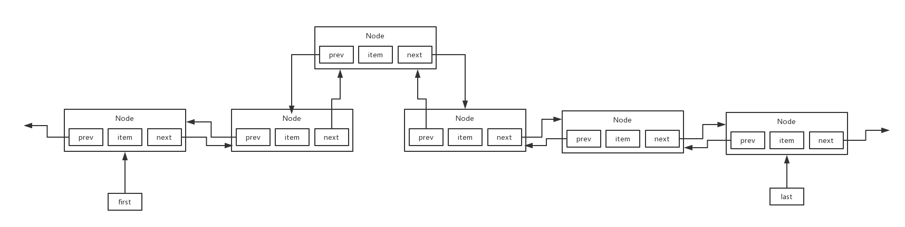

### 主要特性

> 基于双向链表实现，适合频繁插入和删除的场景




### 主要方法

#### 1. 添加元素(从中间插入)

```java
public void add(int index, E element) {
    checkPositionIndex(index);
    if (index == size)
        linkLast(element);
    else
        linkBefore(element, node(index));
}
```




#### 2. 获取指定位置的元素

```java
/** 循环获取 index 处的 node 元素 */
Node<E> node(int index) {
    // assert isElementIndex(index);
    if (index < (size >> 1)) {
        // 如果 index 是前半部分，从 first 开始遍历
        Node<E> x = first;
        for (int i = 0; i < index; i++)
            x = x.next;
        return x;
    } else {
        // 如果 index 是后半部分，从 last 开始遍历
        Node<E> x = last;
        for (int i = size - 1; i > index; i--)
            x = x.prev;
        return x;
    }
}
```


#### 3. 删除元素

```java
public boolean remove(Object o) {
    if (o == null) {
        for (Node<E> x = first; x != null; x = x.next) {
            if (x.item == null) {
                unlink(x);
                return true;
            }
        }
    } else {
        for (Node<E> x = first; x != null; x = x.next) {
            if (o.equals(x.item)) {
                unlink(x);
                return true;
            }
        }
    }
    return false;
}
```


#### 4. unlink 元素

```java
E unlink(Node<E> x) {
    // assert x != null;
    final E element = x.item;
    final Node<E> next = x.next;
    final Node<E> prev = x.prev;
    if (prev == null) {
        first = next;
    } else {
        prev.next = next;
        x.prev = null;
    }
    if (next == null) {
        last = prev;
    } else {
        next.prev = prev;
        x.next = null;
    }
    x.item = null;
    size--;
    modCount++;
    return element;
}
```

