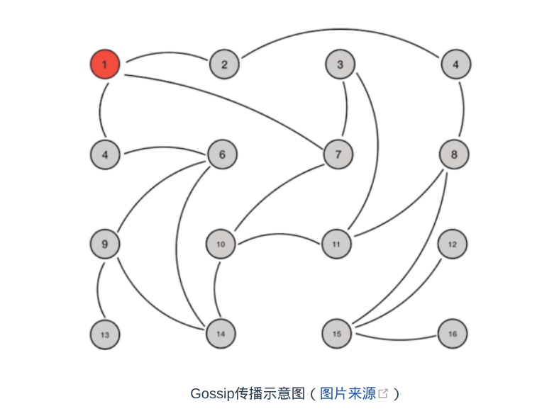

### 强一致性和最终一致性的分布式共识算法

#### 强一致性

- Paxos、Raft、ZAB等分布式算法经常会被称作是“强一致性”的分布式共识协议
- 尽管系统内部节点可以存在不一致的状态，但从系统外部看来，不一致的情况并不会被观察到，所以整体上看系统是强一致性的

#### 最终一致性

- 系统中不一致的状态有可能会在一定时间内被外部直接观察到
- 典型且极为常见的最终一致的分布式系统就是DNS系统，在各节点缓存的TTL到期之
  前，都有可能与真实的域名翻译结果存在不一致

### Gossip

> 先必须强调它所解决的问题并不是直接与Paxos、Raft这些共识算法等价的，只是基于Gossip之上可以通过某些方法去实现与Paxos、Raft相类似的目标而已

#### 工作过程

- 如果有某一项信息需要在整个网络中所有节点中传播，那从信息源开始，选择一个固定
  的传播周期（譬如1秒），随机选择它相连接的k个节点（称为Fan-Out）来传播消息
- 每一个节点收到消息后，如果这个消息是它之前没有收到过的，将在下一个周期内，选
  择除了发送消息给它的那个节点外的其他相邻k个节点发送相同的消息，直到最终网络
  中所有节点都收到了消息，尽管这个过程需要一定时间，但是理论上最终网络的所有节
  点都会拥有相同的消息

- 上图是Gossip传播过程的示意图，根据示意图和Gossip的过程描述，我们很容易发现Gossip对网络节点的连通性和稳定性几乎没有任何要求，它一开始就将网络某些节点只能与一部分节点部分连通 （Partially Connected Network）而不是以全连通网络 （Fully Connected Network）作为前提；能够容忍网络上节点的随意地增加或者减少，随意地宕机或者重启，新增加或者重启的节点的状态最终会与其他节点同步达成一致。Gossip把网络上所有节点都视为平等而普通的一员，没有任何中心化节点或者主节点的概念，这些特点使得Gossip具有极强的鲁棒性，而且非常适合在公众互联网中应用。
- Gossip设计了两种可能的消息传播模式：反熵（Anti-Entropy）和传谣（Rumor-Mongering），这两个名字都挺文艺的。熵（Entropy）是生活中少见但科学中很常用的概念，它代表着事物的混乱程度。反熵的意思就是反混乱，以提升网络各个节点之间的相似度为目标，所以在反熵模式下，会同步节点的全部数据，以消除各节点之间的差异，目标是整个网络各节点完全的一致。但是，在节点本身就会发生变动的前提下，这个目标将使得整个网络中消息的数量非常庞大，给网络带来巨大的传输开销。而传谣模式是以传播消息为目标，仅仅发送新到达节点的数据，即只对外发送变更信息，这样消息数据量将显著缩减，网络开销也相对较小