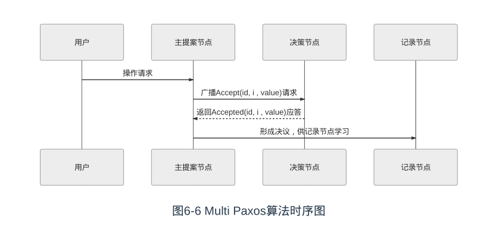
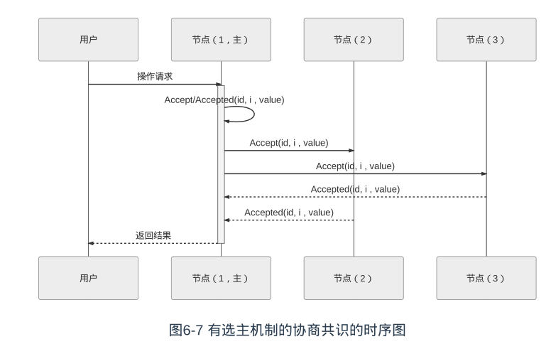

### Paxos 的问题

- 活锁：两个提案节点互不相让地争相提出自己的提案，抢占同一个值的修改权限，导致整个系统在持续性地“反复横跳”，外部看起来就像被锁住了一样。

- 布式共识的复杂性，主要来源于网络的不可靠与请求的可并发两大因素，活锁问题与许多Basic Paxos异常场景中所遭遇的麻烦，都可以看作是源于任何一个提案节点都能够完全平等地、与其他节点并发地提出提案而带来的复杂问题

### Multi-Paxos 的解决方案

- 主从节点

  - 增加了“选主”的过程，提案节点会通过定时轮询（心跳），确定当前网络中的所有节点里是否存在有一个主提案节点，一旦没有发现主节点存在，节点就会在心跳超时后使用Basic Paxos中定义的准备、批准的两轮网络交互过程，向所有其他节点广播自己希望竞选主节点的请求，希望整个分布式系统对“由我作为主节点”这件事情协商达成一致共识，如果得到了决策节点中多数派的批准，便宣告竞选成功
  - 选主完成之后，除非主节点失联之后发起重新竞选，否则从此往后，就只有主节点
    本身才能够提出提案
  - 主节点提案的时候，也就无需再次经过准备过程，因为可以视作是经过选举时的那一次准备之后，后续的提案都是对相同提案ID的一连串的批准过程。也可以通俗理解为选主过后，就不会再有其他节点与它竞争，相当于是处于无并发的环境当中进行的有序操作，所以此时系统中要对某个值达成一致，只需要进行一次批准的交互即可

  

可能有人注意到这时候的二元组(id, value)已经变成了三元组(id, i, value)，这是因为需要给
主节点增加一个“任期编号”，这个编号必须是严格单调递增的，以应付主节点陷入网络分
区后重新恢复，但另外一部分节点仍然有多数派，且已经完成了重新选主的情况，此时必
须以任期编号大的主节点为准。当节点有了选主机制的支持，在整体来看，就可以进一步
简化节点角色，不去区分提案、决策和记录节点了，统统以“节点”来代替，节点只有主（L
eader）和从（Follower）的区别，此时协商共识的时序图如图6-7所示

我们换一个角度来重新思考“分布式系统中如何对某个值达成一致”这个问题，可以把该问题划分做三个子问题来考虑:

- 如何选主（Leader Election）
  - 需考虑 心跳、随机超时、并行竞选 等工程细节问题
- 如何把数据复制到各个节点上（Entity Replication）
- 如何保证过程是安全的（Safety）

>  这种把共识问题分解为“Leader Election”、“Entity Replication”和“Safety”三个问题来思考、解决的解题思路，即“Raft算法