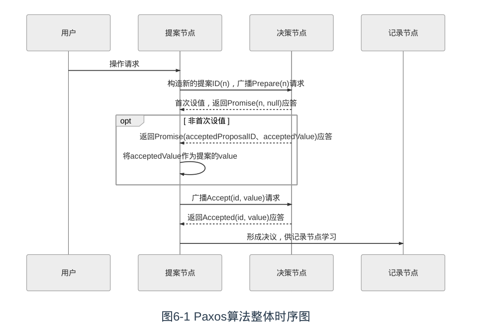

一种基于消息传递的协商共识算法。

### 算法流程

- **提案节点**
  - Proposer,提出对某个值进行设置操作的节点，设置值这个行为就被称之为**提案**（Proposal），值一旦设置成功，就是不会丢失也不可变的.
  - Paxos 是典型的基于操作转移模型而非状态转移模型来设计的算法，这里的“设置值”不要类比成程序中变量赋值操作，应该类比成日志记录操作，在后面介绍的 Raft 算法中就直接把“提案”叫作“日志”了
- **决策节点**
  - Acceptor，是应答提案的节点，决定该提案是否可被投票、是否可被接受
  - 提案一旦得到过半数决策节点的接受，即称该提案被**批准**（Accept），提案被批准即意味着该值不能再被更改，也不会丢失，且最终所有节点都会接受该它。
- **记录节点**
  - Learner，不参与提案，也不参与决策，只是单纯地从提案、决策节点中学习已经达成共识的提案，譬如少数派节点从网络分区中恢复时，将会进入这种状态。

- 所有的节点都是平等的，它们都可以承担以上某一种或者多种的角色，不过为了便于确保有明确的多数派，决策节点的数量应该被设定为奇数个，且在系统初始化时，网络中每个节点都知道整个网络所有决策节点的数量、地址等信息。
- 在分布式环境下，如果我们说各个节点“就某个值（提案）达成一致”，指的是“不存在某个时刻有一个值为 A，另一个时刻又为 B 的情景”。解决这个问题的复杂度主要来源于以下两个方面因素的共同影响
  - 系统内部各个节点通信是不可靠的，不论对于系统中企图设置数据的提案节点抑或决定是否批准设置操作的决策节点，其**发出、收到的信息可能延迟送达、也可能会丢失，但不去考虑消息有传递错误的情况**
  - 统外部各个用户访问是**可并发**的，如果系统只会有一个用户，或者每次只对系统进行串行访问，那单纯地应用 Quorum 机制，少数节点服从多数节点，就已经足以保证值被正确地读写
- 为了这个问题，分布式环境中的锁必须是可抢占的。Paxos算法包括两个阶段
  - 阶段一：
    - “准备”（Prepare）就相当于上面抢占锁的过程。如果某个提案节点准备发起提案，必须先向所有的决策节点广播一个许可申请（称为Prepare请求）。提案节点的Prepare请求中会附带一个全局唯一的数字n作为提案ID，决策节点收到后，将会给予提案节点两个承诺与一个应答。
    - 两个承诺：
      - 承诺不会再接受提案ID小于或等于n的Prepare请求。
      - 承诺不会再接受提案ID小于n的Accept请求。
    - 一个应答：
      - 不违背以前作出的承诺的前提下，回复已经批准过的提案中ID最大的那个提案所设定的
        值和提案ID，如果该值从来没有被任何提案设定过，则返回空值。如果违反此前做出的
        承诺，即收到的提案ID并不是决策节点收到过的最大的，那允许直接对此Prepare请求
        不予理会
  - 阶段二：
    - 当提案节点收到了多数派决策节点的应答（称为Promise应答）后，可以开始第二阶段“批准”（Accept）过程，这时有如下两种可能的结果
      - 如果提案节点发现所有响应的决策节点此前都没有批准过该值（即为空），那说明它是第一个设置值的节点，可以随意地决定要设定的值，将自己选定的值与提案ID，构成一个二元组“(id, value)”，再次广播给全部的决策节点（称为Accept请求）。
      - 如果提案节点发现响应的决策节点中，已经有至少一个节点的应答中包含有值了，那它就不能够随意取值了，必须无条件地从应答中找出提案ID最大的那个值并接受，构成一个二元组“(id, maxAcceptValue)”，再次广播给全部的决策节点（称为Accept请求）
  - 当每一个决策节点收到Accept请求时，都会在不违背以前作出的承诺的前提下，接收并持久化对当前提案ID和提案附带的值。如果违反此前做出的承诺，即收到的提案ID并不是决策节点收到过的最大的，那允许直接对此Accept请求不予理会。
  - 提案节点收到了多数派决策节点的应答（称为Accepted应答）后，协商结束，共识决议形成，将形成的决议发送给所有记录节点进行学习。

### 缺点

- Basic Paxos只能对单个值形成决议，并且决议的形成至少需要两次网络请求和应答（准备和批准阶段各一次），高并发情况下将产生较大的网络开销，极端情况下甚至可能形成活锁（随机睡眠时间解决）
- Basic Paxos是一种很学术化但对工业化并不友好的算法，现在几乎只用来做理论研究，实际的应用都是基于Multi Paxos和Fast Paxos算法的，接下来我们将会了解Multi Paxos与一些它的理论等价的算法（如Raft、ZAB等算法）