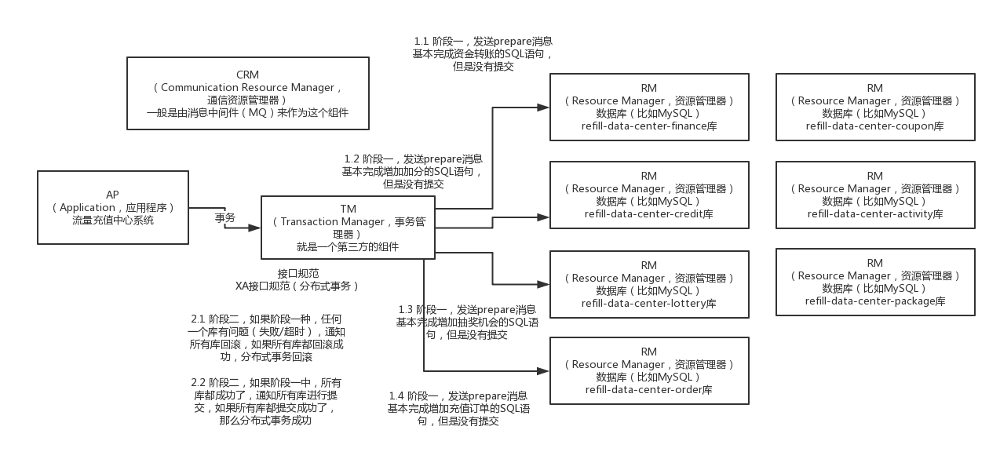
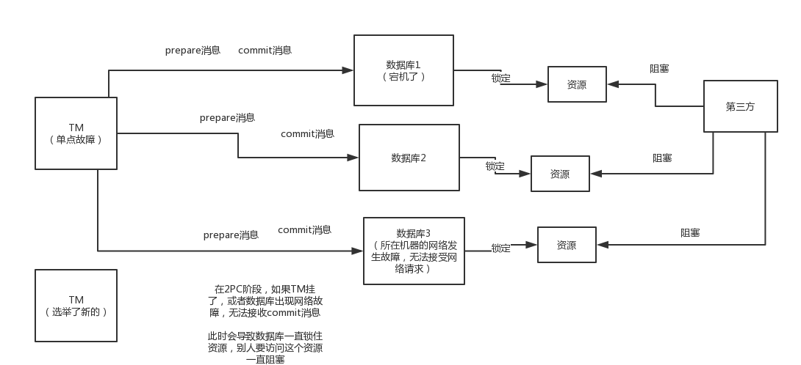

## 2PC

> Two-Phase-Commitment-Protocol，两阶段提交协
>
> 2PC，其实就是基于XA规范，来让分布式事务可以落地，定义了很多实现分布式事务过程中的一些细节

- **准备阶段**
  - TM 发送 prepare 消息给各个数据库，
  - 由各个库执行本地事务但不提交事务
  - 然后返回响应给 TM
- **提交阶段**
  - 如果由失败的情况，TM 通知全部回滚
  - 如果都成功了，TM 通知全部提交

### 缺点：

- 同步阻塞：
  - 在阶段一里执行prepare操作会占用资源，一直到整个分布式事务完成，才会释放资源，这个过程中，如果有其他人要访问这个资源，就会被阻塞住
- 单点故障
  - TM是个单点，一旦挂掉就完蛋了
- 事务状态丢失
  - 即使把TM做成一个双机热备的，一个TM挂了自动选举其他的TM出来，但是如果TM挂掉的同时，接收到commit消息的某个库也挂了，此时即使重新选举了其他的TM，压根儿不知道这个分布式事务当前的状态，因为不知道哪个库接收过commit消息，那个接收过commit消息的库也挂了
- 脑裂问题
  - 在阶段二中，如果发生了脑裂问题，那么就会导致某些数据库没有接收到commit消息，那就完蛋了，有些库收到了commit消息，结果有些库没有收到，这咋整呢，那肯定完蛋了

