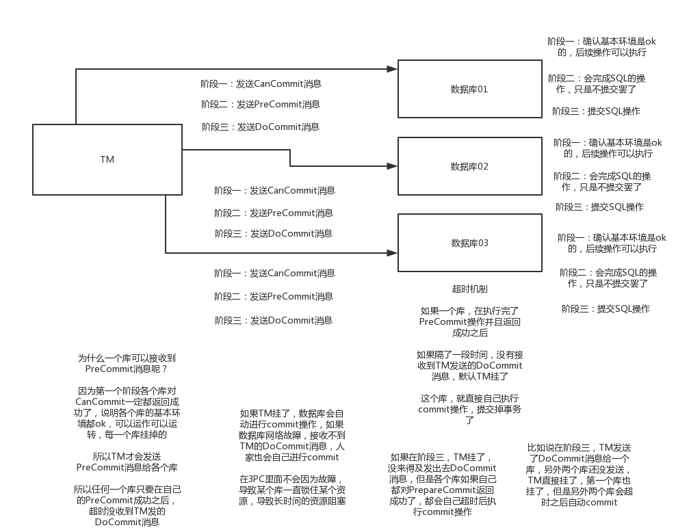

## 	3PC

> three-phase-commitment，三阶段提交协议，这个是针对2PC做的一个改进，主要就是为了解决2PC协议的一些问题

- **CanCommit 阶段**
  - 这个就是TM发送一个CanCommit消息给各个数据库，然后各个库返回个结果，注意一下，这里的话呢，是不会执行实际的SQL语句的，其实说白了，就是各个库看看自己网络环境啊，各方面是否ready
- **PreCommit 阶段**
  - 如果各个库对CanCommit消息返回的都是成功，那么就进入PreCommit阶段，TM发送PreCommit消息给各个库，这个时候就相当于2PC里的阶段一，其实就会执行各个SQL语句，只是不提交罢了；如果有个库对CanCommit消息返回了失败，那么就尴尬了，TM发送abort消息给各个库，大家别玩儿了，结束这个分布式事务
- **DoCommit 阶段**
  - 如果各个库对PreCommit阶段都返回了成功，那么发送DoCommit消息给各个库，就说提交事务吧，兄弟们，各个库如果都返回提交成功给TM，那么分布式事务成功；如果有个库对PreCommit返回的是失败，或者超时一直没返回，那么TM认为分布式事务失败，直接发abort消息给各个库，说兄弟们回滚吧，各个库回滚成功之后通知TM，分布式事务回滚

### 相比 2PC 的改进点

- 引入了CanCommit阶段
- 在DoCommit阶段，各个库自己也有超时机制，也就是说，如果一个库收到了PreCommit自己还返回成功了，等了一会儿，如果超时时间到了，还没收到TM发送的DoCommit消息或者是abort消息，直接判定为TM可能出故障了，人家库自己颠儿颠儿的就执行DoCommit操作，提交事务了。
- 另外资源阻塞问题也能减轻一下，因为一个库如果一直接收不到DoCommit消息，不会一直锁着资源，人家自己会提交释放资源的，所有能减轻资源阻塞问题，比2PC稍微好一些吧而已

### 缺点

- 如果人家TM在DoCommit阶段发送了abort消息给各个库，结果因为脑裂问题，某个库没接收到abort消息，自己还颠儿颠儿的执行了commit操作，不是也不对么
- 其实2PC也好，3PC也好，都没法完全保证分布式事务的ok的，要明白这一点，总有一些特殊情况下会出问题的

