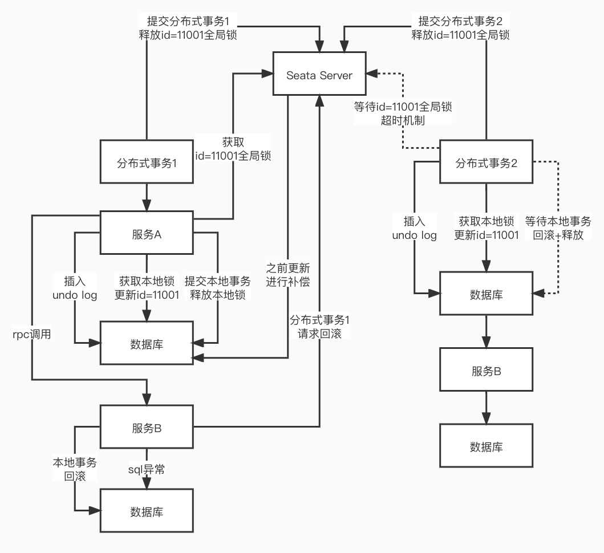
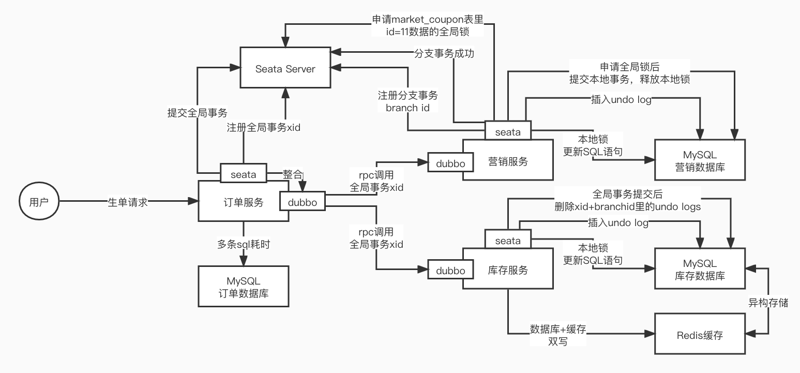

### Seata 是什么？

> Seata 是一款开源的分布式事务解决方案，致力于提供**高性能**和**简单易用**的分布式事务服务。
>
> Seata 将为用户提供了 **AT、TCC、SAGA 和 XA 事务**模式，为用户打造一站式的分布式解决方案。

> 术语表

- **TC（Transaction Coordinator）**  事务协调者

  > 维护全局和分支事务的状态，驱动全局事务的提交或回滚

- **TM（Transaction Manager）** 事务管理器

  > 定义全局事务的范围：开始全局事务、提交或混滚全局事务

- **RM（Resource Manager）** 资源管理器

  > 管理分支事务处理的资源，与 TC 通信以注册分支事务和报告分支事务的状态，并驱动分支事务提交或回滚

### AT 模式

#### 前提

- 基于支持本地 ACID 事务的关系型数据库
- Java 应用，通过 JDBC 访问数据库

#### 整体机制

> 两阶段提交(2PC)协议的演变

- 一阶段：**业务数据和回滚日志记录再同一个本地事务中提交，释放本地锁和连接资源**
- 二阶段：
  - **异步化提交**，非常快速的完成，自动异步批量清理回滚日志
  - 回滚通过一阶段的回滚日志进行**反向补偿**

#### 写隔离

> 全局锁 + 拿锁超时机制

- 一阶段本地事务提交前，需要确保先拿到 **全局锁**
- 拿不到 **全局锁**，不能提交本地事务
- 拿 **全局锁** 的尝试被限制再一定范围内，超出范围将放弃，并回滚本地事务，释放本地锁

#### 读隔离

- 在数据库本地事务隔离级别 **读已提交（Read Committed）** 或以上的基础上，Seata（AT 模式）的默认全局隔离级别是 **读未提交（Read Uncommitted）**
- 如果应用在特定场景下，必需要求全局的 **读已提交** ，目前 Seata 的方式是通过 SELECT FOR UPDATE 语句的代理

#### 回滚日志(undo_log)表

| Field         | Type         |
| ------------- | ------------ |
| branch_id     | bigint PK    |
| xid           | varchar(100) |
| context       | varchar(128) |
| rollback_info | longblob     |
| log_status    | tinyint      |
| log_created   | datetime     |
| log_modified  | datetime     |

### TCC 模式

> 相比与 AT 模式，**不依赖于底层数据源的事务支持**

- 一阶段 prepare 行为：调用 **自定义** 的 prepare 逻辑
- 二阶段 commit 行为：调用 **自定义** 的 commit 逻辑
- 三阶段 rollback 行为：调用 **自定义** 的 rollback 逻辑

> 所谓 TCC 模式，是指支持把 **自定义** 的分支事务纳入到全局事务的管理中

### Saga 模式

> **长事务** 解决方案，在此模式中，**业务流程中的每个参与者都提交本地事务，当出现某一个参与者失败则补偿前面已经成功的参与者，一阶段正向服务和二阶段补偿服务都由业务开发实现**

#### 使用场景

- 业务**流程长**、业务**流程多**
- 参与者包含其它公司或遗留刺痛服务，**无法提供 TCC 模式要求的三个接口**

#### 优势

- 一阶段提交本地事务，无锁，高性能
- 事件驱动架构，参与者可异步执行，高吞吐
- 补偿服务易于实现

#### 缺点

- 不保证隔离性 - [应对方案](http://seata.io/zh-cn/docs/user/saga.html)

### [XA 模式](http://seata.io/zh-cn/docs/dev/mode/xa-mode.html)