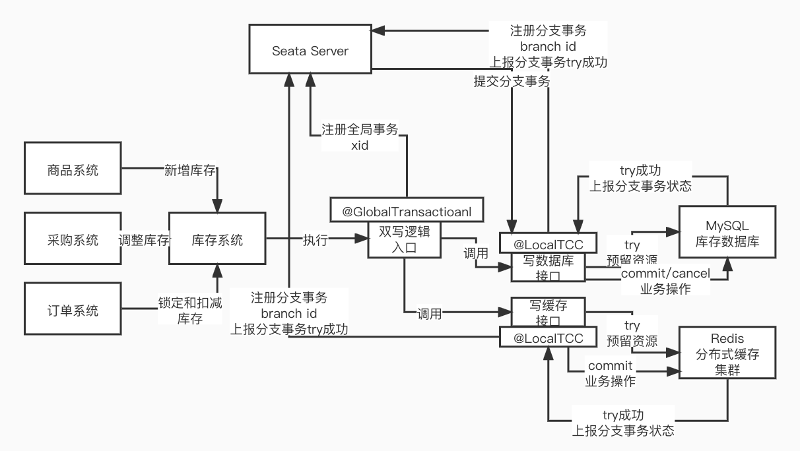

### Seata 异构存储端 TCC 方案

> 支持事务的数据库和不支持事务的缓存

**`实现方案：`**

- 基于 TCC 三阶段，好处是不需要数据源支持事务特性

- 业务逻辑发起方添加开启**全局事务**标志： **@GlobalTransactional(rollbackFor = Exception.class)**

  ```java
  @GlobalTransactional(rollbackFor = Exception.class)
  public void doDeduct(DeductStockDTO deductStock) {
          //1、执行执行mysql库存扣减
          boolean result = lockMysqlStockTccService
                  .deductStock(null,deductStock);
          if(!result) {
              throw new InventoryBizException(InventoryErrorCodeEnum.PRODUCT_SKU_STOCK_NOT_FOUND_ERROR);
          }
  
          //2、执行redis库存扣减
          result = lockRedisStockTccService.deductStock(null,deductStock);
          if(!result) {
              throw new InventoryBizException(InventoryErrorCodeEnum.PRODUCT_SKU_STOCK_NOT_FOUND_ERROR);
          }
      }
  ```

- 双写端 TCC 接口

  - 相关 seata 注解

    - **@LocalTCC**
    - **@TwoPhaseBusinessAction(name = "lockRedisStockTccService", commitMethod = "commit", rollbackMethod = "rollback")**

  - MySQL 逻辑端

    ```java
    /** 锁定 mysql 库存 Seata TCC模式 service */
    @LocalTCC
    public interface LockMysqlStockTccService {
    
    
        /** 一阶段方法：扣减销售库存（saleStockQuantity-saleQuantity）*/
        @TwoPhaseBusinessAction(name = "lockMysqlStockTccService", commitMethod = "commit", rollbackMethod = "rollback")
        boolean deductStock(BusinessActionContext actionContext,
                            @BusinessActionContextParameter(paramName = "deductStock") DeductStockDTO deductStock);
    
    
        /** 二阶段方法：增加已销售库存（saledStockQuantity+saleQuantity）*/
        void commit(BusinessActionContext actionContext);
    
        /** 回滚：增加销售库存（saleStockQuantity+saleQuantity）*/
        void rollback(BusinessActionContext actionContext);
    }
    ```

  - Redis 逻辑端

    ```java
    /** 锁定redis库存 Seata TCC模式 service */
    @LocalTCC
    public interface LockRedisStockTccService {
    
        /** 一阶段方法：扣减销售库存（saleStockQuantity-saleQuantity） */
        @TwoPhaseBusinessAction(name = "lockRedisStockTccService", commitMethod = "commit", rollbackMethod = "rollback")
        boolean deductStock(BusinessActionContext actionContext,
                            @BusinessActionContextParameter(paramName = "deductStock") DeductStockDTO deductStock);
    
    
        /** 二阶段方法：增加已销售库存（saledStockQuantity+saleQuantity）*/
        void commit(BusinessActionContext actionContext);
    
        /** 回滚：增加销售库存（saleStockQuantity+saleQuantity）*/
        void rollback(BusinessActionContext actionContext);
    
    }
    ```

    

### 上述方案可能的问题和解决方案

