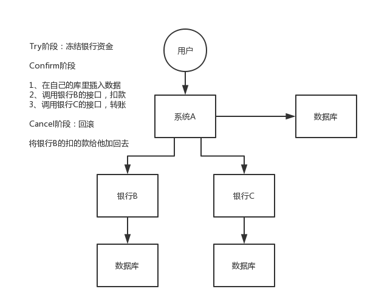

**99%的分布式接口调用，不要做分布式事务，直接就是监控（发邮件、发短信）、记录日志（一旦出错，完整的日志）、事后快速的定位、排查和出解决方案、修复数据.**

### 1. 两阶段提交/ XA 方案

> 比较适合单块应用里，跨多个库的分布式事务，而且因为严重依赖于数据库层面来搞定复杂的事务，效率很低，绝对不适合高并发的场景。如果要玩儿，那么基于spring + JTA就可以搞定

### 2. TCC 方案

> 适合场景：
>
> 这个就是除非你是真的**一致性要求太高**，是你系统中核心之核心的场景，比如常见的就是资金类的场景，那你可以用TCC方案了，自己编写大量的业务逻辑，自己判断一个事务中的各个环节是否ok，不ok就执行补偿/回滚代码

>  尽量确保每个服务的调用都比较快，一般来说确保一个TCC分布式事务的执行，大概需要总共1秒以内的时间

 - **Try**
   	- 对各个服务的**资源做检测**以及对**资源进行锁定或者预留**
 - **Confirm**
   	- 在各个服务中**执行实际的操作**
 - **Cancel**
   	- 如果任何一个服务的业务方法执行出错，那么这里就需要进行补偿，就是执行已经执行成功的业务逻辑的回滚操作

### 3. 本地消息表

- A系统在自己本地一个事务里操作同时，插入一条数据到消息表
- 接着A系统将这个消息发送到MQ中去
- B系统接收到消息之后，在一个事务里，往自己本地消息表里插入一条数据，同时执行其他的业务操作，如果这个消息已经被处理过了，那么此时这个事务会回滚，这样保证不会重复处理消息
- B系统执行成功之后，就会更新自己本地消息表的状态以及A系统消息表的状态
- 如果B系统处理失败了，那么就不会更新消息表状态，那么此时A系统会定时扫描自己的消息表，如果有没处理的消息，会再次发送到MQ中去，让B再次处理
- 这个方案保证了最终一致性，哪怕B事务失败了，但是A会不断重发消息，直到B那边成功为止

### 4. 可靠消息最终一致性方案

> 干脆不要用本地的消息表了，直接基于MQ来实现事务
>
> 适合于那种比较耗时的操作

- A系统先发送一个prepared消息到mq，如果这个prepared消息发送失败那么就直接取消操作别执行了
- 如果这个消息发送成功过了，那么接着执行本地事务，如果成功就告诉mq发送确认消息，如果失败就告诉mq回滚消息
- 如果发送了确认消息，那么此时B系统会接收到确认消息，然后执行本地的事务
- mq会自动定时轮询所有prepared消息回调你的接口，问你，这个消息是不是本地事务处理失败了，所有没发送确认消息？那是继续重试还是回滚？一般来说这里你就可以查下数据库看之前本地事务是否执行，如果回滚了，那么这里也回滚吧。这个就是避免可能本地事务执行成功了，别确认消息发送失败了
- 这个方案里，要是系统B的事务失败了咋办？重试咯，自动不断重试直到成功，如果实在是不行，要么就是针对重要的资金类业务进行回滚，比如B系统本地回滚后，想办法通知系统A也回滚；或者是发送报警由人工来手工回滚和补偿

### 5. 最大努力通知方案

> 不一定保证最终一定会成功，可能会失败，但是他会尽力给你去给你通知那个服务的执行
>
> 比较适合那种不太核心一些服务调用的操作，比如说消息服务，充值好了以后发送短信，一般来说肯定是要发出去短信的，但是如果真的不小心发送失败了，发送短信失败了也无所谓的

- 系统A本地事务执行完之后，发送个消息到MQ
- 这里会有个专门消费MQ的**最大努力通知服务**，这个服务会消费MQ然后写入数据库中记录下来，或者是放入个内存队列也可以，接着调用系统B的接口
- 要是系统B执行成功就ok了；要是系统B执行失败了，那么最大努力通知服务就定时尝试重新调用系统B，反复N次，最后还是不行就放弃

