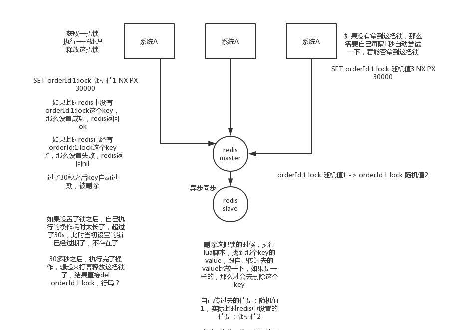
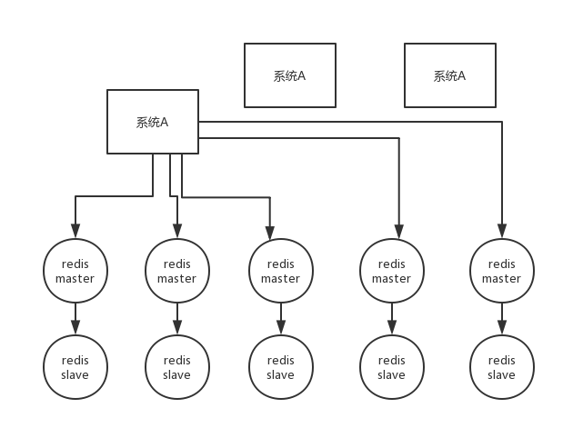
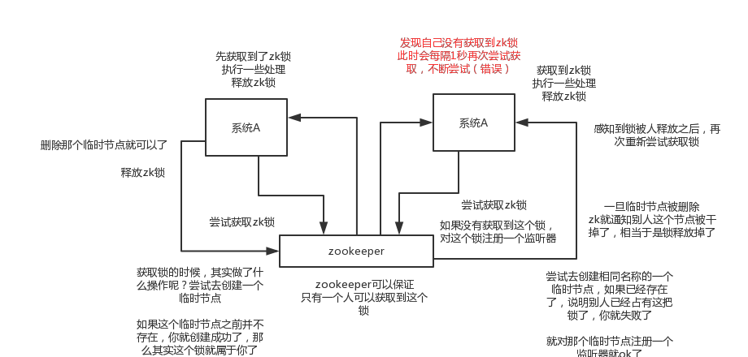

### 1. 最简单的 Redis 分布式锁

> 创建一个 key 并加锁

- **`SET my:lock [随机值] NX PX 30000`**

  - **NX** 不存在返回 ok，已经存在返回 nil
  - **PX 30000** 30 秒后自动过期

- 锁的释放：

  - **通过 lua 脚本判断随价值 value 相同时才释放**

  ```lua
  if redis.call("get",KEYS[1]) == ARGV[1] then
  return redis.call("del",KEYS[1])
  else
      return 0
  end
  ```

  - 因为如果某个客户端获取到了锁，但是**阻塞了很长时间才执行完，此时可能已经自动释放锁了，此时可能别的客户端已经获取到了这个锁，要是你这个时候直接删除key的话会有问题**，所以得用随机值加上面的lua脚本来释放锁

- 存在的问题：
  - 单点问题
  - 主从故障切换锁丢失问题(主从间数据时异步同步的)




### 2. 基于 Redis Cluster 的 RedLock 算法

- 获取当前时间戳，单位是毫秒
- 跟上面类似，轮流尝试在每个master节点上创建锁，过期时间较短，一般就几十毫秒
- 尝试在大多数节点上建立一个锁，比如5个节点就要求是3个节点（n / 2 +1）
- 客户端计算建立好锁的时间，如果建立锁的时间小于超时时间，就算建立成功了
- 要是锁建立失败了，那么就依次删除这个锁
- 只要别人建立了一把分布式锁，你就得不断轮询去尝试获取锁




### 3. Zookeeper 分布式锁

- 某个节点尝试创建**临时znode**，此时创建成功了就获取了这个锁
- 这个时候别的客户端来创建锁会失败，只能**注册个监听器监听这个锁**
- 释放锁就是删除这个znode，**一旦释放掉就会通知客户端**，然后有一个等待着的客户端就可以再次重新加锁。

#### 基于顺序临时节点的实现

> 如果有一把锁，被多个人给竞争，此时多个人会排队，第一个拿到锁的人会执行，然后释放锁，后面的每个人都会去监听排在自己前面的那个人创建的``node``上，一旦某个人释放了锁，排在自己后面的人就会被``zookeeper``给通知，一旦被通知了之后，就``ok``了，自己就获取到了锁，就可以执行代码了




### 4. 两种分布式锁实现方式对比

- Redis 分布式锁
  - 需要**自己不断去尝试获取锁，比较消耗性能**
  - redis获取锁的那个客户端bug了或者挂了，那么只能等待超时时间之后才能释放锁
- Zookeeper 分布式锁
  - 获取不到锁，**注册个监听器即可，不需要不断主动尝试获取锁，性能开销较小**
  - 因为创建的是临时znode，只要客户端挂了，znode就没了，此时就自动释放锁
  - zk的分布式锁比redis的分布式锁牢靠、而且模型简单易用