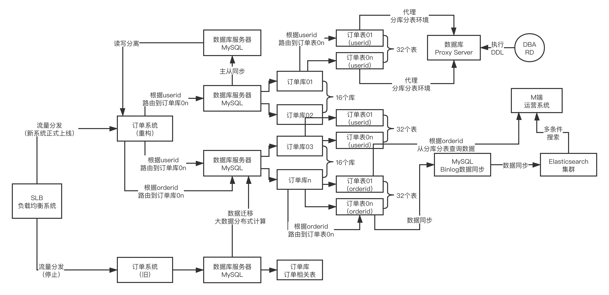

### 一些基本原则

- 单表数据最多千万级别，百万最好(索引树层级高也会导致查询变慢
- 先垂直，再水平

- 订单表根据用户、商家、订单三个维度查，怎么分？
  - 1亿个订单会被均匀的分散在 **1024张表** 里去，要对一个订单做插入，先对这个订单生成一个唯一的id，leaf那套唯一id生成方案了，更新和删除
  - 根据用户id，商家id，订单id，去分三次表(冗余数据？)
  - 如果存储成本不care的话，是ok的，但是如果要是纠结存储成本，可以就订单id分表全量数据，然后用户id分表后就对应订单id，商家id分表后就对应订单id，等于是还要做二次路由

- 分库分表+读写分离
  - 有多个主库，主库里存放了大量的分表，每个主库都挂了一两个从库，抗80%以上的常规的crud，数据binlog同步到ES支撑复杂查询
  - 要不然就是基于sharding-jdbc之类的中间件去做merge，他会并行查询所有的库里的所有的表，然后内存级进行merge，太慢了，这个太坑，基本不建议这么搞；针对那种不包含sharding字段的复杂查询，特别是多条件组合，甚至还有全文检索的模糊匹配需求，那就直接把索引都建到ES里去
- 双写
  - 针对分库分表环境的系统代码肯定要进行修改，sharding-sphere中间件做一个代码的修改，部署，连接的就是分库分表的环境；老系统 -> 单库单表，也在运行； 做一个线上流量的拷贝和分发
  - Nginx做一个流量分发策略
  - 同一个请求，分发给两套系统，你需要做数据监测，数据数量不能少多，数据内容不能变化，新系统 -> 分库分表这套环境彻底ok了
- 运维管理工作台
  - 做大量的线上的DDL的操作，建表、修改表，删除表，自己手动1024个表一个一个去做吧，肯定需要运维管理工作台，可以让你对逻辑上的表做DDL，底层自动把DDL在1024张表了去做一个更新，监控，对每个逻辑上的表都知道他切分为了多少张物理上的表，分散在哪些库上，库在哪台服务器上，逻辑表的总数据量多少行，每个物理表的数据量多少行，有一个监控
- 扩容
  - 一般我们都是设计很多表，扩容的时候就是加更多的服务器和库，然后对表整体做迁移，再修改一下代码里的路由就行了，否则数据迁移是很麻烦的

- 如何设计分库分表方案
  - range、hash，如何hash，hash字段，几台数据库服务器，多少个库，每个库里多少个表，数据如何路由到库，如何路由到表，现有系统的这些功能，C端用户，B端商家，M端运营，各种业务功能的CRUD的SQL能否在分库分表中运行
  - 一般来说，订单数据分库分表都是按用户id和商家id分别拆分的，冗余存储一份数据，常规的都是2个数据库服务器，32个库，每个库32个表，一共是1024张表，刚开始你可以就2台数据库服务器，每台数据库服务器上放16个库就ok了
  - 用户端和商家端本质都是调用订单中台去对订单进行增删改查，订单中台里放你的数据分片逻辑，比如用户端下单，那么订单中台可以对订单数据双写到两套分库分表里去，查询的时候，订单中台自动用对应的数据库集群去进行执行
  - 用户端基本上就是直接把订单数据按userid来路由到32个库中的一个，再路由到里面32个表中的一个，基本上单用户单订单的增删改查就搞定了，如果用户端的订单查询呢？简单，一个用户的订单都在一个分表里，所以基本就是定位到用户的表，单表内做复杂条件的订单查询和分页就ok了
  - 至于说M端，公司级去看数据，那基本分库分表是满足不了的，需要通过HBase+ES的方案去做，把订单同步到HBase里去，rowkey都是订单id，然后查询条件都放ES，然后联合起来做M端的订单查询分析
- 重构数据存储的代码
  - 最好是不要碰业务逻辑的代码，最多就是重构分库分表的配置，数据源引入数据库中间件来做代理，DAO那一层，以及你的一些SQL语句可能会涉及到重构，Service里的业务逻辑，数据存储
- 数据迁移
  - 把单库单表的数据，都迁移一份一模一样的到分库分表的环境里去，而且还需要确保两边的数据是完全一模一样的，重构好的代码就可以在分库分表的环境里运行，确保数据没有丢，也没有多，完全正确的，下线老的单库单表的环境和代码

### 示例

