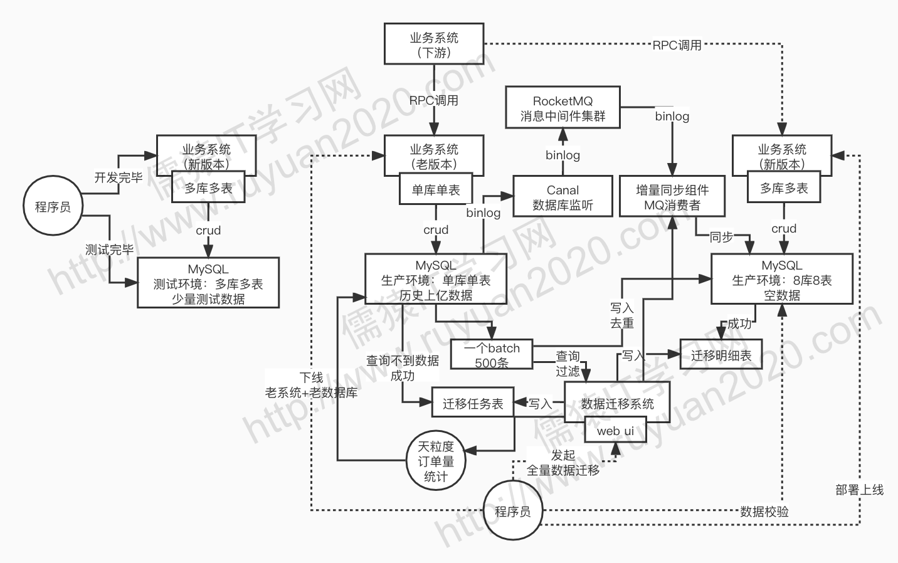
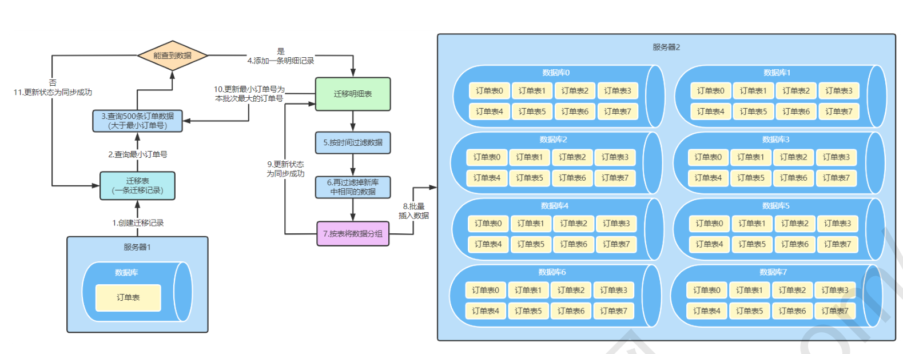
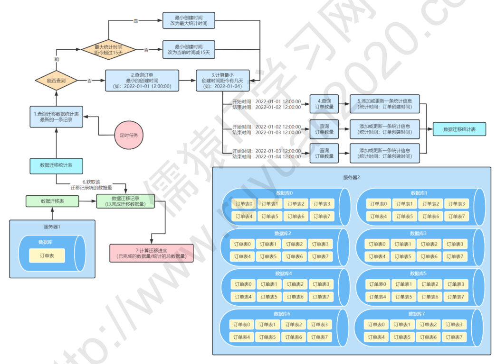
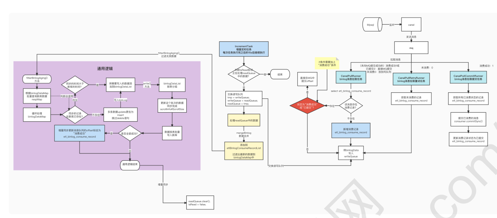
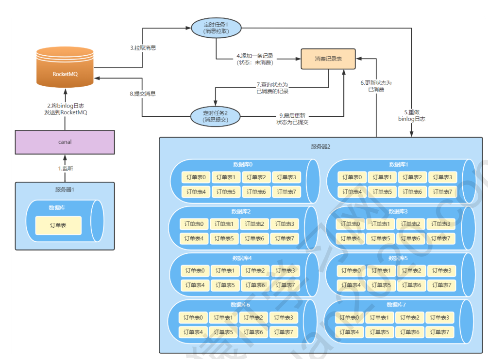

> 分库分表的方案设计，不难，shardingsphere 开发，也不难

> 部署到线上去，上生产是一大难题

### 难点

- 如何**将历史数据和增量数据同步复制到分库分表的环境中**去
  - 数据校验方案怎么做(数据同步+数据校验)
- 多库多表的 DDL 的运维操作
- 库和表的扩容

### 总体方案

#### 1. 单库单表到分库分表的全量复制方案

> 背景：将单库单表  ----> 8 * 8 = 64 的分库分表

> 方案：滚动拉取数据方案

- 从最小或最早的一个订单开始批量复制，从源库查询每批(默认500)数据，然后基于分库分表规则插入到新的库中
- 对于每一批数据的复制迁移，记录一条记录到**迁移明细表**中
- 对于全量复制同步的时候，可以指定时间范围，我们仅仅同步时间范围内的数据
- 需要判断本次要复制和插入的数据在不在目标库中，如果存在就不迁移了
- 中断恢复分析
  - 基于**迁移明细表**中的迁移状态进行任务重试

> 巧妙的统计滚动进度方案

#### 2. 增量数据同步方案

> 基于 Canal 和 RocketMQ 做增量同步

- Canal 配置监听数据库 binlog 的变化
- 发送 binlog 到 RocketMQ 中
- 自己的数据迁移系统去消费这个 binlog 数据

> mq 消息防丢失方案

