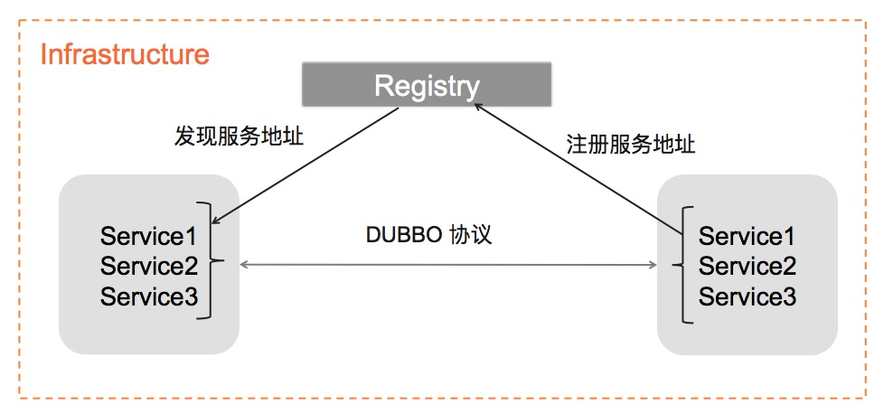
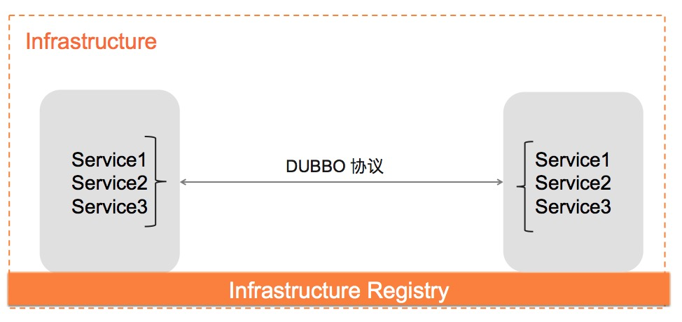
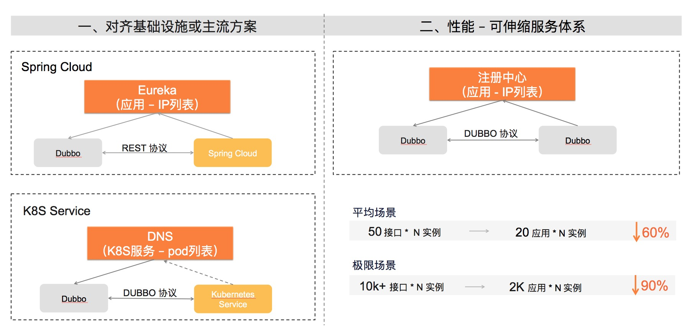

### dubbo 的服务发现模型

> 可选注册中心：Nacos、zk、consul 等

> dubbo 基于消费端的服务自动发现原理如上图所示

### Dubbo 3 与 Dubbo 2 服务发现模型的变化

> **dubbo2 的服务发现模型是基于接口的(应用+接口作为唯一)**
>
> 应用水平扩张导致要存储的订阅以及推送的元数据也线性扩展，注册中心的网络压力都会极速增大，不适合弹性伸缩。
>
> 接口的定义与业务逻辑相关，复用程度不高

> **dubbo3 的服务发现模型是基于应用(唯一)的**
>
>  Dubbo3 需要在原有服务发现流程中抽象出通用的、与业务逻辑无关的地址映射模型，并确保这部分模型足够合理，以支持将地址的注册行为和存储委托给下层基础设施

