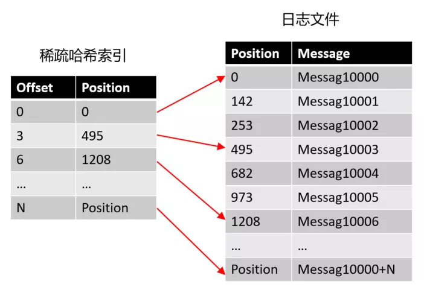
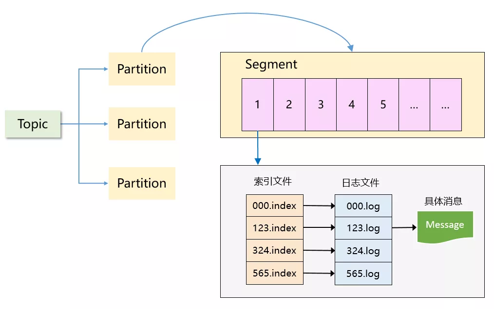

**关键词：**

> `Append Only Data Structures`  `Liner Scans` `LSM Tree` `磁盘顺序写` `页缓存` `零拷贝` `稀疏索引` `二分查找` 

### Kafka 的存储难点

> 1. 功能性需求：存的是什么数据？量级如何？需要存多久？CRUD 的场景都有哪些？
> 2. 非功能性需求：性能和稳定性的要求是什么样的？是否需要考虑扩展性？

**功能性需求：**

- 存的主要是消息流：可以是最简单的文本字符串，也可以是自定义的复杂结构
- 数据量非常大：用于实时日志流处理
- CRUD 场景足够简单：没有 Update，只需要提供按 Offset 或者 Timestamp 进行查询消息的能力，另外长时间未消费的消息(比如 7 天前的)，Broker 做好定期删除即可

**非功能性需求：**

- 性能要求：ActiveMQ 单机吞吐万级 TPS 不能满足要求，Kafka 的性能需要高一个量级才行
- 稳定性要求：
  - 消息的持久化（确保机器重启历史数据不丢失）
  - 单台 Broker 宕机后如何快速故障转移继续对外提供服务
- 扩展性要求：
  - 海量数据存储的扩展性支持

**简单总结：**

> 1. 功能性需求：其实足够简单，追加写、无需update、能根据消费位移和时间戳查询消息、能定期删除过期的消息
> 2. 非功能性需求：是难点所在，因为 Kafka 本身就是一个高并发系统，必然会遇到典型的高性能、高可用和高扩展这三方面的挑战

### Kafka 的存储选型分析

**数据存储领域发展方向：**

- **加快读**
  - 通过索引(B+树、二分查找树)，提高查询速度，但写入速率会因为维护索引而降低
- **加快写**
  - 纯日志性，数据以追加的方式**`顺序IO`**写入，不加索引，写入很快(接近磁盘写入速度)，但是没有索引，查询性能很低

**3 类最具代表性的底层索引结构：**

- **哈希索引：**
  - 通过哈希函数将 key 映射成数据的存储地址，**`只适用等值查`**询等简单场景，对于比较和范围查询无能为力
- **B/B+ Tree 索引：**
  - 重点考虑的是读性能，很多关系型数据库的底层索引结构
- **LSM Tree 索引：**
  - 数据以 Append 方式追加写入日志文件，优化了写但没显著降低读性能，众多 NoSQL 存储系统如 BigTable、HBase、Cassandra、RocksDB 的底层结构

**Kafka 的存储选型考虑：**

- 几十万 TPS 的写入性能

  - B Tree 类索引
    - 写入时需要维护树形结构(**随机 IO**)，而且还会引来 **`页分裂`**，不适用
  - Append Only Log
    - 写入性能能够满足，查询需要优化

- 简单查询的性能

  - 哈希索引 -- 维护 offset 到日志文件的偏移量

    - 如果每个信息都建立索引，要引爆内存

  - 稀疏哈希索引

    - offset 本身是有序的
    - 将消息顺序划分若干 block，**`只索引每个 block 第一条消息的 offset 即可`**

    

- 最终方案：

  - Append 追加写日志 + 稀疏的哈希索引
  - 相关资料：[LSM-append-data-structures](https://www.infoq.com/presentations/lsm-append-data-structures/)

### Kafka 的存储设计

> Kafka 是一个「分区 + 分段 + 索引」的三层结构:
>
> 1. 每个 Topic 被分成多个 Partition，Partition 从物理上可以理解成一个文件夹
> 2. 每个 Partition 又被分成了多个 Segment，Segment 从物理上可以理解成一个「数据文件 + 索引文件」，这两者是一一对应的

**疑问：** 有了 Partition 之后，为什么还需要 Segment？

> 如果不引入 Segment，一个 Partition 只对应一个文件，那这个文件会一直增大，势必造成单个 Partition 文件过大，查找和维护不方便
>
> 此外，在做历史消息删除时，必然需要将文件前面的内容删除，不符合 Kafka 顺序写的思路。而在引入 Segment 后，则只需将旧的 Segment 文件删除即可，保证了每个 Segment 的顺序写

