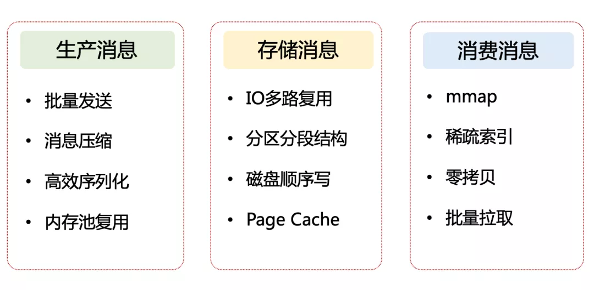
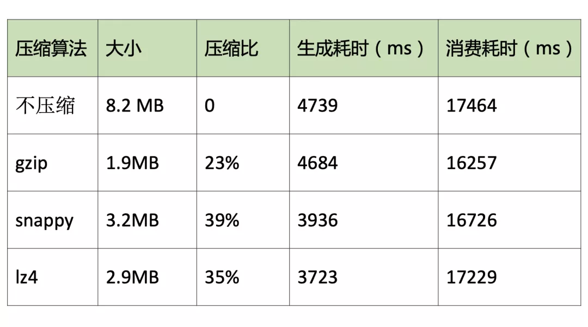
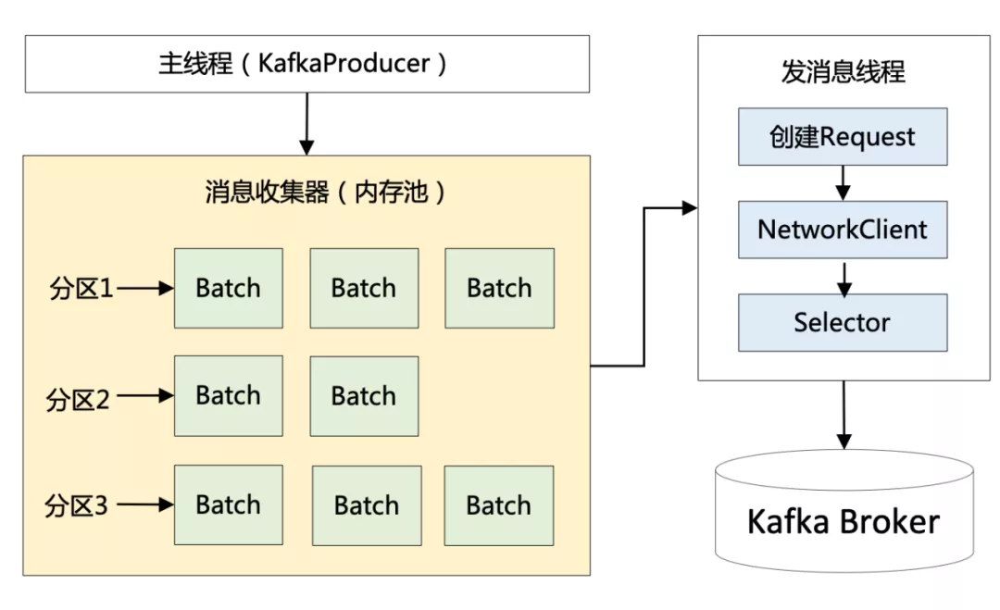
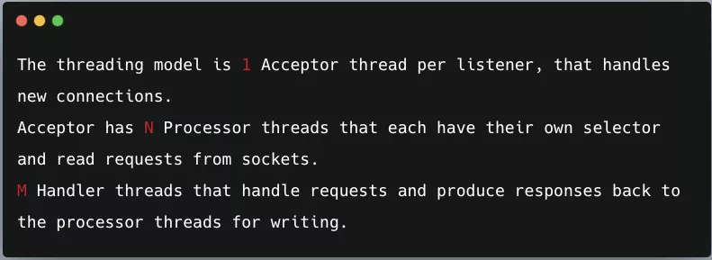
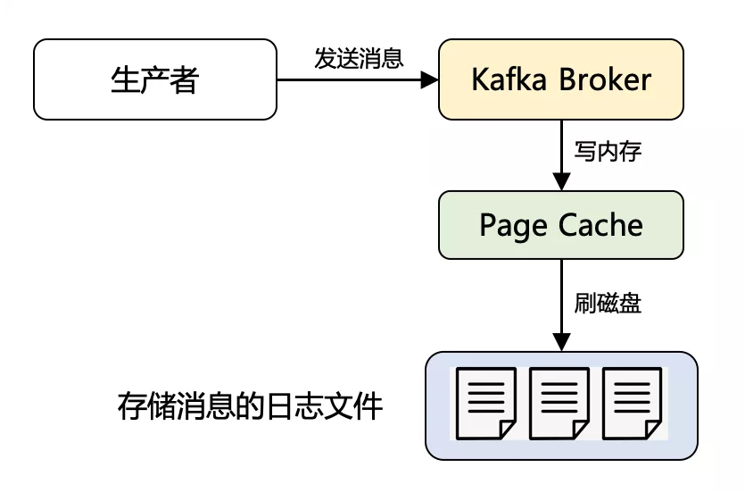
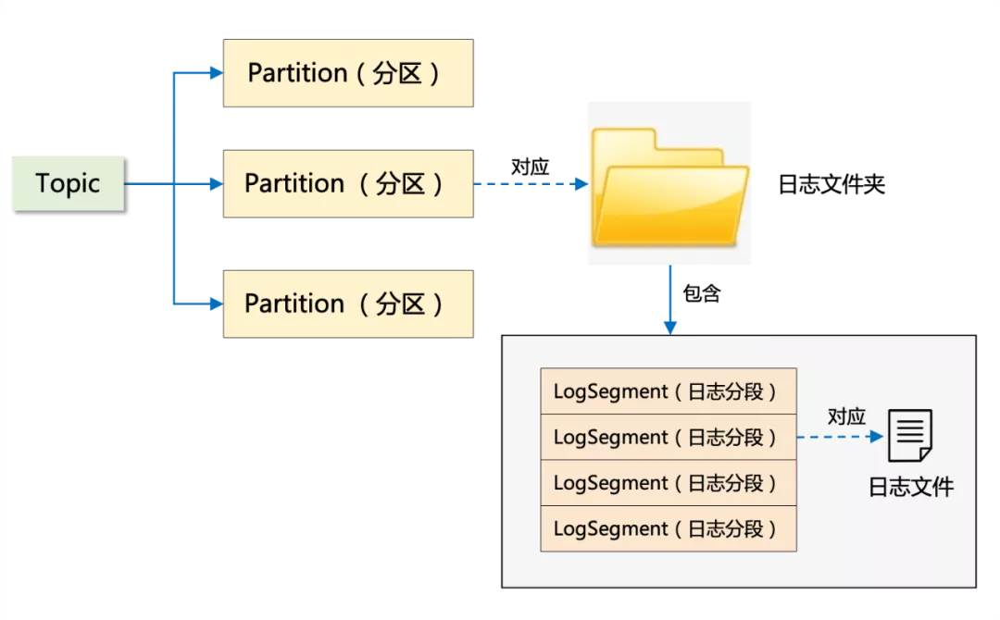
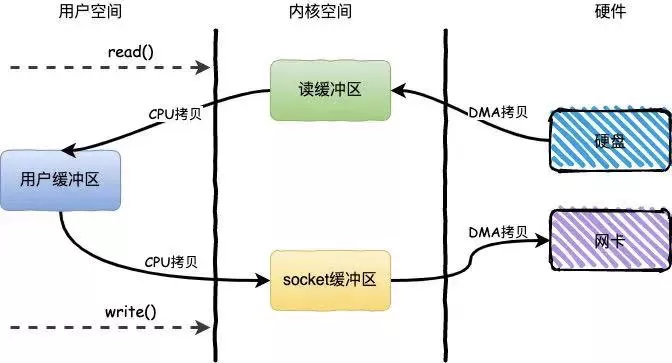
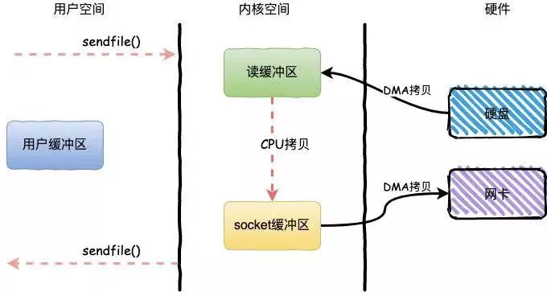

### Kafka 高性能设计全景图



### 1. 生产消息的性能优化手段

- **`批量发送消息`**

  - 磁盘顺序 IO 的速度其实非常快，不亚于内存随机读写。这样网络 IO 便成为了 Kafka 的性能瓶颈所在
  - Kafka 采用了批量发送消息的方式，通过将多条消息按照分区进行分组，然后每次发送一个消息集合，从而大大减少了网络传输的 overhead

- **`消息压缩`**

  - 目的是进一步减少网络传输带宽。
  - 对于压缩算法：**数据量越大，压缩效果越好**   ---> 批量发送利于压缩率最大化--> zipkin 客户端也用到了
  - 不仅仅减少网络 IO，还大大降低了磁盘 IO。因为批量消息在持久化到 Broker 中的磁盘时，仍然保持的是压缩状态，最终在 Consumer 端做了解压缩的操作
  - 支持的三种压缩算法的对比：gzip(压缩效果最好，压缩耗时最长)、snappy、lz4(综合性能最佳)

  

- **`高效序列化`**

  - Kafka 消息中的 Key 和 Value，都支持自定义类型，只需要提供相应的序列化和反序列化器即可。因此，用户可以根据实际情况选用快速且紧凑的序列化方式（比如 ProtoBuf、Avro）来减少实际的网络传输量以及磁盘存储量，进一步提高吞吐量

- **`内存池复用`**

  - 背景：Producer 发送 batch 数据后，内存需要被 GC 回收，有 STW 问题导致性能不能做到极致
  - 解决方案：使用内存池复用内存
    - Producer 一上来就会占用一个固定大小的内存块，比如 64MB，然后将 64 MB 划分成 M 个小内存块（比如一个小内存块大小是 16KB）
    - 需要创建一个新的 Batch 时，直接从内存池中取出一个 16 KB 的内存块即可，然后往里面不断写入消息，但最大写入量就是 16 KB，接着将 Batch 发送给 Broker ，此时该内存块就可以还回到缓冲池中继续复用了，根本不涉及垃圾回收

  

**Producer 端优化总结：**

> 传统的数据库或者消息中间件都是想办法让 Client 端更轻量，将 Server 设计成重量级，仅让 Client 充当应用程序和 Server 之间的接口
>
> 但是 Kafka 却反其道而行之，采取了独具一格的设计思路，在将消息发送给 Broker 之前，需要先在 Client 端完成大量的工作，例如：消息的分区路由、校验和的计算、压缩消息等。这样便很好地分摊 Broker 的计算压力
>
> 可见，没有最好的设计，只有最合适的设计，这就是架构的本源


### 2. 存储信息的性能优化手段

- **`IO 多路复用`**

  - 使用了 Reactor 网络通信模型
  - 源码 SocketServer 的注释

  

  

  - **`1 + N + M`**

  ```
  1：表示 1 个 Acceptor 线程，负责监听新的连接，然后将新连接交给 Processor 线程处理。
  
  N：表示 N 个 Processor 线程，每个 Processor 都有自己的 selector，负责从 socket 中读写数据。
  
  M：表示 M 个 KafkaRequestHandler 业务处理线程，它通过调用 KafkaApis 进行业务处理，然后生成 response，再交由给 Processor 线程。
  ```

- **`磁盘顺序写`**

  - 磁盘顺序写甚至快于内存随机写

- **`Page Cache`**

  - **时间局部性**：最近访问的数据很可能接下来再访问
  - **空间局部性**：数据往往是连续访问的
  - Kafka 作为消息队列，消息先是顺序写入，而且立马又会被消费者读取到，无疑非常契合上述两条局部性原理
  - 如果不用 Page Cache 而用 JVM 进程缓存，对象的**内存开销非常大**(对象头、padding等等空间，可能是实际数据的几倍)，此外还会有 **GC 造成的停顿**
  - **相关的 Linux 系统参数设置：**
    - `vm.dirty_backgroud_ratio`: 脏页占比内存多少时进行 OS 后台刷盘，一般设置(0,10]之间即可
    - `vm.dirty_ratio`:脏页占比内存多少进行强制阻塞(阻塞新的 IO 请求)同步刷盘
    - `vm.swappiness`:上限100，表示积极地使用 swap 分区，建议设置为 1，保留了 swap 机制的同时又最大限度地限制了它对 Kafka 性能的影响

  

- **`分区分段结构`**

  


### 3. 消费消息的性能优化手段

- **`mmap`**

  - 对于索引文件的读取用到了 mmap  --  常规文件操作 Page Cache

  - nio  --> MappedByteBuffer#map()

  - 为什么 log 文件不采用 mmap？

    > mmap 有多少字节可以映射到内存中与地址空间有关，32 位的体系结构只能处理 4GB 甚至更小的文件。Kafka 日志通常足够大，可能一次只能映射部分，因此读取它们将变得非常复杂。然而，索引文件是稀疏的，它们相对较小。将它们映射到内存中可以加快查找过程，这是内存映射文件提供的主要好处

  - [mmap可以让程序员解锁哪些骚操作？](https://mp.weixin.qq.com/s?__biz=Mzg4OTYzODM4Mw==&mid=2247486269&idx=1&sn=4e6cfd17ddaf5eff6c0dc6d2758573ab&scene=21#wechat_redirect)

- **`稀疏索引`**

  

- **`零拷贝`**

  - 零拷贝指**将数据直接从磁盘文件复制到网卡设备，而无需经过应用程序，减少了内核空间和用户空间的上下文切换开销**

  - 不采用零拷贝，上诉过程会经历**4 次拷贝，4 次上下文切换**

    

  - 采用了零拷贝(底层 **`sendfile 方法实现`**)，只需**2 次拷贝和 2 次上下文切换**

    - sendfile ----> **`FileChannel#transferTo()`**
    - 2 次拷贝(参考深入理解 Kafka 核心设计和实践原理)
    - 磁盘 --> kernel read buffer
      - reader buffer ----> nic buffer
      - socket buffer 中传入的是 file descriptor(位置+长度信息)
    
    

- **`批量拉取`**

  - 与生产者批量发送消息类似