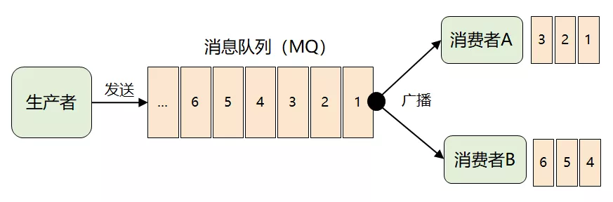
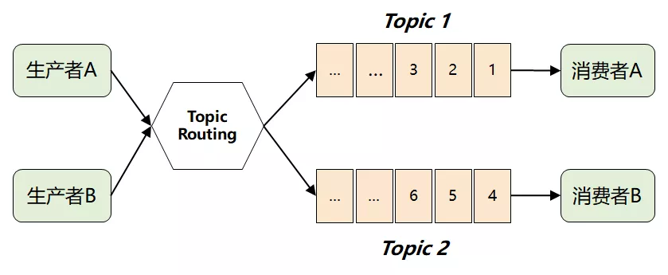
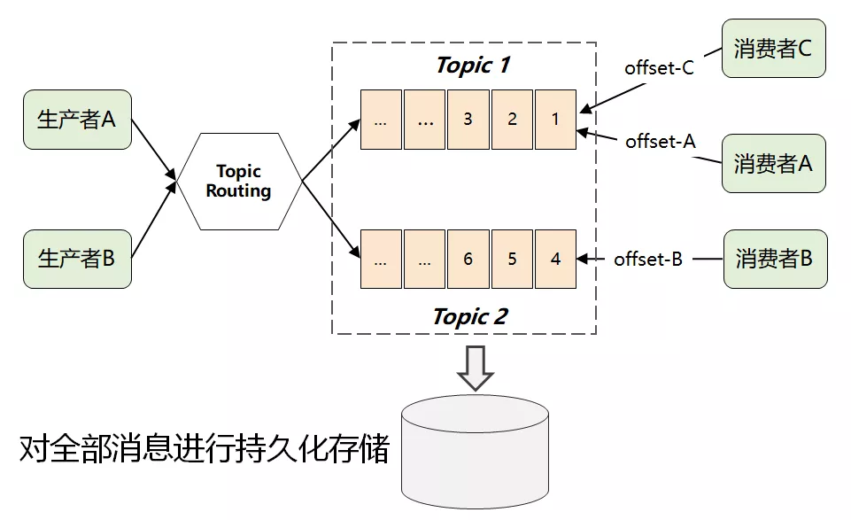
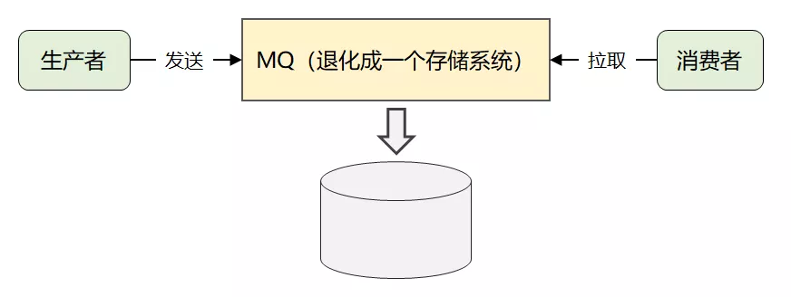

### 诞生背景

> Apache Kafka is an open-source distributed event streaming platform.

> pache Kafka 是一个开源的分布式流处理平台

Kafka 最开始是 Linkedin 内部孵化项目，设计之初是被当作[**数据管道**]，用于处理以下两种场景：

> 1. 运营活动场景：记录用户的浏览、搜索、点击、活跃度等行为
> 2. 系统运维场景：监控服务器的 CPU、内存、请求耗时等性能指标
>
> 特点：实时日志流数据，而且数据量很大

**3 种能力**

> 1. 数据的发布和订阅能力 ----> 消息队列
> 2. 数据的分布式存储能力 ----> 存储系统
> 3. 数据的实时处理能力    ---->  流处理引擎

### Kafka 的消息模型

> 广播全量消息
>
> **问题：**消费者无法只消费部分消息

> 解决上述问题：**生产者**通过**主题路由**将不同主题的消息发送到不同的主题队列中，消费者订阅自己感兴趣的主题即可
>
> **新的问题：** 无法解决多个消费者对同一个主题感兴趣(传统队列模式是单播的，一个消费者消费完数据就删除了)

> 解决上述问题：将所有消息持久化存储。由消费者自己各取所需，只需要传递消息的 offset 即可

**经过上述过程简化后的核心系统架构**

