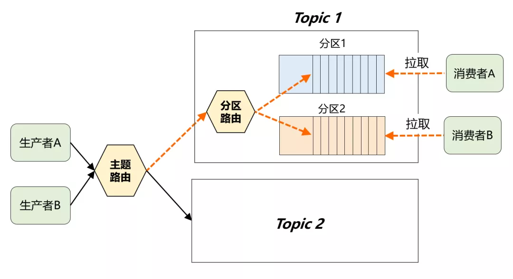
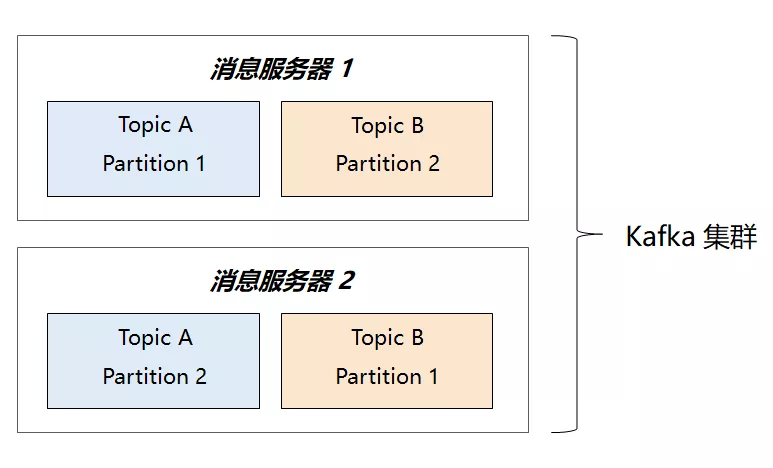
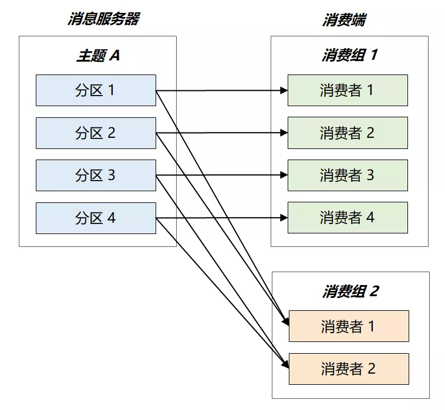
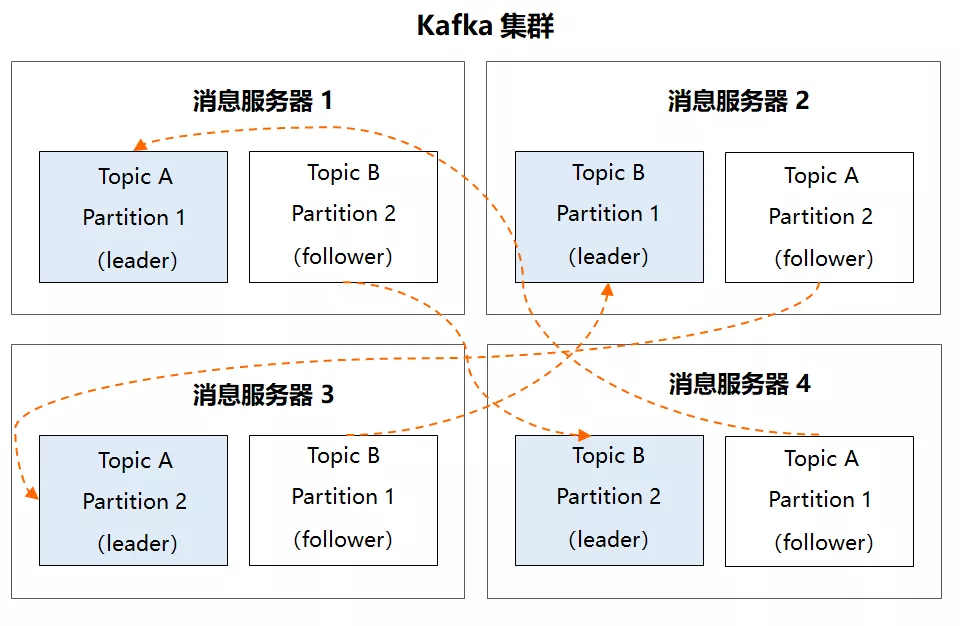
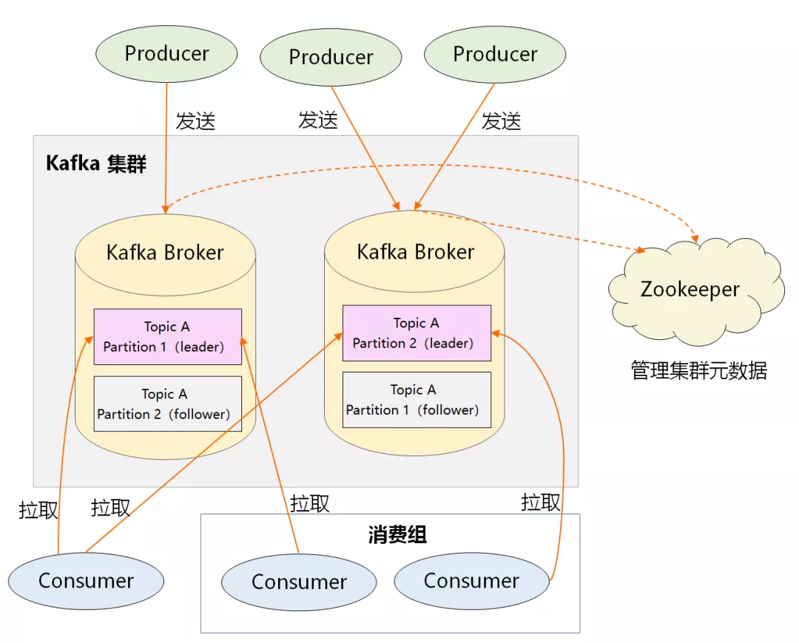

### Kafka 构架设计中的最大技术难点

> 前文剖析过 Kafka 将自己退化成存储系统的过程，而海量消息的存储问题就是它架构设计的最大难点

**解决存储问题的通用方案**

- 数据库设计中的**`分库分表`**
- 缓存设计中的**`分片集群架构`**

> Kafka 也采用了类似的水平拆分方案,拆分后的数据子集叫做 **`Partition 分区`**

> 先走**主题路由**，再走**分区路由**，最终决定发到哪个分区
>
> 其中分区路由可以简单理解成一个 Hash 函数，生产者在发送消息时，完全可以自定义这个函数来决定分区规则。如果分区规则设定合理，所有消息将均匀地分配到不同的分区中

通过这样两层关系，最终在 Topic 之下，就有了一个新的划分单位：Partition。**先通过 Topic 对消息进行逻辑分类**，**然后通过 Partition 进一步做物理分片**，最终多个 Partition 又会**均匀地分布在集群中的每台机器上**，从而很好地**解决了存储的扩展性问题**。

**因此，Partition 是 Kafka 最基本的部署单元。本文之所以将 Partition 称作 Kafka 架构设计的任督二脉，基于下面两点原因：**

> 1. Partition 是存储的关键所在，MQ「一发一存一消费」的核心流程必然围绕它展开
> 2. Kafka 高并发设计中最难的三高问题都能和 Partition 关联起来

### Kafka 的宏观架构设计

> 同一个 Topic 的两个 Partition 分区分布在不同的消息服务器上，能做到消息的分布式存储了
>
> **问题：**消息的消费也需要能做到并行

**消费者的核心述求：**

> 1. 广播消费能力：同一个 Topic 能被多个消费者订阅，一条消息能够被多次消费
> 2. 集群消费能力：当消费者本身也是集群时，每一条消息只能分发给集群中的某一个消费者进行处理

**Kafka 的解决方案：**

> 引入**`消费组`**的概念，每个消费组都有一个对应的消费组
>
> **组间进行广播消费，组内进行集群消费**
>
> 而且限定了：**每个 Partition 只能由消费组中的一个消费组进行消费**

**如何解决单独故障导致的高可用问题：**

> **Partition 多副本机制**

> 1. 在 Kafka 集群中，每个 Partition 都有多个副本，同一分区的不同副本中保存的是相同的消息
> 2. 本之间是 “一主多从” 的关系，其中 leader 副本负责读写请求，follower 副本只负责和 leader 副本同步消息，当 leader 副本发生故障时，它才有机会被选举成新的 leader 副本并对外提供服务，否则一直是待命状态

**整体架构：**

> 1. Producer：生产者，负责创建消息，然后投递到 Kafka 集群中，投递时需要指定消息所属的 Topic，同时确定好发往哪个 Partition
> 2. Consumer：消费者，会根据它所订阅的 Topic 以及所属的消费组，决定从哪些 Partition 中拉取消息
> 3. Broker：消息服务器，可水平扩展，负责分区管理、消息的持久化、故障自动转移等
> 4. Zookeeper：负责集群的元数据管理等功能，比如集群中有哪些 broker 节点以及 Topic，每个 Topic 又有哪些 Partition 等

### 总结

> 1. Kafka 通过巧妙的模型设计，将自己退化成一个海量消息的存储系统
> 2. 为了解决存储的扩展性问题，Kafka 对数据进行了水平拆分，引出了 Partition（分区），这是 Kafka 部署的基本单元，同时也是 Kafka 并发处理的最小粒度
> 3. 对于一个高并发系统来说，还需要做到高可用，Kafka 通过 Partition 的多副本冗余机制进行故障转移，确保了高可靠