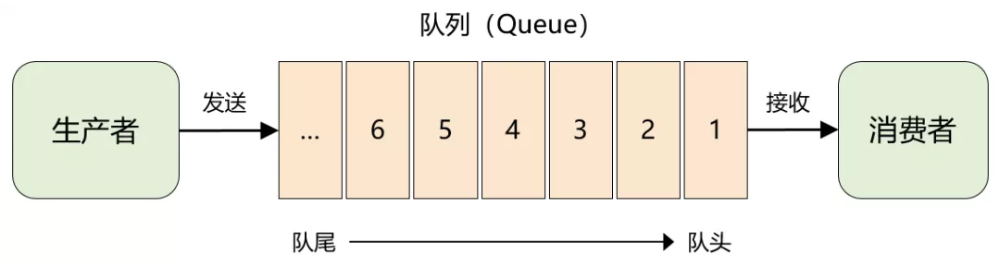
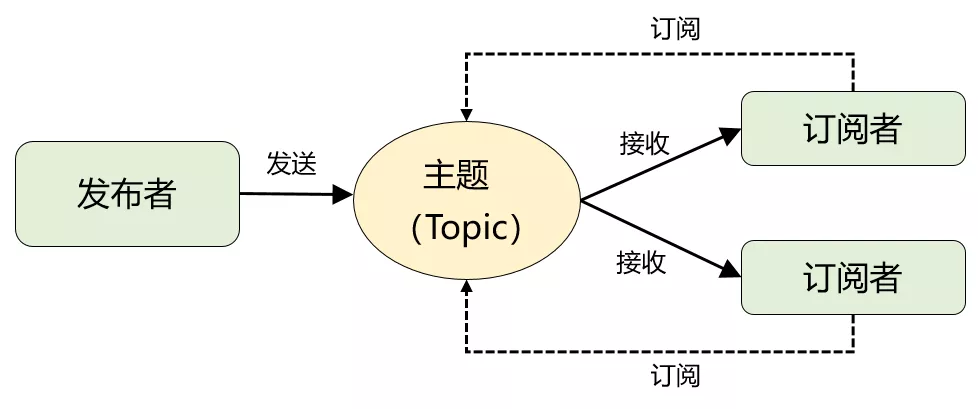
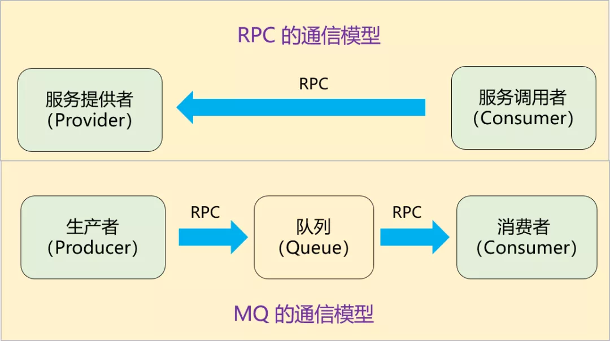
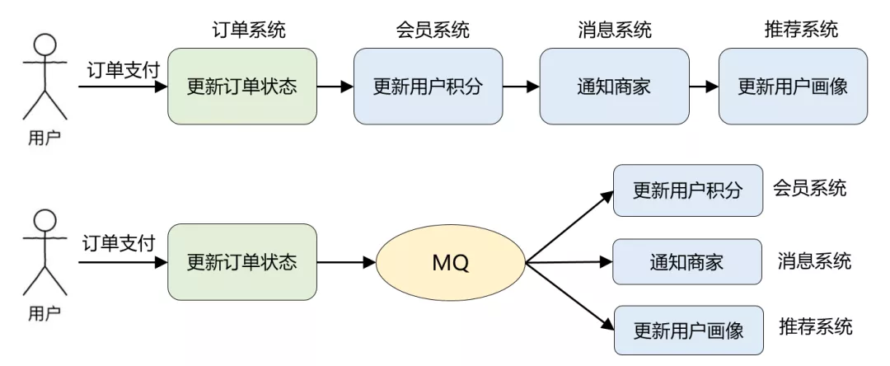
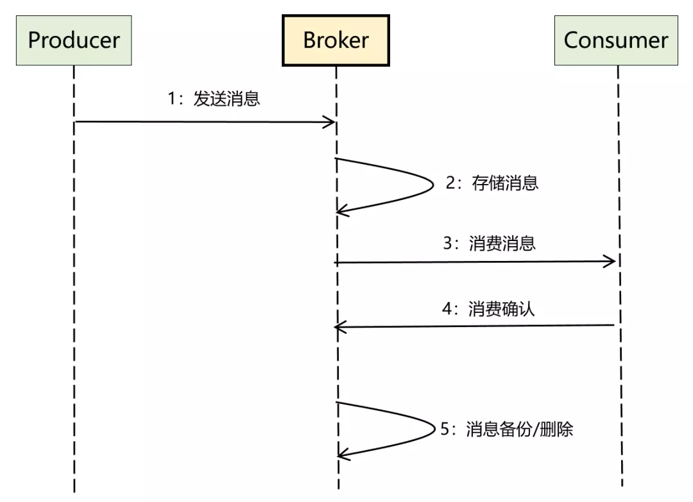

### MQ 的本质

> 发消息  -- 存消息 -- 消费消息


### 消息模型的进化

#### 队列模型



> 特点：允许多个生产者，但一个消息只能被一个消费者接收到，读完即删除

#### 发布-订阅模型



> 生产者就是发布者，队列就是主题，消费者就是订阅者，无本质区别。唯一的不同点在于：一份消息数据是否可以被多次消费

**总结**：

> 上面两种模型说白了就是：**单播**和**广播**的区别。而且，当发布-订阅模型中只有 1 个订阅者时，它和队列模型就一样了，因此在功能上是完全兼容队列模型的


### 透过模型看 MQ 的应用场景

#### 与 RPC 的异同



>1.引入 MQ 后，由之前的一次 RPC 变成了现在的**两次 RPC**，而且**生产者只跟队列耦合**，它根本无需知道消费者的存在

> 2、多了一个中间节点「队列」进行消息转储，相当于将同步变成了**异步**

#### 系统解耦



> 解耦增强了消息下游的可扩展性，异步通信减少了订单系统的整体耗时，提升了订单系统的吞吐量

#### 流量削峰

> 由于队列能转储消息，对于超出系统承载能力的场景，可以用 MQ 作为 “漏斗” 进行限流保护，即所谓的流量削峰。

#### 延时消息

> 利用队列本身的顺序性，来满足消息必须按顺序投递的场景；利用队列 + 定时任务来实现消息的延时消费


### 如何设计一个 MQ

#### 雏形

- 本质：两次 RPC + 消息转储

- 编程实现

  ```
  1. 直接利用成熟的 RPC 框架（Dubbo 或者 Thrift），实现两个接口：发消息和读消息。
  2. 消息放在本地内存中即可，数据结构可以用 JDK 自带的 ArrayBlockingQueue 。
  ```

#### 适用生产环境的 MQ

##### 需要考虑的问题

> 1. 高并发场景下收发消息的**`性能`**
> 2. 如何保证消息服务的**`高可用`**和**`高可靠`**
> 3. 如何保证**服务**是可以**`水平任意扩展`**的
> 4. 如何保证消息**存储**也是**`水平可扩展`**的
> 5. 各种**`元数据`**(集群节点、主题、消费关系)如何管理，需不需要考虑**`数据一致性`**问题

##### 整体设计思路



> 1. Broker（服务端）：MQ 中最核心的部分，是 MQ 的服务端，核心逻辑几乎全在这里，它为生产者和消费者提供 RPC 接口，负责消息的存储、备份和删除，以及消费关系的维护等。
> 2. Producer（生产者）：MQ 的客户端之一，调用 Broker 提供的 RPC 接口发送消息。
> 3. Consumer（消费者）：MQ 的另外一个客户端，调用 Broker 提供的 RPC 接口接收消息，同时完成消费确认。

##### 详细设计

> 技术难点

- RPC 通信
  - 使用成熟 RPC 框架，如 Dubbo、Thrift，不需要考虑服务注册发现、负载均衡、通信协议、序列化等一系列问题了
  - 自研，用 Netty 做底层通信，zk/eureka 等做注册中心，自定义通信协议或 AMQP 协议等。此方案的定制化能力和优化空间更大
- 高可用设计
  - Broker 服务高可用
    - 需要保证 Broker 可水平扩展进行集群部署即可，进一步通过服务自动注册与发现、负载均衡、超时重试机制、发送和消费消息时的 ack 机制来保证
  - 存储方案的高可用
    - 参考 Kafka 的分区 + 多副本模式，但需要考虑分布式场景下数据复制和一致性方案(Zab、Raft 等协议)，并实现自动故障转移
    - 用主流的 DB、分布式文件系统、带持久化能力的 KV 系统，它们都有自己的高可用方案
- 存储设计
  - 对性能要求不高的
    - 使用现成的分布式文件系统、KV 存储或者数据库方案
  - 追求高性能的
    - **追加写日志(WAL)文件**(数据部分) + **索引文件**的方式(很多开源 MQ 的方案)
    - 索引设计考虑**稠密索引**或者**稀疏索引**
    - 查找消息可以利用跳转表、二分查找等
    - 还可以通过 OS 的页缓存、零拷贝技术来提升磁盘文件的读写性能
- 消费关系管理
  - 支持发布-订阅的广播模式
  - 由于 Broker 是集群部署的，所以消费关系通常维护在公共存储上，可以基于 zk、Apollo 等配置中心来管理以及进行变更通知
- 高性能设计(其他优化点)
  - Reactor 网络 IO 模型
  - 业务线程池设计
  - 生产端批量发送
  - Broker 端异步刷盘
  - 消费端批量拉取等


#### 总结

> 1. 需要从功能性需求（收发消息）和非功能性需求（高性能、高可用、高扩展等）两方面入手
> 2. 功能性需求不是重点，能覆盖 MQ 最基础的功能即可，至于延时消息、事务消息、重试队列等高级特性只是锦上添花的东西
> 3. 最核心的是：能结合功能性需求，理清楚整体的数据流，然后顺着这个思路去考虑非功能性的诉求如何满足，这才是技术难点所在

> 来源：[《吃透 MQ 系列》之核心基础篇](https://mp.weixin.qq.com/s?__biz=MzU2MTM4NDAwMw==&mid=2247488812&idx=1&sn=1e23afce50441bcf594c001f0965306b&chksm=fc78ca00cb0f4316e4c8583b84556c62574b50adaa8511d932459396944e9babeee9d141086b&scene=21#wechat_redirect)