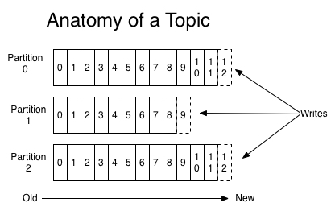
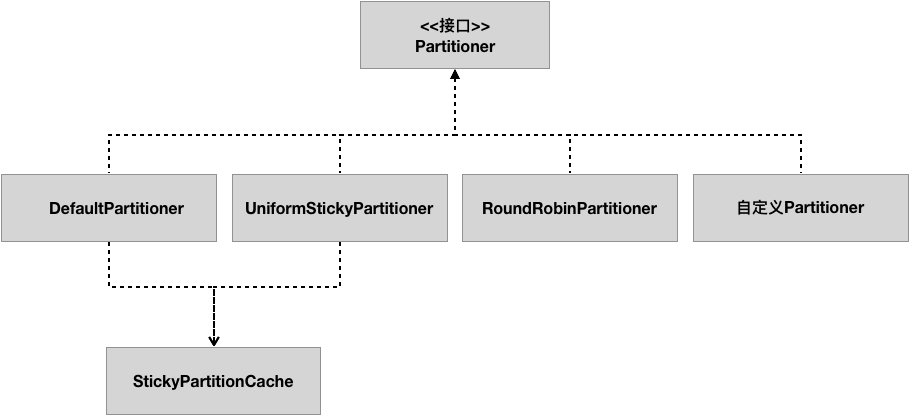

### 分区策略



- Partitioner 接口

  - 分区方法 partition()

  ```java
  /**
  * topic、key、keyBytes、value和valueBytes都属于消息数据，cluster则是集群信* * 息（可以获得一个主题的所有分区信息列表和available分区信息列表等等
  */
  int partition(String topic, Object key, byte[] keyBytes, Object value, byte[] valueBytes, Cluster cluster);
  ```

  - 只要你自己的实现类定义好了 partition 方法，同时设 **partitioner.class** 参数为你自己实现类的 Full Qualified Name，那么生产者程序就会按照你的代码逻辑对消息进行分区
  - close() 方法

- 随机策略 - Randomness（已弃用）

  ```java
  List<PartitionInfo> partitions = cluster.partitionsForTopic(topic);
  return ThreadLocalRandom.current().nextInt(partitions.size());`
  ```

- 轮询策略 - Round-Robin

  - 轮询策略有非常优秀的负载均衡表现，它总是能保证消息最大限度地被平均分配到所有分区上。
  - 但是在吞吐量较小的情况下，也会导致更多批次，而这些批次的大小更小，其实，将所有记录转到指定的分区（或几个分区）并以更大的批记录一起发送似乎会更好。
  - 在key=null时，轮询策略是2.3版本默认使用的分区策略，2.4版本（KIP-480）引入了更好的黏性分区策略。

- 黏性分区策略 - UniformSticky

  - 消息记录会成批的从生产者发送到Broker
  - 生产者触发发送请求的时机由批记录的大小参数和linger.ms参数决定，批记录的大小达到设定的值或linger.ms参数时间到，都会触发批记录的发送（与 zipkin-okhttp-sender 类似！！！）
  - 黏性分区策略通过“黏贴”到分区直到批记录已满（或在linger.ms启动时发送），与轮询策略相比，我们可以创建更大的批记录并减少系统中的延迟。即使在linger.ms为零立即发送的情况下，也可以看到改进的批处理和减少的延迟。在创建新批处理时更改粘性分区，随着时间的流逝，记录应该在所有分区之间是平均分配的。2.4版本key=null时默认使用黏性分区策略

- 按消息 Key 分区策略

  - Kafka 允许为每条消息定义消息键，简称为 Key
  - Key 的作用非常大，它可以是一个有着明确业务含义的字符串，比如客户代码、部门编号或是业务 ID 等；

- 自定义分区策略

  - 一种比较常见的，即所谓的基于地理位置的分区策略。当然这种策略一般只针对那些大规模的 Kafka 集群，特别是跨城市、跨国家甚至是跨大洲的集群
  - 此时我们就可以根据 Broker 所在的 IP 地址实现定制化的分区策略。比如下面这段代码:

  ```java
  List<PartitionInfo> partitions = cluster.partitionsForTopic(topic); 
  return partitions.stream().filter(p -> isSouth(p.leader().host())).map(PartitionInfo::partition).findAny().get();
  ```

- 默认分区策略 - DefaultPartitioner

  - key不为null时，对key进行hash（基于murmurHash2算法），根据最终得到的hash值计算分区号，有相同key的消息会被写入同样的分区；
  - key为null时，2.3版本使用轮询分区策略，2.4版本使用黏性分区策略。


### 生产者分区逻辑

- 指定partition的情况下，直接发往该分区
- 没有指定partition的情况下，根据分区策略确定发往的分区
  - 配置了自定义分区策略的情况下使用自定义的分区策略
  - 没有配置的情况下使用默认分区策略DefaultPartitioner


> 参考：[kafka生产者消息分区机制](https://huagetai.github.io/posts/fabbb24d/)