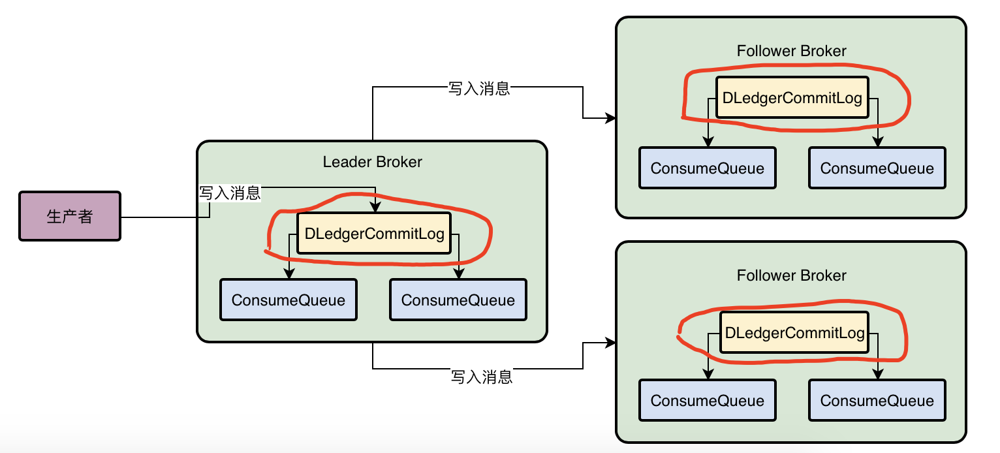

### 1. 管理 CommitLog

- DLedger 技术实际上首先他自己就有一个 CommitLog 机制，你把数据交给他，他会写入 CommitLog 磁盘文件里去，这是他能干的第一件事情
- 使用 DLedger 来管理 CommitLog，然后Broker还是可以基于 DLedger 管理的 CommitLog 去构建出来机器上的各个 ConsumeQueue 磁盘文件

 ### 2. 基于Raft协议选举Leader Broker

- 第一轮选举：
  - Broker01是投票给自己的，Broker02是投票给自己的，Broker03是投票给自己的，他们都把自己的投票发送给了别人。
  - Broker01会收到别人的投票，他发现自己是投票给自己，但是Broker02投票给Broker02自己，Broker03投票给Broker03自己，似乎每个人都很自私，**都在投票给自己，所以第一轮选举是失败的**
- 每个人会进入一个**随机时间的休眠**，比如说Broker01休眠3秒，Broker02休眠5秒，Broker03休眠4秒
- 第二轮：
  - 此时Broker01必然是先苏醒过来的，他苏醒过来之后，直接会继续尝试投票给自己，并且发送自己的选票给别人
  - 着Broker03休眠4秒后苏醒过来，他发现Broker01已经发送来了一个选票是投给Broker01自己的，**此时他自己因为没投票，所以会尊重别人的选择，就直接把票投给Broker01**了，同时把自己的投票发送给别人
  - 着Broker02苏醒了，他收到了Broker01投票给Broker01自己，收到了Broker03也投票给了Broker01，那么他此时自己是没投票的，直接就会尊重别人的选择，直接就投票给Broker01，并且把自己的投票发送给别人
  - 只要有（3台机器 / 2） + 1个人投票给某个人，就会选举他当Leader，这个（机器数量 / 2） + 1就是大多数的意思
- 确保有人可以成为Leader的核心机制就是一轮选举不出来Leader的话，就让大家**随机休眠**一下，**先苏醒过来的人会投票给自己，其他人苏醒过后发现自己收到选票了，就会直接投票给那个人**

### 3. 基于Raft协议进行多副本同步

> 数据同步会分为**两个阶段**，一个是**`uncommitted`**阶段，一个是**`commited`**阶段

- **uncommitted 阶段**
  - 首先Leader Broker上的DLedger收到一条数据之后，会标记为uncommitted状态，然后他会通过自己的DLedgerServer组件把这个uncommitted数据发送给Follower Broker的DLedgerServer
- **committed 阶段**
  - 接着Follower Broker的DLedgerServer收到uncommitted消息之后，必须返回一个ack给Leader Broker的DLedgerServer，然后**如果Leader Broker收到超过半数的Follower Broker返回ack之后**，就会将消息标记为committed状态
  - 然后Leader Broker上的DLedgerServer就会发送commited消息给Follower Broker机器的DLedgerServer，**让 Follower 他们也把消息标记为comitted状态**

**如果 Leader Broker 崩溃：**

- 基于DLedger还是采用Raft协议的算法，去选举出来一个新的Leader Broker继续对外提供服务，而且会对没有完成的数据同步进行一些**恢复性的操作，保证数据不会丢失**

- 消息是 uncommitted 状态，还没发送 uncommitted 数据到 follower 上，此时 leader 崩溃
  - 消息发送失败，需要客户端不断重试
- 消息是 uncommitted 状态，已经发送 uncommitted 数据到 follower 上，部分 follower 接收到请求，还没达到半数 follower 返回 ack 给 leader， 此时 leader 崩溃
  - 消息发送失败
- 超过了半数的uncommitted请求的ack给leader了，服务注册请求已经成功了，此时leader崩溃了，选举一个新的 leader，会去接收其他follower的ack，如果超过半数follower有ack，直接commit操作