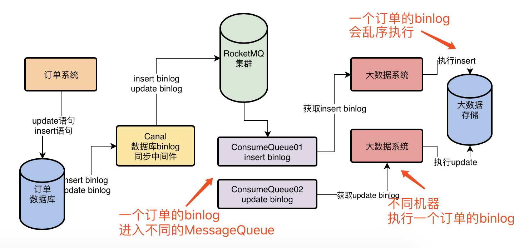

### 消息乱序的本质原因

> **同属于一个业务处理的消息被发送到多个 MessageQueue 中，被多个消费者处理，出现乱序**

### 解决方案

- 将**同一个订单id 的消息发送到同一个 MessageQueue 中**
  - 发送消息的时候传入一个 **MessageQueueSelector**，在里面你要根据
    订单id和MessageQueue数量去选择这个订单id的数据进入哪个MessageQueue
  - **同时在发送消息的时候除了带上消息自己以外，还要带上订单id**，然后 MessageQueueSelector 就会根据订单id去选择一个 MessageQueue 发送过去，这样的话，就可以保证一个订单的多个 binlog 都会进入一个 MessageQueue 中去
  
- 消费端：
  - 使用 **MessageListenerOrderly** 监听器
  - Consumer 会对每个 ConsumeQueue，都仅仅使用一个线程来处理其中的消息
  - 消费失败**不能走重试队列**，对于有序消息的方案中，如果你遇到消息处理失败的场景，就必须返回**SUSPEND_CURRENT_QUEUE_A_MOMENT**这个状态，意思是**先等一会儿，一会儿再继续处理这批消息**，而不能把这批消息放入重试队列去，然后直接处理下一批消息