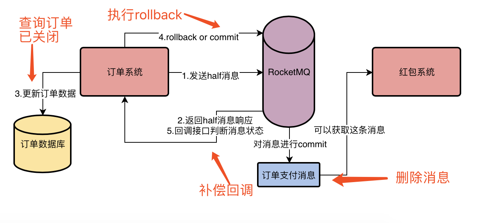
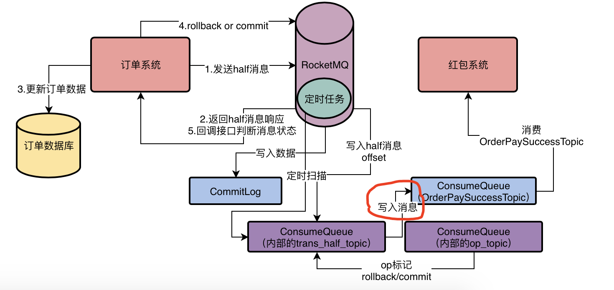

> **场景举例：** 
>
> 支付了订单后发送消息给红包系统发送红包


### 1. 发送端

> 使用事务消息机制发送

#### 1.1 事务消息原理

- 事务消息发送到 broker 后是 **half 状态**，此时**对消费者是不可见**的(在订单增删改之前发送)
- 若上一步发送成功，执行本地数据库事务，如果发送失败，走回滚流程
- 若事务执行成功，发送 commit 请求到 broker 提交，此时消息才对消费者可见
- 若事务执行失败，发送 rollback 请求到 broker 回滚

#### 1.2 如果 half 消息发送成功，一直没有响应怎么办

> RocketMQ 这里有一个**补偿流程**，他会去扫描自己处于 half 状态的消息，如果我们一直没有对这个消息执行 commit/rollback 操作，超过了一定的时间，他就会**回调你的订单系统的一个接口.**
>
> **回调接口逻辑**：这个时候我们的订单系统就得去查一下数据库，看看这个订单当前的状态，一下发现订单状态是“已关闭”，此时就知道，你必然得发送rollback请求给
> MQ去删除之前那个half消息了！

#### 1.3 commit/rollback 失败的处理

> MQ里的消息一直是half状态，过了一定的超时时间会发现这个half消息有问题，他会回调你的订单系统的接口



#### 1.4 half 消息对消费者不可见的原理

- half 消息的 offset 不会被写入相应 topic 的 ConsumeQueue 中
- half 消息会被写入到 broker 自己内部的 **`RMQ_SYS_HALF_TOPIC`** 这个 topic 对应的 ConsumeQueue 中
- 后台有定时任务，定时任务会去扫描RMQ_SYS_TRANS_HALF_TOPIC中的half消息，如果你超过一定时间还是half消息，他会回调订单系统的接口，让你判断这个half消息是要rollback还是commit

#### 1.5 如果执行 rollback 操作，如何标记消息回滚

- 因为RocketMQ都是顺序把消息写入磁盘文件的，所以在这里如果你执行rollback，他的本质就是用一个OP操作来标记half消息的状态RocketMQ内部有一个**OP_TOPIC**，此时可以写一条rollback OP记录到这个Topic里，标记某个half消息是rollback了
- 假设你一直没有执行commit/rollback，RocketMQ会回调订单系统的接口去判断half消息的状态，但是他最多就是**回调15次**，如果15次之后你都没法告知他half消息的状态，就自动把消息标记为rollback

#### 1.6 执行 commit 后，如何对消费者可见

- 执行commit操作之后，RocketMQ就会在OP_TOPIC里写入一条记录，标记half消息已经是commit状态
- 接着需要把放在RMQ_SYS_TRANS_HALF_TOPIC中的half消息给写入到OrderPaySuccessTopic的ConsumeQueue里去，然后我们的红包系统可以就可以看到这条消息进行消费了




#### 1.7 代码示例

```java
// 消息回调接口
TransactionListener transactionListener = new TransactionListener() {
    /**
     * 如果 half 消息发送成功了，就会回调这个接口，就可以执行本地事务了
     */
    @Override
    public LocalTransactionState executeLocalTransaction(Message message, Object o) {
        try {
            return LocalTransactionState.COMMIT_MESSAGE;
        } catch (Exception e) {
            // 本地事务执行失败，发送 rollback 消息给 mq
            return LocalTransactionState.ROLLBACK_MESSAGE;
        }
    }

    /**
     * 因为各种原因，没有返回 commit 或 rollback
     */
    @Override
    public LocalTransactionState checkLocalTransaction(MessageExt messageExt) {
        // 查询本地事务，是否执行成功了
        String id = messageExt.getTransactionId();
        Integer status = Integer.parseInt(id);
        if (null != status) {
            switch (status) {
                case 0: return LocalTransactionState.UNKNOW;
                case 1: return LocalTransactionState.COMMIT_MESSAGE;
                case 2: return LocalTransactionState.ROLLBACK_MESSAGE;
            }
        }
        return LocalTransactionState.COMMIT_MESSAGE;
    }
};

TransactionMQProducer producer = new TransactionMQProducer("TestProducerGroup");

ExecutorService executorService = new ThreadPoolExecutor(
        2,
        5,
        100,
        TimeUnit.SECONDS,
        new ArrayBlockingQueue<>(2000),
        r -> {
            Thread thread = new Thread(r);
            thread.setName("TestThread");
            return thread;
        });
// 给事务消息生产者设置对应的线程池，复制执行 rocketmq 的回调请求
producer.setExecutorService(executorService);
// 设置对应的回调请求监听器
producer.setTransactionListener(transactionListener);
producer.start();

Message msg = new Message(
        "PayOrderSuccessTopic",
        "TestTag",
        "TestKey",
        "订单支付成功".getBytes(StandardCharsets.UTF_8));

try {
    // 将消息作为 half 消息的模式发送出去
    TransactionSendResult result = producer.sendMessageInTransaction(msg, null);
} catch (Exception e) {
    // half 消息发送失败
    // 订单系统执行回滚逻辑
}
```


### 2. 存储端

- broker 配置**同步刷盘**策略
  - broker 配置文件配置：
  - **flushDiskType**：SYNC_FLUSH/ASYNC_FLUSH
- 对 broker 使用高可用主从架构，实现数据冗余


### 3. 消费端

- **手动提交 offset**
  - 在消息监听处理器 MessageListenerConcurrently 的逻辑中，处理完因为逻辑，在手动提交 offset，返回 ConsumeConcurrentlyStatus.CONSUME_SUCCESS
- **自动故障转移**
  - 如果业务已处理，还没有提交 offset 系统挂了
  - 此时 rocketmq 会将没处理完的消息交给其他消费者处理
- 注意：
  - 不能在代码中对消息进行异步的处理