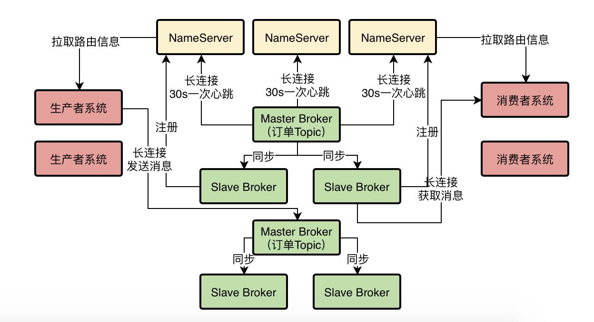

### MessageQueue

> 在创建Topic的时候需要指定一个很关键的参数，就是MessageQueue,本质上就是一个数据分片的机制,他通过MessageQueue将一个Topic的数据拆分为了很多个数据分片，然后在每个Broker机器上都存储一些MessageQueue

 ### Broker 故障处理

- 建议大家在Producer中开启一个开关,**`sendLatencyFaultEnable`**
- 一旦打开了这个开关，那么他会有一个**自动容错机制**，比如如果某次访问一个Broker发现网络延迟有500ms，然后还无法访问，那么就会自动回避访问这个Broker一段时间，比如接下来 3000ms 内，就不会访问这个Broker了,自动回避一段时间不要访问这个 Broker，**过段时间再去访问他**

