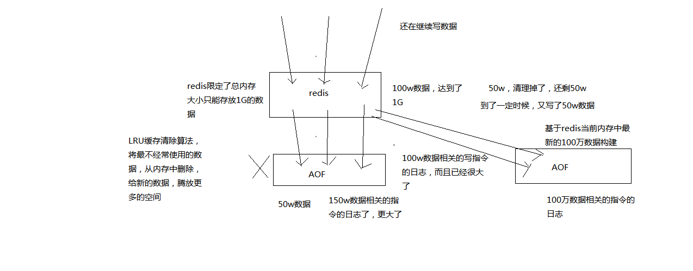

### 持久化的意义 - 故障恢复


#### 1. RDB 和 AOF 持久化机制

>  RDB 

```
对 redis 中的数据执行周期性的快照持久化
1. redis根据配置自己尝试去生成rdb快照文件
2. fork一个子进程出来
3. 子进程尝试将数据dump到临时的rdb快照文件中
4. 完成rdb快照文件的生成之后，就替换之前的旧的快照文件
```

> AOF

```
AOF 机制对每条写入命令作为日志，以append-only的模式写入一个日志文件中，在redis重启的时候，通过回放AOF日志的写入命令来重构整个数据集
```


持久化的数据还可以同步到其他存储服务做备份。如果同时使用了 RDB 和 AOF，重启的时候会采用 AOF 来重构数据。


#### 2. RDB 持久化机制的优点

- 生成多个内存快照数据，每个代表了某个时刻的数据，适合做冷备，可以在其他存储系统上做备份
- RDB 对 redis 本身提供的对外读写服务影响很小，因为 redis 主线程可以 fork 一个子线程出来专门做 RDB 的持久化工作
- 重启时数据恢复更快速


#### 3. RDB 机制的缺点

- 可能丢失的数据更多（每次 snapshot dump有个间隔时间）
- 子进程在dump 快照的时候，如果数据特别大，会有数毫秒甚至数秒的服务停顿


#### 4. AOF 持久化机制的优点

- 保存的数据更完整，一般 AOF 会每隔一秒通过一个后台线程执行一次 fsync 操作
- AOF 以append-only 的形式写入日志文件，没有磁盘寻址的开销，写入性能高，而且不易破损，即使尾部破损也很容易修复
- AOF 在 rewrite log 的时候，会对其中的指令进行压缩，创建一份需要恢复数据的最小日志出来。在创建新日志文件的时候，老的还是照常写入。新的merge后的日志文件ready的时候在新老日志文件交换。
- 非常适合做灾难性的误删除的紧急恢复（在后台 rewrite 发生之前删除AOF文件中的错误指令再放回）



#### 5. AOF 机制的缺点

- AOF 比 RDB 数据快照文件更大
- QPS 要比 RDB 低
- 数据恢复的时候比较慢，不适合做冷备

#### 6. AOF 和 RDB 如何选择

- 综合使用两种机制，AOF 保证数据不丢失，RDB 做冷备

#### 7. RDB 的持久化配置

- save 60 1000   --> 每隔 60 s，如果有超过 1000 个 key 发生了变更，就生成一个新的 dump.rdb 文件，snapshotting，快照
- 也可以手动调用 save 或者 bgsave 命令，同步或异步执行 rdb 快照生成
- save 也可以设置多个快照检查点

#### 8. AOF 的持久化配置

- AOF 默认关闭，RDB 默认打开

- appendonly  yes 打开，生产环境需要打开，每次接收到一条写命令写入日志文件（OS Cache）,每个一段事件 fsync 刷盘

- redis 重启时默认通过 AOF 进行数据恢复

- fsync 的三种策略：

  - always

    没收到一条写命令就刷盘

  - everysec

    没秒刷盘

  - no

    写入 OS Cache 就不管了，OS 根据自己的策略刷盘

#### 9. AOF rewrite

- 背景：redis 的数据会不断淘汰掉旧的（内存有限，缓存清除），所以redis会定期rewrite保存最新的aof日志覆盖掉旧的

- 配置 rewrite 机制

  - auto-aof-rewrite-percentage 100
  - auto-aof-rewrite-min-size 64mb

- rewrite 流程：

  ```
  1）redis fork一个子进程
  2）子进程基于当前内存中的数据，构建日志，开始往一个新的临时的AOF文件中写入日志
  3）redis主进程，接收到client新的写操作之后，在内存中写入日志，同时新的日志也继续写入旧的AOF文件
  4）子进程写完新的日志文件之后，redis主进程将内存中的新日志再次追加到新的AOF文件中
  5）用新的日志文件替换掉旧的日志文件
  ```

#### 10. AOF 破损文件的修复

```
redis-check-aof --fix [path/to/aof-file]    #命令修复
```

#### 11. AOF 和 RDB 同时工作

```
1）如果RDB在执行snapshotting操作，那么redis不会执行AOF rewrite; 如果redis再执行AOF rewrite，那么就不会执行RDB snapshotting
2）如果RDB在执行snapshotting，此时用户执行BGREWRITEAOF命令，那么等RDB快照生成之后，才会去执行AOF rewrite
3）同时有RDB snapshot文件和AOF日志文件，那么redis重启的时候，会优先使用AOF进行数据恢复，因为其中的日志更完整
```


