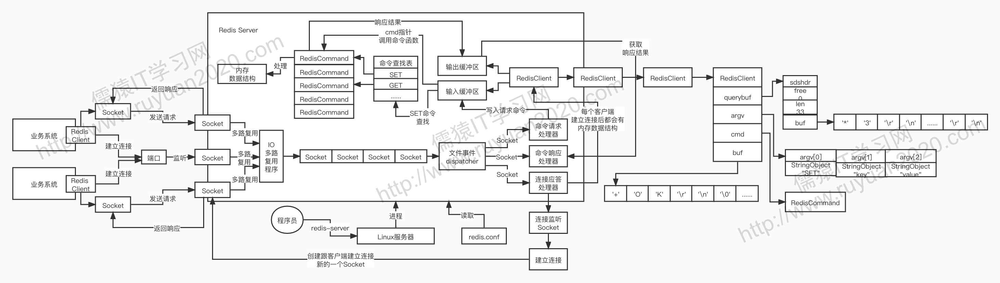

### 1. 文件事件 file event

> 将所有的网络事件抽象为文件事件

### 2. 串行化单线程模型为什么能高并发

- socket **连接的建立，性能开销是可控的**
- server 和 client 端建立的都是**长连接**，复用减少开销
- 对于建立好的大量 socket，短时间内高并发出现网络事件，为什么 **队列串行化+单线程**性能更好？
  - 都是基于**纯内存操作，速度很快(低于1ms)**
  - 单线程+串行化队列避免了多线程间的加锁/互斥和线程切换等资源开销
- 高并发靠的是**每个请求执行和处理的速度和效率**