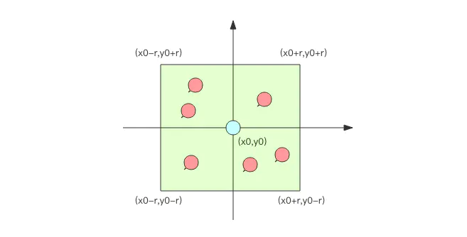

### 适用场景

> 附近的人、附近的餐厅、附近的公交站等等

### 适用数据库计算



```
经纬度坐标的密度不一样 (地球是一个椭圆)，勾股定律计算平方差时之后再求和时，需要按一定的系数比加权求和，如果不求精确的话，也可以不必加权。
首先，你不可能通过遍历来计算所有的元素和目标元素的距离然后再进行排序，这个计算量太大了，性能指标肯定无法满足。一般的方法都是通过矩形区域来限定元素的数量，然后对区域内的元素进行全量距离计算再排序。这样可以明显减少计算量。如何划分矩形区域呢？可以指定一个半径 r，使用一条 SQL 就可以圈出来。当用户对筛出来的结果不满意，那就扩大半径继续筛选。
select id from positions where x0-r < x < x0+r and y0-r < y < y0+r
为了满足高性能的矩形区域算法，数据表需要在经纬度坐标加上双向复合索引 (x, y)，这样可以最大优化查询性能。
```

### GeoHash 算法

算法思想：

```
GeoHash 算法将二维的经纬度数据映射到一维的整数，这样所有的元素都将在挂载到一条线上，距离靠近的二维坐标映射到一维后的点之间距离也会很接近。当我们想要计算「附近的人时」，首先将目标位置映射到这条线上，然后在这个一维的线上获取附近的点就行了。
```

算法实现：


```
编码之后，每个地图元素的坐标都将变成一个整数，通过这个整数可以还原出元素的坐标，整数越长，还原出来的坐标值的损失程度就越小。对于「附近的人」这个功能而言，损失的一点精确度可以忽略不计。
GeoHash 算法会继续对这个整数做一次 base32 编码 (0-9,a-z 去掉 a,i,l,o 四个字母) 变成一个字符串。在 Redis 里面，经纬度使用 52 位的整数进行编码，放进了 zset 里面，zset 的 value 是元素的 key，score 是 GeoHash 的 52 位整数值。zset 的 score 虽然是浮点数，但是对于 52 位的整数值，它可以无损存储。
在使用 Redis 进行 Geo 查询时，我们要时刻想到它的内部结构实际上只是一个 zset(skiplist)。通过 zset 的 score 排序就可以得到坐标附近的其它元素 (实际情况要复杂一些，不过这样理解足够了)，通过将 score 还原成坐标值就可以得到元素的原始坐标。
```

### Redis 的 GEO 指定的基本适用

1. 增加 geoadd

   ```
   127.0.0.1:6379> geoadd company 116.48105 39.996794 juejin
   (integer) 1
   127.0.0.1:6379> geoadd company 116.514203 39.905409 ireader
   (integer) 1
   127.0.0.1:6379> geoadd company 116.489033 40.007669 meituan
   (integer) 1
   127.0.0.1:6379> geoadd company 116.562108 39.787602 jd 116.334255 40.027400 xiaomi
   (integer) 2
   ```

2. 距离 geodist

   ```
   127.0.0.1:6379> geodist company juejin ireader km
   "10.5501"
   127.0.0.1:6379> geodist company juejin meituan km
   "1.3878"
   127.0.0.1:6379> geodist company juejin jd km
   "24.2739"
   127.0.0.1:6379> geodist company juejin xiaomi km
   "12.9606"
   127.0.0.1:6379> geodist company juejin juejin km
   "0.0000"
   ```

3. 获取元素位置 geopos

   ```
   127.0.0.1:6379> geopos company juejin
   1) 1) "116.48104995489120483"
      2) "39.99679348858259686"
   127.0.0.1:6379> geopos company ireader
   1) 1) "116.5142020583152771"
      2) "39.90540918662494363"
   127.0.0.1:6379> geopos company juejin ireader
   1) 1) "116.48104995489120483"
      2) "39.99679348858259686"
   2) 1) "116.5142020583152771"
      2) "39.90540918662494363"
   ```

4. 获取元素 hash 值  geohash

   ```
   127.0.0.1:6379> geohash company ireader
   1) "wx4g52e1ce0"
   127.0.0.1:6379> geohash company juejin
   1) "wx4gd94yjn0"
   ```

5. 附近的元素 georadiusbymember georadius 

   ```
   # 范围 20 公里以内最多 3 个元素按距离正排，它不会排除自身
   127.0.0.1:6379> georadiusbymember company ireader 20 km count 3 asc
   1) "ireader"
   2) "juejin"
   3) "meituan"
   # 范围 20 公里以内最多 3 个元素按距离倒排
   127.0.0.1:6379> georadiusbymember company ireader 20 km count 3 desc
   1) "jd"
   2) "meituan"
   3) "juejin"
   # 三个可选参数 withcoord withdist withhash 用来携带附加参数
   # withdist 很有用，它可以用来显示距离
   127.0.0.1:6379> georadiusbymember company ireader 20 km withcoord withdist withhash count 3 asc
   1) 1) "ireader"
      2) "0.0000"
      3) (integer) 4069886008361398
      4) 1) "116.5142020583152771"
         2) "39.90540918662494363"
   2) 1) "juejin"
      2) "10.5501"
      3) (integer) 4069887154388167
      4) 1) "116.48104995489120483"
         2) "39.99679348858259686"
   3) 1) "meituan"
      2) "11.5748"
      3) (integer) 4069887179083478
      4) 1) "116.48903220891952515"
         2) "40.00766997707732031"
   
   ######
   127.0.0.1:6379> georadius company 116.514202 39.905409 20 km withdist count 3 asc
   1) 1) "ireader"
      2) "0.0000"
   2) 1) "juejin"
      2) "10.5501"
   3) 1) "meituan"
      2) "11.5748"
   ```

6. 删除

   ```
   geo 存储结构上使用的是 zset，意味着我们可以使用 zset 相关的指令来操作 geo 数据，所以删除指令可以直接使用 zrem 指令即可
   ```


### 总结

```
在一个地图应用中，车的数据、餐馆的数据、人的数据可能会有百万千万条，如果使用 Redis 的 Geo 数据结构，它们将全部放在一个 zset 集合中。在 Redis 的集群环境中，集合可能会从一个节点迁移到另一个节点，如果单个 key 的数据过大，会对集群的迁移工作造成较大的影响，在集群环境中单个 key 对应的数据量不宜超过 1M，否则会导致集群迁移出现卡顿现象，影响线上服务的正常运行。

所以，这里建议 Geo 的数据使用单独的 Redis 实例部署，不使用集群环境。

如果数据量过亿甚至更大，就需要对 Geo 数据进行拆分，按国家拆分、按省拆分，按市拆分，在人口特大城市甚至可以按区拆分。这样就可以显著降低单个 zset 集合的大小
```

