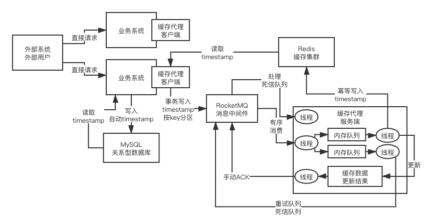

### Cache Aside Pattern

- 读取时，先读缓存，没有再读数据库，并放入缓存中
- 更新的时候，**先删除缓存，再更新数据库**

### 双写不一致问题的分析

#### 1. 先更新数据库，再删除缓存失败了

> 改为**先删除缓存，再更新数据库**

#### 2. 并发情况下的删除缓存失败

- 删除缓存后，还未更新数据库，就有别的请求都数据库并放到缓存中

- 基于 mq 实现的强一致方案

  （1）   更新数据带时间戳作为版本号

  （2）   缓存系统客户端

  （3）   基于rocketmq事务机制，保证投递

  （4）   mq里的数据按key进行分区，保证同一个key的顺序

  （5）   缓存系统服务端

  （6）   按key分区投递到大量内存队列里去，多线程并发处理

  （7）   每个内存队列基于一个磁盘文件实现持久化

  （8）   内存队列+磁盘队列，同时写入+同时读取出来

  （9）   根据数据版本号，按照强顺序更新同一个key下的缓存

  （10） 基于redis分布式集群实现缓存按版本有序更新

  （11） 随意重启缓存系统服务端，内存队列数据绝对不会丢失

  （12） 根据版本实现缓存更新幂等性，避免一个版本重复更新

  （13） 超大key自动识别+独立大队列缓存，避免积压

  （14） redis集群故障时，实现本地磁盘持久化降级，避免内存队列满

  （15） 缓存系统客户端支持缓存读取

  （16） 缓存系统客户端，自动统计和识别热key

  （17） 热key自动缓存在业务系统jvm本地，热key访问从jvm读取

  （18） 缓存系统服务端如果更新热key，通过mq发送广播消息，通知所有客户端更新

- 其他方案：**读请求和写请求串行化**，串到一个**内存队列**里去
- 简单解决方案 -- 缓存双删
  - 先删缓存，再更新数据库，过1秒后再删除缓存
  - 如果延迟删除失败，将失败的key放入消息队列，再重试删除