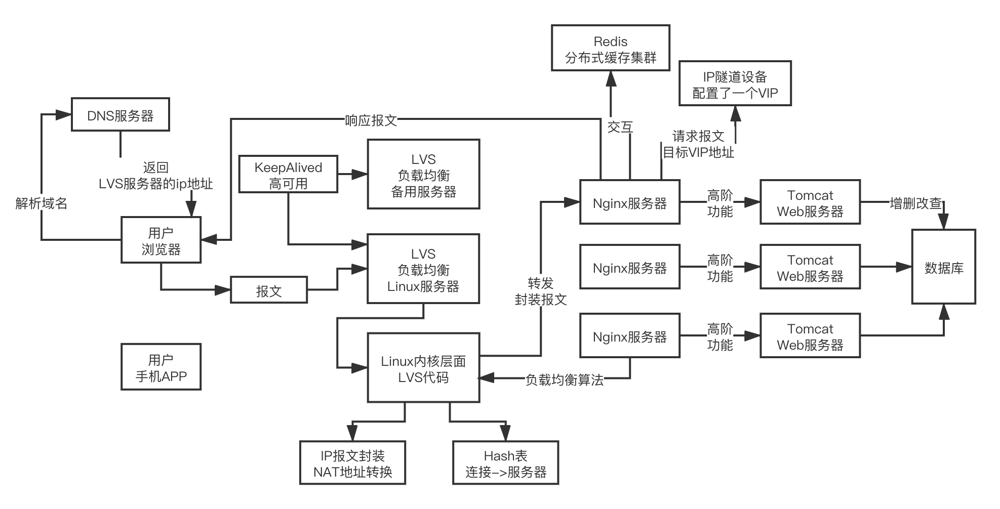

> 互联网主流负载均衡架构

**LVS+KeepAlive+Nginx**

> LVS 运行在四层协议-TCP/IP
>
> Nginx 运行在七层协议 - HTTP
>
> **HTTP 是用户层协议，处理起来设置用户态和内核态的转换，性能有限**
>
> KeepAlived 做高可用

**SLB** -> Server Load Balancer --> 负载均衡

### LVS

> 具体的负载均衡技术实现，基于 Linux 内核级的一些底层机制做请求转发，效率极高，单机抗每秒几十万甚至上百万请求。
>
> web 服务器 4c8g 每秒 1k 请求 qps
>
> Linux Virtual Server -> 把一组Web服务器统一成一台虚拟机服务器对外提供服务，外面的人访问你，都是访问你的LVS，看起来就跟只有一台服务器一样

#### 1. 异地多机房多活 LVS 集群部署架构

#### 2. 基于 NAT 技术实现的 LVS 请求转发原理

- LVS 服务器提供虚拟服务器 ip 地址，然后基于 NAT(Network Address Translation) 技术进行地址改写
- Linux 拿到 SYN 报文后交给 LVS ，由 LVS 将报文转发负载均衡出来的实际应用服务器处理 -- 基于 NAT 技术改写目标地址和端口
- LVS会把跟你这个客户端的Socket连接记录到一个hash表里去，以及这个连接的请求转发到哪个Web服务器了，下次同一个Socket连接再发送后续的报文来的时候，LVS就会把这个连接的报文同样再次转发给上次转发的那台Web服务器去 -- **缓存**
- LVS会对每个连接进行监听，在不同的TCP状态下有不同的超时时间，如果超时没拿到请求，就把这个连接从hash表了删除就可以了
- 运行在四层网络协议上的(TCP/IP)

#### 3. 基于 IP 隧道技术的 LVS 请求与响应分离

##### IP 隧道技术

> IP tunneling，也叫做IP封装技术，IP encapsulation
>
> 每一台Web服务器都把自己的vip配置在ip隧道设备上

##### LVS 的请求与响应分离

- LVS拿到请求之后，把目标地址为Web服务器的vip的请求报文封装到另外一个IP报文里，接着转发IP报文给一台Web服务器，Web服务器拿到IP报文以后解析一下，拿到里面的请求报文，发现目标地址就是一个vip，结果这个vip就配置在自己的IP隧道设备上，此时就可以处理这个请求
- Web服务器想要去发送响应，响应发送给谁呢？已经不是LVS了，他此时会根据你的报文里的一些信息，然后Web服务器直接根据自己的路由表，找到需要返回响应的客户端，把响应报文返回给指定的客户端就可以了

#### 4. 负载均衡算法

> round robin + 加权权重，随机 + 加权权重，hash负载均衡（根据请求参数里的某个值，把这个固定的值算一个hash，就固定路由到那台服务器上去），动态反馈负载均衡算法

#### 5. 内核级别原理

- 修改了内核里的 TCP/IP 协议栈
- LVS有一个IPVS模块挂载在了内核的LOCAL_IN链和IP_FORWARD链两个地方，一个IP报文到达的时候，如果目标地址是virtual ip address，就会转交给LOCAL_IN链，会被挂载在LOCAL_IN链上的IPVS模块处理
- IPVS模块正常情况下会根据负载均衡算法选择一个后端服务器，把报文进行改写和转发，接着会在hash表了记录这个连接和转发的后端服务器地址，下次如果这个连接的报文再到达的时候，就直接根据hash表里的连接对应的服务器地址，直接转发
- 然后NAT方式改写和转发过去的报文响应回来的时候，会被挂载在IP_FORWARD链上的IPVS模块捕获，接着进行改写响应报文的地址，返回给用户
- hash表里的一个连接数据只要128字节，所以一般服务器可以调度几百万个连接都没问题
- 对于 hash 表超时的监控：
  - 基于时间轮
  - 不同的时间轮的时间周期是不同的，然后把不停的超时时间的连接放在不停的时间轮的格子里，让一个或者多个指针不停的旋转，每隔一秒让指针转一下，就可以让不同的时间格里的连接超时失效
  - 把大量的超时任务放在时间轮里，你就几个指针不停的旋转，首先不是每个任务都有定时器，减少了内存消耗，其次没有那么多的定时器一起转，那么cpu负载就不会太高了，那么就可以接受了
- Hash 表的分段锁
  - 把Hash表拆成了很多个小分段，不同的分段一把锁，这样可以降低锁的粒度，减少高并发过程中的锁的频繁冲突，跟ConcurrentHashMap是一个原理

