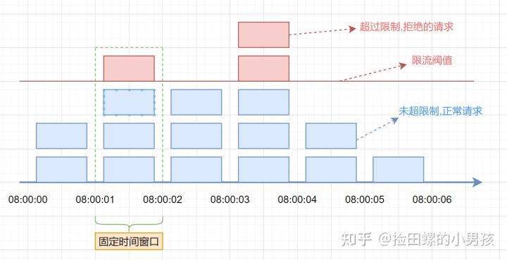
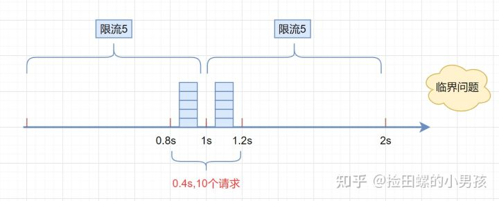
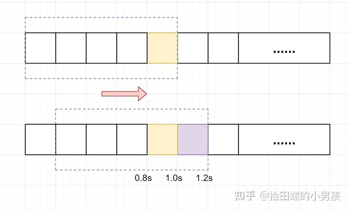
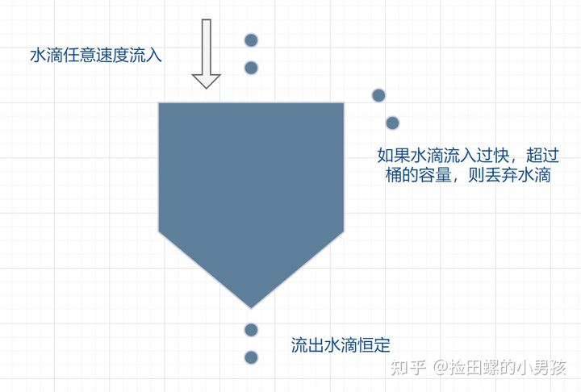
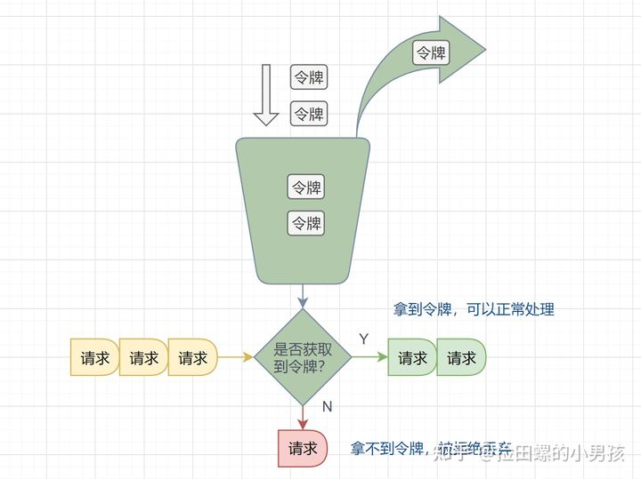

### 1. 固定时间窗口

首先维护一个计数器，将单位时间段当做一个窗口，计数器记录这个窗口接收请求的次数。

- 当次数少于限流阀值，就允许访问，并且计数器+1
- 当次数大于限流阀值，就拒绝访问。
- 当前的时间窗口过去之后，计数器清零。




### 2. 滑动时间窗口

> 固定时间窗口的临界问题 --> 不够平滑



滑动事件窗口的解决办法：

- 将单位时间周期分为 n 个小周期
- 分别记录每个小后期内接口的访问次数
- 根据时间滑动删除过期的小周期

- **缺点：**
  - 内存占用相比固定事件窗口更多
  - 无法解决短时间之内集中流量的突击



### 3. 漏桶算法

它的原理很简单，可以认为就是**注水漏水**的过程。往漏桶中以任意速率流入水，以固定的速率流出水。当水超过桶的容量时，会被溢出，也就是被丢弃。因为桶容量是不变的，保证了整体的速率

- 流入的水滴，可以看作是访问系统的请求，这个流入速率是不确定的。
- 桶的容量一般表示系统所能处理的请求数。
- 如果桶的容量满了，就达到限流的阀值，就会丢弃水滴（拒绝请求）
- 流出的水滴，是恒定过滤的，对应服务按照固定的速率处理请求。



- **缺点：** 处理速率恒定，不能应对突发流量


### 4. 令牌桶算法

面对**突发流量**的时候，我们可以使用令牌桶算法限流

- 有一个令牌管理员，根据限流大小，定速往令牌桶里放令牌。
- 如果令牌数量满了，超过令牌桶容量的限制，那就丢弃。
- 系统在接受到一个用户请求时，都会先去令牌桶要一个令牌。如果拿到令牌，那么就处理这个请求的业务逻辑；
- 如果拿不到令牌，就直接拒绝这个请求



如果令牌发放的策略正确，这个系统即不会被拖垮，也能提高机器的利用率。Guava的RateLimiter限流组件，就是基于**令牌桶算法**实现的。

看到这又想到啥？**Semaphore 信号量**啊，信号量可控制某个资源被同时访问的个数，其实和咱们拿令牌思想一样，一个是拿信号量，一个是拿令牌。

只不过信号量用完了返还，而咱们令牌用了不归还，因为令牌会定时再填充


### 5. 滑动日志

滑动日志是一个比较“冷门”，但是确实好用的限流算法。滑动日志限速算法需要记录请求的时间戳，通常使用**有序集合**来存储，我们可以在单个有序集合中跟踪用户在一个时间段内所有的请求。

假设我们要限制给定T时间内的请求不超过N，我们只需要存储最近T时间之内的请求日志，每当请求到来时判断最近T时间内的请求总数是否超过阈值。

```java
public class SlidingLogRateLimiter extends MyRateLimiter {
    /**
     * 每分钟限制请求数
     */
    private static final long PERMITS_PER_MINUTE = 60;
    /**
     * 请求日志计数器, k-为请求的时间（秒），value当前时间的请求数量
     */
    private final TreeMap<Long, Integer> requestLogCountMap = new TreeMap<>();

    @Override
    public synchronized boolean tryAcquire() {
        // 最小时间粒度为s
        long currentTimestamp = LocalDateTime.now().toEpochSecond(ZoneOffset.UTC);
        // 获取当前窗口的请求总数
        int currentWindowCount = getCurrentWindowCount(currentTimestamp);
        if (currentWindowCount >= PERMITS_PER_MINUTE) {
            return false;
        }
        // 请求成功，将当前请求日志加入到日志中
        requestLogCountMap.merge(currentTimestamp, 1, Integer::sum);
        return true;
    }

    /**
     * 统计当前时间窗口内的请求数
     *
     * @param currentTime 当前时间
     * @return -
     */
    private int getCurrentWindowCount(long currentTime) {
        // 计算出窗口的开始位置时间
        long startTime = currentTime - 59;
        // 遍历当前存储的计数器，删除无效的子窗口计数器，并累加当前窗口中的所有计数器之和
        return requestLogCountMap.entrySet()
                .stream()
                .filter(entry -> entry.getKey() >= startTime)
                .mapToInt(Map.Entry::getValue)
                .sum();
    }
}
```

滑动日志能够避免突发流量，实现较为精准的限流；同样**更加灵活，能够支持更加复杂的限流策略**，如多级限流，每分钟不超过100次，每小时不超过300次，每天不超过1000次，我们只需要保存最近24小时所有的请求日志即可实现。

灵活并不是没有代价的，带来的缺点就是**占用存储空间要高于其他限流算法**。


### 6. 小结

拿令牌桶来说，假设你没预热，那是不是上线时候桶里没令牌？没令牌请求过来不就直接拒了么？

这就误杀了，明明系统没啥负载现在。

再比如说请求的访问其实是随机的，假设令牌桶每20ms放入一个令牌，桶内初始没令牌，这请求就刚好在第一个20ms内有两个请求，再过20ms里面没请求，其实从40ms来看只有2个请求，应该都放行的，而有一个请求就直接被拒了。

这就有可能造成很多请求的误杀，但是如果看监控曲线的话，好像流量很平滑，峰值也控制的很好。

再拿漏桶来说，漏桶中请求是暂时存在桶内的，这其实不符合互联网业务低延迟的要求

所以漏桶和令牌桶其实比较适合**阻塞式限流场景**，即没令牌我就等着，这样就不会误杀了，而漏桶本就是等着，比较适合后台任务类的限流。

而基于时间窗口的限流比较适合对**时间敏感的场景**，请求过不了您就快点儿告诉我，等的花儿都谢了

- 难点

  - 以看到，每个限流都有个阈值，这个阈值如何定是个难点。定大了服务器可能顶不住，定小了就“误杀”了，没有资源利用最大化，对用户体验不好。

  - 我能想到的就是限流上线之后先预估个大概的阈值，然后不执行真正的限流操作，而是采取日志记录方式，对日志进行分析查看限流的效果，然后调整阈值，推算出集群总的处理能力，和每台机子的处理能力(方便扩缩容)。然后将线上的**流量进行重放**，测试真正的限流效果，最终阈值确定，然后上线。

  - 之前还看过一篇耗子叔的文章，讲述了在自动化伸缩的情况下，我们要动态地调整限流的阈值很难。

    于是基于TCP拥塞控制的思想，根据请求响应在一个时间段的响应时间P90或者P99值来确定此时服务器的健康状况，来进行动态限流。在他的 Ease Gateway 产品中实现了这套算法，有兴趣的同学可以自行搜索。

- 限流组件

  - `Google Guava` 提供的限流工具类 `RateLimiter`，是基于令牌桶实现的，并且扩展了算法，支持预热功能。
  - 阿里开源的限流框架`Sentinel` 中的匀速排队限流策略，就采用了漏桶算法。
  - Nginx 中的限流模块 `limit_req_zone`，采用了漏桶算法，还有 OpenResty 中的 `resty.limit.req`库等等。


[面试官：来，年轻人！请手撸5种常见限流算法！](https://www.cnblogs.com/liqiangchn/p/14253924.html)

[阿里云二面：你对限流了解多少](https://mp.weixin.qq.com/s/Kmy1gy0z7gaopKMmAsAd3g)