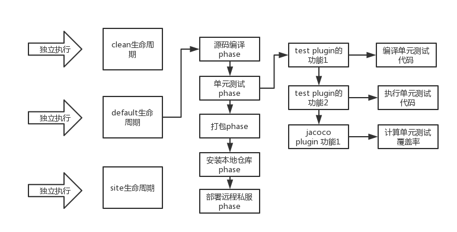

[TOC]

### 坐标机制

> 唯一定位因素：

```
groupId + artifactId + version + packaging + classifier
```

`classifier:`定义工程的附属项目，如 **source** 工程 --> **hello-world-1.0.0-SNAPSHOT-source.jar**


### 版本管理插件

版本管理插件：
<plugin>
    <groupId>org.codehaus.mojo</groupId>
    <artifactId>versions-maven-plugin</artifactId>
    <version>2.5</version>
    <configuration>
        <generateBackupPoms>false</generateBackupPoms>
    </configuration>
</plugin>

插件版本更新：
        mvn versions:display-plugin-updates
依赖版本更新：
        mvn versions:display-dependency-updates

参考：https://winterbe.com/posts/2018/08/29/migrate-maven-projects-to-java-11-jigsaw/


### 依赖的 scope 作用域范围

**Maven 有三套 classpath**

```
1. 编译源代码
2. 编译测试代码及执行测试代码
3. 运行正式项目代码
```


- **compile**
  	**默认的scope**，表示当前依赖参与项目的**编译、测试和运行**阶段。属于强依赖，打包时会打进包里。
- **test**
  	仅仅参与测试相关的内容，包括测试用例的编译和执行。**只对 `src/test/java` 下的类生效！**
- **runtime**
  	仅参与运行周期中的使用。一般这种类库都是接口和实现相分离的类库，比如 JDBC 类库，在编译之时仅依赖相关的接口，在**具体的运行时，才需要具体的** mysql 等数据库驱动程序。**测试+运行时有效，编译时无效！**
- **provided**
  	该依赖在打包过程中，不需要打进去，有运行的环境来提供，比如Tomcat等基础类库。事实上，该依赖可以参与编译、测试和运行等周期，与compile相同。区别在于**打包的时候剔除**了。 **编译+测试时有效，运行时无效！** 例：`servlet-api`
- **system**
  	使用上与provided相同，不同之处在于不从maven仓库提取，而是配合<systemPath>标签从本地文件系统提取。
- **import**
  	maven2.0.9版本之后的属性，import只能在dependencyManagement中使用，能解决maven单继承问题，import依赖关系实际上并不参与限制依赖关系的传递性。


### 依赖调解机制(一个依赖多个版本)

- 就近原则
  - 依赖深度不相等，如 A->B->C->X(1.0) 和 A->D->X(2.0)
  - 此时选择 X(2.0)
- 第一声明原则
  - 依赖深度相等，如 A->B->X(1.0) 和 A->D->X(2.0)
  - 根据在 pox 中先声明的选择 X(1.0)


### 可选依赖(依赖是否向上传递) <optional>

- A->B->C, 如果 B 对 C 的依赖是 optional，A 就不会依赖与 C (依赖不会向上传递)
- 例：B 是通用数据平台，es/redis/mongo 依赖都是 optional ，A 依赖于 B，需要自己依赖 es 来进行操作


### 依赖冲突问题

- 传递性依赖 + 依赖调解机制 导致了这个问题

- class not found / method not found

- 场景：

  ```
  A --> C1.0
  B --> D --> C2.0
  ```

- 手动强制使用冲突依赖的最新版本,排除不想要的依赖 <exclusion>
- mvn dependency:tree 进行依赖链条分析


### Maven 生命周期以及执行原理


> Maven 的生命周期，就是对传统团建项目构建工作的抽象
>
> 清理、初始化、编译、测试、打包、继承测试、验证、部署、站点生成

#### 生命周期原理

**Maven 有三套独立的生命周期，clean、default、site。每个都可以独立运行，每个生命周期的运行都会包含多个 phase，每个 phase 又是又各种插件的 goal 来完成的，一个插件的 goal 可以认为是一个功能 **



#### 各生命周期的 phase

- **`clean` 的 phase**
  - pre-clean
  - clean
  - post-clean
- **`default` 的 phase**
  - validate: 校验配置信息
  - initialize：初始化构建状态，比如设置一些属性，或者创建一些目录
  - generate-sources：自动生成一些源代码，然后包含在项目代码中一起编译
  - process-sources：处理源代码，比如做一些占位符的替换
  - generate-resources：生成资源文件，才是干的时我说的那些事情，主要是去处理各种xml、properties那种配置文件，去做一些配置文件里面占位符的替换
  - process-resources：将资源文件拷贝到目标目录中，方便后面打包
  - compile：编译项目的源代码
  - process-classes：处理编译后的代码文件，比如对java class进行字节码增强
  - generate-test-sources：自动化生成测试代码
  - process-test-sources：处理测试代码，比如过滤一些占位符
  - generate-test-resources：生成测试用的资源文件
  - process-test-resources：拷贝测试用的资源文件到目标目录中
  - test-compile：编译测试代码
  - process-test-classes：对编译后的测试代码进行处理，比如进行字节码增强
  - test：使用单元测试框架运行测试
  - prepare-package：在打包之前进行准备工作，比如处理package的版本号
  - package：将代码进行打包，比如jar包
  - pre-integration-test：在集成测试之前进行准备工作，比如建立好需要的环境
  - integration-test：将package部署到一个环境中以运行集成测试
  - post-integration-test：在集成测试之后执行一些操作，比如清理测试环境
  - verify：对package进行一些检查来确保质量过关
  - install：将package安装到本地仓库中，这样开发人员自己在本地就可以使用了
  - deploy：将package上传到远程仓库中，这样公司内其他开发人员也可以使用了
- **`site` 的 phase**
  - pre-site
  - site
  - post-site
  - site-deploy

#### 各 phase 绑定的默认 plugin 的 goal

- clean
  - clean                                    clean:clean
- default
  - process-resources             resources:resources
  - compile                                compiler:compile
  - process-test-resources      resources:testResources
  - test-compile                        compiler:testCompile
  - test                                       surefire:test
  - package                               jar:jar或者war:war
  - install                                   install:install
  - deploy                                 deploy:deploy
- site
  - site                                       site:site
  - site-deploy                          site:deploy

#### Maven 命令行和生命周期

> mvn clean package

- clean 指的是 clean 生命周期中的 clean phase

- package 指的是 default 生命周期中的 package phase(对于没有默认绑定 plugin goal 的就什么都不会执行)

- 执行 clean 生命周期中 clean phase 和它之前的 phase

- 然后执行 default 生命周期中的 package phase 和它之前的phase

> 直接执行指定插件的一个 goal

- mvn dependency:tree
- mvn deploy:deploy-file