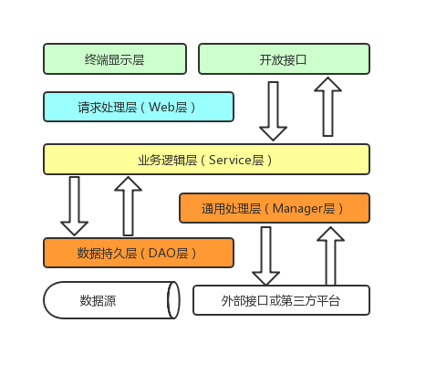
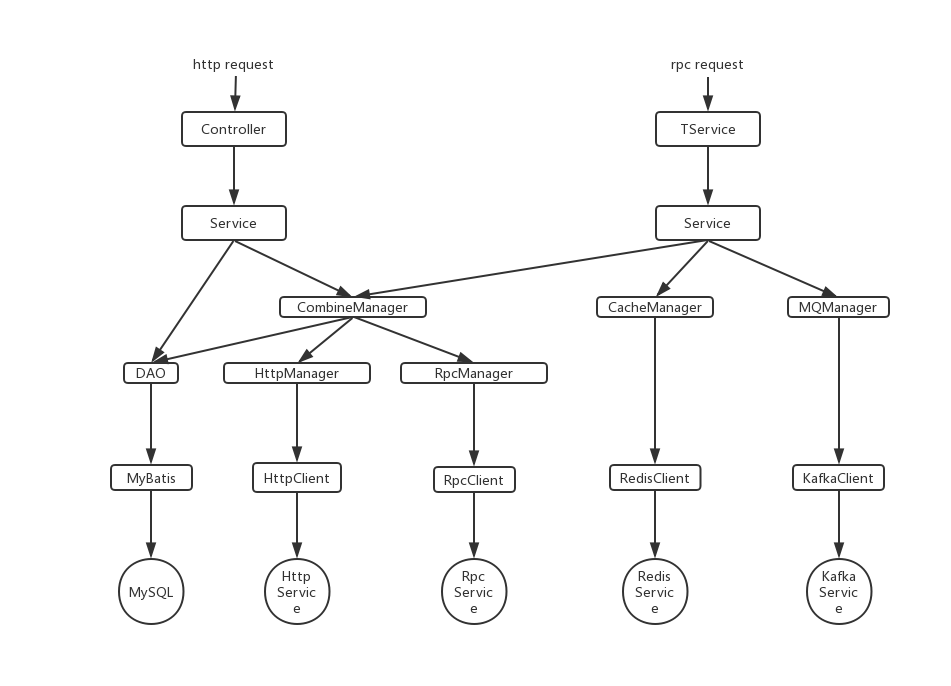

DO(Data Object): 与数据库表结构一一对应，通过DAO层向上传输数据源对象
DTO(Data Transfer Object): 数据传输对象，Service或Manager向外传输的对象
BO(Business Object): 业务对象。由Service层输出的封装业务逻辑的对象
AO(Application Onject): 应用对象。在Web层与Service层之间抽象的复用对象模型，极为贴近展示层，复用度不高
VO(View Object): 显示层对象，通常是Web向模板渲染引擎层传输的对象
Query: 数据查询对象，各层接收上层的查询请求。注意超过2个参数的查询封装，进制使用Map类来传输

+-------------------+-------------------------+
|     层次          |       领域模型          |
+-------------------+-------------------------+
|Controller/TService|        VO/DTO           |
+-------------------+-------------------------+
|Service/Manager    |        AO/BO            |
+-------------------+-------------------------+
|DAO                |        DO               |
+-------------------+-------------------------+

