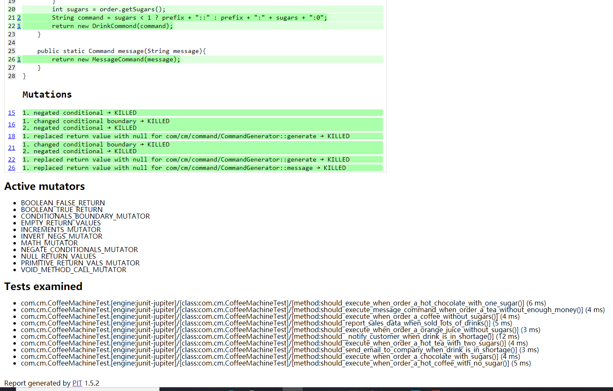

### 背景：
​    100%的测试覆盖率并不能保证代码没有问题,变异测试试图说明测试的有效性

### 思想来源：
​    更改规则后，好的测试应该会失败

### 概念：
​    变异体：更改的代码或逻辑，如 条件边界的更改（>  ---> >=）,数学运算符的更改，返回null而不是instance等等

### 变异测试结果：
​    Killed：  变异体杀死 --> 代码逻辑正确
​    Survived: 变异体存活 --> 代码逻辑有问题或者测试未正确覆盖（例如 <= 的边界条件未测试 = 的情形）
​    无限循环/运行时错误：这通常意味着在这种情况下，突变是不可能发生的

### 注意事项：
​    pitest 比较耗时，应该在重要的测试用例中使用