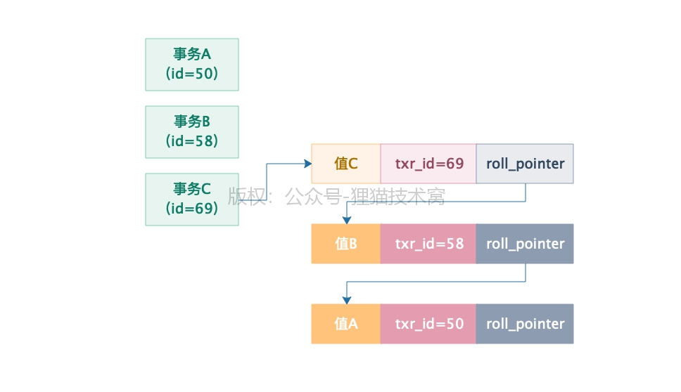
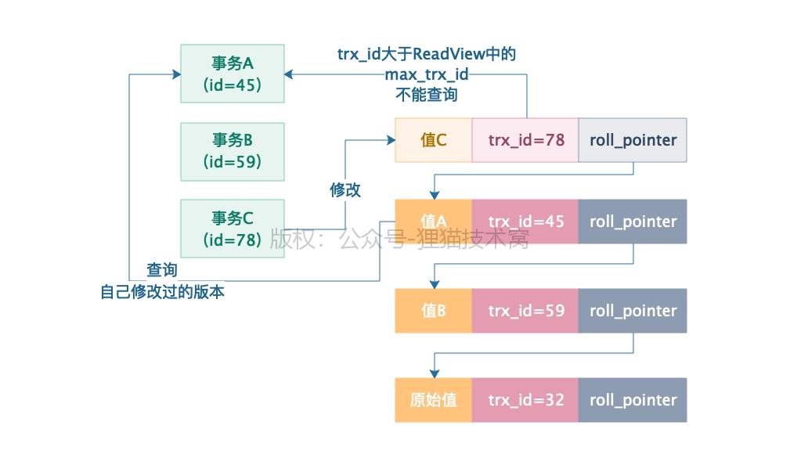

[TOC]

### 1. 多个事务并发读写可能存在的问题

> 脏读、脏写

> 无论是脏写还是脏读,都是因为因为一个事务去**更新或者查询了另外一个还没提交的事务更新过的数据**。当**另一个事务回滚**的时候，导致当前事务更新或者读取的数据丢失了。

> 不可重复读、幻读

> **不可重复读：**单个事务内多次查询到的某行**数据不一致(被其他事务修改了)**
>
> **幻读：**一个事务用一样的SQL多次查询，结果每次查询都会发现查到了一些之前**没看到过的数据(多出来的)**

### 2. 隔离级别

- **`Read Uncommitted(读未提交)`**
  - 不允许脏写
- **`Read Committed(读已提交)`**
  - 不允许脏写和脏读
- **`Repeatable Read(可重复读)`**
  - 不允许脏写、脏读和不可重复读
- **`Serializable(串行化)`**
  - 都不允许

#### MySQL 的默认隔离级别

> **`Repeatable Read(可重复读)`:** 注意 MySQL 的 RR 级别是**可以避免幻读**发生的

### 3. MVCC 多版本并发控制机制的实现原理

#### 3.1 undo log 多版本链

> 行数据结构中两个隐藏字段：
>
> **`trx_id`**: 最近一次更新这条数据的事务ID
>
> **`roll_pointer`**: 指向了更新当前事务之前的 undo log

**版本链：** 多个事务串行执行的时候，每个人修改了一行数据，都会更新隐藏字段txr_id和roll_pointer，同时之前多个数据快照对应的undo log，会通过roll_pinter指针串联起来，形成一个重要的版本链

#### 3.2 基于 undo log 多版本链实现的 ReadView 机制

- **ReadView 的结构**

  | 名称           | 含义                                       |
  | -------------- | ------------------------------------------ |
  | m_ids          | 哪些事务在 MySQL 里执行还没提交的          |
  | min_trx_id     | m_ids 里最小的值                           |
  | max_trx_id     | MySQL 下一个要生成的事务id，就是最大事务id |
  | creator_trx_id | 当前事务 ID                                |

- 并发控制逻辑

  
  - 开启事务的时候生成一个 ReadView
  - trx_id **事务 id 是全局单调递增的**
  - 首先**数据行中的 trx_id 是否小于 min_trx_id**，是的话就是之前事务修改的，可以放心读取
  - 如果**数据行中的 trx_id 大于 max_trx_id**，说明是后面生产的事务先修改成功了
  - 如果**数据行中的 trx_id 在 (min_trx_id,max_trx_id)之间**，看看**在不在 m_ids** 里面，在的话就是同一时间段并发执行的，不能读取，会顺着 undo_log 链条向下查找
  - 可以保证你只能读到你事务开启前，别的提交事务更新的值，还有就是你自己事务更新的值。假如说是你事务开启之前，就有别的事务正在运行，然后你事务开启之后 ，别的事务更新了值，你是绝对读不到的！或者是你事务开启之后，比你晚开启的事务更新了值，你也是读不到的

### Read Committed(读已提交)是如何基于 ReadView + undo log 版本链机制实现的

**`核心机制：`** - **在该隔离级别下，当前事务内的`每次查询都会生成一个新的 ReadView` - 也就是 `max_trx_id 会逐渐增大！`**

### Repetable Read(可重复读)是如何基于 ReadView + undo log 版本链机制实现的

**`核心机制：`** - **在该隔离级别下，当前事务内的 ReadView 生成了就不会变化 - 也就是 `max_trx_id 不随其他事务的操作结果发生变化`**

| 隔离级别      | ReadView 表现                                             |
| ------------- | --------------------------------------------------------- |
| ReadCommitted | 单个事务内**每次查询都会生成新的 RV**(**max_trx_id递增**) |
| RepetableRead | 单个事务内 **RV 生成后就不会变化**了(**max_trx_id不变**)  |

