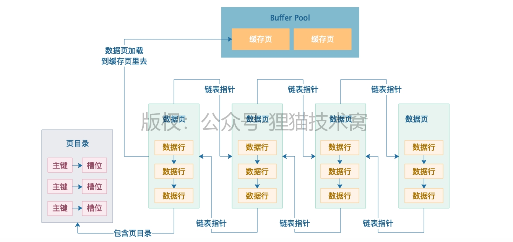
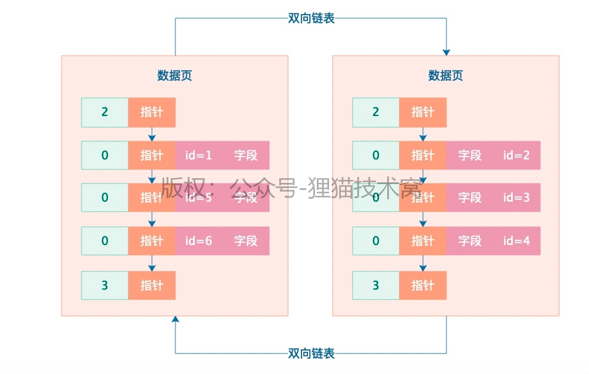
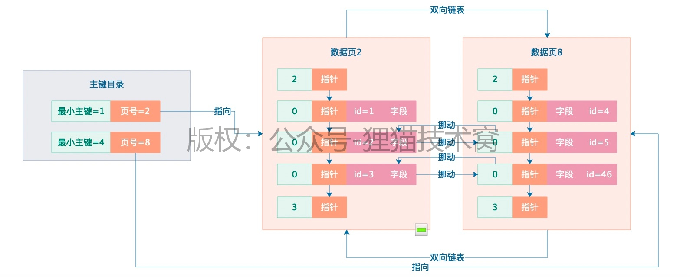
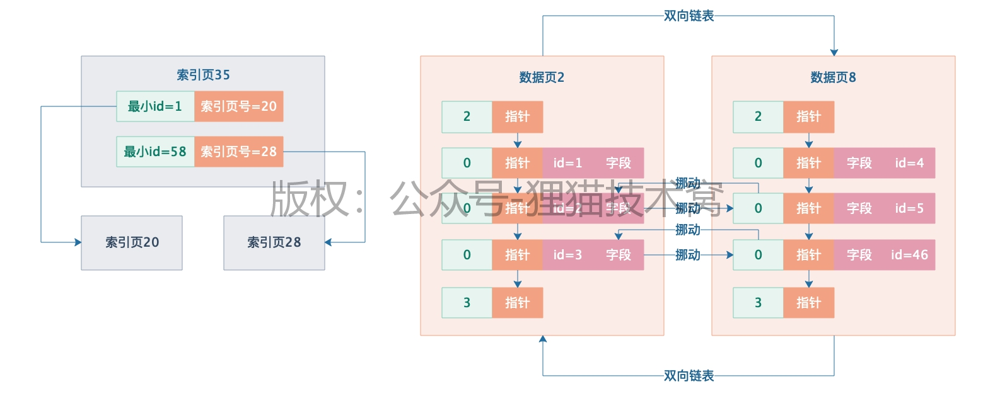
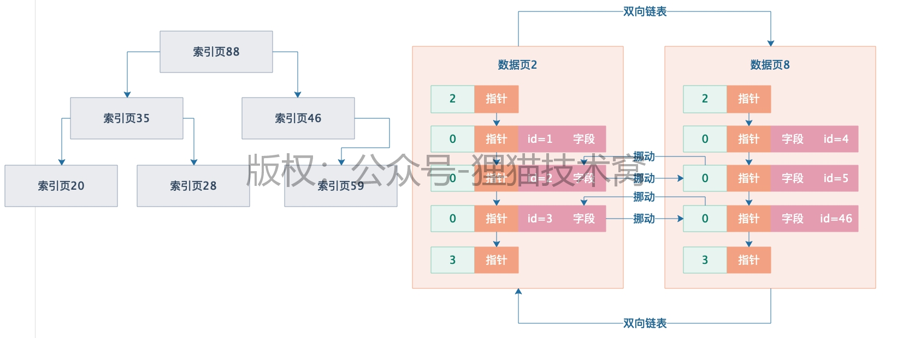
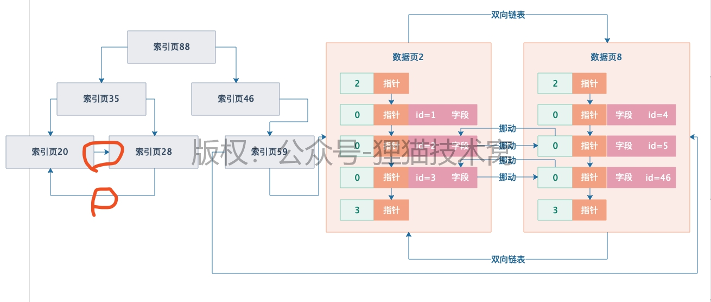
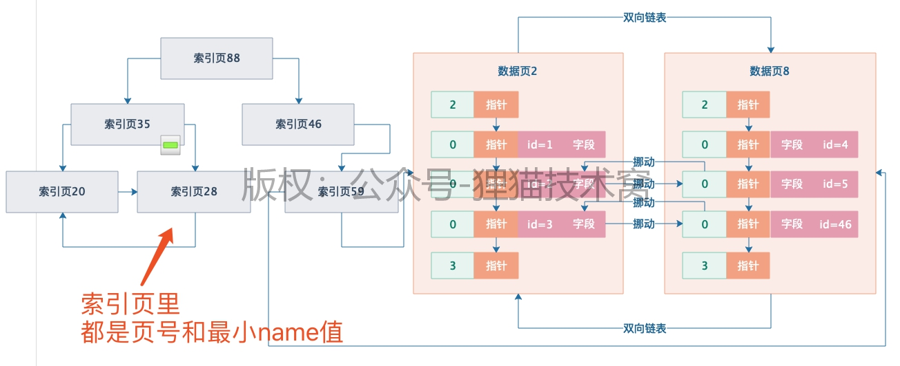

[TOC]

### 前置知识

#### 数据页的物理存储结构

> 数据页之间是组成双向链表的，数据也内部的数据行是组成单向链表的，每个数据页内部根据主键做了一个页目录

#### 页分裂的过程

 

> 2 代表数据页内最小记录，3 最大记录，0 普通记录
>
> 索引运作的核心基础就是要求**`后一个数据页的主键值大于前一个数据页的主键值，如果不满足就会在数据页之间挪动数据`**

### 索引实现

#### 主键索引的简单实现

> 原理：**`把每个数据页的页号，还有数据页里最小的主键值放在一起，组成一个索引的目录`**

#### 主键索引的 B+ 树实现

> 上述实现存在的问题：数据量很大时，上述主键目录的方式占用内存大，查找慢

> 此时可以把索引也放到数据页中，形成索引页，索引页间通过 B+ 树的数据结构串联起来

#### 聚簇索引

> **B+ 树最下层的索引页，是有指针引用数据页的**，所以实际上索引页跟数据页之间是有指针连起来的
>
> 索引页内部，对于**同一个层级内的索引页，互相之间会基于指针组成双向链表**
>
> 如果一颗大的B+树索引数据结构里，叶子节点就是数据页自己本身，那么此时我们就可以称这颗B+树索引为聚簇索引！

#### 二级索引

> 其他字段的索引建立：一方面维护好聚簇索引，另一方面会为其他字段的索引**重新建立一颗 B+ 树**
>
> 它的**叶子节点也是数据页**，但是它**仅仅存放主键+普通索引字段值**

> 对于 select * from table where name='xx' 的查找过程
>
> 1. 先在 name 的二级索引树上找到主键 ID 值
> 2. 再根据主键值去聚簇索引中找到全部字段值（**回表**）