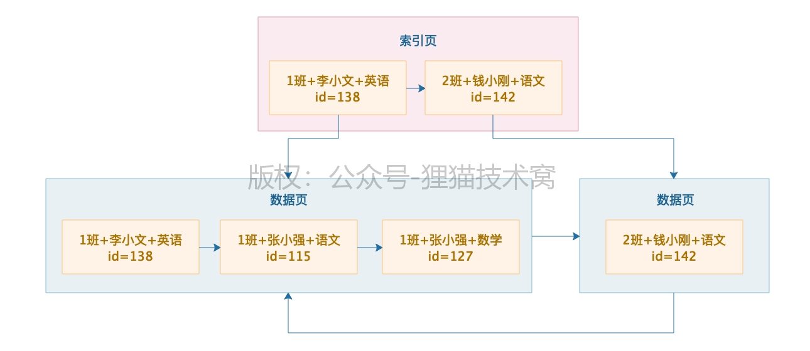

[TOC]

### 联合索引查询规则

> 平时我们设计系统的时候一般都是设计联合索引，很少用单个字段做索引，原因是要尽可能的让索引数量少一些，避免磁盘占用太多，增删改性能太差

`新建学生表`：id,班级，姓名，学科，成绩

`联合索引(班级，姓名，学科)`


#### 全值匹配

`查询语句`：**select *
from student_score where class_name='1班' and student_name='张小强' and subject_name='数学'**



```
where条件里的几个字段都是基于等值来查询，都是用的等于号！而且where条件里的几个字段的名称和顺序也跟你的联合索引一模一样！此时就是等值匹配规则，上面的SQL语句是百分百可以用联合索引来查询的
```


#### 最左匹配

> 不一定必须要在where语句里根据三个字段来查，其实只要根据最左侧的部分字段来查，也是可
> 以的

> select * from student_score where **class_name='' and student_name=''** ---> **OK**
>
> select * from student_score where **class_name='' and subject_name=''** ----> **NOT OK**
>
> select * from student_score where **subject_name=''** ----> **NOT OK**


#### 最左前缀匹配

> select * from student_score where **class_name like '1%'** ----> **OK**
>
> select * from student_score where **class_name like '%班'** ----> **NOT OK**


#### 范围查找

> select * from student_score where **class_name>'1班' and class_name<'5班'** ----> **OK**
>
> select * from student_score where **class_name<'1班' and class_name>'5班'** ----> **NOT OK**


#### 等值匹配+范围匹配

> select * from student_score where **class_name='1班' and student_name>'' and subject_name<''**

```
首先可以用class_name在索引里精准定位到一波数据，接着这波数据里的student_name都是按照顺序排列的，所以student_name>''也会基于索引来查找，但是接下来的subject_name<''是不能用索引的
```


### 总结

**一般我们如果写SQL语句，都是用联合索引的最左侧的多个字段来进行等值匹配+范围搜索，或者是基于最左侧的部分字段来进行最左前缀模糊匹配，或者基于最左侧字段来进行范围搜索，这就要写符合规则的SQL语句，才能用上我们建立好的联合索引！**