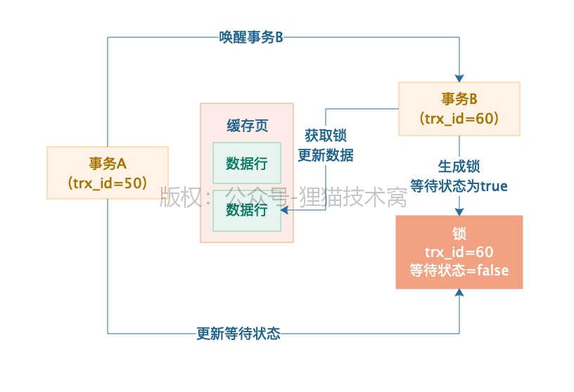

- 事务生成锁来与要操作的数据在内存中关联，锁信息包括**事务id(trx_id)** 和**等待状态**
- 如果事务要操作的**数据已经有锁了就将自己的锁加入等待队列中**
- 其他事务的锁释放了就通知正在等待队列中等待的下一个事务

### 锁分类

- X锁，Exclude 独占锁
  - 与其他锁互斥
  - 独占锁下的读，默认情况下的读，完全不需要加锁，不需要去care其他事务的更新加锁问题，直接基于mvcc机制读某个快照就可以了
- S锁，Share 共享锁
  - 语法：**select xx from table lock `in share mode`**
- 更新数据的时候必然加独占锁，独占锁和独占锁是互斥的，此时别人不能更新；但是**此时你要查询，默认是不加锁的，走mvcc机制读快照版本**，但是你查询是可以手动加共享锁的，共享锁和独占锁是互斥的，但是共享锁和共享锁是不互斥的
- 查询操作加互斥锁：**select xx from table `for update`**
- 手动加了表级的共享锁或者独占锁，此时是会阻塞掉其他事务的一些正常的读写操作的，因为跟他们自动加的意向锁都是互斥的