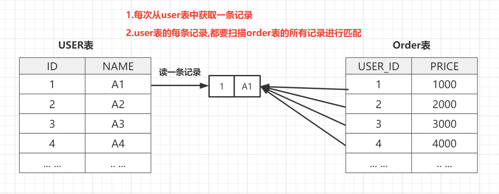
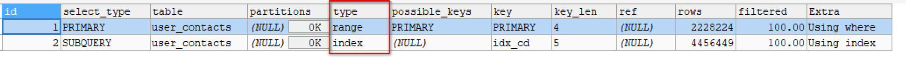
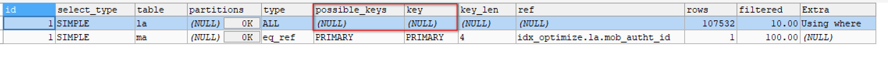
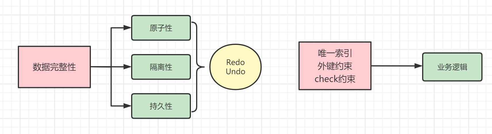
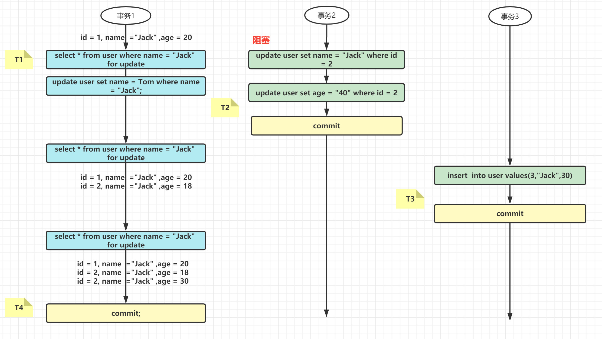
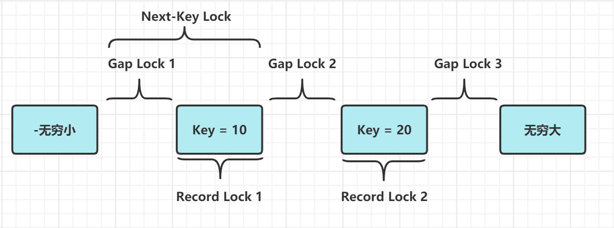
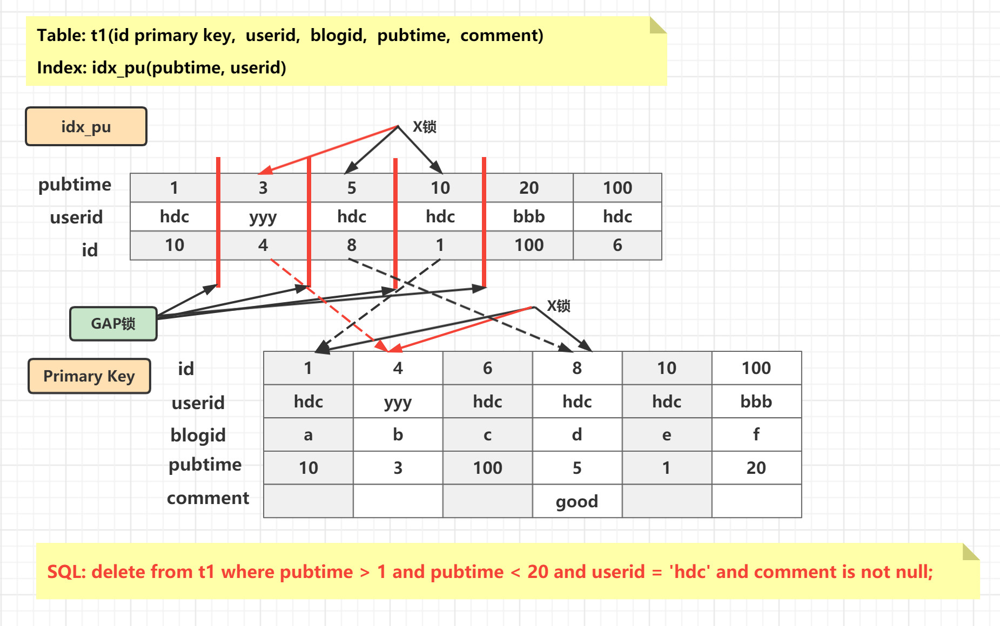

**MySQL实战优化 ( 儒猿IT学习网 讲师: 若白 )**      

 

# MySQL优化实战 

## 课程介绍

### 必备基础知识

- MySQL软件下载和安装（建议版本5.7.28）

- 熟悉MySQL工具和基本SQL操作
- 熟悉MySQL基础知识(主外键约束的使用、SQL的基础用法等)
- 熟悉索引的使用和事务的基本概念

### 课程内容

- MySQL InnoDB存储引擎原理与缓存组件参数优化实战
- MySQL索引存储原理与索引优化实战
- MySQL事务和锁工作原理、事务优化及锁优化实战
- MySQL的表设计原则与数据类型选择及其优化

## 第一章 InnoDB存储引擎原理与优化

从MySQL 5.5版本开始默认   使用InnoDB作为引擎，它擅长处理事务，具有自动崩溃恢复的特性，在日常开发中使用非常广泛。

下面是官方的InnoDB引擎架构图，主要分为**内存结构**和**磁盘结构**两大部分。

    

### InnoDB 内存结构 

#### 1. Buffer Pool

**Buffer Pool基本概念** 

​	Buffer Pool：缓冲池，简称BP。其作用是用来缓存表数据与索引数据，减少磁盘IO操作，提升效率。

​	Buffer Pool由 **缓存数据页(Page)** 和 对缓存数据页进行描述的**控制块** 组成, 控制块中存储着对应缓存页的所属的	表空间、数据页的编号、以及对应缓存页在Buffer Pool中的地址等信息.

​	Buffer Pool默认大小是128M, 以Page页为单位，Page页默认大小16K，而控制块的大小约为数据页的5%，大	概是800字节。

 

> 注:Buffer Pool大小为128M指的就是缓存页的大小，控制块则一般占5%，所以每次会多申请6M的内存空间用于存放控制块


**如何判断一个页是否在BufferPool中缓存 ?**

MySQl中有一个哈希表数据结构，它使用表空间号+数据页号，作为一个key，然后缓冲页对应的控制块作为value。

 

- **当需要访问某个页的数据时，先从哈希表中根据表空间号+页号看看是否存在对应的缓冲页。**

- **如果有，则直接使用；如果没有，就从free链表中选出一个空闲的缓冲页，然后把磁盘中对应的页加载到该缓冲页的位置**

  

#### 2.Page管理机制

**Page页分类** 

BP的底层采用链表数据结构管理Page。在InnoDB访问表记录和索引时会在Page页中缓存，以后使用可以减少磁盘IO操作，提升效率。 

- Page根据状态可以分为三种类型：
  
     
  
  - free page ： 空闲page，未被使用
  
  - clean page：被使用page，数据没有被修改过
  
  - dirty page：脏页，被使用page，数据被修改过，页中数据和磁盘的数据产生了不一致


**Page页如何管理**

针对上面所说的三种page类型，InnoDB通过三种链表结构来维护和管理

**1. free list**：表示空闲缓冲区，管理free page 

- Buffer Pool的初始化过程中，是先向操作系统申请连续的内存空间，然后把它划分成若干个【控制块&缓冲页】的键值对。
- free链表是把所有空闲的缓冲页对应的控制块作为一个个的节点放到一个链表中，这个链表便称之为free链表
- 基节点:  free链表中只有一个基节点是不记录缓存页信息(单独申请空间)，它里面就存放了free链表的头节点的地址，尾节点的地址，还有free链表里当前有多少个节点。

   

磁盘加载页的流程: 

1. 从free链表中取出一个空闲的控制块（对应缓冲页）。
2. 把该缓冲页对应的控制块的信息填上（例如：页所在的表空间、页号之类的信息）。
3. 把该缓冲页对应的free链表节点（即：控制块）从链表中移除。表示该缓冲页已经被使用了。

 

**2.flush list**： 表示需要刷新到磁盘的缓冲区，管理dirty page，内部page按修改时间排序。

- InnoDB引擎为了提高处理效率，在每次修改缓冲页后，并不是立刻把修改刷新到磁盘上，而是在未来的某个时间点进行刷新操作. 所以需要使用到flush链表存储脏页，凡是被修改过的缓冲页对应的控制块都会作为节点加入到flush链表.
- flush链表的结构与free链表的结构相似

 

> 注: 脏页即存在于flush链表，也在LRU链表中，但是两种互不影响，LRU链表负责管理page的可用性和释放，而flush链表负责管理脏页的刷盘操作。
>


**3.lru list**：表示正在使用的缓冲区，管理clean page和dirty page，缓冲区以midpoint为基点，前面链表称为new列表区，存放经常访问的数据，占63%；后面的链表称为old列表区，存放使用较少数据，占37%

- **普通LRU算法** 

LRU = Least Recently Used（最近最少使用）: 就是末尾淘汰法，新数据从链表头部加入，释放空间时从末尾淘汰.

     

1. 当要访问某个页时，如果不在Buffer Pool，需要把该页加载到缓冲池,并且把该缓冲页对应的控制块作为节点添加到LRU链表的头部。

2. 当要访问某个页时，如果在Buffer Pool中，则直接把该页对应的控制块移动到LRU链表的头部

3. 当需要释放空间时,从最末尾淘汰

   

**普通LRU链表的优缺点** 

- 优点
  
- 所有最近使用的数据都在链表表头，最近未使用的数据都在链表表尾,保证热数据能最快被获取到。
  
- 缺点

  - 如果发生全表扫描（比如：没有建立合适的索引 or 查询时使用select * 等），则有很大可能将真正的热数据淘汰掉.	

  - 由于MySQL中存在预读机制，很多预读的页都会被放到LRU链表的表头。如果这些预读的页都没有用到的话，这样，会导致很多尾部的缓冲页很快就会被淘汰。

     

**改进型LRU算法**

改性LRU：链表分为new和old两个部分，加入元素时并不是从表头插入，而是从中间midpoint位置插入(就是说从磁盘中新读出的数据会放在冷数据区的头部)，如果数据很快被访问，那么page就会向new列表头部移动，如果数据没有被访问，会逐步向old尾部移动，等待淘汰。

   

  冷数据区的数据页什么时候会被转到到热数据区呢 ?

  1. 如果该数据页在LRU链表中存在时间超过1s，就将其移动到链表头部  ( 链表指的是整个LRU链表)
  2. 如果该数据页在LRU链表中存在的时间短于1s，其位置不变(由于全表扫描有一个特点，就是它对某个页的频繁访问总耗时会很短)
  3. 1s这个时间是由参数 `innodb_old_blocks_time` 控制的


#### 3. Change Buffer

- **change Buffer基本概念**

​	Change Buffer：写缓冲区,是针对二级索引(辅助索引) 页的更新优化措施。

​	作用:  在进行DML操作时，如果请求的是 辅助索引（非唯一键索引）没有在缓冲池	中时，并不会立刻将磁盘页加载到缓冲池，而是在CB记录缓冲变更，等未来数据被	读取时，再将数据合并恢复到BP中。

​	ChangeBuffer占用BufferPool空间，默认占25%，最大允许占50%，可以根据读写	业务量来进行调整。参数`innodb_change_buffer_max_size`; 

  

1. ChangeBuffer用于存储SQL变更操作，比如Insert/Update/Delete等SQL语句
2. ChangeBuffer中的每个变更操作都有其对应的数据页，并且该数据页未加载到缓存中；
3. 当ChangeBuffer中变更操作对应的数据页加载到缓存中后，InnoDB会把变更操作Merge到数据页上；
4. InnoDB会定期加载ChangeBuffer中操作对应的数据页到缓存中，并Merge变更操作；   


- **change buffer更新流程**  

​    情况1: 对于唯一索引来说，需要将数据页读入内存，判断到没有冲突，插入这个	   	值，语句执行结束；

​	情况2: 对于普通索引来说，则是将更新记录在 change buffer，流程如下: 

1. 更新一条记录时，该记录在BufferPool存在，直接在BufferPool修改，一次内存操作。

 	2. 如果该记录在BufferPool不存在（没有命中），在不影响数据一致性的前提下，InnoDB 会将这些更新操作缓存在 change buffer 中不用再去磁盘查询数据，避免一次磁盘IO。
 	3. 当下次查询记录时，会将数据页读入内存，然后执行change buffer中与这个页有关的操作.通过这种方式就能保证这个数据逻辑的正确性。


- **写缓冲区，仅适用于非唯一普通索引页，为什么？**

  如果在索引设置唯一性，在进行修改时，InnoDB必须要做唯一性校验，因此必须查询磁盘，做一次IO操作。会直接将记录查询到BufferPool中，然后在缓冲池修改，不会在ChangeBuffer操作。


- **什么情况下进行 merge ?** 

  将 change buffer 中的操作应用到原数据页，得到最新结果的过程称为**merge** .

  change buffer，实际上它是可以持久化的数据。也就是说，change buffer 在内存中有拷贝，也会被写入到磁盘上,以下情况会进行持久化:

  1. 访问这个数据页会触发 merge 
  2. 系统有后台线程会定期 merge。
  3. 在数据库正常关闭（shutdown）的过程中，也会执行 merge 操作。


- **Change Buffer 的使用场景**
  - change buffer 的主要目的就是将记录的变更动作缓存下来,所以在merge发生之前应 当尽可能多的缓存变更信	息,这样 change buffer的优势发挥的就越明显.
  - 应用场景: 对于写多读少的业务来说，页面在写完以后马上被访问到的概率比较小，此时 change buffer 的使用	效果最好。这种业务模型常见的就是账单类、日志类的系统。


#### 4. Log Buffer

Log Buffer：日志缓冲区，用来保存要写入磁盘上log文件（Redo/Undo）的数据，日志缓冲区的内容定期刷新到磁盘log文件中。日志缓冲区满时会自动将其刷新到磁盘，当遇到BLOB或多行更新的大事务操作时，增加日志缓冲区可以节省磁盘I/O。

LogBuffer主要作用是: 用来优化每次更新操作之后都要写入redo log 而产生的磁盘IO问题.

 

LogBuffer空间满了，会自动写入磁盘。可以通过将innodb_log_buffer_size参数调大，减少磁盘IO频率


### InnoDB 磁盘结构

InnoDB磁盘主要包含Tablespaces，InnoDB Data Dictionary、Doublewrite Buffer、redo log和Undo Logs。

- Tablespaces: 表空间分为系统表空间（ibdata1文件）、临时表空间、常规表空间、Undo表空间以及file-per-table表空间。系统表空间又包括双写缓冲区（Doublewrite Buffer）、Change Buffer等
- Doublewrite buffer：innodb 将数据页写到文件之前存放的位置。8.0.20版本之前，doublewrite buffer存放在InnoDB系统表空间中，8.0.20版本后存放在doublewrite中
- Redo log：存储的是log buffer刷到磁盘的数据
- Undo log：存在于global临时表空间中，用于事务的回滚

   

#### 1. 表空间 ( Tablespaces )

表空间（Tablespaces) : 用于存储表结构和数据, InnoDB表空间类型包括系统表空间、File-Per-Table表空间，常规表空间，Undo表空间，临时表空间等。

- 系统(共享)表空间（The System Tablespace）

  - 共享表空间: 包含InnoDB数据字典，Doublewrite Buffer，Change Buffer，Undo Logs的存储区域。系统表空间也默认包含任何用户在系统表空间创建的表数据和索引数据。

  - 物理文件查看

    ```shell
    [root@localhost ~]# cd /var/lib/mysql 
    [root@localhost mysql]# ll ibdata*
    -rw-r----- 1 mysql mysql 79691776 1月  25 06:42 ibdata1
    ```

  - 系统表空间是一个共享的表空间因为它是被多个表共享的。该空间的数据文件通过参数`innodb_data_file_path`控制，默认值是 `ibdata1:12M:autoextend` (文件名为ibdata1、12MB、自动扩展)。

    ```sql
    mysql> show variables like '%innodb_data_file_path%';
    +-----------------------+------------------------+
    | Variable_name         | Value                  |
    +-----------------------+------------------------+
    | innodb_data_file_path | ibdata1:12M:autoextend |
    +-----------------------+------------------------+
    1 row in set (0.38 sec)
    ```

  

- 独立表空间（File-Per-Table Tablespaces） 

  - 默认开启，独立表空间是一个单表表空间，该表创建于自己的数据文件中，而非创建于系统表空间中。当`innodb_file_per_table`选项开启时，表将被创建于表空间中。否则，innodb将被创建于系统表空间中。

    ```sql
    mysql> show variables like '%innodb_file_per_table%';
    +-----------------------+-------+
    | Variable_name         | Value |
    +-----------------------+-------+
    | innodb_file_per_table | ON    |
    +-----------------------+-------+
    1 row in set (0.14 sec)
    ```

  - 每个表文件表空间由一个.ibd数据文件代表，该文件默认被创建于数据库目录中。

    ```shell
    [root@localhost test1]# cd /var/lib/mysql/test1/
    [root@localhost test1]# ll
    total 112
    -rw-r----- 1 mysql mysql  8582 Dec 27 19:17 a1.frm
    -rw-r----- 1 mysql mysql 98304 Dec 27 19:21 a1.ibd
    -rw-r----- 1 mysql mysql    67 Dec  9 23:21 db.opt
    ```

- 两种表空间的优缺点

  - 共享表空间
    - 优点：可以将表空间分成多个文件存放到各个磁盘上（表空间文件大小不受表大小的限制，如一个表可以分布在不同的文件上）。数据和文件放在一起方便管理。
    - 缺点：所有的数据和索引存放到一个文件中，虽然可以把一个大文件分成多个小文件，但是多个表及索引在表空间中混合存储，这样对于一个表做了大量删除操作后表空间中将会有大量的空隙，特别是对于统计分析，日值系统这类应用最不适合用共享表空间。
- 独立表空间
    - 优点：
      - 每个表都有自已独立的表空间,每个表的数据和索引都会存在自已的表空间中。
      - 可以实现单表在不同的数据库中移动(复制File-per-table表空间的对应表的数据文件到其他mysql数据库实例的表空间下，实现表的导入迁移)。
      - 空间可以回收（在独立表空间下，删除或者清空表后，存储空间会立刻返回给操作系统。而在共享表空间下，表空间数据文件的大小不会缩小）
    - 缺点：
      - 单表增加过大，如超过100个G。

  

- 通用表空间（General Tablespaces）

  - MySQL 5.7开始支持通用表空间管理功能,类似于系统表空间，也是共享表空间，可以存储多个表的数据。

  - 通用表空间为通过create tablespace语法创建的共享表空间。通用表空间可以创建于mysql数据目录外的其他表空间(自定义存储路径)，其可以容纳多张表，且其支持所有的行格式。

  - 相比File-per-table表空间，通用表空间由于多表共享表空间，消耗的内存会更少一点，具有潜在的内存优势。（占用的磁盘空间会更小）

    

- 需求: 指定存储路径创建一张表

  **方式1: 指定 data directory** 

  ```shell
  [root@localhost ~]# mkdir -p /mdata/general
  [root@localhost ~]# cd /mdata/general/
  
  # 设置文件所有者为mysql(第一个mysql是用户,第二个为用户组)
  [root@localhost general]# chown mysql.mysql /mdata/general/
  ```

  ```sql
  -- 连接mysql,选择数据库创建表,并且将该表创建于刚刚创建的通用表空间目录
  mysql> create table test1.test_ger(a int) data directory='/mdata/general';
  Query OK, 0 rows affected (0.50 sec)
  ```

  ```shell
  [root@localhost general]# tree
  .
  └── test1
      └── test_ger.ibd
  
  1 directory, 1 file
  
  [root@localhost general]# cd /var/lib/mysql/test1/
  [root@localhost test1]# ll
  -rw-r----- 1 mysql mysql  8554 1月  29 01:41 test_ger.frm
  -rw-r----- 1 mysql mysql    33 1月  29 01:41 test_ger.isl
  #cat test_ger.isl 一个文本文件，内容就是idb文件的路径，做了一个链接
  [root@localhost test1]# cat test_ger.isl 
  /mdata/general/test1/test_ger.ibd
  ```

  **方式2: 使用通用表空间**  

  ```sql
  -- 1.创建通用表空间 (file_block_size就是指定page_size大小)
  mysql> create tablespace ger_space add datafile '/mdata/general/ger_space.ibd' file_block_size=16384;
  Query OK, 0 rows affected (0.15 sec)
  
  -- 查看目录
  [root@localhost mysql]# cd /mdata/general/
  [root@localhost general]# ll ger*
  -rw-r----- 1 mysql mysql 65536 1月  29 01:56 ger_space.ibd
  
  -- 查看通用表空间信息
  mysql> select * from information_schema.innodb_sys_tablespaces where name = 'ger_space'\G;
  *************************** 1. row ***************************
           SPACE: 153
            NAME: ger_space
            FLAG: 2048
     FILE_FORMAT: Any
      ROW_FORMAT: Any
       PAGE_SIZE: 16384 --页大小16K
   ZIP_PAGE_SIZE: 0
      SPACE_TYPE: General
   FS_BLOCK_SIZE: 4096
       FILE_SIZE: 65536
  ALLOCATED_SIZE: 32768
  1 row in set (0.00 sec)
  
  -- 在通用表空间创建一张表
  mysql> create table test1.test_ger2(a int) tablespace=ger_space;
  Query OK, 0 rows affected (0.13 sec)
  
  -- 查看表信息
  mysql> show create table test_ger2;
  +-----------+----------------------------------------------------------------------------------------------------------------------------------+
  | Table     | Create Table                                                                                                                     |
  +-----------+----------------------------------------------------------------------------------------------------------------------------------+
  | test_ger2 | CREATE TABLE `test_ger2` (
    `a` int(11) DEFAULT NULL
  ) /*!50100 TABLESPACE `ger_space` */ ENGINE=InnoDB DEFAULT CHARSET=utf8mb4 |
  ```


- 撤销表空间（Undo Tablespaces）

  - 撤销表空间，用来保存回滚日志，即undo logs, undo Log 的数据默认在系统表空间ibdata1文件中
  
  - 可以通过 `innodb_undo_directory`属性 查看回滚表空间的位置。默认路径是mysql的数据存储路径。

    ```sql
    mysql> show variables like 'innodb_undo_directory';
    +-----------------------+-------+
    | Variable_name         | Value |
    +-----------------------+-------+
    | innodb_undo_directory | ./    |
    +-----------------------+-------+
    ```

  - InnoDB使用的undo表空间由 `innodb_undo_tablespaces` 配置选项控制，设置undo独立表空间个数，范围为0-128， 默认为0，0表示不开启独立undo表空间 ,且 undo日志存储在ibdata1文件中。 

    ```sql
    mysql> show variables like '%innodb_undo_tablespace%';
    +-------------------------+-------+
    | Variable_name           | Value |
    +-------------------------+-------+
    | innodb_undo_tablespaces | 0     |
    +-------------------------+-------+
    1 row in set (0.01 sec)
    ```
  
    **什么时候需要来设置这个参数 ?** 
  
    当DB写压力较大时，可以设置独立undo表空间，把undo从 ibdata文件中分离开来，指定 `innodb_undo_directory` 目录存放，可以制定到高速磁盘上，加快undo log 的读写性能。
  
    
  
  - undo日志使用共享表空间存在的问题
  
    因为共享表空间不会自动收缩,即使事务关闭,undo log也会一直占用空间, 所以可能会出现因为大事物而导致ibdata1文件过大的问题.
  
    MySQL5.7中引入了一个新的参数 `innodb_undo_log_truncate`
  
    表示是否开启自动收缩undolog的表空间的操作。如果配置为`ON`，并且配置了2个或2个以上的undolog表空间数据文件，当某一个日志文件大小超过设置的最大值之后，就会自动的收缩表空间数据文件。
  
    > 在回收表空间数据文件的时候，被回收的表空间数据文件会临时下线，为了保证undolog一直有地方可以写，此时要保证至少还有1个undolog日志文件是在线的。这就是要求`innodb_undo_tablespaces>=2`的根本原因 
  
    
  
  - 8.0 对于undo log存储的进一步优化
  
    从MySQL8.0版本开始，MySQL默认对undo进行了分离操作，也就是说，不需要在初始化中手动配置参数，默认会在datadir目录下生成两个undo表空间文件undo_001 和 undo002 并且可以在线的增加和删除undo表空间文件, 进行动态扩容和收缩.
  
    查询undo log信息
  
    ```sql
    mysql> select tablespace_name, file_name from information_schema.files where file_type like 'undo log';
    +-----------------+------------+
    | TABLESPACE_NAME | FILE_NAME  |
    +-----------------+------------+
    | innodb_undo_001 | ./undo_001 |
    | innodb_undo_002 | ./undo_002 |
    +-----------------+------------+
    
    -- 文件位置 /var/lib/mysql
    [root@localhost mysql]# ll undo*
    -rw-r-----. 1 mysql mysql 16777216 12月 31 00:21 undo_001
    -rw-r-----. 1 mysql mysql 16777216 12月 31 00:21 undo_002
    ```
  
    

- 临时表空间（Temporary Tablespaces）

  - 用户创建的临时表和磁盘内部临时表创建于共享临时表空间中。MySQL 5.7起，开始采用独立的临时表空间,命名ibtmp1文件，初始化12M，且默认无上限。

  - 全局临时表空间默认是数据目录的ibtmp1文件，所有临时表共享,可以通过`innodb_temp_data_file_path` 属性指定临时表空间的位置。

    ```sql
    mysql> select @@innodb_temp_data_file_path;
    +------------------------------+
    | @@innodb_temp_data_file_path |
    +------------------------------+
    | ibtmp1:12M:autoextend        |
    +------------------------------+
    1 row in set (0.00 sec)
    ```

    需要注意的是: 临时表空间最好是设置最大增长限制,否则可能会导致 ibtmp1文件过大,占用过多的磁盘空间.

    ```SQL
    -- 设置了上限的大小，当数据文件达到最大大小时，查询将失败，并显示一条错误消息，表明表已满，查询不能往下执行，避免 ibtmp1 过大 (需要生成临时表的SQL无法被执行,一般这种SQL效率也比较低，可借此机会进行优化)
    innodb_temp_data_file_path=ibtmp1:12M:autoextend:max:500M
    ```

    

  - `tmp_table_size` 参数配置内部内存临时表的大小。

    ```sql
    mysql> set global tmp_table_size=16*1024*1024;
    Query OK, 0 rows affected (0.00 sec)
    
    mysql> show variables like 'tmp_table_size';
    +----------------+----------+
    | Variable_name  | Value    |
    +----------------+----------+
    | tmp_table_size | 16777216 |
    +----------------+----------+
    1 row in set (0.00 sec)
    ```

    > 注: 如果内存中的临时表超出限制，MySQL自动将其转换为磁盘上的MyISAM表tmp_table_size最大值是18446744073709551615

    

  - 如何监控临时表与临时表空间使用情况

    ```sql
    mysql> show status like '%tmp%';
    +-------------------------+-------+
    | Variable_name           | Value |
    +-------------------------+-------+
    | Created_tmp_disk_tables | 0     |
    | Created_tmp_files       | 6     |
    | Created_tmp_tables      | 11    |
    +-------------------------+-------+
    3 rows in set (0.00 sec)
    ```

    建议Created_tmp_disk_tables / Created_tmp_tables不要超过25%。如果Created_tmp_disk_tables数量很大，查看是否有很多慢sql，是否有很多使用临时表的语句。加大tmp_table_size的值。

    还可以选择择机重启实例，释放 ibtmp1 文件，和 ibdata1 不同，ibtmp1 重启时会被重新初始化而 ibdata1 则不可以


#### 2. 数据字典 ( Data Dictionary )

- 数据字典（InnoDB Data Dictionary）

  MySQL中，数据字典包括了: 表结构、数据库名或表名、字段的数据类型、视图、索引、表字段信息、MySQL版本信息、存储过程、触发器等内容.

  InnoDB数据字典由内部系统表组成，这些表包含用于查找表、索引和表字段等对象的元数据。元数据物理上位于InnoDB系统表空间中。在MySQL8.0之前 由于历史原因，数据字典元数据在一定程度上与InnoDB表元数据文件（.frm文件）中存储的信息重叠。
  
    
  
  

> 注: MySQL8.0版本以后 将所有原先存放于数据字典文件中的信息，全部存放到数据库系统表中，即将之前版本的 .frm,.opt等文件都移除了，不再通过文件的方式存储数据字典信息


#### 3. 双写缓冲区  ( Doublewrite Buffer Files)

- **什么是写失效 ( 部分页失效 )** 

  InnoDB的页和操作系统的页大小不一致，InnoDB页大小一般为16K，操作系统页大小为4K，InnoDB的页写入到磁盘时，一个页需要分4次写。

  如果存储引擎正在写入页的数据到磁盘时发生了宕机，可能出现页只写了一部分的情况，比如只写了4K，就宕机了，这种情况叫做部分写失效（partial page write），可能会导致数据丢失。

   
  
  

-  **双写缓冲区 Doublewrite Buffer** 

   为了解决写失效问题，InnoDB实现了double write buffer Files, 它位于系统表空间，是一个存储区域。

   在BufferPool的page页刷新到磁盘真正的位置前，会先将数据存在Doublewrite 缓冲区。这样在宕机重启时，如果出现数据页损坏，那么在应用redo log之前，需要通过该页的副本来还原该页，然后再进行redo log重做，double write实现了InnoDB引擎数据页的可靠性.

   

   默认情况下启用双写缓冲区，如果要禁用Doublewrite 缓冲区，可以将`innodb_doublewrite`设置为0。

   ```sql
   mysql> show variables like '%innodb_doublewrite%';
   +--------------------+-------+
   | Variable_name      | Value |
   +--------------------+-------+
   | innodb_doublewrite | ON    |
   +--------------------+-------+
   1 row in set (0.01 sec)
   ```

   

- 数据双写流程

   

  - **step1**：当进行缓冲池中的脏页刷新到磁盘的操作时,并不会直接写磁盘,每次脏页刷新必须要先写double write .

  - **step2**：通过memcpy函数将脏页复制到内存中的double write buffer .

  - **step3**:  double write buffer再分两次、每次1MB, 顺序写入共享表空间的物理磁盘上, **第一次写**.

  - **step4**:  在完成double write页的写入后，再将double wirite buffer中的页写入各个表的**独立表空间**文件中(数据文件 .ibd), **第二次写**。

    

- 为什么写两次 ?

  可能有的同学会有疑问，为啥写两次，刷一次数据文件保存数据不就可以了，为什么还要写共享表空间 ?其实是因为共享表空间是在ibdbata文件中划出2M连续的空间，专门给double write刷脏页用的, 由于在这个过程中，**double write页的存储是连续的，因此写入磁盘为顺序写，性能很高**；完成double write后，再将脏页写入实际的各个表空间文件，这时写入就是离散的了.
  
  
  
- Change Buffer 

   系统表空间中的change buffer是内存缓冲池中change buffer的备份，也就是说被持久化到了系统表空间中。在崩溃恢复的时候会从系统表空间的change buffer中读取信息到buffer pool。

   

#### 4. 重做日志 ( redo log ) 

- **WAL（Write-Ahead Logging）机制**

  WAL 的全称是 Write-Ahead Logging，中文称预写式日志(日志先行)，是一种数据安全写入机制。就是先写日志，然后再写入磁盘，这样既能提高性能又可以保证数据的安全性。Mysql中的redo log就是采用WAL机制。

  **为什么使用WAL ?** 

  磁盘的写操作是随机IO，比较耗性能，所以如果把每一次的更新操作都先写入log中，那么就成了顺序写操作，实际更新操作由后台线程再根据log异步写入。这样对于client端，延迟就降低了。并且，由于顺序写入大概率是在一个磁盘块内，这样产生的io次数也大大降低。所以WAL的核心在于**将随机写转变为了顺序写**，降低了客户端的延迟，提升了吞吐量.

  

- **redo log 基本概念** 

  InnoDB引擎对数据的更新，是先将更新记录写入redo log日志，然后会在系统空闲的时候或者是按照设定的更新策略再将日志中的内容更新到磁盘之中。这就是所谓的预写式技术（Write Ahead logging）。这种技术可以大大减少IO操作的频率，提升数据刷新的效率。

  redo log：被称作重做日志, 包括两部分：一个是内存中的日志缓冲： `redo log buffer`，另一个是磁盘上的日志文件： `redo log file` 。 

  mysql 每执行一条 DML 语句，先将记录写入 redo log buffer ( redo日志记录的是事务对数据库做了哪些修改 ) 。后续某个时间点再一次性将多个操作记录写到 redo log file 。当故障发生致使内存数据丢失后，InnoDB会在重启时，经过重放 redo，将Page恢复到崩溃之前的状态 **通过Redo log可以实现事务的持久性 。**

  

- Redo log数据落盘流程

  将内存中的数据页持久化到磁盘,需要下面的两个流程来完成 :

1. **脏页落盘机制**     

 

脏页是指修改了Buffer Pool中的数据页后,导致了内存中的数据页和磁盘中的数据页不一致,这时就出现了脏页.

当进行数据页的修改操作时: 首先修改在缓冲池中的页，然后再以一定的频率刷新到磁盘上。页从缓冲池刷新回磁盘的操作并不是在每次页发生更新时触发，而是通过一种称为`CheckPoint`的机制刷新回磁盘。 


**checkpoint机制** 

思考一下这个场景：如果重做日志可以无限地增大，同时缓冲池也足够大，那么是不需要将缓冲池中页的新版本刷新回磁盘。因为当发生宕机时，完全可以通过重做日志来恢复整个数据库系统中的数据到宕机发生的时刻。

Checkpoint(检查点)技术主要解决以下几个问题：

1. 缩短数据库的恢复时间

2. 缓冲池不够用时，将脏页刷新到磁盘

3. 重做日志不可用时，刷新脏页。

   

脏页落盘的时机 采用CheckPoint检查点机制 以下机制都可通过参数控制

```
sharp checkpoint：强制落盘。把内存中所有的脏页都执行落盘操作。只有当关闭数据库之前才会执行。
fuzzy checkpoint：模糊落盘。把一部分脏页执行落盘操作
	1.Master Thrad Checkpoint 主线程定时将脏页写入磁盘 每秒或每10s执行一次脏页。
	2.FLUSH_LRU_LIST buffer pool有脏页换出，执行落盘
	3.Async/Sync Flush checkpoint 当redo log快写满的时候执行落盘
		a.当redo log超过75%小于90%会执行异步落盘
		b.当redo log超过90%，会执行同步落盘操作。会阻塞写操作。
	4.Dirty Page too much checkpoint 如果buffer pool中脏页太多，脏页率超过75%执行落盘
```


2. **redo log 持久化**

缓冲区数据一般情况下是无法直接写入磁盘的，中间必须经过操作系统缓冲区( OS Buffer )。因此， redo log buffer 写入 redo logfile 实际上是先写入 OS Cache，然后再通过系统调用 fsync() 将其刷到 redo log file. 

Redo Buffer 持久化到 redo log 的策略，可通过`Innodb_flush_log_at_trx_commit` 设置：

|       参数值       | 含义                                                         |
| :----------------: | ------------------------------------------------------------ |
|     0 (延迟写)     | 事务提交时不会将 `redo log buffer `中日志写入到 `os buffer `，<br />而是每秒写入 `os cache `并调用 `fsync() `写入到 `redo log file `中。<br />也就是说设置为0时是(大约)每秒刷新写入到磁盘中的，当系统崩溃，会丢失1秒钟的数据。 |
| 1  (实时写,实时刷) | 事务每次提交都会将 `redo log buffer `中的日志写入 `os cache `并<br />调用 `fsync() `刷到 `redo log file `中。这种方式即使系统崩溃也不会丢失任何数据，但是因为每次提交都写入磁盘，IO的性能较差。 |
| 2 (实时写, 延时刷) | 每次提交都仅写入到 `os buffer `，然后是每秒调用 `fsync() `将 `os cache`中的日志写入到 `redo log file `。 |

一般建议选择取值2，因为 MySQL 挂了数据没有损失，整个服务器挂了才会损失1秒的事务提交数据

 


- **redo log日志格式**

  物理日志VS逻辑日志

  - 物理日志: 记录的是每一个page页中具体存储的值是多少，在这个数据页上做了什么修改.  比如: 某个事物将系统表空间中的第100个页面中偏移量为1000处的那个字节的值1改为2.

  - 逻辑日志: 记录的是每一个page页面中具体数据是怎么变动的，它会记录一个变动的过程或SQL语句的逻辑, 比如: 把一个page页中的一个数据从1改为2，再从2改为3,逻辑日志就会记录1->2,2->3这个数据变化的过程.

  

  redo日志属于物理日志, 只是记录一下事务对数据库做了哪些修改。

   

  1. **type**: 该条日志的类型
  2. **space ID** : 表空间ID
  3. **page number** : 页号
  4. **data** : 该条redo日志的具体内容

  

- **redo log日志类型** 

  redo log根据在页面中写入数据的多少,将redo日志划分为几种不同的类型(MySQL5.7中有53种类型)。

  - **MLOG_1BYTE (type=1)** : 表示在页面的某个偏移量处写入**1字节**的redo日志类型。

  - **MLOG_2BYTE (type=2)** : 表示在页面的某个偏移量处写入**2字节**的redo日志类型。

  - **MLOG_4BYTE (type=4)** : 表示在页面的某个偏移量处写入 **4字节** 的redo日志类型。

  - **MLOG_8BYTE (type=8)** : 表示在页面的某个偏移量处写入**8字节**的redo日志类型。

     

  - **MLOG_WRITE_STRING（type=30）**: 表示在页面的某个偏移量处写入一串数据，但是因为不能确定写入的具体数据占用多少字节，所以需要在日志结构中添加一个len字段。。

     


- **redo log 写入机制**

  同学们已经知道 redo log buffer是用来缓存写入到redo log文件中的数据内容的,那么是不是每次redo log buffer产生内容就立即写入到磁盘进行持久化呢 ? 

  其实不需要的,就算在事务执行期间MySQL宕机了,redo log 缓冲区中的内容丢失了,也不会有损失,因为事务并没有提交(事务提交,必然写入日志完成).

  **redo log 三种状态** 

   

  1. 存在于redo log buffer 内存区域中

  2. 向磁盘写入,但是没有真正写入磁盘,而是保存在文件系统缓存中

  3. 持久化到磁盘

     
  
  如果事务没有提交的时候,redo log buffer中的部分日志有可能被持久化到磁盘吗 ?
  
  触发真正的fsync写盘的场景
  
  1. redo log buffer 占用的空间即将达到 innodb_log_buffer_size 一半的时候，后台线程会主动写盘。
  
  2. 并行的事务提交的时候，顺带将某个未提交的事务的redo log buffer 持久化到磁盘。因为redo log buffer 是共享的，因此一些正在执行中的事务的redo log信息也有可能被持久化到磁盘中。
  
     
  
  **组提交** 
  
  MySQL 为了优化磁盘持久化的开销，会有一个 组提交（group commit）的机制
  
  每个InnDB存储引擎至少有1个重做日志文件组（group），每个文件组下至少有两个重做日志文件，默认的为`ib_logfile0`、`ib_logfile1`；
  
  1) 事务日志组路径，当前目录表示MyQSL数据目录为日志组目录.
  
  ```sql
  mysql> show variables like 'innodb_log_group_home_dir';
  +---------------------------+-------+
  | Variable_name             | Value |
  +---------------------------+-------+
  | innodb_log_group_home_dir | ./    |
  +---------------------------+-------+
  1 row in set (0.00 sec)
  
  [root@localhost mysql]# ll ib_log*
  -rw-r----- 1 mysql mysql 50331648 1月  29 03:39 ib_logfile0
  -rw-r----- 1 mysql mysql 50331648 7月  11 2020 ib_logfile1
  ```
  
  
  
  2) 事务日志组中的事务日志文件个数,默认是2个.
  
  ```sql
  mysql> show variables like 'innodb_log_files_in_group';
  +---------------------------+-------+
  | Variable_name             | Value |
  +---------------------------+-------+
  | innodb_log_files_in_group | 2     |
  +---------------------------+-------+
  1 row in set (0.01 sec)
  ```
  
  
  
  3) 日志组中每个重做日志的大小一致，并循环使用；
  
  ```
  mysql> show variables like 'innodb_log_file_size';
  +----------------------+----------+
  | Variable_name        | Value    |
  +----------------------+----------+
  | innodb_log_file_size | 50331648 |
  +----------------------+----------+
  1 row in set (0.00 sec)
  ```
  
  
  
  InnoDB 以环型方式(circular fashion)写入数据到重做日志文件，当文件满了的时候，会自动切换到日志文件2，当重做日志文件2也写满时，会再切换到重做日志文件1；
  
   
  
  **write pos**: 表示日志当前记录的位置，当ib_logfile_4写满后，会从ib_logfile_1从头开始记录；
  
  **check point**: 表示将日志记录的修改写进磁盘，完成数据落盘，数据落盘后checkpoint会将日志上的相关记录擦除掉，即 `write pos -> checkpoint`  之间的部分是redo log空着的部分，用于记录新的记录，`checkpoint -> write pos` 之间是redo log 待落盘的数据修改记录
  
  如果 write pos 追上 checkpoint，表示写满，这时候不能再执行新的更新，得停下来先擦掉一些记录，把 checkpoint 推进一下。
  


#### 5. 撤销日志 ( undo log )

- **undo log 基本概念**

  undo log是一种用于撤销回退的日志，在数据库事务开始之前，MySQL会先记录更新前的数据到 undo log日志文件里面，当事务回滚时或者数据库崩溃时，可以利用 undo log来进行回退。

  Undo Log产生和销毁：Undo Log在事务开始前产生；事务在提交时，并不会立刻删除undo log，innodb会将该事务对应的undo log放入到删除列表中，后面会通过后台线程purge thread进行回收处理。

  **注意: undo log也会产生redo log，因为undo log也要实现持久性保护。**

  

- **undo log的作用**

  1. 提供回滚操作【**undo log实现事务的原子性**】

     在数据修改的时候，不仅记录了redo log，还记录了相对应的undo log，如果因为某些原因导致事务执行失败了，可以借助undo log进行回滚。

     undo log 和 redo log 记录物理日志不一样，它是**逻辑日志**。可以认为当delete一条记录时，undo log中会记录一条对应的insert记录，反之亦然，当update一条记录时，它记录一条对应相反的update记录。

     

  2. 提供多版本控制(MVCC)【**undo log实现多版本并发控制（MVCC）**】

     MVCC，即多版本控制。在MySQL数据库InnoDB存储引擎中，用undo Log来实现多版本并发控制(MVCC)。当读取的某一行被其他事务锁定时，它可以从undo log中分析出该行记录以前的数据版本是怎样的，从而让用户能够读取到当前事务操作之前的数据【快照读】。

     **快照读：**

     SQL读取的数据是快照版本【可见版本】，也就是历史版本，不用加锁，普通的SELECT就是快照读。

     **当前读：**

     SQL读取的数据是最新版本(最新版本指的是修改且已经提交的数据)。除了在执行修改语句的时候，需要执行当前读，然后再更新数据之外，select语句也有可能是当前读,比如: select ... lock in share mode、select ... for update。

      

- **undo log 的工作原理**

  在更新数据之前，MySQL会提前生成undo log日志，当事务提交的时候，并不会立即删除undo log，因为后面可能需要进行回滚操作，要执行回滚（rollback）操作时，从缓存中读取数据。

  undo log日志的删除是通过通过后台purge线程进行回收处理的。

   
  
  1. 事务A执行update更新操作，在事务没有提交之前，会将旧版本数据备份到对应的undo buffer中，然后再由undo buffer持久化到磁盘中的undo log文件中, 之后才会对user进行更新操作,然后持久化到磁盘.
  2. 在事务A执行的过程中,事务B对User进行了查询
  
  
  
- **Undo log的存储机制** 

  为了保证事务并发操作时，在写各自的undo log时不产生冲突，InnoDB采用回滚段的方式来维护undo log的并发写入和持久化。

  `rollback segment` 称为回滚段 共有128个，每个回滚段中有1024个`undo log segment` ,即支持`128*1024`个`undo`操作,最多支持131072个并发事务执行。

  

  接下来我们一起来看一下,一条INSERT语句的undo log具体都存储着哪些内容

  **1) 事务ID**

  事务执行过程中在对某个表执行增、删、改操作时，InnoDB就会给这个事务分配一个唯一的事务ID。

  可以通过 `information_schema.INNODB_TRX` 来查询当前系统中运行的事务信息.

  ```sql
  START TRANSACTION;
  	select * from test1.a1;
  commit;
  --trx_id 就是事务ID,InnoDB 在内存维护了一个全局变量来表示事务ID，每当要分配一个事务ID时，就获取这个变量值，然后把这个变量自增1
  select 
  	trx_id , 
  	trx_state ,
      trx_started,
      trx_isolation_level
  from information_schema.INNODB_TRX;
  ```

  **2) 行记录的隐藏列**

  InnoDB引擎管理的数据表中每行行记录,都存在着三个隐藏列:

    

  - `DB_ROW_ID` : 如果没有为表显式的定义主键，并且表中也没有定义唯一索引，那么InnoDB会自动为表添加一个row_id的隐藏列作为主键。
  - `DB_TRX_ID` : 事务中对某条记录做增删改时,就会将这个事务的事务ID写入到trx_id中.
  - `DB_ROLL_PTR`: 回滚指针,指向undo log的指针

  

  **3) INSERT语句的undo log回滚日志结构** 

  插入一条数据对应的undo操作其实就是根据主键删除这条数据就行了。所以 insert 对应的 undo log 主要是把这条记录的主键记录上

   

  - start、end：指向记录开始和结束的位置。
  - 主键列信息：记录INSERT这行数据的主键ID信息，或者唯一列信息。
  - table id：表空间ID。
  - undo no：在当前事务中 undo log 的编号,从0开始。
  - undo type：undo log 的类型，insert语句的undo log类型是 `TRX_UNDO_INSERT_REC`。
    

  **4) undo回滚链** 

  通过一个事物操作,我们一起来看一下回滚链的形成.

      

   

- **undo log 相关参数**

  MySQL 与undo相关的参数设置:

  ```sql
  mysql> show variables like '%undo%';
  +--------------------------+------------+
  | Variable_name            | Value      |
  +--------------------------+------------+
  | innodb_max_undo_log_size | 1073741824 |
  | innodb_undo_directory    | ./         |
  | innodb_undo_log_truncate | OFF        |
  | innodb_undo_logs         | 128        |
  | innodb_undo_tablespaces  | 0          |
  +--------------------------+------------+
  
  mysql> show global variables like '%truncate%';
  +--------------------------------------+-------+
  | Variable_name                        | Value |
  +--------------------------------------+-------+
  | innodb_purge_rseg_truncate_frequency | 128   |
  | innodb_undo_log_truncate             | OFF   |
  +--------------------------------------+-------+
  ```

  - **innodb_max_undo_log_size**

    表示每一个undolog对应的日志文件的最大值，默认最大值为1GB大小，默认初始化大小为10MB。

    日志文件达到该阈值之后，且参数 `innodb_undo_log_truncate=ON`，才会触发truncate回收（收缩）动作，被truncate后的表空间文件大小缩小到undolog表空间数据文件默认的1OMB大小。否则即便是到达最大值之后，也不会自动回收undolog的表空间。

  - **innodb_undo_directory**  

    指定undo log日志的存储目录，默认值为 ./。

  - **innodb_undo_logs **

    在MySQL5.6版本之后，可以通过此参数自定义多少个rollback segment，默认值为128。

  - **innodb_undo_tablespaces** 

    设置undo独立表空间个数，范围为0-128， 默认为0，0表示表示不开启独立undo表空间 且 undo日志存储在ibdata文件中。

    什么时候需要来设置这个参数 ?

    当DB写压力较大时，可以设置独立undo表空间，把undo从 ibdata文件中分离开来，指定 `innodb_undo_directory` 目录存放，可以制定到高速磁盘上，加快undo log 的读写性能。

  - **innodb_undo_log_truncate**

    表示是否开启自动收缩undolog的表空间的操作。如果配置为`ON`，并且配置了2个或2个以上的undolog表空间数据文件，当某一个日志文件大小超过设置的最大值之后，就会自动的收缩表空间数据文件。

    > 在回收表空间数据文件的时候，被回收的表空间数据文件会临时下线，为了保证undolog一直有地方可以写，此时要保证至少还有1个undolog日志文件是在线的。这就是要求`innodb_undo_tablespaces>=2`的根本原因 

    


#### 6. 二进制日志 ( binlog )

- **binlog基本概念** 

  binlog是一个二进制格式的文件，用于记录用户对数据库更新的SQL语句信息，例如更改数据库表和更改内容的SQL语句都会记录到binlog里，但是不会记录SELECT和SHOW这类操作。

  binlog的特点

  - binlog在MySQL的Server层实现(引擎共用)
- binlog为逻辑日志,记录的是一条SQL语句的原始逻辑
  - binlog不限制大小,追加写入,不会覆盖以前的日志.
  - 默认情况下，binlog日志是二进制格式的，不能使用查看文本工具的命令（比如，cat，vi等）查看，而使用mysqlbinlog解析查看。
  
  
  
  开启Binlog日志有以下两个最重要的使用场景:
  
  1. 主从复制：在主库中开启Binlog功能，这样主库就可以把Binlog传递给从库，从库拿到Binlog后实现数据恢复达到主从数据一致性。
  2. 数据恢复：通过mysqlbinlog工具来恢复数据。


- **binlog日志的三种模式**  

  - ROW（row-based replication, RBR）：日志中会记录每一行数据被修改的情况，然后在slave端对相同的数据进行修改。

    优点：能清楚记录每一个行数据的修改细节，能完全实现主从数据同步和数据的恢复。而且不会出现某些特定情况下存储过程或function，以及trigger的调用和触发器无法被正确复制的问题。

    缺点：批量操作，会产生大量的日志，尤其是alter table会让日志暴涨。

  - STATMENT（statement-based replication, SBR）：记录每一条修改数据的SQL语句（批量修改时，记录的不是单条SQL语句，而是批量修改的SQL语句事件）, slave在复制的时候SQL进程会解析成和原来master端执行过的相同的SQL再次执行。简称SQL语句复制。

    优点：日志量小，减少磁盘IO，提升存储和恢复速度

    缺点：在某些情况下会导致主从数据不一致，比如last_insert_id()、now()等函数。

     

  - MIXED（mixed-based replication, MBR）：以上两种模式的混合使用，一般会使用STATEMENT模式保存binlog，对于STATEMENT模式无法复制的操作使用ROW模式保存binlog，MySQL会根据执行的SQL语句选择写入模式。

    

  **企业场景如何选择binlog的模式**

  1. 如果生产中使用MySQL的特殊功能相对少（存储过程、触发器、函数）。选择默认的语句模式，Statement。

  2. 如果生产中使用MySQL的特殊功能较多的，可以选择Mixed模式。

  3. 如果生产中使用MySQL的特殊功能较多，又希望数据最大化一致，此时最好Row 模式；但是要注意，该模式的binlog日志量增长非常快.

     

- **Binlog写入机制** 

  **1) binlog文件结构**  

  MySQL的binlog文件中记录的是对数据库的各种修改操作，用来表示修改操作的数据结构是Log event。不同的修改操作对应的不同的log event。

  比较常用的log event有：`Query event`、`Row event`、`Xid event`等。binlog文件的内容就是各种Log event的集合。

   

  

  **2) binlog落盘策略** 

  binlog 的写入顺序: `binlog cache (write)` -> `OS cache`  -> `(fsync) disk.`

  write表示: 写入文件系统缓存,fsync表示持久化到磁盘的时机

  binlog刷数据到磁盘由参数sync_binlog进行配置

  - sync_binlog=0 的时候，表示每次提交事务都只 write,不 fsync;
  - sync_binlog=1 的时候，表示每次提交事务都会执行 fsync;
  - sync_binlog=N(N>1) 的时候，表示每次提交事务都 write，但累积 N 个事务后才 fsync。

  ```sql
  mysql> show variables like '%sync_binlog%';
  +---------------+-------+
  | Variable_name | Value |
  +---------------+-------+
  | sync_binlog   | 1     |
  +---------------+-------+
  1 row in set (0.00 sec)
  ```

  > 注意: 不建议将这个参数设成 0，比较常见的是将其设置为 100~1000 中的某个数值。如果设置成0，主动重启丢失的数据不可控制。设置成1，效率低下，设置成N(N>1)，则主机重启，造成最多N个事务的binlog日志丢失，但是性能高，丢失数据量可控。

  

  **3) binlog 写入流程** 

   

  1. 根据记录模式和操作触发event事件生成log event.
  2. 事务执行过程中，先把日志(log event) 写到binlog cache，事务提交的时候，再把binlog cache写到binlog文件中。
  3. binlog cache，系统为每个线程分配了一片binlog cache内存 (每个线程都有自己的binlog cache，共用一份binlog文件) .
  4. 事务提交的时候，执行器把binlog cache里完整的事务写入binlog中。并清空binlog cache.

  

- **redo log 和 binlog的区别**

  1. redo log是InnoDB引擎特有的；binlog是MySQL的Server层实现的，所有引擎都可以使用

  2. redo log是物理日志，记录的是“在XXX数据页上做了XXX修改”；binlog是逻辑日志，记录的是原始逻辑，其记录是对应的SQL语句

  3. redo log是循环写的，空间一定会用完，需要write pos和check point搭配；binlog是追加写，写到一定大小会切换到下一个，并不会覆盖以前的日志

  4. Redo Log作为服务器异常宕机后事务数据自动恢复使用，Binlog可以作为主从复制和数据恢复使用。Binlog没有自动crash-safe能力

    > CrashSafe指MySQL服务器宕机重启后，能够保证：
    > 所有已经提交的事务的数据仍然存在。
    > 所有没有提交的事务的数据自动回滚。
    
     

- **Binlog命令操作**

  **1. 使用sql命令查看binlog文件**  

  - 启用Binlog

    ```shell
    vim /etc/my.cnf
    
    --增加下面几个参数
    binlog-format=ROW
    log-bin=mysqlbinlog
    server-id=1
    
    -- 重启mysql
    systemctl restart mysqld
    ```

    **binlog-format**: 文件模式

    **log-bin**: mysql会根据这个配置自动设置log_bin为on状态，自动设置log_bin_index文件为你指定的文件名后跟.index
  
    **server-id**=1:  随机指定一个不能和其他集群中机器重名的字符串，如果只有一台机器，那就可以随便指定了
  
    
  
  - 启动成功之后，我们可以登陆查看我们的配置是否起作用
  
    ```shell
    mysql> show variables like '%log_bin%';
    +---------------------------------+----------------------------------+
    | Variable_name                   | Value                            |
    +---------------------------------+----------------------------------+
  | log_bin                         | ON                               |
    | log_bin_basename                | /var/lib/mysql/mysqlbinlog       |
  | log_bin_index                   | /var/lib/mysql/mysqlbinlog.index |
    | log_bin_trust_function_creators | OFF                              |
    | log_bin_use_v1_row_events       | OFF                              |
    | sql_log_bin                     | ON                               |
    +---------------------------------+----------------------------------+
    ```
  
    **log_bin**: 是否开启binlog日志 
  
    **log_bin_basename**: 基础文件名
  
  **log_bin_index** : binlog文件的索引文件，管理所有binlog文件
  
  **sql_log_bin**: 表示当前会话是否记录 bin log，默认值on(当sql_log_bin关闭后，主库服务器上的改动不记录bin log，不会复制到从库)。
  
  - 查看binlog文件列表
  
  ```shell
    mysql> show binary logs;
  +--------------------+-----------+
    | Log_name           | File_size |
    +--------------------+-----------+
    | mysqlbinlog.000001 |       177 |
    | mysqlbinlog.000002 |       177 |
    | mysqlbinlog.000003 |       154 |
    +--------------------+-----------+
  ```
  
  - 查看正在写入的binlog文件
  
  ```sql
    show master status;
  ```
  
- 查看binlog文件信息
  
    使用show binlog events命令查询到的每一行数据就是一个binlog管理事件
  
    ```sql
    mysql> show binlog events;
    +--------------------+-----+----------------+-----------+-------------+---------------------------------------+
    | Log_name           | Pos | Event_type     | Server_id | End_log_pos | Info                                  |
    +--------------------+-----+----------------+-----------+-------------+---------------------------------------+
    | mysqlbinlog.000001 |   4 | Format_desc    |         1 |         123 | Server ver: 5.7.30-log, Binlog ver: 4 |
    | mysqlbinlog.000001 | 123 | Previous_gtids |         1 |         154 |                                       |
    | mysqlbinlog.000001 | 154 | Stop           |         1 |         177 |                                       |
    +--------------------+-----+----------------+-----------+-------------+-----------
    ```
  
    参数说明
  
    1. **Log_name**：当前事件所在的binlog文件名称；
    
    2. **Pos**：当前事件的开始位置，每个事件都占用固定的字节大小，结束位置(**End_log_position**)减去Pos，就是这个事件占用的字节数。
    
       > 第一个事件位置并不是从0开始，而是从4。Mysql通过文件中的前4个字节，来判断这是不是一个binlog文件。这种方式很常见，很多格式文件，如pdf、doc、jpg等，都会通常前几个特定字符判断是否是合法文件。
    
    3. **Event_type**：表示事件的类型；
    
    4. **Server_id**：表示产生这个事件的mysql server_id，通过设置my.cnf中的server-id选项进行配置；

    5. **End_log_position**：下一个事件的开始位置；

    6. **Info**：当前事件的描述信息。

       

  - 查看指定binlog文件内容
  
    ```sql
    mysql> show binlog events in 'mysqlbinlog.000001'\G;
    *************************** 1. row ***************************
       Log_name: mysqlbinlog.000001
            Pos: 4
     Event_type: Format_desc
      Server_id: 1
    End_log_pos: 123
           Info: Server ver: 5.7.30-log, Binlog ver: 4
    *************************** 2. row ***************************
       Log_name: mysqlbinlog.000001
            Pos: 123
     Event_type: Previous_gtids
      Server_id: 1
    End_log_pos: 154
           Info: 
    *************************** 3. row ***************************
       Log_name: mysqlbinlog.000001
            Pos: 154
     Event_type: Stop
      Server_id: 1
    End_log_pos: 177
         Info: 
    3 rows in set (0.00 sec)
    ```
  ```
  
    
  
  ```

**2. 使用mysqlbinlog命令查看binlog文件**     

- mysql给我们提供了一个用于查看binlog日志的工具，叫做**mysqlbinlog**
  
    ```sql
    [root@localhost mysql]# mysqlbinlog mysqlbinlog.000001
  /*!50530 SET @@SESSION.PSEUDO_SLAVE_MODE=1*/;
    /*!50003 SET @OLD_COMPLETION_TYPE=@@COMPLETION_TYPE,COMPLETION_TYPE=0*/;
  DELIMITER /*!*/;
    # at 4
    #220125  6:40:35 server id 1  end_log_pos 123 CRC32 0x1e570724  Start: binlog v 4, server v 5.7.30-log created 220125  6:40:35 at startup
    ROLLBACK/*!*/;
  BINLOG '
    4wvwYQ8BAAAAdwAAAHsAAAAAAAQANS43LjMwLWxvZwAAAAAAAAAAAAAAAAAAAAAAAAAAAAAAAAAA
  AAAAAAAAAAAAAAAAAADjC/BhEzgNAAgAEgAEBAQEEgAAXwAEGggAAAAICAgCAAAACgoKKioAEjQA
    ASQHVx4=
    '/*!*/;
    # at 123
    #220125  6:40:35 server id 1  end_log_pos 154 CRC32 0x43fa19f1  Previous-GTIDs
    # [empty]
    # at 154
    #220125  6:41:17 server id 1  end_log_pos 177 CRC32 0x205de899  Stop
    SET @@SESSION.GTID_NEXT= 'AUTOMATIC' /* added by mysqlbinlog */ /*!*/;
    DELIMITER ;
    # End of log file
    /*!50003 SET COMPLETION_TYPE=@OLD_COMPLETION_TYPE*/;
    /*!50530 SET @@SESSION.PSEUDO_SLAVE_MODE=0*/;
  ```
  
  - 输出指定position位置的binlog日志
  
    ```
     mysqlbinlog --start-position='154' --stop-position='177'
    ```
  
  - 输出指定position位置的binlog日志到指定文件中
  
    ```
    mysqlbinlog --start-position='154' --stop-position='177' mysqlbinlog.000001 > test.log
    ```
  
  - 输出指定position位置的binlog日志到压缩文件中
  
    ```
    mysqlbinlog --start-position="指定开始位置" --stop-position="指定结束位置" binlog文件|gzip > 压缩文件名
    ```
  
  - 输出指定开始时间的binlog日志
  
    ```
    mysqlbinlog --start-datetime="yyyy-MM-dd HH:mm:ss" binlog文件 
    ```

#### 7. 新版本结构演变

 

- MySQL 5.7 版本

  - 将 Undo日志表空间从共享表空间 ibdata 文件中分离出来，可以在安装 MySQL 时由用户自行指定文件大小和数量。

  - 增加了 temporary 临时表空间，里面存储着临时表或临时查询结果集的数据。

  - Buffer Pool 大小可以动态修改，无需重启数据库实例。

- MySQL 8.0 版本

  - 将InnoDB表的数据字典和Undo都从共享表空间ibdata中彻底分离出来了，以前需要ibdata中数据字典与独立表空间ibd文件中数据字典一致才行，8.0版本就不需要了。
  - temporary 临时表空间也可以配置多个物理文件，而且均为 InnoDB 存储引擎并能创建索引，这样加快了处理的速度。
  - 用户可以像 Oracle 数据库那样设置一些表空间，每个表空间对应多个物理文件，每个表空间可以给多个表使用，但一个表只能存储在一个表空间中。
  - 将Doublewrite Buffer从共享表空间ibdata中也分离出来了。

### InnoDB 线程模型

  

InnoDB存储引擎是多线程的模型，因此其后台有多个不同的后台线程，负责处理不同的任务.

后台线程的主要作用是负责刷新内存池中的数据，保证缓冲池中的内存缓存的是最近的数据。此外将已修改的数据文件刷新到磁盘文件，同时保证在数据库发生异常的情况下InnoDB能恢复到正常运行状态。

#### **1. IO Thread** 

在InnoDB中使用了大量的AIO（Async IO）来做读写处理，这样可以极大提高数据库的性能。在InnoDB1.0版本之前共有4个IO Thread，分别是write，read，insert buffer和log thread，后来版本将read thread和write thread分别增大到了4个，一共有10个了。

```sql
show engine innodb status; 
```

 

- read thread ： 负责读取操作，将数据从磁盘加载到缓存page页。4个
- write thread：负责写操作，将缓存脏页刷新到磁盘。4个
- log thread：负责将日志缓冲区内容刷新到磁盘。1个
- insert buffer thread ：负责将写缓冲内容刷新到磁盘。1个

#### **2. Purge Thread**

事务提交之后，其使用的undo日志将不再需要，因此需要Purge Thread回收已经分配的undo页。

```sql
mysql> show variables like '%innodb_purge_threads%';

+----------------------+-------+
| Variable_name        | Value |
+----------------------+-------+
| innodb_purge_threads | 4     |
+----------------------+-------+
1 row in set (0.01 sec)
```

InnoDB1.2+开始，支持多个Purge Thread 这样做的目的为了加快回收undo页（释放内存）。

#### 3. Page Cleaner Thread

作用是将脏数据刷新到磁盘，脏数据刷盘后相应的redo log也就可以覆盖，即可以同步数据，又能达到redo log循环使用的目的。会调用write thread线程处理。

```sql
mysql> show variables like '%innodb_page_cleaners%';
+----------------------+-------+
| Variable_name        | Value |
+----------------------+-------+
| innodb_page_cleaners | 1     |
+----------------------+-------+
```

#### **4. Master Thread**

Master thread是InnoDB的主线程，负责调度其他各线程，优先级最高。作用是将缓冲池中的数据异步刷新到磁盘 ，保证数据的一致性。包含：脏页的刷新（page cleaner thread）、undo页回收（purge thread）、redo日志刷新（log thread）、合并写缓冲等。内部有两个主处理，分别是每隔1秒和10秒处理。

每1秒的操作：

- 刷新脏页数据到磁盘，根据脏页比例达到75%才操作

  innodb_io_capacity用来表示IO的吞吐量，默认200，对于刷新到磁盘页的数量，会按照innodb_io_capacity的百分比来控制：

  - 在从缓冲池刷新脏页时，刷新脏页的数量为innodb_io_capcity;

    ```sql
    mysql> show variables like 'innodb_io_capacity';
    +--------------------+-------+
    | Variable_name      | Value |
    +--------------------+-------+
    | innodb_io_capacity | 200   |
    +--------------------+-------+
    1 row in set (0.00 sec)
    ```

  - 如果缓冲池中的脏页比例大于innodb_max_dirty_pages_pct(默认是75%时),刷新脏页到磁盘 数量是innodb_io_capacity的值

    ```sql
    mysql> show variables like 'innodb_max_dirty_pages_pct';
    +----------------------------+-----------+
    | Variable_name              | Value     |
    +----------------------------+-----------+
    | innodb_max_dirty_pages_pct | 75.000000 |
    +----------------------------+-----------+
    ```

- 合并写缓冲区数据: 并不是每秒刷新的，如果前一秒的IO次数小于5，则认为IO压力小，可以执行合并插入缓冲的操作。

- 刷新日志缓冲区到磁盘：即使事务没有提交，InnoDB也会每秒将重做日志缓冲刷新到重做日志文件中，因此可以理解为什么再大的事务提交，时间也是很短的。

  

每10秒的操作：

- 刷新脏页数据到磁盘
  - 从缓冲池刷新脏页时，刷行脏页的数量为innodb_io_capcity;
- 合并写缓冲区数据
  - 每隔10秒,  合并插入缓冲是innodb_io_capacity的5%
- 刷新日志缓冲区(每隔10秒操作一次)
- 删除无用的undo页(每隔10秒操作一次)

### InnoDB 数据文件

#### 1.表空间文件结构

InnoDB表空间文件结构分为: Tablespace(表空间) -->  Segment（段）-->Extent（区）-->Page（页）--> Row（行）

 

**1) Tablesapce**

1. 表空间能够看作是InnoDB 存储引擎逻辑结构的最高层，用于存储多个ibd数据文件，用于存储表的记录和索引。一个文件包含多个段。
2. 表空间分为：系统表空间、独占表空间、通用表空间、 临时表空间、Undo 表空间。

**2) 段 (Segment)** 

1. 段是磁盘上空间分配和回收的申请者，是一个逻辑概念，用来管理物理文件,段是为了保持叶子节点在磁盘上的连续，可以实现更好的顺序I/O操作。
2. 常见的段有数据段、索引段、回滚段等. 其中索引段就是非叶子结点部分，而数据段就是叶子结点部分，回滚段用于数据的回滚和多版本控制。

 **3) 区 ( Extend )**                                                                                                                                                                                                                                                                                                                                                                                                                                                                                                                                                                                                                                                                                                                                                                                                                                                                                                                                                                                                                                                                                                                                                                                                                                                                                                                                                                                                                                                                                                                                                                                                                                                                                                                                                                                                                                                                                                                                                                                                                                                                                                                                                                                                                                                                                                                                                                                                                                                                                                                                                                                                                                                                                                                                                                                                                                                                                                                                                                                                                                                                                 

1. 区是由连续页组成的空间，每个区的默认大小都是1MB，一个区中有64个连续的页。为了保证区中页的连续性，扩展的时候InnoDB存储引擎一次从磁盘申请4~5个区。

**4) 页 (Page)** 

1. 区是由连续的页（Page） 组成的空间，默认每一个页的存储大小为16k 
2. 页，用于存储多个Row行记录。包含很多种页类型，比如数据页，undo页，系统页，事务数据页，大的BLOB对象页。

**5) 行 (Row)** 

1. InnoDB的数据是按行进行存放的，每个页存放的行记录最多允许存放16KB / 2 -200行的记录，即7992行记录。每行记录根据不同的行格式、不同的数据类型，会有不同的存储方式。

2. 行，包含了记录的字段值，事务ID（DB_TRX_ID）、回滚指针（DB_ROLLPTR）、字段指针（Field pointers）等信息。

   

#### 2.Page结构

Page是整个InnoDB存储的最基本构件，也是InnoDB磁盘管理的最小单位，与数据库相关的所有内容都存储在这种Page结构里。

Page分为几种类型，常见的页类型有数据页（B+tree Node）Undo页（Undo Log Page）系统页（System Page） 事务数据页（Transaction System Page）等

 

**Page 各部分说明**   

| 名称               | 占用大小 | 说明                                |
| ------------------ | -------- | ----------------------------------- |
| File Header        | 38字节   | 文件头, 描述页信息                  |
| Page Header        | 56字节   | 页头,页的状态                       |
| Infimum + Supremum | 26字节   | 最大和最小记录,这是两个虚拟的行记录 |
| User Records       | 不确定   | 用户记录,存储数据行记录             |
| Free Space         | 不确定   | 空闲空间,页中还没有被使用的空间     |
| Page Directory     | 不确定   | 页目录,存储用户记录的相对位置       |
| File Trailer       | 8字节    | 文件尾,校验页是否完整               |

- File Header 字段用于记录 Page 的头信息，其中比较重要的是 FIL_PAGE_PREV 和 FIL_PAGE_NEXT 字段，通过这两个字段，我们可以找到该页的上一页和下一页，实际上所有页通过两个字段可以形成一条双向链表

- Page Header 字段用于记录 Page 的状态信息。

- Infimum 和 Supremum 是两个伪行记录，Infimum（下确界）记录比该页中任何主键值都要小的值，Supremum （上确界）记录比该页中任何主键值都要大的值，这个伪记录分别构成了页中记录的边界。

- User Records 中存放的是实际的数据行记录

- Free Space 中存放的是空闲空间，被删除的行记录会被记录成空闲空间

- Page Directory 记录着与二叉查找相关的信息

- File Trailer 存储用于检测数据完整性的校验和等数据。

  

页结构整体上可以分为三大部分，分别为通用部分(文件头、文件尾)、存储记录空间、索引部分。

**1) 通用部分 (File Header&File Trailer )** 

通用部分 : 主要指文件头和文件尾，将页的内容进行封装，通过文件头和文件尾校验的CheckSum方式来确保页的传输是完整的。

其中比较重要的是在文件头中的 `FIL_PAGE_PREV` 和 `FIL_PAGE_NEXT` 字段，通过这两个字段，我们可以找到该页的上一页和下一页，实际上所有页通过两个字段可以形成一条双向链表

  


**2) 记录部分(User Records&Free Space)** 

页的主要作用是存储记录，所以“最小和最大记录”和“用户记录”部分占了页结构的主要空间。另外空闲空间是个灵活的部分，当有新的记录插入时，会从空闲空间中进行分配用于存储新记录

 

**3)数据目录部分 (Page Directory)**  

数据页中行记录按照主键值由小到大顺序串联成一个单链表(**页中记录是以单向链表的形式进行存储的**)，且单链表的链表头为最小记录，链表尾为最大记录。并且为了更快速地定位到指定的行记录，通过`Page Directory`实现目录的功能，借助`Page Directory`使用二分法快速找到需要查找的行记录。

 

#### 3.行记录格式

**1) 行格式分类** 

表的行格式决定了它的行是如何物理存储的，这反过来又会影响查询和DML操作的性能。如果在单个page页中容纳更多行，查询和索引查找可以更快地工作，缓冲池中所需的内存更少，写入更新时所需的I/O更少。

InnoDB存储引擎支持四种行格式：Redundant、Compact、Dynamic 和 Compressed . 

查询MySQL使用的行格式,默认为: dynamic

```sql
mysql> show variables like 'innodb_default_row_format';
+---------------------------+---------+
| Variable_name             | Value   |
+---------------------------+---------+
| innodb_default_row_format | dynamic |
+---------------------------+---------+
```

指定行格式语法

```sql
CREATE TABLE <table_name(column_name)> ROW_FORMAT=行格式名称
ALTER TABLE <table_name> ROW_FORMAT=行格式名称
```


**2) COMPACT 行记录格式** 

Compact 设计目标是高效地存储数据，一个页中存放的行数据越多，其性能就越高。

compact行记录由两部分组成: 记录放入额外信息 和  记录的真实数据.
 

- **记录额外信息部分** 

  服务器为了描述一条记录而添加了一些额外信息(元数据信息)，这些额外信息分为3类，分别是: 变长字段长度列表**、**NULL值列表和记录头信息.

  - **变长字段长度列表**

    MySQL支持一些变长的数据类型，比如VARCHAR(M)、VARBINARY(M)、各种TEXT类型，各种BLOB类型，这些变长的数据类型占用的存储空间分为两部分：

    1. 真正的数据内容
    2. 占用的字节数

    变长字段的长度是不固定的，所以在存储数据的时候要把这些数据占用的字节数也存起来，读取数据的时候才能根据这个长度列表去读取对应长度的数据。

    在`Compact`行格式中，把所有变长类型的列的长度都存放在记录的开头部位形成一个列表，按照列的顺序逆序存放,这个列表就是 **变长字段长度列表**。

  - **NULL值列表**

    表中的某些列可能会存储NULL值，如果把这些NULL值都放到记录的真实数据中会比较浪费空间，所以Compact行格式把这些值为NULL的列存储到NULL值列表中。( 如果表中所有列都不允许为 NULL，就不存在NULL值列表 )

  - **记录头信息**

    记录头信息是由固定的5个字节组成，5个字节也就是40个二进制位，不同的位代表不同的意思，这些头信息会在后面的一些功能中看到。

    | 名称         | 大小(单位:bit) | 描述                                                         |
    | ------------ | -------------- | ------------------------------------------------------------ |
    | 预留位1      | 1              | 没有使用                                                     |
    | 预留位2      | 1              | 没有使用                                                     |
    | delete_mask  | 1              | 标记该记录是否被删除                                         |
    | min_rec_mask | 1              | 标记该记录是否是本层B+树的非叶子节点中的最小记录             |
    | n_owned      | 4              | 表示当前分组中管理的记录数                                   |
    | heap_no      | 13             | 表示当前记录在记录堆中的位置信息                             |
    | record_type  | 3              | 表示当前记录的类型:<br />0 表示普通记录,<br />1 表示B+树非叶子节点记录,<br />2 表示最小记录,3表示最大记录 |
    | next_record  | 16             | 表示下一条记录的相对位置                                     |

    1. delete_mask

       这个属性标记着当前记录是否被删除，占用1个二进制位，值为0 的时候代表记录并没有被删除，为1 的时候代表记录被删除掉了

    2. min_rec_mask

       B+树的每层非叶子节点中的最小记录都会添加该标记。

    3. n_owned

       代表每个分组里，所拥有的记录的数量，一般是分组里主键最大值才有的。

    4. heap_no

       在数据页的User Records中插入的记录是一条一条紧凑的排列的，这种紧凑排列的结构又被称为堆。为了便于管理这个堆，把记录在堆中的相对位置给定一个编号——heap_no。所以heap_no这个属性表示当前记录在本页中的位置。

    5. record_type

       这个属性表示当前记录的类型，一共有4种类型的记录， 0 表示普通用户记录， 1 表示B+树非叶节点记录， 2 表示最小记录， 3 表示最大记录。

    6. next_record

       表示从当前记录的真实数据到下一条记录的真实数据的地址偏移量，可以理解为指向下一条记录地址的指针。值为正数说明下一条记录在当前记录后面，为负数说明下一条记录在当前记录的前面。

       

- **记录真实数据部分** 

  记录的真实数据除了插入的那些列的数据，MySQL会为每个记录默认的添加一些列（也称为隐藏列），具体的列如下： 

    

  | 列名           | 是否必须 | 占用空间 | 描述                  |
  | -------------- | -------- | -------- | --------------------- |
  | row_id         | 否       | 6字节    | 行ID,唯一标识一条记录 |
  | transaction_id | 是       | 6字节    | 事务ID                |
  | roll_pointer   | 是       | 7字节    | 回滚指针              |

  生成隐藏主键列的方式有:

  1. 服务器会在内存中维护一个全局变量，每当向某个包含隐藏的row_id列的表中插入一条记录时，就会把该变量的值当作新记录的row_id列的值，并且把该变量自增1。
  2. 每当这个变量的值为256的倍数时，就会将该变量的值刷新到系统表空间的页号为7的页面中一个Max Row ID的属性处。
  3. 当系统启动时，会将页中的Max Row ID属性加载到内存中，并将该值加上256之后赋值给全局变量，因为在上次关机时该全局变量的值可能大于页中Max Row ID属性值。
  4. 

  **3) Compact中的行溢出机制** 

  **什么是行溢出 ?** 

  MySQL中是以页为基本单位,进行磁盘与内存之间的数据交互的,我们知道一个页的大小是16KB,16KB = 16384字节.而一个varchar(m) 类型列最多可以存储65532个字节,一些大的数据类型比如TEXT可以存储更多.

  如果一个表中存在这样的大字段,那么一个页就无法存储一条完整的记录.这时就会发生行溢出,多出的数据就会存储在另外的溢出页中.

  总结: 如果某些字段信息过长，无法存储在B树节点中，这时候会被单独分配空间，此时被称为溢出页，该字段被称为页外列。

  **Compact中的行溢出机制**

  InnoDB 规定一页至少存储两条记录(B+树特点)，如果页中只能存放下一条记录，InnoDB存储引擎会自动将行数据存放到溢出页中.
  当发生行溢出时，数据页只保存了前768字节的前缀数据，接着是20个字节的偏移量，指向行溢出页.

   

  

  **4) 其他行记录格式** 

  1. DYNAMIC 和 COMPRESSED 行记录格式

     DYNAMIC 和 COMPRESSED新格式引入的功能有：数据压缩、增强型长列数据的页外存储和大索引前缀。

     Compressed 和 Dynamic 行记录格式与 Compact 行记录格式是类似的，区别是在处理行溢出时,数据页不会存储真实数据的前768字节(完全溢出)，只存储20个字节的指针来指向溢出页。

      

     > Compressed 与 Dynamic 相比，Compressed 存储的行数据会以zlib的算法进行压缩以节省空间，因此对于 BLOB、TEXT、VARCHAR 这类大长度类型的数据能够进行非常有效的存储。
     >
     > MySQL5.7 默认的行记录格式是 `Dynamic`。

  2. Redundant

       Redundant是 MySQL5.0 版本之前 InnoDB 的行记录存储方式。

      

     Redundant 行记录格式的首部是一个字段长度偏移列表，同样是按照列的顺序逆序放置的。该条记录中所有列（包括隐藏列、NULL值列）的长度信息都按照逆序存储到字段长度偏移列表。

  


### InnoDB 参数优化

#### 1.内存相关参数优化

**1.Buffer Pool参数优化** 

**1.1 缓冲池内存大小配置**    

一个大的日志缓冲区允许大量的事务在提交之前不写日志到磁盘。因此，如果你有很多事务的更新，插入或删除操作，通过设置这个参数会大量的减少磁盘I/O的次数数。
建议: 在专用数据库服务器上，可以将缓冲池大小设置为服务器物理内存的60% - 80%.

- 查看缓冲池大小

  ```sql
  mysql> show variables like '%innodb_buffer_pool_size%';
  +-------------------------+-----------+
  | Variable_name           | Value     |
  +-------------------------+-----------+
  | innodb_buffer_pool_size | 134217728 |
  +-------------------------+-----------+
  
  mysql> select 134217728 / 1024 / 1024;
  +-------------------------+
  | 134217728 / 1024 / 1024 |
  +-------------------------+
  |            128.00000000 |
  +-------------------------+
  ```

- 在线调整InnoDB缓冲池大小

  innodb_buffer_pool_size可以动态设置，允许在不重新启动服务器的情况下调整缓冲池的大小.

  ```sql
  mysql> SET GLOBAL innodb_buffer_pool_size = 268435456; -- 512
  Query OK, 0 rows affected (0.10 sec)
  
  mysql> show variables like '%innodb_buffer_pool_size%';
  +-------------------------+-----------+
  | Variable_name           | Value     |
  +-------------------------+-----------+
  | innodb_buffer_pool_size | 268435456 |
  +-------------------------+-----------+
  ```

  监控在线调整缓冲池的进度

  ```sql
  mysql> SHOW STATUS WHERE Variable_name='InnoDB_buffer_pool_resize_status';
  +----------------------------------+----------------------------------------------------------------------+
  | Variable_name                    | Value                                                        |
  +----------------------------------+----------------------------------------------------------------------+
  | Innodb_buffer_pool_resize_status | Size did not change (old size = new size = 268435456. Nothing to do. |
  +----------------------------------+----------------------------------------------------------------------+
  ```


**1.2 配置多个buffer pool实例** 

当buffer pool的大小是GB级别时，将一个buffer pool分割成几个独立的实例能降低多个线程同时读写缓存页的竞争性而提高并发性。

通过innodb_buffer_pool_instances参数可以调整实例个数。如果有多个实例，则缓存的数据页会随机放置到任意的实例中，且每个实例都有独立的buffer pool所有的特性。

buffer pool 可以存放多个 instance，每个instance由多个chunk组成。instance的数量范围和chunk的总数量范围分别为1-64，1-1000。

  

- `Innodb_buffer_pool_instances` 的默认值是1，最大可以调整成64

  ```sql
  mysql> show variables like 'innodb_buffer_pool_instances';
  +------------------------------+-------+
  | Variable_name                | Value |
  +------------------------------+-------+
  | innodb_buffer_pool_instances | 1     |
  +------------------------------+-------+
  ```


**1.3 chunk(块)大小配置**   

增大或减小缓冲池大小时，将以chunk的形式执行操作.chunk 大小由 `innodb_buffer_pool_chunk_size` 决定引入chunk 是为了方便在线修改缓冲池大小，修改时以 chunk 为单位拷贝 buffer pool。

```sql
mysql> show variables like 'innodb_buffer_pool_chunk_size';
+-------------------------------+-----------+
| Variable_name                 | Value     |
+-------------------------------+-----------+
| innodb_buffer_pool_chunk_size | 134217728 | 
+-------------------------------+-----------+
```

缓冲池大小`innodb_buffer_pool_size`必须始终等于或者是

 `chunk_size * instances`的倍数(不等于则MySQL会自动调整)。

```
假设
 innodb_buffer_pool_chunk_size=128MB 
 innodb_buffer_pool_instances=16
那么
 innodb_buffer_pool_chunk_size * innodb_buffer_pool_instances=2GB 

如果我们设置innodb_buffer_pool_size=9GB，则会被自动调整为10GB
```


**1.4 InnoDB 缓存性能评估**   

当前配置的innodb_buffer_pool_size是否合适，可以通过分析InnoDB缓冲池的缓存命中率来验证。

- 以下公式计算InnoDB buffer pool 命中率:

  ```
  命中率 = innodb_buffer_pool_read_requests / (innodb_buffer_pool_read_requests+innodb_buffer_pool_reads)* 100
  
  参数1: innodb_buffer_pool_reads：表示InnoDB缓冲池无法满足的请求数。需要从磁盘中读取。
  参数2: innodb_buffer_pool_read_requests：表示从内存中读取页的请求数。
  ```

  ```sql
  mysql> show status like 'innodb_buffer_pool_read%';
  +---------------------------------------+-------+
  | Variable_name                         | Value |
  +---------------------------------------+-------+
  | Innodb_buffer_pool_read_ahead_rnd     | 0     |
  | Innodb_buffer_pool_read_ahead         | 0     |
  | Innodb_buffer_pool_read_ahead_evicted | 0     |
  | Innodb_buffer_pool_read_requests      | 12701 |
  | Innodb_buffer_pool_reads              | 455   |
  +---------------------------------------+-------+
  
  -- 此值低于90%，则可以考虑增加innodb_buffer_pool_size。
  mysql> select 12701 / (455 + 12701) * 100 ;
  +-----------------------------+
  | 12701 / (455 + 12701) * 100 |
  +-----------------------------+
  |                     96.5415 |
  +-----------------------------+
  ```

**1.5 Page管理相关参数** 

查看Page页的大小(默认16KB),`innodb_page_size`只能在初始化MySQL实例之前配置，不能在之后修改。如果没有指定值，则使用默认页面大小初始化实例。

```sql
mysql> show variables like '%innodb_page_size%'; 
+------------------+-------+
| Variable_name    | Value |
+------------------+-------+
| innodb_page_size | 16384 |
+------------------+-------+
```

- Page页管理状态相关参数

  ```sql
  mysql> show global status like '%innodb_buffer_pool_pages%';
  +----------------------------------+-------+
  | Variable_name                    | Value |
  +----------------------------------+-------+
  | Innodb_buffer_pool_pages_data    | 515   |
  | Innodb_buffer_pool_pages_dirty   | 0     |
  | Innodb_buffer_pool_pages_flushed | 334   |
  | Innodb_buffer_pool_pages_free    | 15868 |
  | Innodb_buffer_pool_pages_misc    | 0     |
  | Innodb_buffer_pool_pages_total   | 16383 |
  +----------------------------------+-------+
  ```

  **pages_data**: InnoDB缓冲池中包含数据的页数。 该数字包括脏页面和干净页面。

  **pages_dirty**: 显示在内存中修改但尚未写入数据文件的InnoDB缓冲池数据页的数量（脏页刷新）。

  **pages_flushed**: 表示从InnoDB缓冲池中刷新脏页的请求数。

  **pages_free**: 显示InnoDB缓冲池中的空闲页面

  **pages_misc**: 缓存池中当前已经被用作管理用途或hash index而不能用作为普通数据页的数目

  **pages_total**: 缓存池的页总数目。单位是page。

  

- **优化建议**

  innodb_page_size的官方描述:

     

  MySQL 5.7增加了对32KB和64KB页面大小的支持。默认的16KB或更大的页面大小适用于各种工作负载，特别是涉及表扫描的查询和涉及批量更新的DML操作。对于涉及许多小写操作的OLTP工作负载，较小的页面大小可能更有效.

  - Page大小对于行存储的影响

    对于4KB、8KB、16KB和32KB的页大小，最大行大小(不包括存储在页外的任何可变长度的列)略小于页大小的一半。

  - Page大小对于索引的影响

    如果在创建MySQL实例时通过指定innodb_page_size选项将InnoDB页面大小减少到8KB或4KB，索引键的最大长度将按比例降低，这是基于16KB页面大小的3072字节限制。也就是说，当页面大小为8KB时，最大索引键长度为1536字节，而当页面大小为4KB时，最大索引键长度为768字节。

    

**1.6 Change Buffer相关参数优化** 

change buffering是MySQL5.5加入的新特性，change buffering是insert buffer的加强，insert buffer只针对insert有效，change buffering对insert、delete、update(delete+insert)、purge都有效。

- **配置change buffer使用模式** 

  **innodb_change_buffering** 配置参数说明

  ```sql
  mysql> show variables like '%innodb_change_buffering%';
  +-------------------------+-------+
  | Variable_name           | Value |
  +-------------------------+-------+
  | innodb_change_buffering | all   |
  +-------------------------+-------+
  ```

  | 选项    | 说明                         |
  | ------- | ---------------------------- |
  | inserts | 插入缓冲                     |
  | deletes | 删除标记缓冲                 |
  | changes | 更新缓冲,由两个缓冲区组成    |
  | purges  | 缓冲在后台发生的物理删除操作 |
  | all     | 表示启用上面所有配置(默认)   |
  | none    | 表示不启用任何配置           |

- **配置change buffer 大小**

  ChangeBuffer占用BufferPool空间，默认占25%，最大允许占50%，可以根据读写业务量来进行调整。参数`innodb_change_buffer_max_size`;

  ```sql
  mysql> show variables like 'innodb_change_buffer_max_size';
  +-------------------------------+-------+
  | Variable_name                 | Value |
  +-------------------------------+-------+
  | innodb_change_buffer_max_size | 25    |
  +-------------------------------+-------+
  1 row in set (0.00 sec)
  ```

- **查看change buffer的工作状态** 

  ```sql
  -- 查看change buffer的工作状态
  -------------------------------------
  INSERT BUFFER AND ADAPTIVE HASH INDEX
  -------------------------------------
  Ibuf: size 1, free list len 0, seg size 2, 0 merges
  merged operations:
   insert 0, delete mark 0, delete 0
  discarded operations:
   insert 0, delete mark 0, delete 0
  ```

  - **size:** 表示已经合并到辅助索引页的数量；

  - **free list len:** 表示空闲列表长度；

  - **seg size：**表示当前Change Buffer的大小，2*16KB；

  - **merges**：表示合并的次数；

  - **merged operations：**表示每个具体操作合并的次数；

    - insert：表示插入操作；
    - delete mark：表示删除标记操作；
    - delete：表示物理删除操作；

    

#### 2.日志相关参数优化

**1.日志缓冲区相关参数配置**  

日志缓冲区的大小。一般默认值16MB是够用的，但如果事务之中含有blog/text等大字段，这个缓冲区会被很快填满会引起额外的IO负载。配置更大的日志缓冲区,可以有效的提高MySQL的效率.

- **innodb_log_buffer_size 缓冲区大小** 

  ```sql
  mysql> show variables like 'innodb_log_buffer_size';
  +------------------------+----------+
  | Variable_name          | Value    |
  +------------------------+----------+
  | innodb_log_buffer_size | 16777216 |
  +------------------------+----------+
  ```

- **innodb_log_files_in_group 日志组文件个数**

  日志组根据需要来创建。而日志组的成员则需要至少2个，实现循环写入并作为冗余策略。

  ```sql
  mysql> show variables like 'innodb_log_files_in_group';
  +---------------------------+-------+
  | Variable_name             | Value |
  +---------------------------+-------+
  | innodb_log_files_in_group | 2     |
  +---------------------------+-------+
  ```

  

- **innodb_log_file_size 日志文件大小**

  参数innodb_log_file_size用于设定MySQL日志组中每个日志文件的大小(默认48M)。此参数是一个全局的静态参数，不能动态修改。

  参数innodb_log_file_size的最大值，二进制日志文件大小（innodb_log_file_size * innodb_log_files_in_group）不能超过512GB.所以单个日志文件的大小不能超过256G.

  ```sql
  mysql> show variables like 'innodb_log_file_size';
  +----------------------+----------+
  | Variable_name        | Value    |
  +----------------------+----------+
  | innodb_log_file_size | 50331648 |
  +----------------------+----------+
  ```


**2.日志文件参数优化**  

首先我们先来看一下日志文件大小设置对性能的影响

- 设置过小

  1. 参数`innodb_log_file_size`设置太小，就会导致MySQL的日志文件( redo log）频繁切换，频繁的触发数据库的检查点（Checkpoint），导致刷新脏页到磁盘的次数增加。从而影响IO性能。

  2. 处理大事务时，将所有的日志文件写满了，事务内容还没有写完，这样就会导致日志不能切换.

     

- 设置过大

  参数`innodb_log_file_size`如果设置太大，虽然可以提升IO性能，但是当MySQL由于意外宕机时，二进制日志很大，那么恢复的时间必然很长。而且这个恢复时间往往不可控，受多方面因素影响。

  

**优化建议: ** 

- 如何设置合适的日志文件大小 ?

  根据实际生产场景的优化经验,一般是计算一段时间内生成的事务日志（redo log）的大小， 而MySQL的日志文件的大小最少应该承载一个小时的业务日志量(官网文档中有说明)。

  1. 想要估计一下InnoDB redo log的大小，需要抓取一段时间内Log [Sequence](https://so.csdn.net/so/search?q=Sequence&spm=1001.2101.3001.7020) Number的数据,来计算日志一小时内的日志大小.

     > Log sequence number
     >
     > 自系统修改开始，就不断的修改页面，也就不断的生成redo日志。为了记录一共生成了多少日志，于是mysql设计了全局变量log sequence number，简称lsn，但不是从0开始，是从8704字节开始。

  ```SQL
  -- pager分页工具, 只获取 sequence的信息
  mysql> pager grep sequence;
  PAGER set to 'grep sequence'
  
  -- 查询状态,并倒计时一分钟
  mysql> show engine innodb status\G select sleep(60);
  Log sequence number 5399154
  1 row in set (0.00 sec)
  
  1 row in set (1 min 0.00 sec)
  
  -- 一分时间内所生成的数据量 5406150
  mysql> show engine innodb status\G select sleep(60);
  Log sequence number 5406150
  
  -- 关闭pager
  mysql> nopager;
  PAGER set to stdout
  ```

  2. 有了一分钟的日志量,据此推算一小时内的日志量

  ```sql
  mysql> select (5406150 - 5399154) / 1024 as kb_per_min;
  +------------+
  | kb_per_min |
  +------------+
  |     6.8320 |
  +------------+
  
  mysql> select (5406150 - 5399154) / 1024 * 60 as kb_per_min;
  +------------+
  | kb_per_min |
  +------------+
  |   409.9219 |
  +------------+
  ```


#### 3.IO线程相关参数优化

数据库属于 IO 密集型的应用程序，其主要职责就是数据的管理及存储工作。从内存中读取一个数据库数据的时间是微秒级别，而从一块普通硬盘上读取一个IO是在毫秒级别。要优化数据库，IO操作是必须要优化的，尽可能将磁盘IO转化为内存IO。

- **1) 参数: query_cache_size&have_query_cache** 

  MySQL查询缓存保存查询返回的完整结果。当查询命中该缓存，会立刻返回结果，跳过了解析，优化和执行阶段。 
  查询缓存会跟踪查询中涉及的每个表，如果这写表发生变化，那么和这个表相关的所有缓存都将失效。 

  1. 查看查询缓存是否开启

  ```sql
  -- 查询是否支持查询缓存
  mysql> show variables like 'have_query_cache';
  +------------------+-------+
  | Variable_name    | Value |
  +------------------+-------+
  | have_query_cache | YES   |
  +------------------+-------+
  
  -- 查询是否开启查询缓存 默认关闭
  mysql> show variables like '%query_cache_type%';
  +------------------+-------+
  | Variable_name    | Value |
  +------------------+-------+
  | query_cache_type | OFF   |
  +------------------+-------+
  ```

  

  2. 开启缓存,在my.ini中添加下面一行参数

  ```shell
  query_cache_size=128M
  query_cache_type=1
  
  query_cache_type:
  	设置为0，OFF,缓存禁用
  	设置为1，ON,缓存所有的结果
  	设置为2，DENAND,只缓存在select语句中通过SQL_CACHE指定需要缓存的查询
  ```
```
  

  
3. 测试能否缓存查询
  
  ```sql
  mysql> show status like '%Qcache%';
  +-------------------------+---------+
  | Variable_name           | Value   |
  +-------------------------+---------+
  | Qcache_free_blocks      | 1       |
  | Qcache_free_memory      | 1031832 |
  | Qcache_hits             | 0       |
  | Qcache_inserts          | 0       |
  | Qcache_lowmem_prunes    | 0       |
  | Qcache_not_cached       | 1       |
  | Qcache_queries_in_cache | 0       |
  | Qcache_total_blocks     | 1       |
  +-------------------------+---------+
```

  - **Qcache_free_blocks**:缓存中目前剩余的blocks数量（如果值较大，则查询缓存中的内存碎片过多）
  - **Qcache_free_memory**:空闲缓存的内存大小
  - **Qcache_hits**:命中缓存次数
  - **Qcache_inserts**: 未命中然后进行正常查询
  - **Qcache_lowmem_prunes**:查询因为内存不足而被移除出查询缓存记录
  - **Qcache_not_cached**: 没有被缓存的查询数量
  - **Qcache_queries_in_cache**:当前缓存中缓存的查询数量
- **Qcache_total_blocks**:当前缓存的block数量
  

  

**优化建议**: Query Cache的使用需要多个参数配合，其中最为关键的是 query_cache_size 和 query_cache_type ，前者设置用于缓存 ResultSet 的内存大小，后者设置在何场景下使用 Query Cache。

MySQL数据库数据变化相对不多，query_cache_size 一般设置为256MB比较合适 ,也可以通过计算Query Cache的命中率来进行调整

  ```sql
  ( Qcache_hits / ( Qcache_hits + Qcache_inserts ) * 100) )
  ```


- **2) 参数: innodb_max_dirty_pages_pct** 

  该参数是InnoDB 存储引擎用来控制buffer pool中脏页的百分比，当脏页数量占比超过这个参数设置的值时，InnoDB会启动刷脏页的操作。

  ```sql
  -- innodb_max_dirty_pages_pct 参数可以动态调整，最小值为0， 最大值为99.99，默认值为 75。
  mysql> show variables like 'innodb_max_dirty_pages_pct';
  +----------------------------+-----------+
  | Variable_name              | Value     |
  +----------------------------+-----------+
  | innodb_max_dirty_pages_pct | 75.000000 |
  +----------------------------+-----------+
  ```

  **优化建议**: 该参数比例值越大，从内存到磁盘的写入操作就会相对减少，所以能够一定程度下减少写入操作的磁盘IO。但是，如果这个比例值过大，当数据库 Crash 之后重启的时间可能就会很长，因为会有大量的事务数据需要从日志文件恢复出来写入数据文件中.最大不建议超过90,一般重启恢复的数据在超过1GB的话,启动速度就会变慢.

  

- **3) 参数: innodb_old_blocks_pct&innodb_old_blocks_time**

  `innodb_old_blocks_pct` 用来确定LRU链表中old sublist所占比例,默认占用37%

  ```sql
  mysql> show variables like '%innodb_old_blocks_pct%';
  +-----------------------+-------+
  | Variable_name         | Value |
  +-----------------------+-------+
  | innodb_old_blocks_pct | 37    |
  +-----------------------+-------+
  ```

  `innodb_old_blocks_time`  用来控制old sublist中page的转移策略，新的page页在进入LRU链表中时，会先插入到old sublist的头部，然后page需要在old sublist中停留innodb_old_blocks_time这么久后，下一次对该page的访问才会使其移动到new sublist的头部，默认值1秒.

  ```sql
  mysql> show variables like '%innodb_old_blocks_time%';
  +------------------------+-------+
  | Variable_name          | Value |
  +------------------------+-------+
  | innodb_old_blocks_time | 1000  |
  +------------------------+-------+
  ```

  **优化建议**: 在没有大表扫描的情况下，并且数据多为频繁使用的数据时，我们可以增加innodb_old_blocks_pct的值，并且减小innodb_old_blocks_time的值。让数据页能够更快和更多的进入的热点数据区。


- **4) 参数: innodb_io_capacity&innodb_io_capacity_max**

  `innodb_io_capacity`: InnoDB1.0.x版本开始提供该参数 ,它的作用在两个方面:

  1. 合并插入缓冲时,每秒合并插入缓冲的数量为 innodb_io_capacity值的5%，默认就是 200*5%=10
  2. 在从缓冲区刷新脏页时（checkpoint）,每秒刷新脏页的数量就等于innodb_io_capacity的值，默认200

  `innodb_io_capacity_max` : 若用户使用了SSD类的磁盘,或者将几块磁盘做了RAID,当存储设备拥有更高的 IO速度时,可以将 innodbio_capacity_max的值调高,直到符合磁盘IO的吞吐量 为止。

  ```sql
  mysql> show variables like '%innodb_io_capacity%';
  +------------------------+-------+
  | Variable_name          | Value |
  +------------------------+-------+
  | innodb_io_capacity     | 200   |
  | innodb_io_capacity_max | 2000  |
  +------------------------+-------+
  ```

  

  **优化建议**: 在有频繁写入的操作时,对该参数进行调整.并且该参数设置的大小取决于硬盘的IOPS，即每秒的输入输出量（或读写次数）。

  什么样的磁盘配置应该设置innodb_io_capacity参数的值是多少,下面是一些参考:

  > 仅供参考,建议通过sysbench或者其他基准工具对磁盘吞吐量进行测试

  | innodb_io_capacity | 硬盘配置      |
  | ------------------ | ------------- |
  | 200                | 单盘 SAS/SATA |
  | 2000               | SAS*12 RAID10 |
  | 8000               | SSD           |
  | 50000              | FUSON-IO()    |


## 第二章 MySQL索引原理与优化

### 索引原理

MySQL官方对索引定义：是存储引擎用于快速查找记录的一种数据结构。需要额外开辟空间和数据维护工作。

- 索引是物理数据页存储，在数据文件中（InnoDB，ibd文件），利用数据页(page)存储。
- 索引可以加快检索速度，但是同时也会降低增删改操作速度，索引维护需要代价。

MySQL默认使用B+树结构管理索引,B+树中的B代表平衡（balance ),在讲B+树之前必须先了解二叉树、平衡二叉树(AVL) 和 B-Tree，因为B+Tree即由这些树逐步优化而来。

#### 1.二叉查找树

下面是一张数据库的表,有两列,分别是 Col1 和 Col2

 

我们来查找一下col2=89的这行数据,SQL语句如下:

```sql
select * from a where col2 = 87
```

没有用索引时执行上面的查询 , 数据从磁盘一条一条拿来对比最终找到结果，如果数据表很大,数据又在表尾的话,需要花费非常多的时间检索,效率低下。

   


**优化方式: 使用二叉查找树** 

为了加快查找,可以维护一个二叉树,二叉树具有以下性质：左子树的键值小于根的键值，右子树的键值大于根的键值。 每个节点分别保存字段数据和一个指向对应数据记录物理地址的指针.

这样查找时 就可以使用二叉树查找获取相应的数据,从而快速检索出符合条件的记录

 

对该二叉树的节点进行查找发现深度为1的节点的查找次数为1,深度为2的查找次数为2,深度为n的节点的查找次数为n,因此其平均查找次数为 (1+2+2+3+3+3+3) / 6 = 2.8次.


**二叉查找树的缺点**

MySQL 索引底层使用的并不是二叉树,因为二叉树存在一个很大的缺陷,就是在存储有序的数据时,最终的排列结构会形成一个单向链表,对于读取某个指定节点时效率会很低.

测试链接: https://www.cs.usfca.edu/~galles/visualization/BST.html

 

#### 2.平衡二叉树 (AVL Tree)

二叉查找树存在不平衡的问题，那么可以通过树的叶子节点自动旋转和调整，让二叉树始终保持基本平衡的状态，这样就能够保持二叉查找树的最佳性能。AVL树 就是基于以上思路的自调整平衡二叉树.

平衡二叉树（AVL树）在符合二叉查找树的条件下，还满足任何节点的两个子树的高度最大差为1。

**AVL 树与非AVL树对比**

​	左边是AVL树，它的任何节点的两个子树的高度差<=1

​	右边的不是AVL树，其根节点的左子树高度为3，而右子树高度为1； 

  


**AVL树的旋转方式**

AVL树失去平衡之后，可以通过旋转使其恢复平衡. 接下来我们来介绍一下两种失去平衡的情况下对应的旋转方式.

- LL旋转(左左旋转),根节点的左子树高度比右子树高度高2. 恢复步骤:

  1. 将根节点的左孩子作为新根节点
  2. 将新根节点的右孩子作为原来根节点的左孩子
  3. 将原根节点的作为新根节点的右孩子

   

- RR旋转(右右旋转) ,根节点的右子树高度比左子树高度高2,旋转方法与LL旋转对称

  1. 将根节点的右孩子作为新根节点
  2. 将新根节点的左孩子作为原来根节点的右孩子
  3. 将原根节点的作为新根节点的左孩子

   


**AVL树的优缺点**

- 优点
  - 叶子节点的层级减少
  - 形态上能够保持平衡
  - 查询效率提升,大量的顺序插入也不会导致查询性能的降低.

- 缺点
  - 一个节点最多分裂出两个子节点, 树的高度太高,导致IO次数过多
  - 节点里面只保存着一个关键字,每次操作获取的目标数据太少

#### 3.B-Tree

因为AVL树存在的缺陷,MySQL并没有把它作为索引存储的数据结构.如何减少磁盘IO是数据库提升性能的关键,每个节点尽可能多的存储一些数据,每次磁盘IO就能多加载一些数据到内存,B-Tree就是基于这样的思想设计的.


**B-Tree介绍** 

B-Tree是一种平衡的多路查找树,B树允许一个节点存放多个数据. 这样可以在尽可能减少树的深度的同时,存放更多的数据(把**瘦高**的树变的**矮胖**). 

B-Tree中所有节点的子树个数的最大值称为B-Tree的阶,用m表示.一颗m阶的B树,如果不为空,就必须满足以下条件.

- m阶的B-Tree满足以下条件:
  1. 每个节点最多拥有m-1个关键字(根节点除外),也就是m个子树
  2. 根节点至少有两个子树(可以没有子树,有就必须是两个)
  3. 分支节点至少有(m/2)颗子树 (除去根节点和叶子节点其他都是分支节点)
  4. 所有叶子节点都在同一层,并且以升序排序

 

- 什么是B-Tree的阶 ?

  所有节点中，节点【60,70,90】拥有的子节点数目最多，四个子节点（灰色节点），所以可以上面的B-Tree为4阶B树


**B-Tree结构存储索引的特点**  

为了描述B-Tree首先定义一条记录为一个键值对[key, data] ，key为记录的键值，对应表中的主键值(聚簇索引)，data为一行记录中除主键外的数据。对于不同的记录，key值互不相同

- 索引值和data数据分布在整棵树结构中
- 白色块部分是指针,存储着子节点的地址信息。
- 每个节点可以存放多个索引值及对应的data数据
- 树节点中的多个索引值从左到右升序排列

 


**B-Tree的查找操作**

B-Tree的每个节点的元素可以视为一次I/O读取，树的高度表示最多的I/O次数，在相同数量的总元素个数下，每个节点的元素个数越多，高度越低，查询所需的I/O次数越少.


B-Tree的查找可以分为3步:

1. 首先要查找节点,因为B-Tree通常是在磁盘上存储的,所以这步需要进行磁盘IO操作

2. 第二步查找关键字,当找到某个节点后将该节点**读入内存中**, 然后通过顺序或者折半查找来查找关键字,如果命中就结束查找。

3. 若没有找到关键字，则需要判断大小来找到合适的分支继续查找,如果已经找到了叶子节点,就结束查询。

   

下面我们演示一下在一个3阶B-Tree中查找元素21的过程

```js
演示地址: https://www.cs.usfca.edu/~galles/visualization/BTree.html
插入顺序: 32 3 12 54 1 9 14 21 54 65 66
```

 


**B-Tree总结** 

- 优点: B树可以在内部节点存储键值和相关记录数据，因此把频繁访问的数据放在靠近根节点的位置将大大提高热点数据的查询效率。

- 缺点: B树中每个节点不仅包含数据的key值,还有data数据. 所以当data数据较大时,会导致每个节点存储的key值减少,并且导致B树的层数变高.增加查询时的IO次数.

- 使用场景: B树主要应用于文件系统以及部分数据库索引，如MongoDB，大部分关系型数据库索引则是使用B+树实现

  

#### 4.B+Tree

B+Tree是在B-Tree基础上的一种优化，使其更适合实现存储索引结构，InnoDB存储引擎就是用B+Tree实现其索引结构。

**B+Tree的特征**

- 非叶子节点只存储键值信息.
- 所有叶子节点之间都有一个链指针.
- 数据记录都存放在叶子节点中.

  


**B+Tree的优势**  

1. B+Tree是B Tree的变种，B Tree能解决的问题，B+Tree也能够解决（降低树的高度，增大节点存储数据量）

2. B+Tree扫库和扫表能力更强，如果我们要根据索引去进行数据表的扫描，对B Tree进行扫描，需要把整棵树遍历一遍，而B+Tree只需要遍历他的所有叶子节点即可（叶子节点之间有引用）。

3. B+Tree磁盘读写能力更强，他的根节点和支节点不保存数据区，所有根节点和支节点同样大小的情况下，保存的关键字要比B Tree要多。而叶子节点不保存子节点引用。所以，B+Tree读写一次磁盘加载的关键字比B Tree更多。

4. B+Tree排序能力更强，如上面的图中可以看出，B+Tree天然具有排序功能。

5. B+Tree查询效率更加稳定，每次查询数据，查询IO次数一定是稳定的。当然这个每个人的理解都不同，因为在B Tree如果根节点命中直接返回，确实效率更高。


**一颗B+Tree可以存放多少数据**  

MySQL设计者将一个B+Tree的节点的大小设置为等于一个页. (这样做的目的是每个节点只需要一次I/O就可以完全载入), InnoDB的一个页的大小是16KB,所以每个节点的大小也是16KB, 并且B+Tree的根节点是保存在内存中的,子节点才是存储在磁盘上.

 


假设一个B+树高为2，即存在一个根节点和若干个叶子节点，那么这棵B+树的存放总记录数为：根节点指针数*单个叶子节点记录行数.

- **计算根节点指针数**: 假设表的主键为INT类型,占用的就是4个字节,或者是BIGINT占用8个字节, 指针大小为6个字节,那么一个页(就是B+Tree中的一个节点) ,大概可以存储: 16384B / (4B+6B) = 1638 ,一个节点最多可以存储1638个索引指针.
- **计算每个叶子节点的记录数**:我们假设一行记录的数据大小为1k,那么一页就可以存储16行数据,16KB / 1KB = 16.
- **一颗高度为2的B+Tree可以存放的记录数为**: 1638 * 16=26208 条数据记录, 同样的原理可以推算出一个高度3的B+Tree可以存放: 1638 * 1638 * 16 = 42928704条这样的记录.

**所以InnoDB中的B+Tree高度一般为1-3层,就可以满足千万级别的数据存储**,在查找数据时一次页的查找代表一次 IO，所以通过主键索引查询通常只需要 1-3 次 IO 操作即可查找到数据。

#### 5.Hash索引

MySQL中索引的常用数据结构有两种: 一种是BTree,另一种则是Hash.

Hash底层实现是由Hash表来实现的，是根据键值 <key,value> 存储数据的结构。非常适合根据key查找value值，也就是单个key查询，或者说等值查询。

 

对于每一行数据，存储引擎都会对所有的索引列计算一个哈希码，哈希码是一个较小的值,如果出现哈希码值相同的情况会拉出一条链表.


**Hsah索引的优点**

- 因为索引自身只需要存储对应的Hash值,所以索引结构非常紧凑, 只需要做等值比较查询，而不包含排序或范围查询的需求，都适合使用哈希索引 .
- 没有哈希冲突的情况下,等值查询访问哈希索引的数据非常快.(如果发生Hash冲突,存储引擎必须遍历链表中的所有行指针,逐行进行比较,直到找到所有符合条件的行).

**Hash索引的缺点**

- 哈希索引只包含哈希值和行指针，而不存储字段值，所以不能使用索引中的值来避免读取行。

- 哈希索引只支持等值比较查询。不支持任何范围查询和部分索引列匹配查找。

- 哈希索引数据并不是按照索引值顺序存储的，所以也就无法用于排序。

  

#### 6.聚簇索引与非聚簇索引

**聚簇索引(主键索引)**: 将数据存储与索引放到了一块,索引结构的叶子节点保存了行数据.

**非聚簇索引(非主键/二级索引)**: 将数据与索引分开存储，索引结构的叶子节点指向了数据对应的位置.

在InnoDB引擎中，主键索引采用的就是聚簇索引结构存储。

假设有一个 A表 表中字段有: ( id PK , name KEY , sex ,level),表中id是聚集索引, name是普通索引.

表中有四条记录: 

| id   | name | sex  | level |
| ---- | ---- | ---- | ----- |
| 1    | ls   | 0    | A     |
| 3    | zs   | 0    | A     |
| 5    | ww   | 1    | B     |
| 9    | sq   | 0    | C     |

- 聚簇索引（聚集索引）

  聚簇索引是一种数据存储方式，InnoDB的聚簇索引就是按照主键顺序构建 B+Tree结构。B+Tree 的叶子节点就是行记录，行记录和主键值紧凑地存储在一起。 这也意味着 InnoDB 的主键索引就是数据表本身，它按主键顺序存放了整张表的数据，占用的空间就是整个表数据量的大小。通常说的**主键索引**就是聚集索引。

  InnoDB的表要求必须要有聚簇索引：

  - 如果表定义了主键，则主键索引就是聚簇索引
  - 如果表没有定义主键，则第一个非空unique列作为聚簇索引
  - 否则InnoDB会从建一个隐藏的row-id作为聚簇索引

   

- **非聚簇索引(二级索引)**  

  InnoDB的二级索引，是根据索引列构建 B+Tree结构。但在 B+Tree 的叶子节点中只存了索引列和主键的信息。二级索引占用的空间会比聚簇索引小很多， 通常创建辅助索引就是为了提升查询效率。一个表InnoDB只能创建一个聚簇索引，但可以创建多个辅助索引。

   

  

- **使用聚簇索引时要注意的问题**

  - 当使用主键为聚簇索引时，主键最好不要使用uuid，因为uuid的值太过离散，不适合排序且可能出线新增加记录的uuid，会插入在索引树中间的位置，导致索引树调整复杂度变大，消耗更多的时间和资源。

  - 建议使用int类型的自增，方便排序并且默认会在索引树的末尾增加主键值，对索引树的结构影响最小。而且，主键值占用的存储空间越大，辅助索引中保存的主键值也会跟着变大，占用存储空间，也会影响到IO操作读取到的数据量。

    

- **使用非聚簇索引(二级索引) 要注意的问题** 

  **1) 先说一下什么是回表 ?** 

  我们来执行这样一条 `select * from A where name = 'ls';`  , MySQL在执行这条SQL时的过程是这样的:

  - 在通过name进行查询时,需要扫描两遍索引树

    第一遍: 先通过普通索引定位到 主键值 = 1

    第二遍: 根据主键值在聚集索引中定位到具体的记录

   

  **回表:  先根据普通索引查询到主键值，再根据主键值在聚集索引中获取行记录,这就是回表. 回表查询,相对于只扫描一遍聚集索引树的性能 要低一些** 

  

  **2) 使用覆盖索引来避免回表** 

  - **什么是覆盖索引**

    如果一个索引包含了所有需要查询的字段的值 (**不需要回表**)，这个索引就是覆盖索引。

    覆盖索引是一种避免回表查询的优化策略:  只需要在一棵索引树上就能获取	SQL所需的所有列数据，无需回表，速度更快。

    

  - **具体的实现方式: **

    将被查询的字段建立普通索引或者**联合索引**，这样的话就可以直接返回索引中的数据，不需要再通过聚集索引去定位行记录，避免了回表的情况发生。

    比如: 下面这样一条SQL语句,就使用到了覆盖索引.

    ```sql
    SELECT user_name,user_age,user_level FROM users 
    WHERE user_name = 'tom' AND user_age = 17;
    ```

      

### Explain性能分析

#### 1.Explain 概述

使用 `EXPLAIN` 关键字可以模拟优化器来执行SQL查询语句，从而知道MySQL是如何处理我们的SQL语句的。分析出查询语句或是表结构的性能瓶颈。

- **MySQL查询过程**

 

通过explain我们可以获得以下信息：

- 表的读取顺序
- 数据读取操作的操作类型
- 哪些索引可以被使用
- 哪些索引真正被使用
- 表的直接引用
- 每张表的有多少行被优化器查询了

Explain使用方式: **explain+sql语句**, 通过执行explain可以获得sql语句执行的相关信息

```sql
explain select * from L1;
```

  

#### 2.Explain 详解

**1) 数据准备**  

```sql
-- 创建数据库
CREATE DATABASE test_explain CHARACTER SET 'utf8';

-- 创建表
CREATE TABLE L1(id INT PRIMARY KEY AUTO_INCREMENT,title VARCHAR(100) );
CREATE TABLE L2(id INT PRIMARY KEY AUTO_INCREMENT,title VARCHAR(100) );
CREATE TABLE L3(id INT PRIMARY KEY AUTO_INCREMENT,title VARCHAR(100) );
CREATE TABLE L4(id INT PRIMARY KEY AUTO_INCREMENT,title VARCHAR(100) );

-- 每张表插入3条数据
INSERT INTO L1(title) VALUES('ruyuan001'),('ruyuan002'),('ruyuan003');
INSERT INTO L2(title) VALUES('ruyuan004'),('ruyuan005'),('ruyuan006');
INSERT INTO L3(title) VALUES('ruyuan007'),('ruyuan008'),('ruyuan009');
INSERT INTO L4(title) VALUES('ruyuan010'),('ruyuan011'),('ruyuan012');
```


**2) ID字段说明**

**select查询的序列号，包含一组数字，表示查询中执行select子句或操作表的顺序**

- id相同，执行顺序由上至下

  ```sql
  EXPLAIN SELECT * FROM  L1,L2,L3 WHERE L1.id=L2.id AND L2.id = L3.id;
  ```

   

  

- id不同，如果是子查询，id的序号会递增，**id值越大优先级越高，越先被执行**

  ```sql
  EXPLAIN SELECT * FROM L2 WHERE id = (
  	SELECT id FROM L1 WHERE id = (SELECT L3.id FROM L3 WHERE L3.title = 'ruyuan007'));
  ```

   


**3) select_type和table字段说明** 

**表示查询类型，主要用于区别普通查询，联合查询，子查询等的复杂查询**

- `simple` :  简单的select查询，查询中不包含子查询或者UNION

  ```sql
  EXPLAIN SELECT * FROM L1 where id = 1;
  ```

   

  

- `primary` :  查询中若包含任何复杂的子部分，最外层查询被标记

- `subquery` : 在select或where列表中包含了子查询

  ```sql
  EXPLAIN SELECT * FROM L2 WHERE id = (
  	SELECT id FROM L1 WHERE id = (SELECT L3.id FROM L3 WHERE L3.title = 'ruyuan08'));
  ```

  

  

- `union` :  union连接的两个select查询，第一个查询是dervied派生表，除了第一个表外，第二个以后的表select_type都是union

- `derived` : 在from列表中包含的子查询被标记为derived（派生表），MySQL会递归执行这些子查询，把结果放到临时表中

- `union result` : UNION 的结果 

  ```sql
  EXPLAIN SELECT * FROM (select * from L3 union select * from L4)a;
  ```

   


**4) type字段说明**

type字段在 MySQL 官网文档描述如下：

> The join type. For descriptions of the different types.

**type字段显示的是连接类型 ( join type表示的是用什么样的方式来获取数据)，它描述了找到所需数据所使用的扫描方式, 是较为重要的一个指标。** 

下面给出各种连接类型,按照从最佳类型到最坏类型进行排序:

```SQL
-- 完整的连接类型比较多
system > const > eq_ref > ref > fulltext > ref_or_null > index_merge > unique_subquery > index_subquery > range > index > ALL

-- 简化之后,我们可以只关注一下几种
system > const > eq_ref > ref > range > index > ALL
```

> **一般来说,需要保证查询至少达到 range级别,最好能到ref,否则就要就行SQL的优化调整**   


下面介绍type字段不同值表示的含义: 

- **system: **  表中就仅有一行数据的时候. 这是const连接类型的一个特例,很少出现。

- **const: ** const表示命中主键索引(primary key) 或者唯一索引(unique),表示通过索引一次就找到数据记录.

  因为只匹配一条记录,所以被连接的部分是一个常量. (如果将主键放在 where条件中, MySQL就能将该查询转换为一个常量) 这种类型非常快.

  例如以下查询:

  ```sql
  explain select * from L1 where id = 3;
  
  -- 为L1表的title字段添加唯一索引
  alter table L1 add unique(title);
  explain select * from L1 where title = 'ruyuan001'; 
  ```

   

  

- **eq_ref** : 对于前一个表中的每个一行，后表只有一行被扫描。除了system和const类型之外，这是最好的连接类型。只有当联接使用索引的部分都是主键或惟一非空索引时，才会出现这种类型。

  例如以下查询：

  ```sql
  EXPLAIN SELECT L1.id,L1.title FROM L1 left join L2 on L1.id = L2.id;
  ```

   

  

- **ref **: 非唯一性索引扫描(使用了普通索引), 对于前表的每一行(row)，后表可能有多于一行的数据被扫描,它返回所有匹配某个单独值的行.

  例如以下查询:

  ```sql
  -- 为L1表的title字段添加普通索引
  alter table L1 add index idx_title (title) ;
  EXPLAIN SELECT * FROM L1 inner join L2 on L1.title = L2.title;
  ```

   

  

- **range **:  索引上的范围查询,检索给定范围的行,between，in函数，> 都是典型的范围(range)查询, 例如以下查询: 

  ```SQL
  EXPLAIN SELECT * FROM L1 WHERE L1.id between 1 and  10;
  ```

   

  > 注: 当in函数中的数据很大时,可能会导致效率下降,最终不走索引

  

- **index **:   出现index 是 SQL 使用了索引, 但是没有通过索引进行过滤,需要扫描索引上的全部数据 ( `查找所有索引树,比ALL快一些,因为索引文件要比数据文件小` ), 一般是使用了索引进行排序分组.

  ```sql
  EXPLAIN SELECT * FROM L2 group by id  order by id;
  
  -- 该count查询需要通过扫描索引上的全部数据来计数
  EXPLAIN SELECT count(*) FROM L2;
  ```

   


- **ALL** : 没有使用到任何索引, 连接查询时对于前表的每一行，后表都要被全表扫描。

  ```sql
  EXPLAIN SELECT * FROM L3 inner join L4 on L3.title = L4.title ;
  ```

   


- 总结各类type类型的特点:

  | **type类型** | **解释**                                                     |
  | ------------ | ------------------------------------------------------------ |
  | **system**   | **不进行磁盘IO,查询系统表,仅仅返回一条数据**                 |
  | **const**    | **查找主键索引,最多返回1条或0条数据. 属于精确查找**          |
  | **eq_ref**   | **查找唯一性索引,返回数据最多一条, 属于精确查找**            |
  | **ref**      | **查找非唯一性索引,返回匹配某一条件的多条数据,属于精确查找,数据返回可能是多条.** |
  | **range**    | **查找某个索引的部分索引,只检索给定范围的行,属于范围查找. 比如: > 、 < 、in 、between** |
  | **index**    | **查找所有索引树,比ALL快一些,因为索引文件要比数据文件小.**   |
  | **ALL**      | **不使用任何索引,直接进行全表扫描**                          |


**5) possible_keys 与 key说明** 

- possible_keys 

  **显示可能应用到这张表上的索引**, 一个或者多个. 查询涉及到的字段上若存在索引, 则该索引将被列出, 但不一定被查询实际使用.

- key

  **实际使用的索引**，若为null，则没有使用到索引。（两种可能，1.没建立索引, 2.建立索引，但索引失效）。查询中若使用了覆盖索引，则该索引仅出现在key列表中。

  

1. 理论上没有使用索引,但实际上使用了

```sql
EXPLAIN SELECT L3.id FROM L3;
```

 

2. 理论和实际上都没有使用索引

```sql
EXPLAIN SELECT * FROM L3 WHERE title = 'ruyuan007';
```

 

3. 理论和实际上都使用了索引

```sql
EXPLAIN SELECT * FROM L2 WHERE title = 'ruyuan004';
```

 


**6) key_len字段说明**  

表示索引中使用的字节数, 可以通过该列计算查询中使用索引的长度. 

key_len 字段能够帮你检查是否充分利用了索引   **ken_len 越长, 说明索引使用的越充分** 

- 创建表

  ```sql
  CREATE TABLE L5(
  	a INT PRIMARY KEY, 
  	b INT NOT NULL, 
  	c INT DEFAULT NULL, 
      d CHAR(10) NOT NULL
  );
  ```

- 使用explain 进行测试

  ```sql
  EXPLAIN SELECT * FROM L5 WHERE a > 1 AND b = 1;
  ```

  **观察key_len的值, 索引中只包含了1列 是int类型 ,所以,key_len是4字节。** 

   

- 为b字段添加索引,进行测试

  ```sql
  ALTER TABLE L5 ADD INDEX idx_b(b);
  
  -- 执行SQL,这次将b字段也作为条件
  EXPLAIN SELECT * FROM L5 WHERE a > 1 AND b = 1;
  ```

  **两列都使用了索引,所以,这里ken_len是8。** 

   

- 为c、d字段添加联合索引,然后进行测试

  ```sql
  ALTER TABLE L5 ADD INDEX idx_c_b(c,d);
  
  explain select * from L5 where c = 1 and d = ''; 
  ```

   

  **c字段是int类型 4个字节, d字段是 char(10)代表的是10个字符相当30个字节** 

  > 数据库的字符集是utf8 一个字符3个字节,d字段是 char(10)代表的是10个字符相当30个字节,多出的一个字节用来表示是联合索引

  

  下面这个例子中,虽然使用了联合索引,但是可以根据ken_len的长度推测出该联合索引只使用了一部分,没有充分利用索引,还有优化空间.

  ```sql
  explain select * from L5 where c = 1 ; 
  ```

   

**7) ref 字段说明**  

显示索引的哪一列被使用了，如果可能的话，是一个常数。哪些列或常量被用于查找索引列上的值

-   **L1.id='1'; 1是常量 , ref = const**

```sql
EXPLAIN SELECT * FROM L1 WHERE  L1.id=1;
```

 


**8) rows 字段说明**  

表示MySQL根据表统计信息及索引选用情况,估算的找到所需的记录所需要读取的行数

- L3中的title没有添加索引, 所以L3中有3条记录,就需要读取3条记录进行查找.

```sql
EXPLAIN SELECT * FROM L3,L4 WHERE L3.id = L4.id AND L3.title LIKE 'ruyuan007'; 
```

  

> 需要注意的是 rows只是一个估算值,并不准确 .所以rows行数过大的问题并不值得过多考虑，主要分析的还是索引是否使用正确了

 

**9) filtered 字段说明** 

- 它指返回结果的行占需要读到的行(rows列的值)的百分比


**10) extra 字段说明 **

Extra 是 EXPLAIN 输出中另外一个很重要的列，该列显示MySQL在查询过程中的一些详细信息.

- 准备数据


```sql
CREATE TABLE users (
	uid INT PRIMARY KEY AUTO_INCREMENT,
	uname VARCHAR(20),
	age INT(11)
);
 
INSERT INTO users VALUES(NULL, 'lisa',10);
INSERT INTO users VALUES(NULL, 'lisa',10);
INSERT INTO users VALUES(NULL, 'rose',11);
INSERT INTO users VALUES(NULL, 'jack', 12);
INSERT INTO users VALUES(NULL, 'sam', 13);
```


- **Using filesort**

  执行结果Extra为`Using filesort`，这说明，得到所需结果集，需要对所有记录进行文件排序。这类SQL语句性能极差，需要进行优化。

  典型的，在一个没有建立索引的列上进行了order by，就会触发filesort，常见的优化方案是，在order by的列上添加索引，避免每次查询都全量排序。

  ```sql
  EXPLAIN SELECT * FROM users ORDER BY age;
  ```

   

- **Using temporary**

  表示MySQL需要使用临时表来存储结果集，常见于排序和分组查询  

  ```sql
  EXPLAIN SELECT COUNT(*),uname FROM users GROUP BY uname;
  ```

   

- **Using where**

  意味着全表扫描或者在查找使用索引的情况下,但是还有查询条件不在索引字段当中.

  **需要注意的是：**

  1. 返回所有记录的SQL，不使用where条件过滤数据，大概率不符合预期，对于这类SQL往往需要进行优化；
  2. 使用了where条件的SQL，并不代表不需要优化，往往需要配合explain结果中的type（连接类型）来综合判断。例如本例查询的 age 未设置索引，所以返回的type为ALL，仍有优化空间，可以建立索引优化查询。

  ```sql
  EXPLAIN SELECT * FROM users WHERE age=10;
  ```

   

- **Using index**

  表示直接访问索引就能够获取到所需要的数据(覆盖索引) , 不需要通过索引回表.

  ```sql 
  -- 为uname创建索引
  alter table users add index idx_uname(uname);
  
  EXPLAIN SELECT uid,uname FROM users WHERE uname='lisa';
  ```

   

- **Using join buffer**

  使用了连接缓存, 会显示join连接查询时,MySQL选择的查询算法  .

  ```sql
  EXPLAIN SELECT * FROM users u1 LEFT JOIN (SELECT * FROM users WHERE age = 1) u2 ON u1.age = u2.age;
  ```

    

  `Using join buffer (Block Nested Loop)` 说明，需要进行嵌套循环计算, 这里每个表都有五条记录，内外表查询的type都为ALL。

  问题在于 两个关联表的关联使用了字段 age，并且age字段未建立索引，就会出现这种情况。

- **Using index condition**

  查找使用了索引 (但是只使用了一部分,一般是指联合索引)，但是需要回表查询数. 	

  ```sql
  explain select * from L5 where c > 10 and d = ''; 
  ```
  
   
  
  

**Extra主要指标的含义(有时会同时出现)**

- `using index` ：使用覆盖索引的时候就会出现
- `using where`：在查找使用索引的情况下，需要回表去查询所需的数据
- `using index condition`：查找使用了索引，但是需要回表查询数据
- `using index & using where`：查找使用了索引，但是需要的数据都在索引列中能找到，所以不需要回表查询数据


### 索引优化原则

#### 1.数据准备

上面我们学习到了使用explain命令帮助我们分析索引的执行情况，接下来我们继续深入谈谈索引优化的一些原则和具体场景的优化方式。 

- 创建数据库、表,插入数据

  ```sql
  create database idx_optimize character set 'utf8';
  
  CREATE TABLE users(
    id INT PRIMARY KEY AUTO_INCREMENT,
    user_name VARCHAR(20) NOT NULL COMMENT '姓名',
    user_age INT NOT NULL DEFAULT 0 COMMENT '年龄',
    user_level VARCHAR(20) NOT NULL COMMENT '用户等级',
    reg_time TIMESTAMP NOT NULL DEFAULT CURRENT_TIMESTAMP COMMENT '注册时间'
  );
  
  INSERT INTO users(user_name,user_age,user_level,reg_time)
  VALUES('tom',17,'A',NOW()),('jack',18,'B',NOW()),('lucy',18,'C',NOW());
  ```

- 创建联合索引

  ```sql
  ALTER TABLE users ADD INDEX idx_nal (user_name,user_age,user_level) USING BTREE;
  ```

#### 2.优化原则详解 

**1)最佳左前缀法则**  

最佳左前缀法则:  如果创建的是联合索引,就要遵循该法则. 使用索引时，where后面的条件需要从索引的最左前列开始使用,并且不能跳过索引中的列使用。

- 场景1:  按照索引字段顺序使用，三个字段都使用了索引,没有问题。

  ```sql
  EXPLAIN SELECT * FROM users WHERE user_name = 'tom' 
  AND user_age = 17 AND user_level = 'A';
  ```

   

  

-  场景2: 直接跳过user_name使用索引字段，索引无效，未使用到索引。

  ```sql
  EXPLAIN SELECT * FROM users WHERE user_age = 17 AND user_level = 'A';
  ```

    

  

- 场景3:  不按照创建联合索引的顺序,使用索引

  ```sql
  EXPLAIN SELECT * FROM users WHERE 
  user_age = 17 AND user_name = 'tom' AND user_level = 'A';
  ```

   

  

  where后面查询条件顺序是 `user_age`、`user_level`、`user_name`与我们创建的索引顺序`user_name`、`user_age`、`user_level`不一致，为什么还是使用了索引，原因是因为MySql底层优化器对其进行了优化。

  

- **最佳左前缀底层原理**

  MySQL创建联合索引的规则是: 首先会对联合索引**最左边**的字段进行**排序**  ( 例子中是 `user_name` ), **在第一个字段的基础之上** 再对第二个字段进行排序 ( 例子中是 `user_age` ) .

  所以: 最佳左前缀原则其实是和B+树的结构有关系, 最左字段肯定是有序的, 第二个字段则是无序的(**联合索引的排序方式是: 先按照第一个字段进行排序,如果第一个字段相等再根据第二个字段排序**). 所以如果直接使用第二个字段 `user_age` 通常是使用不到索引的.

   


**2) 不要在索引列上做任何计算** 

不要在索引列上做任何操作，比如计算、使用函数、自动或手动进行类型转换,会导致索引失效，从而使查询转向全表扫描。

- 插入数据

  ```sql
  INSERT INTO users(user_name,user_age,user_level,reg_time) VALUES('11223344',22,'D',NOW());
  ```

  

- 场景1:  使用系统函数 left()函数,对user_name进行操作

  ```sql
  EXPLAIN SELECT * FROM users WHERE LEFT(user_name, 6) = '112233';
  ```

   

  

- 场景2:  字符串不加单引号 (隐式类型转换)

  varchar类型的字段，在查询的时候不加单引号,就需要进行隐式转换, 导致索引失效，转向全表扫描。

  ```sql
  EXPLAIN SELECT * FROM users WHERE user_name = 11223344;
  ```

   

  

**3) 范围之后全失效**  

在编写查询语句时, where条件中如果有范围条件, 并且范围条件之后还有其他过滤条件,   那么范围条件之后的列就都将会索引失效. 

- 场景1: 条件单独使用user_name时,  `type=ref`,   `key_len=62`

  ```sql
  -- 条件只有一个 user_name
  EXPLAIN SELECT * FROM users WHERE user_name = 'tom';
  ```

   

- 场景2: 条件增加一个 user_age ( 使用常量等值) ,`type= ref`  ,  `key_len = 66`

  ```sql
  EXPLAIN SELECT * FROM users WHERE user_name = 'tom' AND user_age = 17;
  ```

   

- 场景3: 使用全值匹配, `type = ref`  , `key_len = 128`  , 索引都利用上了.

  ```sql
  EXPLAIN SELECT * FROM users WHERE user_name = 'tom' 
  AND user_age = 17 AND user_level = 'A';
  ```

   

- 场景4: 使用范围条件时, avg > 17 , `type = range`  ,  `key_len = 66`   , 与场景3 比较,可以发现 `user_level` 索引没有用上.

  ```sql
  EXPLAIN SELECT * FROM users WHERE user_name = 'tom' 
  AND user_age > 17 AND user_level = 'A';
  ```

   

    

  

**4) 避免使用 is null 、 is not null、!= 、or**

- 使用 `is null` 会使索引失效

  ```sql
  EXPLAIN SELECT * FROM users WHERE user_name IS NULL;
  ```

   

  > Impossible Where:  表示where条件不成立, 不能返回任何行

- 使用 `is not null` 会使索引失效

  ```sql
  EXPLAIN SELECT * FROM users WHERE user_name IS NOT NULL;
  ```

   

- 使用 `!=`  和 `or` 会使索引失效

  ```sql
  EXPLAIN SELECT * FROM users WHERE user_name != 'tom';
  
  EXPLAIN SELECT * FROM users WHERE user_name = 'tom' or user_name = 'jack';
  ```

   


**5)  like以%开头会使索引失效**

like查询为范围查询，%出现在左边，则索引失效。%出现在右边索引未失效.

- 场景1: 两边都有% 或者 字段右边有%,索引都会失效

  ```sql
  EXPLAIN SELECT * FROM users WHERE user_name LIKE '%tom%';
  
  EXPLAIN SELECT * FROM users WHERE user_name LIKE '%tom';
  ```

   

  

- 场景2: 字段左边有%,索引生效

  ```sql
  EXPLAIN SELECT * FROM users WHERE user_name LIKE 'tom%';
  ```

  


**解决%出现在左边索引失效的方法**

- 使用覆盖索引

  ```sql
  EXPLAIN SELECT user_name FROM users WHERE user_name LIKE '%jack%';
  
  EXPLAIN SELECT user_name,user_age,user_level FROM users WHERE user_name LIKE '%jack%';
  ```

  

  对比场景1可以知道, 通过使用覆盖索引 `type = index`,并且 `extra = Using index`,从全表扫描变成了全索引扫描.


- like 失效的原理

  1. **%号在右:** 由于B+树的索引顺序，是按照首字母的大小进行排序，%号在右的匹配又是匹配首字母。所以可以在B+树上进行有序的查找，查找首字母符合要求的数据。所以有些时候可以用到索引.

  2. **%号在左:**  是匹配字符串尾部的数据，我们上面说了排序规则，尾部的字母是没有顺序的，所以不能按照索引顺序查询，就用不到索引.

  3. **两个%%号:**  这个是查询任意位置的字母满足条件即可，只有首字母是进行索引排序的，其他位置的字母都是相对无序的，所以查找任意位置的字母是用不上索引的.

     

**索引优化原则总结** 

- **最左前缀法则要遵守** 
- **索引列上不计算**
- **范围之后全失效**
- **覆盖索引记住用。**
- **不等于、is null、is not null、or导致索引失效。**
- **like百分号加右边，加左边导致索引失效，解决方法：使用覆盖索引。**


### 慢查询日志分析

#### 1.慢查询设置与测试

**1) 慢查询介绍**

- MySQL的慢查询，全名是慢查询日志，是MySQL提供的一种日志记录，用来记录在MySQL中响应时间超过阈值的语句。

- 默认情况下，MySQL数据库并不启动慢查询日志，需要手动来设置这个参数。

  **如果不是调优需要的话，一般不建议启动该参数**，因为开启慢查询日志会或多或少带来一定的性能影响。慢查询日志支持将日志记录写入文件和数据库表。


**2) 慢查询参数**

- 执行下面的语句

  ```sql
  mysql> show variables like '%slow_query_log%';
  +---------------------+------------------------------+
  | Variable_name       | Value                        |
  +---------------------+------------------------------+
  | slow_query_log      | ON                           |
  | slow_query_log_file | /var/lib/mysql/test-slow.log |
  +---------------------+------------------------------+
  
  mysql> show variables like '%long_query%';
  +-----------------+-----------+
  | Variable_name   | Value     |
  +-----------------+-----------+
  | long_query_time | 10.000000 |
  +-----------------+-----------+
  ```

-  MySQL 慢查询的相关参数解释：

  - **slow_query_log**：是否开启慢查询日志，`ON(1)`表示开启,

    `OFF(0)` 表示关闭。  

  - **slow-query-log-file**：新版（5.6及以上版本）MySQL数据库慢查询日志存储路径。

  - **long_query_time**： 慢查询**阈值**，当查询时间多于设定的阈值时，记录日志。

    

**3) 慢查询配置方式**

1. 默认情况下slow_query_log的值为OFF，表示慢查询日志是禁用的

```sql
mysql> show variables like '%slow_query_log%';
+---------------------+------------------------------+
| Variable_name       | Value                        |
+---------------------+------------------------------+
| slow_query_log      | ON                           |
| slow_query_log_file | /var/lib/mysql/test-slow.log |
+---------------------+------------------------------+
```


2. 可以通过设置slow_query_log的值来开启

```sql
mysql> set global slow_query_log=1;
```


3. 使用`set global slow_query_log=1`  开启了慢查询日志只对当前数据库生效，MySQL重启后则会失效。如果要永久生效，就必须修改配置文件my.cnf（其它系统变量也是如此）

```sql
-- 编辑配置
vim /etc/my.cnf

-- 添加如下内容
slow_query_log =1
slow_query_log_file=/var/lib/mysql/ruyuan-slow.log

-- 重启MySQL
service mysqld restart

mysql> show variables like '%slow_query%';
+---------------------+--------------------------------+
| Variable_name       | Value                          |
+---------------------+--------------------------------+
| slow_query_log      | ON                             |
| slow_query_log_file | /var/lib/mysql/ruyuan-slow.log |
+---------------------+--------------------------------+
```


4. 那么开启了慢查询日志后，什么样的SQL才会记录到慢查询日志里面呢？ 这个是由参数 `long_query_time`控制，默认情况下long_query_time的值为10秒. 

```sql
mysql> show variables like 'long_query_time';
+-----------------+-----------+
| Variable_name   | Value     |
+-----------------+-----------+
| long_query_time | 10.000000 |
+-----------------+-----------+

mysql> set global long_query_time=1;
Query OK, 0 rows affected (0.00 sec)

mysql>  show variables like 'long_query_time';
+-----------------+-----------+
| Variable_name   | Value     |
+-----------------+-----------+
| long_query_time | 10.000000 |
+-----------------+-----------+
```


5. 修改了变量long_query_time，但是查询变量long_query_time的值还是10，难道没有修改到呢？注意：使用命令 set global long_query_time=1 修改后，需要重新连接或新开一个会话才能看到修改值。

```sql
mysql> show variables like 'long_query_time';
+-----------------+----------+
| Variable_name   | Value    |
+-----------------+----------+
| long_query_time | 1.000000 |
+-----------------+----------+
```


6. `log_output` 参数是指定日志的存储方式。`log_output='FILE'`  表示将日志存入文件，默认值是'FILE'。`log_output='TABLE'` 表示将日志存入数据库，这样日志信息就会被写入到 mysql.slow_log 表中。

```sql
mysql> SHOW VARIABLES LIKE '%log_output%';
+---------------+-------+
| Variable_name | Value |
+---------------+-------+
| log_output    | FILE  |
+---------------+-------+
```

> MySQL数据库支持同时两种日志存储方式，配置的时候以逗号隔开即可，如：log_output='FILE,TABLE'。日志记录到系统的专用日志表中，要比记录到文件耗费更多的系统资源，因此对于需要启用慢查询日志，又需要能够获得更高的系统性能，那么建议优先记录到文件.


7. 系统变量 `log-queries-not-using-indexes`：未使用索引的查询也被记录到慢查询日志中（可选项）。如果调优的话，建议开启这个选项。

```sql
mysql> show variables like 'log_queries_not_using_indexes';
+-------------------------------+-------+
| Variable_name                 | Value |
+-------------------------------+-------+
| log_queries_not_using_indexes | OFF   |
+-------------------------------+-------+

mysql> set global log_queries_not_using_indexes=1;
Query OK, 0 rows affected (0.00 sec)

mysql> show variables like 'log_queries_not_using_indexes';
+-------------------------------+-------+
| Variable_name                 | Value |
+-------------------------------+-------+
| log_queries_not_using_indexes | ON    |
+-------------------------------+-------+
```


**3) 慢查询测试** 

1. 执行 test_index.sql 脚本,监控慢查询日志内容

```shell 
[root@localhost mysql]# tail -f /var/lib/mysql/ruyuan-slow.log 
/usr/sbin/mysqld, Version: 5.7.30-log (MySQL Community Server (GPL)). started with:
Tcp port: 0  Unix socket: /var/lib/mysql/mysql.sock
Time                 Id Command    Argument
```


2. 执行下面的SQL,执行超时 (超过1秒) 我们去查看慢查询日志

```sql
SELECT * FROM test_index WHERE  
hobby = '20009951' OR hobby = '10009931' OR hobby = '30009931' 
OR dname = 'name4000' OR dname = 'name6600' ;
```


3. 日志内容

我们得到慢查询日志后，最重要的一步就是去分析这个日志。我们先来看下慢日志里到底记录了哪些内容。

如下图是慢日志里其中一条SQL的记录内容，可以看到有时间戳，用户，查询时长及具体的SQL等信息.

```sql
# Time: 2022-02-23T13:50:45.005959Z
# User@Host: root[root] @ localhost []  Id:     3
# Query_time: 3.724273  Lock_time: 0.000371 Rows_sent: 5  Rows_examined: 5000000
SET timestamp=1645624245;
select * from test_index where hobby = '20009951' or hobby = '10009931' or hobby = '30009931' or dname = 'name4000' or dname = 'name6600';
```

- Time: 执行时间
- User: 用户信息 ,Id信息
- Query_time: 查询时长
- Lock_time: 等待锁的时长
- Rows_sent:查询结果的行数
- Rows_examined: 查询扫描的行数
- SET timestamp: 时间戳
- SQL的具体信息


#### 2.慢查询SQL优化思路

**1) SQL性能下降的原因**

在日常的运维过程中，经常会遇到DBA将一些执行效率较低的SQL发过来找开发人员分析，当我们拿到这个SQL语句之后，在对这些SQL进行分析之前，需要明确可能导致SQL执行性能下降的原因进行分析，执行性能下降可以体现在以下两个方面： 

- **等待时间长**

  ```
  锁表导致查询一直处于等待状态，后续我们从MySQL锁的机制去分析SQL执行的原理
  ```

- **执行时间长**

  ```
  1.查询语句写的烂
  2.索引失效 
  3.关联查询太多join 
  4.服务器调优及各个参数的设置
  ```

  

**2) 慢查询优化思路**

1. 优先选择优化高并发执行的SQL,因为高并发的SQL发生问题带来后果更严重.

   ```
   比如下面两种情况:
      SQL1: 每小时执行10000次, 每次20个IO 优化后每次18个IO,每小时节省2万次IO
      SQL2: 每小时10次,每次20000个IO,每次优化减少2000个IO,每小时节省2万次IO
      SQL2更难优化,SQL1更好优化.但是第一种属于高并发SQL,更急需优化 成本更低
   ```

2. 定位优化对象的性能瓶颈(在优化之前了解性能瓶颈在哪)

   ```
   在去优化SQL时,选择优化分方向有三个: 
     1.IO(数据访问消耗的了太多的时间,查看是否正确使用了索引) , 
     2.CPU(数据运算花费了太多时间, 数据的运算分组 排序是不是有问题) 
     3.网络带宽(加大网络带宽)
   ```

3. 明确优化目标

   ```
   需要根据数据库当前的状态
   数据库中与该条SQL的关系
   当前SQL的具体功能
   最好的情况消耗的资源,最差情况下消耗的资源,优化的结果只有一个给用户一个好的体验
   ```

4. 从explain执行计划入手

   ```
   只有explain能告诉你当前SQL的执行状态
   ```

5. 永远用小的结果集驱动大的结果集

   ```java
   小的数据集驱动大的数据集,减少内层表读取的次数
   
   类似于嵌套循环
   for(int i = 0; i < 5; i++){
   	for(int i = 0; i < 1000; i++){
   
   	}
   }
   如果小的循环在外层,对于数据库连接来说就只连接5次,进行5000次操作,如果1000在外,则需要进行1000次数据库连接,从而浪费资源，增加消耗.这就是为什么要小表驱动大表。
   ```

6. 尽可能在索引中完成排序	

   ```
   排序操作用的比较多,order by 后面的字段如果在索引中,索引本来就是排好序的,所以速度很快,没有索引的话,就需要从表中拿数据,在内存中进行排序,如果内存空间不够还会发生落盘操作
   ```

7. 只获取自己需要的列

   ```
   不要使用select  * ,select * 很可能不走索引,而且数据量过大
   ```

8. 只使用最有效的过滤条件

   ```
   误区 where后面的条件越多越好,但实际上是应该用最短的路径访问到数据
   ```

9. 尽可能避免复杂的join和子查询

   ```
   每条SQL的JOIN操作 建议不要超过三张表
   将复杂的SQL, 拆分成多个小的SQL 单个表执行,获取的结果 在程序中进行封装
   如果join占用的资源比较多,会导致其他进程等待时间变长
   ```

10. 合理设计并利用索引

   ```
   如何判定是否需要创建索引?
       1.较为频繁的作为查询条件的字段应该创建索引.
       2.唯一性太差的字段不适合单独创建索引，即使频繁作为查询条件.（唯一性太差的字段主要是指哪些呢？如状态字段，类型字段等等这些字段中的数据可能总共就是那么几个几十个数值重复使用）（当一条Query所返回的数据超过了全表的15%的时候，就不应该再使用索引扫描来完成这个Query了）.
       3.更新非常频繁的字段不适合创建索引.（因为索引中的字段被更新的时候，不仅仅需要更新表中的数据，同时还要更新索引数据，以确保索引信息是准确的）.
       4.不会出现在WHERE子句中的字段不该创建索引.
   
   如何选择合适索引?
       1.对于单键索引，尽量选择针对当前Query过滤性更好的索引.
       2.选择联合索引时,当前Query中过滤性最好的字段在索引字段顺序中排列要靠前.
       3.选择联合索引时,尽量索引字段出现在w中比较多的索引.
   ```

### JOIN优化

#### 1.JOIN算法原理

**1) JOIN回顾**

JOIN 是 MySQL 用来进行联表操作的，用来匹配两个表的数据，筛选并合并出符合我们要求的结果集。

JOIN 操作有多种方式，取决于最终数据的合并效果。常用连接方式的有以下几种:

 


**2) 驱动表的定义**

什么是驱动表 ?

- 多表关联查询时,第一个被处理的表就是驱动表,使用驱动表去关联其他表.
- 驱动表的确定非常的关键,会直接影响多表关联的顺序,也决定后续关联查询的性能

驱动表的选择要遵循一个规则:

- 在对最终的结果集没有影响的前提下,优先选择结果集最小的那张表作为驱动表


**3) 三种JOIN算法**

**1.Simple Nested-Loop Join（ 简单的嵌套循环连接 **) 

- 简单来说嵌套循环连接算法就是一个双层for 循环 ，通过循环外层表的行数据，逐个与内层表的所有行数据进行比较来获取结果.

- **这种算法是最简单的方案，性能也一般。对内循环没优化。**

- 例如有这样一条SQL:

  ```sql
  -- 连接用户表与订单表 连接条件是 u.id = o.user_id
  select * from user t1 left join order t2 on t1.id = t2.user_id;
  -- user表为驱动表,order表为被驱动表
  ```

- 转换成代码执行时的思路是这样的: 

  ```java
  for(user表行 uRow : user表){
      for(Order表的行 oRow : order表){
          if(uRow.id = oRow.user_id){
              return uRow;
          }
      }
  }
  ```

- 匹配过程如下图

   

- SNL 的特点
  - 简单粗暴容易理解，就是通过双层循环比较数据来获得结果

  - 查询效率会非常慢,假设 A 表有 N 行，B 表有 M 行。SNL 的开销如下：
    - A 表扫描 1 次。

    - B 表扫描 M 次。

    - 一共有 N 个内循环，每个内循环要 M 次，一共有内循环 N * M 次


**2) Index Nested-Loop Join（ 索引嵌套循环连接 ）**

- Index Nested-Loop Join 其优化的思路:  **主要是为了减少内层表数据的匹配次数** , 最大的区别在于，用来进行 join 的字段已经在被驱动表中建立了索引。

- 从原来的  `匹配次数 = 外层表行数 * 内层表行数` , 变成了  `匹配次数 = 外层表的行数 * 内层表索引的高度`  ，极大的提升了 join的性能。

- 当  `order`  表的   `user_id`  为索引的时候执行过程会如下图：

    

  **注意：使用Index Nested-Loop Join 算法的前提是匹配的字段必须建立了索引。** 

  

**3) Block Nested-Loop Join( 块嵌套循环连接 )** 

- 如果 join 的字段有索引，MySQL 会使用 INL 算法。如果没有的话，MySQL 会如何处理？

- 因为不存在索引了，所以被驱动表需要进行扫描。这里 MySQL 并不会简单粗暴的应用 SNL 算法，而是加入了 buffer 缓冲区，降低了内循环的个数，也就是被驱动表的扫描次数。

   

  - 在外层循环扫描 user表中的所有记录。扫描的时候，会把需要进行 join 用到的列都缓存到 buffer 中。buffer 中的数据有一个特点，里面的记录不需要一条一条地取出来和 order 表进行比较，而是整个 buffer 和 order表进行批量比较。

  - 如果我们把 buffer 的空间开得很大，可以容纳下 user 表的所有记录，那么 order 表也只需要访问一次。

  - MySQL 默认 buffer 大小 256K，如果有 n 个 join 操作，会生成 n-1 个 join buffer。

    ```sql
    mysql> show variables like '%join_buffer%';
    +------------------+--------+
    | Variable_name    | Value  |
    +------------------+--------+
    | join_buffer_size | 262144 |
    +------------------+--------+
    
    mysql> set session join_buffer_size=262144;
    Query OK, 0 rows affected (0.00 sec)
    ```

    

**4) 总结**

1. 永远用小结果集驱动大结果集(其本质就是减少外层循环的数据数量)

2. 为匹配的条件增加索引(减少内层表的循环匹配次数)

3. 增大join buffer size的大小（一次缓存的数据越多，那么内层包的扫表次数就越少）

4. 减少不必要的字段查询（字段越少，join buffer 所缓存的数据就越多

   

#### 2.in和exists函数

上面我们说了 小表驱动大表,就是小的数据集驱动大的数据集, 主要是为了减少数据库的连接次数,根据具体情况的不同,又出现了两个函数 `exists` 和 `in`  函数

创建部门表与员工表,并插入数据

```sql
-- 部门表
CREATE TABLE department (
  id INT(11) PRIMARY KEY,
  deptName VARCHAR(30) ,
  address VARCHAR(40) 
) ;

-- 部门表测试数据
INSERT INTO `department` VALUES (1, '研发部', '1层');
INSERT INTO `department` VALUES (2, '人事部', '3层');
INSERT INTO `department` VALUES (3, '市场部', '4层');
INSERT INTO `department` VALUES (5, '财务部', '2层');

-- 员工表
CREATE TABLE employee (
  id INT(11) PRIMARY KEY,
  NAME VARCHAR(20) ,
  dep_id INT(11) ,
  age INT(11) ,
  salary DECIMAL(10, 2)
);

-- 员工表测试数据
INSERT INTO `employee` VALUES (1, '鲁班', 1, 15, 1000.00);
INSERT INTO `employee` VALUES (2, '后裔', 1, 22, 2000.00)
INSERT INTO `employee` VALUES (4, '阿凯', 2, 20, 3000.00);
INSERT INTO `employee` VALUES (5, '露娜', 2, 30, 3500.00);
INSERT INTO `employee` VALUES (6, '李白', 3, 25, 5000.00);
INSERT INTO `employee` VALUES (7, '韩信', 3, 50, 5000.00);
INSERT INTO `employee` VALUES (8, '蔡文姬', 3, 35, 4000.00);
INSERT INTO `employee` VALUES (3, '孙尚香', 4, 20, 2500.00);
```


**1) in 函数**

- 假设: department表的数据小于 employee表数据, 将所有部门下的员工都查出来,应该使用 in 函数

```sql
-- 编写SQL,使in 函数
SELECT * FROM employee e WHERE e.dep_id IN (SELECT id FROM department);
```

- **in函数的执行原理** 

  1. `in` 语句, 只执行一次, 将 `department`  表中的所有id字段查询出来并且缓存.

  2. 检查 `department`  表中的id与 `employee` 表中的    `dep_id` 是否相等, 如果相等 添加到结果集, 直到遍历完`department`  所有的记录.

   
  
  ```SQL 
  -- 先循环: select id from department; 相当于得到了小表的数据
  for(i = 0; i < $dept.length; i++){  -- 小表
  	-- 后循环: select * from employee where e.dep_id  = d.id;
  	for(j = 0 ; j < $emp.legth; j++){  -- 大表
  	
  		if($dept[i].id == $emp[j].dep_id){
  			$result[i] = $emp[j]
  			break;
  		}
  		
  	}
  }
  ```

- 结论:  **如果子查询得出的结果集记录较少，主查询中的表较大且又有索引时应该用 `in`**

**2) exists 函数**

- 假设: department表的数据大于 employee表数据, 将所有部门下的的员工都查出来,应该使用 exists 函数.

  ```sql
  explain SELECT * FROM employee e WHERE EXISTS 
  (SELECT id FROM department d WHERE d.id = e.dep_id);
  ```

- `exists`   特点

  `exists` 子句返回的是一个 布尔值，如果有返回数据，则返回值是`true`，反之是`false`。

  如果结果为 `true`  , 外层的查询语句会进行匹配,否则 外层查询语句将不进行查询或者查不出任何记录。

   

- exists 函数的执行原理

  ```sql
  -- 先循环: SELECT * FROM employee e;
  -- 再判断: SELECT id FROM department d WHERE d.id = e.dep_id
  
  for(j = 0; j < $emp.length; j++){  -- 小表
  
  -- 遍历循环外表，检查外表中的记录有没有和内表的的数据一致的, 匹配得上就放入结果集。
  	if(exists(emp[i].dep_id)){   -- 大表
  		$result[i] = $emp[i];
  	}
  }
  ```

**3) in 和 exists 的区别** 

- 如果子查询得出的结果集记录较少，主查询中的表较大且又有索引时应该用 `in`

- 如果主查询得出的结果集记录较少，子查询中的表较大且又有索引时应该用  `exists`

- 一句话:  **in后面跟的是小表，exists后面跟的是大表。**

  

### order by优化

MySQL中的两种排序方式

- 索引排序: 通过有序索引顺序扫描直接返回有序数据
- 额外排序: 对返回的数据进行文件排序

- ORDER BY优化的核心原则: **尽量减少额外的排序，通过索引直接返回有序数据。**

#### 1.索引排序

因为索引的结构是B+树，索引中的数据是按照一定顺序进行排列的，所以在排序查询中如果能利用索引，就能避免额外的排序操作。EXPLAIN分析查询时，Extra显示为Using index。

 

比如查询条件是 `where age = 21 order by name`，那么查询过程就是会找到满足 `age = 21` 的记录，而符合这条的所有记录一定是按照 name 排序的，所以也不需要额外进行排序.

#### 2.额外排序

所有不是通过索引直接返回排序结果的操作都是Filesort排序，也就是说进行了额外的排序操作。EXPLAIN分析查询时，Extra显示为Using filesort。

**1) 按执行位置划分** 

- Sort_Buffer
  MySQL 为每个线程各维护了一块内存区域 sort_buffer ，用于进行排序。sort_buffer 的大小可以通过 sort_buffer_size 来设置。

  ```sql
  mysql> show variables like '%sort_buffer_size%';
  +-------------------------+---------+
  | Variable_name           | Value   |
  +-------------------------+---------+
  | sort_buffer_size        | 262144  |
  +-------------------------+---------+
  
  mysql> select 262144 / 1024;
  +---------------+
  | 262144 / 1024 |
  +---------------+
  |      256.0000 |
  +---------------+
  ```

  > 注: sort_Buffer_Size 并不是越大越好，由于是connection级的参数，过大的设置+高并发可能会耗尽系统内存资源。

- Sort_Buffer + 临时文件

  如果加载的记录字段总长度（可能是全字段也可能是 rowid排序的字段）小于 sort_buffer_size 便使用 sort_buffer 排序；如果超过则使用 sort_buffer + 临时文件进行排序。

  临时文件种类：

  临时表种类由参数 tmp_table_size 与临时表大小决定，如果内存临时表大小超过 tmp_table_size ，那么就会转成磁盘临时表。因为磁盘临时表在磁盘上，所以使用内存临时表的效率是大于磁盘临时表的。

  

**2) 按执行方式划分** 

执行方式是由 `max_length_for_sort_data` 参数与用于排序的单条记录字段长度决定的，如果用于排序的单条记录字段长度 `<= max_length_for_sort_data` ，就使用全字段排序；反之则使用 rowid 排序。

```sql
mysql> show variables like 'max_length_for_sort_data';
+--------------------------+-------+
| Variable_name            | Value |
+--------------------------+-------+
| max_length_for_sort_data | 1024  |
+--------------------------+-------+
```


**2.1) 全字段排序** 

全字段排序就是将查询的所有字段全部加载进来进行排序。

优点：查询快，执行过程简单
缺点：需要的空间大。

```sql
select name,age,add from user where addr = '北京' order by name limit 1000; -- addr有索引
```

  

上面查询语句的执行流程:

1. 初始化 sort_buffer，确定放入 name、age、addr 这3个字段。

2. 从索引 addr 中找到第一个满足 addr=’北京’ 的主键ID（ID_x）。

3. 到主键索引中找到 ID_x，取出整行，取 name、addr、age 3个字段的值，存入 sort_buffer。

4. 从索引 addr 取下一个记录的主键ID。

5. 重复3、4，直到 addr 值不满足条件。

6. 对 sort_buffer 中的数据按照 name 做快速排序。

7. 把排序结果中的前1000行返回给客户端。

   

**2.2) rowid排序**  

rowid 排序相对于全字段排序，不会把所有字段都放入sort_buffer。所以在sort buffer中进行排序之后还得回表查询。

缺点：会产生更多次数的回表查询，查询可能会慢一些。 

优点：所需的空间更小

```SQL
select name,age,add from user where addr = '北京' order by name limit 1000; -- addr有索引
```

假设 name、age、addr3个字段定义的总长度为36，而 max_length_for_sort_data = 16，就是单行的长度超了，MySQL认为单行太大，需要换一个算法。
放入 sort_buffer 的字段就会只有要排序的字段 name，和主键 id，那么排序的结果中就少了 addr 和 age，就需要回表了。

 

上面查询语句的执行流程:

1. 初始化 sort_buffer，确定放入2个字段，name 和 id。
2. 从索引 addr 中找到第一个满足addr=’北京’的主键ID（ID_x）。
3. 到主键索引中取出整行，把 name、id 这2个字段放入 sort_buffer。
4. 从索引 addr 取下一个记录的主键ID。
5. 重复3、4，直到addr值不满足条件。
6. 对 sort_buffer 中的数据按照 name 做快速排序。
7. 取排序结果中的前1000行，并按照 id 的值到原表中取出 name、age、addr 3个字段的值返回给客户端。

**总结**

- 如果 MySQL 认为内存足够大，会优先选择全字段排序，把需要的字段都放到 sort_buffer中， 这样排序后就会直接从内存里面返回查询结果了，不用再回到原表去取数据。


-  MySQL 的一个设计思想：如果内存够，就要多利用内存，尽量减少磁盘访问。 对于 InnoDB 表来说，rowid 排序会要求回表多造成磁盘读，因此不会被优先选择。

#### 3.排序优化

**添加索引**

- 为 `employee` 表 创建索引

  ```sql
  -- 联合索引
  ALTER TABLE employee ADD INDEX idx_name_age(NAME,age);
  
  -- 为薪资字段添加索引
  ALTER TABLE employee ADD INDEX idx_salary(salary);
  ```

- 查看  `employee` 表的索引情况

  ```sql
  SHOW INDEX FROM employee; 
  ```

   

**场景1:  只查询用于排序的 索引字段, 可以利用索引进行排序,最左原则 ** 

- 查询 `name, age`  两个字段, 并使用 `name` 与 `age` 行排序

  ```sql
  EXPLAIN SELECT e.name, e.age FROM employee e ORDER BY e.name,e.age;
  ```

   

**场景2:  排序字段在多个索引中,无法使用索引排序**

- 查询 `name , salary` 字段, 并使用 `name` 与 `salary` 排序

  ```SQL
  EXPLAIN SELECT e.name, e.salary FROM employee e ORDER BY e.name,e.salary;
  ```

  

**场景3: 只查询用于排序的索引字段和主键, 可以利用索引进行排序**

- 查询 `id , name` , 使用 `name` 排序

  ```sql
  EXPLAIN SELECT e.id, e.name FROM employee e ORDER BY e.name;
  ```

   

**场景4: 查询主键之外的没有添加索引的字段，不会利用索引排序**

- 查询 `dep_id` ,使用 `name` 进行排序

  ```sql
  EXPLAIN SELECT e.dep_id FROM employee e ORDER BY e.name;
  EXPLAIN SELECT id, e.dep_id FROM employee e ORDER BY e.name;
  EXPLAIN SELECT * FROM employee e ORDER BY e.name;
  ```

  

**场景5: 排序字段顺序与索引列顺序不一致,无法利用索引排序**

- 使用联合索引时, ORDER BY子句也要求, 排序字段顺序和联合索引列顺序匹配。

  ```sql
  EXPLAIN SELECT e.name, e.age FROM employee e ORDER BY e.age,e.name;
  ```

   

**场景6: where 条件是 范围查询时, 会使order by  索引 失效 **

- 比如 添加一个条件 :  `age > 18` ,然后再根据 `age` 排序.

  ```sql
  EXPLAIN SELECT e.name, e.age FROM employee e WHERE e.age > 10 ORDER BY e.age;
  ```

    

- **注意: ORDERBY子句不要求必须索引中第一列,没有仍然可以利用索引排序。但是有个前提条件，只有在等值过滤时才可以，范围查询时不**

  ```sql
  EXPLAIN SELECT e.name, e.age FROM employee e WHERE e.age = 18 ORDER BY e.age;
  ```

   

**场景7: 升降序不一致,无法利用索引排序**

- ORDER BY排序字段要么全部正序排序，要么全部倒序排序，否则无法利用索引排序。

  ```sql
  -- 升序
  EXPLAIN SELECT e.name, e.age FROM employee e ORDER BY e.name , e.age ;
  
  -- 降序
  EXPLAIN SELECT e.name, e.age FROM employee e ORDER BY e.name DESC, e.age DESC;
  ```

   

- name字段升序,age字段降序,索引失效

  ```sql
  EXPLAIN SELECT e.name, e.age FROM employee e ORDER BY e.name, e.age DESC;
  ```

   

### 索引优化实战

#### 1.索引单表优化

下面是一张`用户通讯表`的表结构信息,这张表来源于真实企业的实际项目中,有接近500万条数据.

```sql
CREATE TABLE user_contacts (
  id INT(11) NOT NULL AUTO_INCREMENT,
  user_id INT(11) DEFAULT NULL COMMENT '用户标识',
  mobile VARCHAR(50) DEFAULT NULL COMMENT '手机号',
  NAME VARCHAR(20) DEFAULT NULL COMMENT '姓名',
  verson INT(11) NOT NULL DEFAULT '0' COMMENT '版本',
  create_by VARCHAR(64) DEFAULT NULL COMMENT '创建者',
  create_date DATETIME NOT NULL COMMENT '创建时间',
  update_by VARCHAR(64) DEFAULT NULL COMMENT '更新者',
  update_date DATETIME NOT NULL COMMENT '更新时间',
  remarks VARCHAR(255) DEFAULT NULL COMMENT '备注信息',
  del_flag CHAR(1) NOT NULL DEFAULT '0' COMMENT '删除标识',
  PRIMARY KEY (id)
); 
```


**需求一:**

- 查询所有名字中包含李的用户姓名和手机号,并根据user_id字段排序

```sql
SELECT NAME, mobile FROM  user_contacts WHERE NAME LIKE '李%' ORDER BY user_id;
```

- 通过explain命令 查看SQL查询优化信息

```sql
EXPLAIN SELECT NAME, mobile FROM  user_contacts WHERE NAME LIKE '%李%' ORDER BY user_id;
```

 

- 分析的结果显示: type=ALL 是最坏的情况,并且Extra中还出现了 Using FIlesort(文件排序未使用到索引),所以必须优化

**优化:**

1. 首先添加联合索引, 该联合索引包含所有要查询的字段,使其成为覆盖索引,一并解决like模糊查询时索引失效问题

```sql 
ALTER TABLE user_contacts ADD INDEX idx_nmu(NAME,mobile,user_id);
```

2. explain分析

```sql
EXPLAIN SELECT NAME, mobile FROM  user_contacts WHERE NAME LIKE '%李%' ORDER BY user_id;
```

 

3. 分析结果显示: type连接类型提升到了index级别,通过索引就获取到了全部数据,但是Extra字段中还是存在 Using filesort. 

4. 继续优化, 根据最佳左前缀法则,之后最左侧列是有序的, 在创建联合索引时,正确的顺序应该是: **user_id,NAME,mobile**

   ```sql
   -- 删除索引
   DROP INDEX idx_nmu ON user_contacts 
   
   -- 添加重新排序后的索引
   ALTER TABLE user_contacts ADD INDEX idx_unm(user_id,NAME,mobile);
   ```

5. 执行查询,发现type=index , Using filesort没有了.

   ```sql
   EXPLAIN SELECT NAME, mobile FROM  user_contacts WHERE NAME LIKE '%李%' ORDER BY user_id;
   ```

    

**需求二:**

- 统计手机号是135、136、186、187开头的用户数量.

  ```sql
  EXPLAIN  SELECT COUNT(*) FROM user_contacts 
  WHERE mobile LIKE '135%' OR mobile LIKE '136%' OR mobile LIKE '186%' OR mobile LIKE '187%';
  ```

- 通过explain命令 查看SQL查询优化信息

   

  `type=index` : 用到了索引,但是进行了索引全表扫描

  `key=idx_unm`: 使用到了联合索引,但是效果并不是很好

  `Extra=Using where; Using index`:  查询的列被索引覆盖了,但是无法通过该索引直接获取数据.

  综合上面的执行计划给出的信息,需要进行优化.

**优化**

1. 经过上面的分析,发现联合索引没有发挥作用,所以尝试对 mobile字段单独建立索引

   ```sql
   ALTER TABLE user_contacts ADD INDEX idx_m(mobile);
   ```

2. 再次执行,得到下面的分析结果

   ```sql
   EXPLAIN  SELECT COUNT(*) FROM user_contacts 
   WHERE mobile LIKE '135%' OR mobile LIKE '136%' OR mobile LIKE '186%' OR mobile LIKE '187%';
   ```

    

   `type=range`: 使用了索引进行范围查询,常见于使用>，>=，<，<=，BETWEEN，IN() 或者 like 等运算符的查询中。 

   `key=idx_m`: mysql选择了我们为mobile字段创建的索引,进行数据检索

   `rows=1575026`: 为获取所需数据而进行扫描的行数,比之前减少了近三分之一

**count(*) 和 count(1)和count(列名)区别**  

进行统计操作时,count中的统计条件可以三种选择:

```sql
EXPLAIN  SELECT COUNT(*) FROM user_contacts 
WHERE mobile LIKE '135%' OR mobile LIKE '136%' OR mobile LIKE '186%' OR mobile LIKE '187%';

EXPLAIN  SELECT COUNT(id) FROM user_contacts 
WHERE mobile LIKE '135%' OR mobile LIKE '136%' OR mobile LIKE '186%' OR mobile LIKE '187%';

EXPLAIN  SELECT COUNT(1) FROM user_contacts 
WHERE mobile LIKE '135%' OR mobile LIKE '136%' OR mobile LIKE '186%' OR mobile LIKE '187%';
```


	执行效果:
		count(*) 包括了所有的列,在统计时 不会忽略列值为null的数据.
		count(1) 用1表示代码行,在统计时,不会忽略列值为null的数据.
	    count(列名)在统计时,会忽略列值为空的数据,就是说某个字段的值为null时不统计.
	执行效率:
		列名为主键, count(列名)会比count(1)快
	    列名为不是主键, count(1)会比count(列名)快
	    如果表没有主键,count(1)会比count(*)快
	    如果表只有一个字段,则count(*) 最优.
**需求三:** 

- 查询2017-2-16日,新增的用户联系人信息. 查询字段: name , mobile

  ```sql
  EXPLAIN SELECT NAME,mobile FROM user_contacts  WHERE DATE_FORMAT(create_date,'%Y-%m-%d')='2017-02-16';
  ```

   

**优化:** 

- explain分析的结果显示 `type=ALL` : 进行了全表扫描,需要进行优化,为create_date字段添加索引.

  ```sql
  ALTER TABLE user_contacts ADD INDEX idx_cd(create_date);
  
  EXPLAIN SELECT NAME,mobile FROM user_contacts  WHERE create_date 
  BETWEEN '2017-02-16 00:00:00' AND '2017-02-16 23:59:59';
  ```

    

  添加索引后,发现并没有使用到索引 `key=null` 

- 分析原因: create_date字段是datetime类型 ,转换为日期再匹配,需要查询出所有行进行过滤, 所以导致索引失效.


**继续优化:** 

- 改为使用 between ... and ... ,使索引生效

  ```sql
  EXPLAIN SELECT NAME,mobile FROM user_contacts  WHERE create_date 
  BETWEEN '2017-02-16 00:00:00' AND '2017-02-16 23:59:59';
  ```

   

  `type=range` : 使用了索引进行范围查询 

  `Extra=Using index condition; Using MRR` :Using index condition 表示使用了部分索引, MRR表示InnoDB存储引擎 通过把「随机磁盘读」，转化为「顺序磁盘读」,从而提高了索引查询的性能.
  
  

**需求四:** 

- 获取用户通讯录表第10万条数据开始后的100条数据.

  ```sql
  EXPLAIN SELECT * FROM user_contacts uc LIMIT 100000,100;
  
  -- 查询记录量越来越大，所花费的时间也会越来越多
  EXPLAIN SELECT * FROM user_contacts uc LIMIT 1000000,1000;
  
  EXPLAIN SELECT * FROM user_contacts uc LIMIT 2000000,10000;
  
  EXPLAIN SELECT * FROM user_contacts uc LIMIT 3000000,100000;
  ```

   

- LIMIT 子句可以被用于指定 SELECT 语句返回的记录数。需注意以下几点：

  - 第一个参数指定第一个返回记录行的偏移量，注意从0开始()

  - 第二个参数指定返回记录行的最大数目

  - 如果只给定一个参数：它表示返回最大的记录行数目

  - 初始记录行的偏移量是 0(而不是 1)

    

- 优化1: 通过索引进行分页

  直接进行limit操作 会产生全表扫描,速度很慢. Limit限制的是从结果集的M位置处取出N条输出,其余抛弃.

  假设ID是连续递增的,我们根据查询的页数和查询的记录数可以算出查询的id的范围，然后配合 limit使用

  ```sql
  EXPLAIN SELECT * FROM user_contacts WHERE id  >= 100001 LIMIT 100;
  ```

   

  - type类型提升到了 range级别

- 优化2: 使用子查询优化

  ```sql
  -- 首先定位偏移位置的id
  SELECT id FROM user_contacts LIMIT 100000,1;
  
  -- 根据获取到的id值向后查询.
  EXPLAIN SELECT * FROM user_contacts WHERE id >=
  (SELECT id FROM user_contacts LIMIT 100000,1) LIMIT 100;
  ```

    


#### 2.索引多表优化

- **用户手机认证表**
  - 该表约有11万数据,保存的是通过手机认证后的用户数据 
  - 关联字段: `user_id` 

```sql
CREATE TABLE `mob_autht` (
  `id` int(11) NOT NULL AUTO_INCREMENT COMMENT '标识',
  `user_id` int(11) NOT NULL COMMENT '用户标识',
  `mobile` varchar(11) NOT NULL COMMENT '手机号码',
  `seevc_pwd` varchar(12) NOT NULL COMMENT '服务密码',
  `autht_indc` varchar(1) NOT NULL DEFAULT '0' COMMENT '认证标志',
  `verson` int(11) NOT NULL DEFAULT '0' COMMENT '版本',
  `create_by` varchar(64) DEFAULT NULL COMMENT '创建者',
  `create_date` datetime NOT NULL COMMENT '创建时间',
  `update_by` varchar(64) DEFAULT NULL COMMENT '更新者',
  `update_date` datetime NOT NULL COMMENT '更新时间',
  `remarks` varchar(255) DEFAULT NULL COMMENT '备注信息',
  `del_flag` char(1) NOT NULL DEFAULT '0' COMMENT '删除标识',
  PRIMARY KEY (`id`)
) ;
```

- **紧急联系人表** 
  - 该表约有22万数据,注册成功后,用户添加的紧急联系人信息.
  - 关联字段: `user_id`

```sql
CREATE TABLE `ugncy_cntct_psn` (
  `id` int(11) NOT NULL AUTO_INCREMENT COMMENT '标识',
  `psn_info_id` int(11) DEFAULT NULL COMMENT '个人信息标识',
  `user_id` int(11) NOT NULL COMMENT '向钱用户标识',
  `cntct_psn_name` varchar(10) NOT NULL COMMENT '联系人姓名',
  `cntct_psn_mob` varchar(11) NOT NULL COMMENT '联系手机号',
  `and_self_rltn_cde` char(2) NOT NULL COMMENT '与本人关系代码 字典表关联',
  `verson` int(11) NOT NULL DEFAULT '0' COMMENT '版本',
  `create_by` varchar(64) DEFAULT NULL COMMENT '创建者',
  `create_date` datetime NOT NULL COMMENT '创建时间',
  `update_by` varchar(64) DEFAULT NULL COMMENT '更新者',
  `update_date` datetime NOT NULL COMMENT '更新时间',
  `remarks` varchar(255) DEFAULT NULL COMMENT '备注信息',
  `del_flag` char(1) NOT NULL DEFAULT '0' COMMENT '删除标识',
  PRIMARY KEY (`id`)
) ;
```

- **借款申请表**
  - 该表约有11万数据,保存的是每次用户申请借款时 填写的信息.
  - 关联字段: `user_id` 

```sql
CREATE TABLE `loan_apply` (
  `id` INT(11) NOT NULL AUTO_INCREMENT COMMENT '借款申请标识',
  `loan_nbr` VARCHAR(50) NOT NULL COMMENT '借款编号',
  `user_id` INT(11) NOT NULL COMMENT '用户标识',
  `idnt_info_id` INT(11) DEFAULT NULL COMMENT '身份信息标识',
  `psn_info_id` INT(11) DEFAULT NULL COMMENT '个人信息标识',
  `mob_autht_id` INT(11) DEFAULT NULL COMMENT '手机认证标识',
  `bnk_card_id` INT(11) DEFAULT NULL COMMENT '银行卡标识',
  `apply_limit` DECIMAL(16,2) NOT NULL DEFAULT '0.00' COMMENT '申请额度',
  `apply_tlmt` INT(3) NOT NULL COMMENT '申请期限',
  `apply_time` DATETIME NOT NULL COMMENT '申请时间',
  `audit_limit` DECIMAL(16,2) NOT NULL COMMENT '审核额度',
  `audit_tlmt` INT(3) NOT NULL COMMENT '审核期限',
  `audit_time` DATETIME DEFAULT NULL COMMENT '审核时间',
  `cfrm_limit` DECIMAL(16,2) NOT NULL DEFAULT '0.00' COMMENT '确认额度',
  `cfrm_tlmt` INT(3) NOT NULL COMMENT '确认期限',
  `cfrm_time` DATETIME DEFAULT NULL COMMENT '确认时间',
  `loan_sts_cde` CHAR(1) NOT NULL COMMENT '借款状态:0 未提交 1 提交申请(初始) 2 已校验 3 通过审核4 未通过审核 5开始放款 6放弃借款 7 放款成功 ',
  `audit_mod_cde` CHAR(1) NOT NULL COMMENT '审核模式：1 人工 2 智能',
  `day_rate` DECIMAL(16,8) NOT NULL DEFAULT '0.00000000' COMMENT '日利率',
  `seevc_fee_day_rate` DECIMAL(16,8) NOT NULL DEFAULT '0.00000000' COMMENT '服务费日利率',
  `normal_paybk_tot_day_rate` DECIMAL(16,8) NOT NULL DEFAULT '0.00000000' COMMENT '正常还款总日利率',
  `ovrdu_fee_day_rate` DECIMAL(16,8) DEFAULT NULL COMMENT '逾期违约金日利率',
  `day_intr_amt` DECIMAL(16,2) NOT NULL DEFAULT '0.00' COMMENT '日利率金额',
  `seevc_fee_day_intr_amt` DECIMAL(16,2) NOT NULL DEFAULT '0.00' COMMENT '服务日利率金额',
  `normal_paybk_tot_intr_amt` DECIMAL(16,2) NOT NULL DEFAULT '0.00' COMMENT '综合日利率金额',
  `cnl_resn_time` DATETIME DEFAULT NULL COMMENT '放弃时间',
  `cnl_resn_cde` CHAR(8) DEFAULT NULL COMMENT '放弃原因：关联字典代码',
  `cnl_resn_othr` VARCHAR(255) DEFAULT NULL COMMENT '放弃的其他原因',
  `verson` INT(11) NOT NULL DEFAULT '0' COMMENT '版本',
  `create_by` VARCHAR(64) DEFAULT NULL COMMENT '创建者',
  `create_date` DATETIME NOT NULL COMMENT '创建时间',
  `update_by` VARCHAR(64) DEFAULT NULL COMMENT '更新者',
  `update_date` DATETIME NOT NULL COMMENT '更新时间',
  `remarks` VARCHAR(255) DEFAULT NULL COMMENT '备注信息',
  `loan_dst_cde` CHAR(1) NOT NULL DEFAULT '0' COMMENT '0,未分配; 1,已分配',
  `del_flag` CHAR(1) NOT NULL DEFAULT '0' COMMENT '删除标识',
  `last_loan_apply_id` INT(11) DEFAULT NULL COMMENT '上次借款申请标识',
  PRIMARY KEY (`id`),
  UNIQUE KEY `ind_loan_nbr` (`loan_nbr`) USING BTREE,
) ;
```

**需求一:**

- 查询所有认证用户的手机号以及认证用户的紧急联系人的姓名与手机号信息

  ```sql
  explain select 
  	ma.mobile '认证用户手机号',
      ucp.cntct_psn_name '紧急联系人姓名',
      ucp.cntct_psn_mob '紧急联系人手机号'
  from mob_autht ma left join ugncy_cntct_psn ucp 
  on ma.user_id = ucp.user_id;
  ```

   

  - type 类型都是ALL, 使用了全表扫描

    

- 优化:  为`mob_autht` 表的 user_id字段 添加索引

  ```sql
  alter table mob_autht add index idx_user_id(user_id);
  ```

   

  - 根据小结果及驱动大结果集的原则, `mob_autht`  是驱动表,驱动表即使建立索引也不会生效.

  - 一般情况下: 左外连接左表是驱动表,右外连接右表就是驱动表.

  - explain分析结果的第一行的表,就是驱动表

    

- 继续优化: 为`ugncy_cntct_psn`表的 user_id字段 添加索引

  ```sql
  ALTER TABLE ugncy_cntct_psn ADD INDEX idx_userid(user_id); 
  ```

  

  - `mob_autht` 的type类型为ALL, `ugncy_cntct_psn`的type类型是ref
  
    

**需求二:**

- 获取紧急联系人数量>8的,用户手机号信息

  ```sql
  -- 1.获取紧急联系人>8的,用户ID
  SELECT user_id , COUNT(user_id) c FROM ugncy_cntct_psn GROUP BY user_id HAVING c > 8;
  
  -- 2.获取认证用户的ID与手机号
  SELECT user_id, mobile FROM mob_autht
  
  -- 3.将上面两条SQL进行JOIN连接
  SELECT 
   ucp.user_id,
   COUNT(ucp.user_id),
   m.user_id,
   m.mobile
  FROM ugncy_cntct_psn ucp
  INNER JOIN (SELECT user_id, mobile FROM mob_autht) m ON m.user_id = ucp.user_id
  GROUP BY ucp.user_id HAVING COUNT(ucp.user_id) > 8 ;
  ```

   

  - `Using temporary` : MySQL 创建了临时表,来保存结果.
  - `Using filesort` : 使用了文件排序

- 优化: 上面这种情况的原因是ySQL对所有 GROUP BY col1，col2...的字段进行了排序,如果用户想要避免排序结果的消耗，则可以指定 `ORDER By NULL` 来禁止排序

  ```sql
  EXPLAIN SELECT 
   ucp.user_id,
   COUNT(ucp.user_id),
   m.user_id,
   m.mobile
  FROM ugncy_cntct_psn ucp
  INNER JOIN (SELECT user_id, mobile FROM mob_autht) m ON m.user_id = ucp.user_id
  GROUP BY ucp.user_id HAVING COUNT(ucp.user_id) > 8 ORDER BY NULL;
  ```

   

**需求三:** 

- 获取所有智能审核的用户手机号和申请额度、申请时间、审核额度

  ```sql
  EXPLAIN SELECT 
      ma.mobile '用户认证手机号',
      la.apply_limit '申请额度',
       la.apply_time '申请时间',
      la.audit_limit '审核额度'
  FROM mob_autht ma inner JOIN loan_apply la ON ma.id = la.mob_autht_id
  WHERE la.audit_mod_cde = '2'; 
  ```

  

- 优化分析

  - 查询 `loan_apply`表,使用的条件字段为 `audit_mod_cde` ,因为该字段没有添加索引,导致  `type=ALL` 发生全表扫描,

  - 为`audit_mod_cde` 字段添加索引,来提高查询效率.

    ```sql
    ALTER TABLE loan_apply ADD INDEX idx_amc(audit_mod_cde); 
    ```

     

    添加索引后type的类型确实提升了,但是需要注意的扫描的行还是很高,并且 Extra字段的值为 `Using where` 表示: 通过索引访问时,需要再回表访问所需的数据.

    > 注意: 如果执行计划中显示走了索引，但是rows值很高，extra显示为using where，那么执行效果就不会很好。因为索引访问的成本主要在回表上.


- 继续优化:

  -  `audit_mod_cde`  字段的含义是审核模式,只有两个值: 1 人工 2 智能 ,所以在根据该字段进行查询时,会有大量的相同数据.

  - 比如: 统计一下 `audit_mod_cde = '2'`  的数据总条数,查询结果是9万多条,该表的总数接近11万条,查询出的数据行超过了表的总记录数的30%, 这时就不建议添加索引 ( 比如有1000万的数据，就算平均分后结果集也有500万条,结果集还是太大，查询效率依然不高 ).

    ```sql
    SELECT COUNT(*) FROM loan_apply; -- 109181条
    
    SELECT COUNT(*) FROM loan_apply la WHERE la.audit_mod_cde = '2' ; -- 91630条
    ```

  - **总结: 唯一性太差的字段不需要创建索引,即便用于where条件.**

    

- 继续优化:

  - 如果一定要根据状态字段进行查询,我们可以根据业务需求 添加一个日期条件,比如获取某一时间段的数据,然后再区分状态字段.

    ```sql
    -- 获取2017年 1月1号~1月5号的数据
    EXPLAIN SELECT 
        ma.mobile '用户认证手机号',
        la.apply_time '申请时间',
        la.apply_limit '申请额度',
        la.audit_limit '审核额度'
    FROM  loan_apply la  INNER JOIN mob_autht ma  ON la.mob_autht_id = ma.id 
    WHERE apply_time BETWEEN '2017-01-01 00:00:00' 
    AND  '2017-01-05 23:59:59' AND la.audit_mod_cde = '2';  
    ```

     

    `extra = Using index condition;` : 只有一部分索引生效

    `MRR` 算法: 通过范围扫描将数据存入 `read_rnd_buffer_size` ，然后对其按照 Primary Key（RowID）排序，最后使用排序好的数据进行顺序回表，因为 InnoDB 中叶子节点数据是按照 Primary Key（RowID）进行排列的，这样就转换随机IO为顺序IO了，从而减小磁盘的随机访问.


## 第三章 MySQL事务和锁原理与优化

### ACID特性

在关系型数据库管理系统中，一个逻辑工作单元要成为事务，必须满足这 4 个特性，即所谓的 ACID：原子性（Atomicity）、一致性（Consistency）、隔离性（Isolation）和持久性（Durability）。

#### 1.原子性

原子性：事务是一个原子操作单元，其对数据的修改，要么全都执行，要么全都不执行。

  

每写一个事务,都会修改Buffer Pool,从而产生响应的Redo/Undo日志:

- 如果事务提交之后，redo log刷入磁盘，结果MySQL宕机了，是可以根据redo log恢复事务修改过的缓存数据的。
- 如果要回滚事务，那么就基于undo log来回滚就可以了，把之前对缓存页做的修改都给回滚了就可以了。

#### 2.持久性

持久性：指的是一个事务一旦提交，它对数据库中数据的改变就应该是永久性的，后续的操作或故障不应该对其有任何影响，不会丢失。

MySQL持久性的保证依赖两个日志文件: `redo log` 和 `binlog`

> 因为最开始MySQL没有InnoDB引擎，MySQL自带的引擎是MyISAM，但是MyISAM没有crash-safe的能力，binlog日志只能用于归档，InnoDB如果只依靠binlog是没有crash-safe能力的，所以InnoDB使用另外一套日志系统，redo log来实现crash-safe能力。

下图为 update 语句的执行流程图，图中白色框表示是在 InnoDB 内部执行的，绿色框表示是在执行器中执行的。

```sql
update T set c = c+1 where ID = 2
```

   

1. 执行器先找引擎取 ID=2 这一行。ID 是主键，引擎直接用树搜索找到这一行。如果 ID=2 这一行所在的数据页本来就在内存中，就直接返回给执行器；否则，需要先从磁盘读入内存，然后再返回。
2. 执行器拿到引擎给的行数据，把这个值加上 1，比如原来是 N，现在就是 N+1，得到新的一行数据，再调用引擎接口写入这行新数据。
3. 引擎将这行新数据更新到内存（InnoDB Buffer Pool）中，同时将这个更新操作记录到 redo log 里面，此时 redo log 处于 prepare 状态。然后告知执行器执行完成了，随时可以提交事务。
4. 执行器生成这个操作的 binlog，并把 binlog 写入磁盘。
5. 执行器调用引擎的提交事务接口，引擎把刚刚写入的 redo log 改成提交（commit）状态，更新完成。

**两阶段提交**

将 redo log 的写入拆成了两个步骤：prepare 和 commit，这就是两阶段提交（2PC）。

 


**为什么使用两阶段提交 ?**

MySQL 使用两阶段提交主要解决 binlog 和 redo log 的数据一致性的问题。

当进行 `crash recovery` 时, redo log 和 binlog 有一个共同的数据字段，叫 XID。崩溃恢复的时候，会按顺序扫描 redo log：

- 如果碰到既有 prepare、又有 commit 的 redo log，就直接提交.
- 如果 redo log 处于 prepare，就拿着 XID 去 binlog 找对应的事务, 判断事务对应的 binlog 是不是完整的.
  - 是，则把事务提交
  - 否，则事务回滚


**持久性的保证**

- redo log在系统Crash重启之类的情况时，可以修复数据，从而保障事务的持久性.

- 通过原子性可以保证逻辑上的持久性.
- 通过存储引擎的数据刷盘可以保证物理上的持久性.


#### 3.隔离性

隔离性：指的是一个事务的执行不能被其他事务干扰，即一个事务内部的操作及使用的数据对其他的并发事务是隔离的。

不考虑隔离性会引发的问题:

- **脏读** : 一个事务读取到了另一个事务修改但未提交的数据。
- **不可重复读**: 一个事务中多次读取同一行记录的结果不一致，后面读取的跟前面读取的结果不一致。
- **幻读** : 一个事务中多次按相同条件查询，结果不一致。后续查询的结果和面前查询结果不同，多了或少了几行记录。

InnoDB 支持的隔离性有 4 种，隔离性从低到高分别为：读未提交、读提交、可重复读、可串行化。锁和多版本控制（MVCC）技术就是用于保障隔离性的（后面课程详解）。


#### 4.一致性

一致性：指的是事务开始之前和事务结束之后，数据库的完整性限制未被破坏。一致性包括两方面的内容，分别是约束一致性和数据一致性。

- 约束一致性：创建表结构时所指定的外键、Check、唯一索引等约束，可惜在 MySQL 中不支持 Check 。
- 数据一致性：是一个综合性的规定，因为它是由原子性、持久性、隔离性共同保证的结果，而不是单单依赖于某一种技术。

一致性也可以理解为数据的完整性。数据的完整性是通过原子性、隔离性、持久性来保证的，而这3个特性又是通过 Redo/Undo 来保证的。逻辑上的一致性，包括唯一索引、外键约束、check 约束，这属于业务逻辑范畴。

 

#### 5.ACID的关系

- 事务的持久化是为了应对系统崩溃造成的数据丢失.
- 只有保证了事务的一致性，才能保证执行结果的正确性
- 在非并发状态下，事务间天然保证隔离性，因此只需要保证事务的原子性即可保证一致性.
- 在并发状态下，需要严格保证事务的原子性、隔离性。

 

### 事务控制的演进

#### 1. 排队

排队处理是事务管理最简单的方法，就是完全顺序执行所有事务的数据库操作，不需要加锁，简单的说就是全局排队。序列化执行所有的事务单元，数据库某个时刻只处理一个事务操作，特点是强一致性，处理性能低。

 

#### 2. 排它锁

引入锁之后就可以支持并发处理事务，如果事务之间涉及到相同的数据项时，会使用排他锁，或叫互斥锁，先进入的事务独占数据项以后，其他事务被阻塞，等待前面的事务释放锁。

 

注意，在整个事务1结束之前，锁是不会被释放的，所以，事务2必须等到事务1结束之后开始。

#### 3. 读写锁

读和写操作：读读、写写、读写、写读。

读写锁就是进一步细化锁的颗粒度，区分读操作和写操作，让读和读之间不加锁，这样下面的两个事务就可以同时被执行了。

 

读写锁，可以让读和读并行，而读和写、写和读、写和写这几种之间还是要加排他锁。

#### 4. MVCC

**1.MVCC概念**

MVCC（Multi Version Concurrency Control）被称为多版本控制，是指在数据库中为了实现高并发的数据访问，对数据进行多版本处理，并通过事务的可见性来保证事务能看到自己应该看到的数据版本。

MVCC最大的好处是读不加锁，读写不冲突。在读多写少的系统应用中，读写不冲突是非常重要的，极大的提升系统的并发性能，这也是为什么现阶段几乎所有的关系型数据库都支持 MVCC 的原因，不过目前MVCC只在 Read Commited 和 Repeatable Read 两种隔离级别下工作。


**2.Undo log 多版本链**  

在介绍MVCC之前,我们首先来了解一下Undo Log多版本链,了解了这个机制才能更好的理解MVCC机制.

之前介绍Undo log的时候已经讲过, 每条数据其实都有两个隐藏字段,事务ID(trx_id) ,回滚指针(roll_pointer) .

- trx_id: 记录最近一次更新这条数据的事务id

- roll_pointer: 指向之前生成的 undo log 

  

通过下面的例子,我们来一起看一下版本链的生成:

1. 假设有一个事务A (trx_id=50) ,向表中插入一条数据,插入的这条数据的值为A,则插入的这条数据结构如下,其中roll_pointer会指向一个空的undo log:

    

2. 接着又有一个事务B (trx_id=58) 过来,对同一条数据进行修改,将值改为B,事务B的id是58,在更新之前会生成一个undo log来记录之前的值.然后会让roll_pointer指向这个实际的undo log回滚日志:

     

3. 如果再有一个事务C (trx_id=69) 继续更新该条记录值为C,则会跟第二步的步骤一样,

    

总结: **每一条数据都有多个版本,版本之间通过undo log链条进行连接** 

通过这样的设计,可以保证每个事务提交的时候一旦需要回滚操作,可以保证同一个事务只能读到比当前版本更早提交的值,不能看到更晚提交的值.


**3.ReadView**

刚才讲解了undo log版本链,接下来说一下基于undo log版本链实现的Read View视图机制.

**什么是Read View?**

Read View是 InnoDB 在实现 MVCC 时用到的一致性读视图，即 consistent read view，用于支持 RC（Read Committed，读提交）和 RR（Repeatable Read，可重复读）隔离级别的实现.

Read View简单理解就是对数据在每个时刻的状态拍成照片记录下来。那么之后获取某时刻的数据时就还是原来的照片上的数据，是不会变的.

Read View中比较重要的字段有4个:

- `m_ids` : 用来表示MySQL中哪些事务正在执行,但是没有提交.
- `min_trx_id`: 就是m_ids里最小的值.
- `max_trx_id` : 下一个要生成的事务id值,也就是最大事务id
- `creator_trx_id`: 就是你这个事务的id


**Read View 的使用**

下面是一个Read View所存储的信息:
  

我们一起来看下面的这个例子:

1. 假设数据库有一行数据,很早就有事务操作过,事务id 是32. 此时两个事务并发过来执行了, 一个事务A (id=45),一个事务B (id=59). 事务A需要读取数据,而事务B需要更新数据,如下图:

      

   > 如果不加任何限制,这里会出现脏读的情况,也就是一个事务可能会读到一个没有提交的值.

2. 现在事务A直接开启一个ReadView，这个ReadView里的`m_ids`就包含了事务A和事务B的两个id，45和59，然后`min_trx_id`就是45，`max_trx_id`就是60.  `creator_trx_id`就是45，是事务A自己。

     

3. 此时事务A第一次查询这行数据，首先会判断一下当前这行数据的`txr_id`是否小于ReadView中的`min_trx_id`，此时发现txr_id=32，是小于ReadView里的`min_trx_id`就是45的，说明你事务开启之前，修改这行数据的事务已经提交了，所以此时可以查到这行数据，如下图所示:

     

4. 接下来事务B开始操作该条数据,他把这行数据的值修改为了值B,然后将这行数据的`txr_id`设置为自己的id,也就是59，同时`roll_pointer`指向了修改之前生成的一个undo log，然后事务B提交,如下图所示:

     

5. 这时事务A再次执行了查询,但是却发现数据行里的txr_id=59，也就是这个txr_id是大于ReadView里的min_txr_id(45),同时小于ReadView里的max_trx_id（60）的，说明更新这条数据的事务，很可能就跟自己差不多同时开启的,于是会看一下这个txr_id=59,是否在ReadView的m_ids列表里？
   果然,在ReadView的m_ids列表里,有45和59两个事务id，直接证实了，这个修改数据的事务是跟自己同一时段并发执行然后提交的，所以对这行数据是不能查询的！如下图所示:

     

6. 通过上面的判断,事务A就知道这条数据不是他改的,不能查.所以要根据roll_point顺着undo log版本链向下找,找到最近的一条undo log,trx_id是32，此时发现trx_id=32，是小于ReadView里的min_trx_id（45）的，说明这个undo log版本
   必然是在事务A开启之前就执行且提交的。
   那么就查询最近的那个undo log里的值就可以了,这时undo log版本链的作用就体现出来了,它相当于保存了一条快照链条,而事务A读取到的数据,就是之前的快照数据.

     


**Read View的更新方式:**

我们只分析RC级别和RR级别，因为MVCC不适用于其它两个隔离级别。

**Read Committed级别** 

当你一个事务设置他处于RC隔离级别时, 每次执行select都会创建新的read_view，更新旧read_view，保证能读取到其他事务已经COMMIT的内容（读提交的语义)

比如下面这个例子:

1. 假设当前有事务A(id=60)与事务B(id=70) 并发执行,在当前级别下,事务A每次select的时候都会创建新的read view.

   首先事务B修改这条数据, trx_id被设置为70,同时会生成一条undo log,由roll_point来指向.然后事务A发起一次查询操作,生成一个read view,如下图:

      

2. 接着事务A会发起查询,发现当前这条数据的trx_id=70

   > 根据read view机制的规则:  范围是在min_trx_id与max_trx_id的范围之间,并且trx_id存在于m_ids数组中,trx_id在m_ids数组中表示的是事务B是和事务A同一时刻开启的事务,并且还没有提交. 事务A是无法查询到事务B修改的值的.

   事务A会顺着undo log版本链往下查找,发现原始值,trx=50

   > 根据read view机制的规则: 当前数据的trx_id小于min_trx_id,表示这条数据是在当前事务开启之前,其他事务就已经操作了该条数据,并且提交了事务,所以当前事务能读到这个快照数据.

      

3. 接着事务B提交了,事务B一旦提交,那么事务A下次再查询的时候,就可以读到事务B修改过的值了.

   如何保证事务A可以读取到已经提交的事务B的数据呢? 其实很简单,就是事务A再次查询时 会生成一个新的read view,如下图:

     

   **以上就是基于ReadView实现RC隔离级别的原理,其本质就是协调你多个事务并发运行的时候,并发的读写同一批数据,此时应该如何协调互相的可见性。**  


**Repeatab Read级别**

第一次select时更新这个read_view，以后不会再更新，后续所有的select都是复用这个read_view。所以能保证每次读取的一致性，即都是读取第一次读取到的内容（可重复读的语义）。

1.首先我们还是假设有一条数据是 事务id=50的事务插入的,同时此时有事务A(id=60) ,

事务B(id=70) , 此时事务A发起了一个查询, 在RR级别下第一次查询会生成read view,

根据规则事务A可以查询到数据,因为数据的trx_id=50,小于min_trx_id.

  


2. 接着事务B进行操作,并提交事务,事务B的trx_id=70.因为是RR级别,所以Read View一旦生成就不会改变了,所以事务B虽然结束了,但是事务A的Read View的m_ids中仍然还是[60,70]两个事务id

   事务进行第二次查询发现数据的trx_id=70, 70在min_trx_id与max_trx_id之间,同时又在m_ids数组中,这表示的是事务A开启查询的时候,事务B当时正在运行.因此事务A是不能查询到事务B更新的这个值的,因此还要顺着指针往历史版本链条上去找.

   找到了trx_id=50的这个版本的数据,50小于min_trx_id,说明开启之前已经提交了,可以查询到.

     

3. 至此事务A多次读同一个数据，每次读到的都是一样的值，除非是他自己修改了值，否则读到的一直会一样的值,这就是RR级别的实现原理.


**Read View总结:**

- **通过Read View判断记录的某个版本是否可见的方式总结:** 
  - **trx_id = creator_trx_id**

    如果被访问版本的trx_id,与readview中的creator_trx_id值相同,表明当前事务在访问自己修改过的记录,该版本可以被当前事务访问.

  - **trx_id < min_trx_id**

    如果被访问版本的trx_id,小于readview中的min_trx_id值,表明生成该版本的事务在当前事务生成readview前已经提交,该版本可以被当前事务访问.

  - **trx_id >= max_trx_id**

    如果被访问版本的trx_id,大于或等于readview中的max_trx_id值,表明生成该版本的事务在当前事务生成readview后才开启,该版本不可以被当前事务访问.

  - **trx_id > min_trx_id && trx_id < max_trx_id**

    如果被访问版本的trx_id,值在readview的min_trx_id和max_trx_id之间，就需要判断trx_id属性值是不是在m_ids列表中？

    - 在：说明创建readview时生成该版本的事务还是活跃的,该版本不可以被访问
    
  - 不在：说明创建readview时生成该版本的事务已经被提交,该版本可以被访问
    
      
  
- **生成readview时机**
  RC隔离级别：每次读取数据前，都生成一个readview.
  RR隔离级别：在第一次读取数据前，生成一个readview,之后read view不再更新.

  

**4.MVCC在mysql中的具体实现** 

MySQL实现MVCC机制的方式:  undo log多版本链+ReadView机制.

在MySQL中 实现MVCC时，会为每一个表添加如下几个隐藏的字段：

- 6字节的`DATA_TRX_ID`：标记了最新更新这条行记录的transaction id，每处理一个事务，其值自动设置为当前事务ID ( DATA_TRX_ID只有在事务提交之后才会更新 )

- 7字节的`DATA_ROLL_PTR`：一个rollback指针，指向当前这一行数据的上一个版本，找之前版本的数据就是通过这个指针，通过这个指针将数据的多个版本连接在一起构成一个undo log版本链

- 6字节的`DB_ROW_ID`：隐含的自增ID，如果数据表没有主键，InnoDB会自动以DB_ROW_ID产生一个聚簇索引。这是一个用来唯一标识每一行的字段；

- `DELETE BIT`位：用于标识当前记录是否被删除，这里的不是真正的删除数据，而是标志出来的删除。真正意义的删除是在commit的时候。

  

下面分别以select、delete、 insert、 update语句来说明:

- **查询 SELECT**

  1.InnoDB只查找版本早于当前事务版本的数据行(也就是数据行的版本必须小于等于事务的版本)，这确保当前事务读取的行都是事务之前已经存在的，或者是由当前事务创建或修改的行

  2.行的删除操作的版本一定是未定义的或者大于当前事务的版本号，确定了当前事务开始之前，行没有被删除

  符合了以上两点则返回查询结果。

  

- **删除 DELETE**

  修改`DATA_TRX_ID`的值为当前的执行删除操作的事务的ID，然后设置`DELETE BIT`为True，表示被删除

  

- **增加：INSERT**
  设置新记录的DATA_TRX_ID为当前事务ID，其他的采用默认的。

  

- **修改：UPDATE **
  用排它锁锁定该行（因为是写操作）
  记录redo log：将更新之后的数据记录到redo log中,以便日后使用.
  记录undo log：将更新之前的数据记录到undo log中.

  

**MVCC读操作分类**  

在 MVCC 并发控制中，读操作可以分为两类: 快照读（`Snapshot Read`）与当前读 （`Current Read`）。

- 
  快照读

  快照读是指读取数据时不是读取最新版本的数据，而是基于历史版本读取的一个快照信息（mysql读取undo log历史版本) ，快照读可以使普通的SELECT 读取数据时不用对表数据进行加锁，从而解决了因为对数据库表的加锁而导致的两个如下问题

  1. 解决了因加锁导致的修改数据时无法对数据读取问题.
  2. 解决了因加锁导致读取数据时无法对数据进行修改的问题.

- 当前读

  当前读是读取的数据库最新的数据，当前读和快照读不同，因为要读取最新的数据而且要保证事务的隔离性，所以当前读是需要对数据进行加锁的（`Update delete insert select ....lock in share mode`   , `select for update` 为当前读）
  
  

MVCC已经实现了读读、读写、写读并发处理，如果想进一步解决写写冲突，可以采用下面两种方案：

- 乐观锁
- 悲观锁

### 事务隔离级别

#### 1.隔离级别的类型

通过设置隔离级别,可以防止上面的三种并发问题.
MySQL数据库有四种隔离级别 上面的级别最低，下面的级别最高。

- ✔ 会出现问题
- ✘ 不会出现问题

| 级别 | 名字     | 隔离级别         | 脏读 | 不可重复读 | 幻读 | 数据库的默认隔离级别 |
| ---- | -------- | ---------------- | ---- | ---------- | ---- | -------------------- |
| 1    | 读未提交 | read uncommitted | ✔    | ✔          | ✔    |                      |
| 2    | 读已提交 | read committed   | ✘    | ✔          | ✔    | Oracle和SQLServer    |
| 3    | 可重复读 | repeatable read  | ✘    | ✘          | ✔    | MySql                |
| 4    | 串行化   | serializable     | ✘    | ✘          | ✘    |                      |

- 读未提交

  Read Uncommitted 读未提交：解决了回滚覆盖类型的更新丢失，但可能发生脏读现象，也就是可能读取到其他会话中未提交事务修改的数据。

- 已提交读

  Read Committed 读已提交：只能读取到其他会话中已经提交的数据，解决了脏读。但可能发生不可重复读现象，也就是可能在一个事务中两次查询结果不一致。

- 可重复度

  Repeatable Read 可重复读：解决了不可重复读，它确保同一事务的多个实例在并发读取数据时，会看到同样的数据行。不过理论上会出现幻读，简单的说幻读指的的当用户读取某一范围的数据行时，另一个事务又在该范围插入了新行，当用户在读取该范围的数据时会发现有新的幻影行。

- 可串行化

  所有的增删改查串行执行。它通过强制事务排序，解决相互冲突，从而解决幻度的问题。这个级别可能导致大量的超时现象的和锁竞争，效率低下。

> 注: 数据库的事务隔离级别越高，并发问题就越小，但是并发处理能力越差（代价）。读未提交隔离级别最低，并发问题多，但是并发处理能力好。以后使用时，可以根据系统特点来选择一个合适的隔离级别，比如对不可重复读和幻读并不敏感，更多关心数据库并发处理能力，此时可以使用Read Commited隔离级别。


#### 2.事务隔离级别和锁的关系

1. 事务隔离级别是SQL92定制的标准，相当于事务并发控制的整体解决方案，本质上是对锁和MVCC使用的封装，隐藏了底层细节。

2. 锁是数据库实现并发控制的基础，事务隔离性是采用锁来实现，对相应操作加不同的锁，就可以防止其他事务同时对数据进行读写操作。

3. 对用户来讲，首先选择使用隔离级别，当选用的隔离级别不能解决并发问题或需求时，才有必要在开发中手动的设置锁。

   MySQL默认隔离级别：可重复读

   Oracle、SQLServer默认隔离级别：读已提交


#### 3.MySQL隔离级别控制

MySQL默认的事务隔离级别是Repeatable Read，查看MySQL当前数据库的事务隔离级别命令如下：

```sql
show variables like 'tx_isolation';
```

或

```sql
select @@tx_isolation;
```

设置事务隔离级别可以如下命令：

```sql
set tx_isolation='READ-UNCOMMITTED';
set tx_isolation='READ-COMMITTED';
set tx_isolation='REPEATABLE-READ';
set tx_isolation='SERIALIZABLE';
```

### InnoDB锁机制

#### 1.锁概述

之前讲解的undo log版本链 + Read View机制实现MVCC多版本并发控制,可以防止事务并发读写同一数据时,出现比如 脏读、不可重复读、幻读等问题.

除了上面说的三个问题,还有一个脏写的问题, 就是当多个事务同时并发对一条数据进行更新时,这时就可能会出现脏写问题,如下图.

 

1. 事务A开启事务 对数据进行操作,将值修改为 A
2. 事务B也对该数据进行操作,将值修改为了B
3. 接着 事务A进行了回滚,将值恢复成了NULL
4. 事务B发现自己的值没有了,出现了数据不一致

**脏写: 一个事务修改了另外一个没提交的事务的值（没提交有可能回滚），而导致有可能数据前后不一致的问题。**


#### 2.锁分类

**1) 从操作的粒度可分为表级锁、行级锁和页级锁。** 

- 表级锁：每次操作锁住整张表。锁定粒度大，发生锁冲突的概率最高，并发度最低。应用在MyISAM、InnoDB、BDB 等存储引擎中。
- 行级锁：每次操作锁住一行数据。锁定粒度最小，发生锁冲突的概率最低，并发度最高。应用在InnoDB 存储引擎中。
- 页级锁：每次锁定相邻的一组记录，锁定粒度界于表锁和行锁之间，开销和加锁时间界于表锁和行锁之间，并发度一般。应用在BDB 存储引擎中。

 


**2) 从操作的类型可分为读锁和写锁。**

- 读锁（S锁）：共享锁,针对同一份数据,多个读操作可以同时进行而不会互相影响。
- 写锁（X锁）：排他锁,当前写操作没有完成前,它会阻断其他写锁和读锁

  - S锁：事务A对记录添加了S锁，可以对记录进行读操作，不能做修改，其他事务可以对该记录追加S锁，但是不能追加X锁，要追加X锁，需要等记录的S锁全部释放。
  - X锁：事务A对记录添加了X锁，可以对记录进行读和修改操作，其他事务不能对记录做读和修改操作。
  - IS: 意向共享锁，表级锁，已加S锁的表，肯定会有IS锁，反过来，有IS锁的表，不一定会有S锁
  - IX: 意向排它锁，表级锁，已加X锁的表，肯定会有IX锁，反过来，有IX锁的表，不一定会有X锁.


 **3) 从操作的性能可分为乐观锁和悲观锁。**

- 乐观锁：一般的实现方式是对记录数据版本进行比对，在数据更新提交的时候才会进行冲突检测，如果发现冲突了，则提示错误信息。
- 悲观锁：在对一条数据修改的时候，为了避免同时被其他人修改，在修改数据之前先锁定，再修改的控制方式。共享锁和排他锁是悲观锁的不同实现，但都属于悲观锁范畴。


#### 3.锁实战

根据加锁的范围,MySQL中的锁大致可以分为: 全局锁、表级锁和行锁三类.

接下来我们一起看一下这三种锁的使用方式:

##### 3.1 全局锁

- **什么是全局锁**

  全局锁是对整个数据库实例加锁，添加全局锁后,以下语句会被阻塞：数据更新语句（增删改）、数据定义语句（建表、修改表结构等）和更新类事务的提交语句。

  全局锁命令(FTWRL):

  ```
  flush tables with read lock
  ```

- **全局锁使用场景**

  全局锁的典型使用场景是，做全库逻辑备份（mysqldump）. 重新做主从时候也就是把整库每个表都 select 出来存成文本.
  通过 FTWRL 确保不会有其他线程对数据库做更新，然后对整个库做备份.在备份过程中整个库完全处于只读状态。

  > 值得注意的是当使用MySQL的逻辑备份工具mysqldump进行备份时.
  >
  > 添加参数 **--single-transaction** ，会在导数据之前就启动一个事务，来确保拿到一致性快照视图。由于 MVCC 的支持，这个过程中数据是可以正常更新的. 
  >
  > 但是**--single-transaction **方式只适用于所有的表都使用InnoDB引擎的情况,如果有表没有使用事务引擎,那么备份就需要使用FTWRL命令

- **数据库全局锁的两种方法**

  方式一

  ```sql
  flush tables with read lock
  ```

  方式二(不建议)

  ```sql
  set global readonly = true
  ```

  **执行FTWRL 命令之后由于客户端发生异常断开，那么 MySQL 会自动释放这个全局锁，整个库回到可以正常更新的状态,而将整个库设置为 readonly 之后，如果客户端发生异常，则数据库就会一直保持 readonly 状态，这样会导致整个库长时间处于不可写状态，风险较高。**

- 全局锁示例

  1. 使用数据库 test_lock, 创建 test1表

  ```sql
  create table test1(
    id int primary key,
    name varchar(32)
  );
  ```

  2. 插入数据

  ```sql
  insert into test1 values(1,'A'),(2,'B'),(3,'C');
  ```

  3. 查看表数据

  ```sql
  mysql> select * from test1;
  +----+------+
  | id | name |
  +----+------+
  |  1 | A    |
  |  2 | B    |
  |  3 | C    |
  +----+------+
  ```

  4. 加全局锁

  ```sql
  mysql> flush tables with read lock;
  ```

  5. 执行insert操作 报错

  ```sql
  mysql> insert into test1 values(4,'D');
  ERROR 1223 (HY000): Can't execute the query because you have a conflicting read lock
  ```

  6. 执行查询可以正常返回结果

  ```sql
  mysql> select * from test1;
  +----+------+
  | id | name |
  +----+------+
  |  1 | A    |
  |  2 | B    |
  |  3 | C    |
  +----+------+
  ```

  7. 释放锁,添加成功

  ```sql
  mysql> unlock tables;
  Query OK, 0 rows affected (0.00 sec)
  
  mysql> insert into test1 values(4,'D');
  Query OK, 1 row affected (0.10 sec)
  ```


##### 3.2 表级锁 (偏读)

表级锁是MySQL中锁定粒度最大的一种锁，表示对当前操作的整张表加锁，它实现简单，资源消耗较少，被大部分MySQL引擎支持。最常使用的MYISAM与INNODB都支持表级锁定。

- 表级锁定分为:   **表共享读锁（共享锁）与表独占写锁（排他锁）。**
- 表级锁特点: 开销小,加锁快.出现死锁的概率比较低;锁定的粒度比较大,发生锁冲突的概率比较高,并发度比较低.MyISAM引擎默认使用表级锁

**1) 数据准备**

```sql
-- 创建表选择 MYISAM存储引擎
create table mylock01(
	id int primary key auto_increment,
    title varchar(20)
)engine myisam;

create table mylock02(
	id int primary key auto_increment,
    title varchar(20)
)engine myisam;

insert into mylock01(title) values('a1'),('b1'),('c1'),('d1'),('e1');
insert into mylock02(title) values('a2'),('b2'),('c2'),('d2'),('e2');
```


**2) 加锁语法**

1. 查询表中加过的锁

```sql
-- 0表示没有加锁,当前的所有数据库表都没有加锁
SHOW OPEN TABLES;

-- 查询加锁的表,条件In_use 大于0
SHOW OPEN TABLES WHERE In_use > 0;
```

2. 手动加表锁

语法格式: LOCK TABLE 表名 READ(WRITE), 表名2 READ(WRITE), 其他;

```sql
-- 为mylock01加读锁(共享锁),给mylock02加写锁(排它锁)
mysql> lock table mylock01 read,mylock02 write;
Query OK, 0 rows affected (0.00 sec)

mysql> show open tables where In_use > 0;
+-----------+----------+--------+-------------+
| Database  | Table    | In_use | Name_locked |
+-----------+----------+--------+-------------+
| test_lock | mylock01 |      1 |           0 |
| test_lock | mylock02 |      1 |           0 |
+-----------+----------+--------+-------------+
```

3. 释放锁,解除锁定

```sql
unlock tables;
```


**3) 加读锁测试**

开启session1和session2两个会话窗口

1. 在session1中对mylock01表加读锁

```sql
lock table mylock01 read;
```

2. 对mylock01进行读操作, 两个窗口都可以读.

```sql
select * from mylock01;
```

3. 在session1进行写操作,失败

```sql
mysql> update mylock set title='a123' where id=1;
ERROR 1100 (HY000): Table 'mylock' was not locked with LOCK TABLES
```

4. 在session1中 读取其他表,比如读取mylock02表,读取失败.不能读取未锁定的表

```sql
mysql> select * from mylock02;
ERROR 1100 (HY000): Table 'mylock02' was not locked with LOCK TABLES
```

5. 在session2中 对 mylock01表 进行写操作,	执行后一直阻塞

```sql
update mylock01 set title='a123' where id = 1;
```

6. session1解除 mylock01 的锁定,session2 的修改执行.

```sql
unlock tables;

mysql> update mylock01 set title='a123' where id = 1;
Query OK, 1 row affected (47.83 sec)
```

总结: 

- 对MyISAM表的读写操作,加读锁,不会阻塞其他进程对同一表的读请求,但是会阻塞对同一表的写请求. 只有当读锁释放后才会执行其他进程的写操作.

  

**4) 加写锁测试**

1. 在session1中 对mylock01表加写

```sql
 lock table mylock01 write;
```

2. 在session1中, 对 mylock01 进行读写操作, 都是可以进行的

```sql
select * from mylock01 where id = 1;
update mylock01 set title = 'a123' where id = 1;
```

3. 在session1中读其他表, 还是不允许

```sql
mysql> select * from mylock02 where id = 1;
ERROR 1100 (HY000): Table 'mylock02' was not locked with LOCK TABLES
```

4. 在session2 中读mylock01 表, 读操作被阻塞

```sql
select * from mylock01;
```

5. 在session2 中 对mylock01表进行写操作, 仍然被阻塞

```sql
update mylock01 set title = 'a456' where id = 1;
```

6. 释放锁, session2操作执行执行.

```
unlock tables;
```

**总结: 对MyISAM表加写锁, 会阻塞其他进程对同一表的读和写操作,只有当写锁释放后,才会执行其他进程的操作**


##### 3.3 行级锁 (偏写)

**1) 行级锁介绍**

行锁的是mysql锁中粒度最小的一种锁，因为锁的粒度很小，所以发生资源争抢的概率也最小，并发性能最大，但是也会造成死锁，每次加锁和释放锁的开销也会变大。

使用MySQL行级锁的两个前提

- 使用 innoDB 引擎

- 开启事务 (隔离级别为 `Repeatable Read`)

InnoDB行锁的类型

- **共享锁**（S）：当事务对数据加上共享锁后, 其他用户可以并发读取数据，但任何事务都不能对数据进行修改（获取数据上的排他锁），直到已释放所有共享锁。

- **排他锁**（X）：如果事务T对数据A加上排他锁后，则其他事务不能再对数据A加任任何类型的封锁。获准排他锁的事务既能读数据，又能修改数据。

加锁的方式 

- InnoDB引擎默认更新语句，**update,delete,insert 都会自动给涉及到的数据加上排他锁**，select语句默认不会加任何锁类型，如果要加可以使用下面的方式:

- 加共享锁（S）：select * from table_name where ... **lock in share mode**;

- 加排他锁（x）：select * from table_name where ... **for update**;

锁兼容

- 共享锁只能兼容共享锁, 不兼容排它锁
- 排它锁互斥共享锁和其它排它锁

 


**2) 行锁测试**

1. 数据准备

```sql
create table innodb_lock(
	id int primary key auto_increment,
    name varchar(20),
	age int,
    index idx_name(name)
);

insert into innodb_lock values(null,'a',13);
insert into innodb_lock values(null,'a',23);
insert into innodb_lock values(null,'a',33);
insert into innodb_lock values(null,'a',43);
insert into innodb_lock values(null,'a',43);
insert into innodb_lock values(null,'b',53);
insert into innodb_lock values(null,'c',63);
insert into innodb_lock values(null,'d',73);
```


2. 打开两个窗口,并开启手动提交事务(提交或者回滚事务就会释放锁)

```sql
#开启MySQL数据库手动提交
SET autocommit=0;
```


3.  窗口1中, 对id为1的数据进行更新操作,但是不commit. 执行之后,在当前窗口查看表数据,发现被修改了.

```sql
mysql> set autocommit = 0;
Query OK, 0 rows affected (0.00 sec)

mysql> update innodb_lock set name = 'aaa' where id=1;
Query OK, 1 row affected (0.00 sec)
Rows matched: 1  Changed: 1  Warnings: 0

mysql> select * from innodb_lock;
+----+------+------+
| id | NAME | age  |
+----+------+------+
|  1 | aaa  |   13 |
|  2 | b    |   23 |
|  3 | c    |   33 |
|  4 | d    |   43 |
+----+------+------+
```


4. 在窗口2 查看表信息, 无法看到更新的内容

```sql
mysql> select * from innodb_lock;
+----+------+------+
| id | NAME | age  |
+----+------+------+
|  1 | a    |   13 |
|  2 | b    |   23 |
|  3 | c    |   33 |
|  4 | d    |   43 |
+----+------+------+
4 rows in set (0.00 sec)
```

**总结: 在有写锁的情况下,一个事务不允许读取到另一个事务没有提交的内容. 避免了脏读的发生.** 


5. 窗口1开启事务,  对innodb_lock表 id=1的这一行进行读取.

```sql
mysql> begin;
Query OK, 0 rows affected (0.00 sec)

mysql> select * from innodb_lock where id = 1;
+----+------+------+
| id | NAME | age  |
+----+------+------+
|  1 | aaa  |   13 |
+----+------+------+
```


6. 窗口2开启事务, 对id=1的数据进行修改,然后提交事务

```sql
begin;
update innodb_lock set name = 'a' where id=1;
mysql> commit;
Query OK, 0 rows affected (0.00 sec)

mysql> select * from innodb_lock;
+----+------+------+
| id | NAME | age  |
+----+------+------+
|  1 | a    |   13 |
|  2 | b    |   23 |
|  3 | c    |   33 |
|  4 | d    |   43 |
+----+------+------+
4 rows in set (0.00 sec)
```


7. 窗口2提交事务后,窗口1再次查询,还是之前的查询结果

```sql
mysql> select * from innodb_lock where id = 1;
+----+------+------+
| id | NAME | age  |
+----+------+------+
|  1 | aaa  |   13 |
+----+------+------+

```

**总结: 在有写锁的情况下，一个事务内多次读取同一数据的结果始终保持一致,避免了不可重复读的问题.**  


**3) InnoDB行级锁升级为表级锁**

InnoDB中的行级锁是「**对索引加的锁，在不通过索引查询数据的时候，InnoDB就会使用表锁**」.

> 但是通过索引查询的时候是否使用索引，还要看Mysql的执行计划，Mysql的优化器会判断是一条sql执行的最佳策略。
>
> 若是Mysql觉得执行索引查询还不如全表扫描速度快, 那么Mysql就会使用全表扫描来查询，这是即使sql语句中使用了索引, 最后还是执行为全表扫描，加的是表锁.

下面是行级锁升级为表级锁的原因:

- 未使用到索引
- 索引失效
- 索引字段重复率过高

接下来对上面的几种情况进行一下演示:

1. 未使用索引导致行级锁升级为表级锁

```SQL
-- 窗口1中,设置手动提交,更新数据成功,但是不提交
mysql> set autocommit = 0;
Query OK, 0 rows affected (0.00 sec)

mysql> update innodb_lock set name = 'lisi' where age = 63;
Query OK, 1 row affected (0.00 sec)
Rows matched: 1  Changed: 1  Warnings: 0

-- 窗口2中,开启事务,然后对id为6的数据进行修改,但是发生阻塞
mysql> update innodb_lock set name = 'wangwu' where id = 6;
-- 阻塞......
```

2. 索引失效导致行级锁升级为表级锁

```sql
-- 窗口1中,设置手动提交,更新数据成功,但是不提交
mysql> set autocommit = 0;
Query OK, 0 rows affected (0.00 sec)

mysql> update innodb_lock set name = 'lisi' where name like '%c';

-- 窗口2中,开启事务,然后对id为6的数据进行修改,但是发生阻塞
mysql> update innodb_lock set name = 'wangwu' where id = 6;
```

3. 索引字段重复率过高,导致索引失效

```sql
-- 窗口1,执行查询 并添加排它锁
mysql> set autocommit = 0;
Query OK, 0 rows affected (0.00 sec)

mysql> select * from innodb_lock where name = 'a' for update;
+----+------+------+
| id | name | age  |
+----+------+------+
|  1 | a    |   13 |
|  2 | a    |   23 |
|  3 | a    |   33 |
|  4 | a    |   43 |
|  5 | a    |   43 |
|  6 | a    |   53 |
+----+------+------+
6 rows in set (0.00 sec)

-- 窗口2
mysql> update innodb_lock set name = 'wangwu' where id = 7;
-- 发生阻塞,原因是name字段虽然有索引,但是字段值重复率太高,MySQL放弃了该索引


-- 窗口1 开启事务,查询name = b的数据,并加入排它锁
mysql> begin;
Query OK, 0 rows affected (0.00 sec)

mysql> select * from innodb_lock where name = 'b' for update;
Empty set (0.00 sec)


-- 窗口1 开启事务,查询name = d的数据,并加入排它锁,查询到了结果,没有阻塞的原因是name字段的索引生效了,还是行级的锁
mysql> begin;
Query OK, 0 rows affected (0.00 sec)

mysql> select * from innodb_lock where name = 'd' for update;
+----+------+------+
| id | name | age  |
+----+------+------+
|  8 | d    |   73 |
+----+------+------+
1 row in set (0.00 sec)


-- 通过Explain进行分析,可以看到两条SQL的索引使用情况
mysql> explain select * from innodb_lock where name = 'b';
+----+-------------+-------------+------------+------+---------------+----------+---------+-------+------+----------+-------+
| id | select_type | table       | partitions | type | possible_keys | key      | key_len | ref   | rows | filtered | Extra |
+----+-------------+-------------+------------+------+---------------+----------+---------+-------+------+----------+-------+
|  1 | SIMPLE      | innodb_lock | NULL       | ref  | idx_name      | idx_name | 63      | const |    1 |   100.00 | NULL  |
+----+-------------+-------------+------------+------+---------------+----------+---------+-------+------+----------+-------+
1 row in set, 1 warning (0.00 sec)

mysql> explain select * from innodb_lock where name = 'a';
+----+-------------+-------------+------------+------+---------------+------+---------+------+------+----------+-------------+
| id | select_type | table       | partitions | type | possible_keys | key  | key_len | ref  | rows | filtered | Extra       |
+----+-------------+-------------+------------+------+---------------+------+---------+------+------+----------+-------------+
|  1 | SIMPLE      | innodb_lock | NULL       | ALL  | idx_name      | NULL | NULL    | NULL |    8 |    75.00 | Using where |
+----+-------------+-------------+------------+------+---------------+------+---------+------+------+----------+-------------+
1 row in set, 1 warning (0.00 sec)
```


**4) 查询SQL的锁测试** 

1. 查询时的排他锁测试

- select语句加排他锁方式 : select * from table_name where ... **for update**;
  - for update 的作用: for update 是在数据库中上锁用的，可以为数据库中的行上一个排他锁。存在高并发并且对于数据的准确性很有要求的场景，可以选择使用for update。
  - for update 的注意点: for update 仅适用于InnoDB，并且必须开启事务，在begin与commit之间才生效。

2. 在窗口1中, 首先开启事务, 然后对 id为1 的数据进行排他查询

```sql
begin;
select * from innodb_lock where id = 1 for update;
```

3. 在窗口2中，对同一数据分别使用 `排他查`和`共享锁`  两种方式查询

```sql
-- 排他锁查询
select * from innodb_lock where id = 1 for update;

-- 共享锁查询
select * from innodb_lock where id = 1 lock in share mode;
```

**我们看到开了窗口2的排他锁查询和共享锁查询都会处于阻塞状态，因为id=1的数据已经被加上了排他锁，此处阻塞是等待排他锁释放。**

4. 如果只是使用普通查询,我们发现是可以的

```SQL
select * from innodb_lock where id = 1;
```


5. 查询时的共享锁测试

- 添加共享锁: select * from table_name where ... **lock in share mode**;

- 事务获取了共享锁，在其他查询中也只能加共享锁,但是不能加排它锁。

  

6. 窗口1 开启事务, 使用共享锁查询 id  = 2 的数据 ,但是不要提交事务

```sql
mysql> begin;
Query OK, 0 rows affected (0.00 sec)

mysql> select * from innodb_lock where id = 2  lock in share mode;
+----+------+------+
| id | NAME | age  |
+----+------+------+
|  2 | b    |   23 |
+----+------+------+
```


7. 窗口2 开启事务, 使用普通查询和共享锁查询 id  = 2 的数据 ,是可以的

```sql
mysql> begin;
Query OK, 0 rows affected (0.00 sec)

mysql> select * from innodb_lock where id = 2  lock in share mode;
+----+------+------+
| id | NAME | age  |
+----+------+------+
|  2 | b    |   23 |
+----+------+------+
```


8. 加排他锁就查不到，因为排他锁与共享锁不能存在同一数据上。

```sql
select * from innodb_lock where id = 2 for update;
-- 阻塞
```


**5) 行锁的三种加锁模式** 

在还使用行锁时, 有三种不同的加锁模式:

**1.记录锁(Record Locks) :**  记录锁就是为某行记录加锁(也就是行锁), 其特点为

- 列必须为唯一索引列或主键列，否则加的锁就会变成临键锁
- 查询语句必须为精准匹配 = ，不能为 >、<、like等，否则也会退化成临键锁。 

```sql
-- 在id=1的数据上添加记录锁,阻止其他事务对其进行更新操作
select * from test where id = 1 FOR UPDATE

-- 通过主键索引和唯一索引对数据进行update操作时,也会对该行数据加记录锁
update set age = 50 where id = 1; -- id是主键
```

记录锁也是排它(X)锁,所以会阻塞其他事务对其插入、更新、删除。之前介绍过排它锁,这里就不在详细讲解.


**2.间隙锁(Gap Lock) :** 间隙锁是封锁索引记录中的间隔,可以是两个索引记录之间,也可能是第一个索引记录之前或最后一个索引之后的空间.

```sql
SELECT * FROM table WHERE id BETWEN 1 AND 10 FOR UPDATE;
```

即所有在`（1，10）`区间内的记录行都会被锁住，所有id 为 2、3、4、5、6、7、8、9 的数据行的插入会被阻塞，但是 1 和 10 两条记录行并不会被锁住。后面我们会通过案例详细演示间隙锁.


**3.临键锁 ( Next-Key Locks ) : **next-key锁其实包含了记录锁和间隙锁，即锁定一个范围，并且锁定记录本身，InnoDB默认加锁方式是next-key 锁。

通过临建锁可以解决幻读的问题。 每个数据行上的非唯一索引列上都会存在一把临键锁，当某个事务持有该数据行的临键锁时，会锁住一段左开右闭区间的数据。


**间隙锁实战** 

**间隙锁的产生, 产生间隙锁的条件 (RR事务隔离级别)**

- 使用普通索引锁定

- 使用多列唯一索引

- 使用唯一索引锁定多行记录


**查看间隙锁设置**

- `innodb_locks_unsafe_for_binlog`参数: 表示是否禁用间隙锁

```sql
mysql> show variables like 'innodb_locks_unsafe_for_binlog';
+--------------------------------+-------+
| Variable_name                  | Value |
+--------------------------------+-------+
| innodb_locks_unsafe_for_binlog | OFF   |
+--------------------------------+-------+
```

- `innodb_locks_unsafe_for_binlog`：默认值为OFF，即启用间隙锁。因为此参数是只读模式，如果想要禁用间隙锁，需要修改 my.cnf（windows是my.ini） 重新启动才行。

```
# 在 my.cnf 里面的[mysqld]添加
[mysqld]
innodb_locks_unsafe_for_binlog = 1
```


**唯一索引的间隙锁**

- 准备数据

```sql
create table test_Gaplock(
	id int primary key auto_increment,
    name varchar(32) default null
);

insert into test_Gaplock values(1,'路飞'),(5,'乔巴'),(7,'娜美'),(11,'乌索普');
```

- 在进行测试之前，我们先来看看test表中存在的隐藏间隙：

1. (无穷小,1]

2. (1,5]

3. (5,7]

4. (7,11]

5. (11,无穷大]

   

测试1:  只使用记录锁,不会产生间隙锁

```sql
-- 开启事务1
mysql> begin;
Query OK, 0 rows affected (0.00 sec)

-- 查询id=5的数据并加记录锁
mysql> select * from test_Gaplock where id = 5 for update;
+----+--------+
| id | name   |
+----+--------+
|  5 | 乔巴   |
+----+--------+

-- 延时30秒执行,防止锁释放
mysql> select sleep(30);
+-----------+
| sleep(30) |
+-----------+
|         0 |
+-----------+

-- 事务2 插入一条数据,成功
mysql> insert into test_Gaplock(id,name) values(4,'索隆'); 
Query OK, 1 row affected (0.12 sec)

-- 事务3 插入一条数据,成功
mysql> insert into test_Gaplock(id,name) values(8,'罗宾');
Query OK, 1 row affected (0.12 sec)

-- 提交事务1,释放事务1的锁 
commit;
```

**总结: 由于主键是唯一索引，而且是只使用一个索引查询，并且只锁定一条记录，只会对 id = 5 的数据加上记录锁，而不会产生间隙锁。**


测试2: **产生间隙锁的情况** , 清空表数据,重新插入原始数据继续通过id进行测试

```sql
-- 开启事务
mysql> begin;
Query OK, 0 rows affected (0.00 sec)

-- 查询id在 7 ~ 11 范围的数据并加记录锁
mysql> select * from test_Gaplock where id between 5 and 7 for update;
+----+--------+
| id | name   |
+----+--------+
|  5 | 乔巴   |
|  7 | 娜美   |
+----+--------+
2 rows in set (0.11 sec)

mysql> select sleep(30);
+-----------+
| sleep(30) |
+-----------+
|         0 |
+-----------+
1 row in set (30.00 sec)

mysql> insert into test_Gaplock(id,name) values(3,'大和'); -- 正常执行
Query OK, 1 row affected (0.10 sec)

mysql> insert into test_Gaplock(id,name) values(4,'凯多');-- 正常执行
Query OK, 1 row affected (0.00 sec)

mysql> insert into test_Gaplock(id,name) values(6,'大妈');-- 阻塞
ERROR 1205 (HY000): Lock wait timeout exceeded; try restarting transaction

mysql> insert into test_Gaplock(id,name) values(8,'山治');-- 阻塞
^C^C -- query aborted
ERROR 1317 (70100): Query execution was interrupted

mysql> insert into test_Gaplock(id,name) values(9,'艾斯');-- 阻塞
^C^C -- query aborted
ERROR 1317 (70100): Query execution was interrupted 

mysql> insert into test_Gaplock(id,name) values(11,'白胡子');-- 阻塞
^C^C -- query aborted
ERROR 1317 (70100): Query execution was interrupted

mysql> insert into test_Gaplock(id,name) values(12,'黑胡子');
-- 正常执行
Query OK, 1 row affected (0.00 sec)

-- 事务1 提交事务
commit;
```

> 总结: (5,7] ,(7,11]这两个区间,是不允许插入数据的,其他的区间可以正常插入.
> 也就是说当我们给(5,7]这个区间加锁的时候,会锁住(5,7] ,(7,11]这两个区间.

> `where id between 5 and 7`在范围查询时间隙锁的添加方式是: 过滤条件的最左侧值,作为左区间也就是记录值id=5,向右寻找最靠近检索条件的记录值 id = 11,那么锁定的区间就是 (5,11) .


测试3: 针对不存在的数据,进行加锁

```sql
-- 开启事务1
mysql> begin;
Query OK, 0 rows affected (0.00 sec)

mysql> select * from test_Gaplock where id = 3 for update;
Empty set (0.00 sec)

mysql> select sleep(30);

-- 执行插入操作,每个插入操作都是有一个独立的事务
mysql> insert into test_Gaplock(id,name) values(2,'大和');-- 阻塞
^C^C -- query aborted
ERROR 1317 (70100): Query execution was interrupted 

mysql> insert into test_Gaplock(id,name) values(4,'凯多');-- 阻塞
^C^C -- query aborted
ERROR 1317 (70100): Query execution was interrupted 

mysql> insert into test_Gaplock(id,name) values(6,'大妈');-- 正常执行
Query OK, 1 row affected (0.00 sec)

mysql> insert into test_Gaplock(id,name) values(8,'山治');-- 正常执行
Query OK, 1 row affected (0.00 sec)
```

结论: 对于指定查询某一条记录的加锁语句, 如果该记录不存在, 会产生记录锁和间隙锁,如果记录存在,则只会产生记录锁, 如：`WHERE id = 5 FOR UPDATE;`


**普通索引的间隙锁**

1. 数据准备

```sql
-- 创建表
create table test_Gaplock2(
	id int primary key auto_increment,
    number int,
    index idx_n(number)
);

-- 插入数据
insert into test_Gaplock2 values(1,1),(5,3),(7,8),(11,12);
```


2. 分析test_Gaplock2表中,number2索引存在的隐藏间隙

- (无穷小,1]

- (1,3]

- (3,8]

- (8,12]

- (12,无穷大]

  

3. 案例测试

```sql
-- 开启事务
mysql> begin;
Query OK, 0 rows affected (0.00 sec)

-- 查询number=3的数据添加记录锁
mysql> select * from test_Gaplock2 where number = 3 for update;
+----+--------+
| id | number |
+----+--------+
|  5 |      3 |
+----+--------+
1 row in set (0.00 sec)

mysql> select sleep(30);
+-----------+
| sleep(30) |
+-----------+
|         0 |
+-----------+


-- 下面执行的每个插入操作,都是一个独立的事务
mysql> insert into test_Gaplock2 (number) values(0); -- 执行成功
Query OK, 1 row affected (0.00 sec)

-- 执行失败 >>>>>>>>>>>
mysql> insert into test_Gaplock2 (number) values(1); 
^C^C -- query aborted
ERROR 1317 (70100): Query execution was interrupted

mysql> insert into test_Gaplock2 (number) values(2);
^C^C -- query aborted
ERROR 1317 (70100): Query execution was interrupted

mysql> insert into test_Gaplock2 (number) values(4);
^C^C -- query aborted
ERROR 1317 (70100): Query execution was interrupted
-- 执行失败 >>>>>>>>>>>

-- 执行成功 >>>>>>>>>>>
mysql> insert into test_Gaplock2 (number) values(8);
Query OK, 1 row affected (0.01 sec)

mysql> insert into test_Gaplock2 (number) values(9);
Query OK, 1 row affected (0.00 sec)

mysql> insert into test_Gaplock2 (number) values(10);
Query OK, 1 row affected (0.01 sec)
-- 执行成功 >>>>>>>>>>>

-- 提交事务1
commit;
```

- 因为产生了间隙锁, number( 1 - 8 )的间隙中,插入语句都被阻塞了,而不在这个范围内的语句,都是正常执行.

 


- 接着进行测试 (首先将数据还原)

```sql
-- 开启事务
mysql> begin;
Query OK, 0 rows affected (0.00 sec)

-- 查询number=3的数据添加记录锁
mysql> select * from test_Gaplock2 where number = 3 for update;
+----+--------+
| id | number |
+----+--------+
|  5 |      3 |
+----+--------+
1 row in set (0.00 sec)

mysql> select sleep(30);
+-----------+
| sleep(30) |
+-----------+
|         0 |
+-----------+

-- 下面执行的每个操作,都是一个独立的事务
mysql> insert into test_Gaplock2(id,number) values(2,1); -- 阻塞
^C^C -- query aborted
ERROR 1317 (70100): Query execution was interrupted

mysql> insert into test_Gaplock2(id,number) values(3,2);-- 阻塞
^C^C -- query aborted
ERROR 1317 (70100): Query execution was interrupted

mysql> insert into test_Gaplock2(id,number) values(6,8);-- 阻塞
^C^C -- query aborted
ERROR 1317 (70100): Query execution was interrupted

mysql> insert into test_Gaplock2(id,number) values(8,8);-- 正常执行
Query OK, 1 row affected (0.00 sec)

mysql> insert into test_Gaplock2(id,number) values(9,9);-- 正常执行
Query OK, 1 row affected (0.00 sec)

mysql> insert into test_Gaplock2(id,number) values(10,12);-- 正常执行
Query OK, 1 row affected (0.00 sec)

mysql> update test_Gaplock2 set number = 5 where id = 11 and  number = 12;  -- 阻塞
^C^C -- query aborted
ERROR 1317 (70100): Query execution was interrupted

-- 提交事务1
commit;
```

- 通过下图分析一下阻塞的原因:

 

1. 原始数据Id值为: 1,5,7,11 ,原始数据number值为: 1,3,8,12
2. 事务3添加 id=6,number=8,这条数据是在(3,8) 的区间里边,所以被阻塞
3. 事务4添加 id=8,number=8,当加锁字段number相同时,会根据主键id进行排序, 这条数据是在(8,12) 的区间里边,所以不会被阻塞
4. 事务7的修改语句,要设置number=5, 修改后的值在(3,8) 的区间里面,所以被阻塞.

**总结: 在普通索引列上,不管是何种查询,只要加锁,都会产生间隙锁**


**临键锁 (Next-Key Locks)**

Next-key锁是记录锁和间隙锁的组合，可以理解为一种特殊的间隙锁。通过临建锁可以解决幻读的问题。

每个数据行上的非唯一索引列上都会存在一把临键锁，当某个事务持有该数据行的临键锁时，会锁住一段**左开右闭区间**的数据。

> 当InnoDB 搜索或扫描索引时，InnoDB在它遇到的索引记录上所设置的锁就是next-key lock，它会锁定索引记录本身以及该索引记录前面的gap.


- **加锁原则**

1. 加锁的基本单位是next-key lock。next-key lock是左开右闭区间。
2. 查找过程中访问到的对象才会加锁。
3. 索引上的等值查询，给唯一索引加锁的时候，next-key lock退化为行锁。
4. 索引上的等值查询，向右遍历时且最后一个值不满足等值条件的时候，next-key lock退化为间隙锁。
5. 唯一索引上的范围查询会访问到不满足条件的第一个值为止。


- `lock in share mode`与`for update`的区别
  - `lock in share mode`加的是读锁(共享锁) ,`lock in share mode` 只锁覆盖索引,也就说：`lock in share mode`只锁非主键索引对应的B+树中的索引内容.
  - `for update` 加的是写锁(排它锁) ,`for update` 的加锁内容是非主键索引树上符合条件的索引项,以及这些索引项对应的主键索引树上相应的索引项。在两个索引上都加了锁.
  - 共同点: 两者都属于当前读范围.


**Next-Key Lock案例演示**

1. 数据准备

```sql
create table test_NK(
	id int primary key,
	num1 int,
    num2 int,
	key idx_num1(num1)
);

insert into test_NK values(5,5,5),(10,10,10),(20,20,20),(25,25,25);
```


2. 在更新时,不仅对下面的五条数据加行锁, 还会对中间的取值范围增加6个临键锁, 该索引可能被锁住的范围如下

```
(-∞,5],(5,10],(10,15],(15,20],(20,25],(25,+∞)
```

| id (主键) | num1(普通索引) | num2(无索引) |
| --------- | -------------- | ------------ |
| 5         | 5              | 5            |
| 10        | 10             | 10           |
| 15        | 15             | 15           |
| 20        | 20             | 20           |
| 25        | 25             | 25           |


测试1: 等值查询普通索引

```sql
-- 事务1,开启事务,查询 num1 = 5的记录, 并添加共享锁
mysql> begin;
Query OK, 0 rows affected (0.00 sec)

mysql> select id from test_NK where num1 = 5 lock in share mode;
+----+
| id |
+----+
|  5 |
+----+
1 row in set (0.01 sec)

-- 事务2,执行插入操作
Database changed
mysql> update test_NK set num2 = num2+1 where id = 5; -- 执行成功
Query OK, 1 row affected (0.01 sec)

mysql> insert into test_NK values(7,7,7); --阻塞

mysql> insert into test_NK values(4,4,4); --阻塞

mysql> insert into test_NK values(10,10,10); -- 主键已存在
ERROR 1062 (23000): Duplicate entry '10' for key 'PRIMARY'
```

分析上面部分SQL语句发生阻塞的原因

​	1) 初步加锁，加锁的范围是（0,5]，（5,10]的临键锁。

​	2) 根据原则4,由于查询是等值查询,并且最后一个值不满足查询要求,所next-key退化	为间隙锁,最终锁定的范围是(0,10).

​	3) 因为加锁范围是(0,10) , 所以 insert id = 4和 id=7都阻塞了.

​	4) 因为num1是普通索引列, `lock in share mode` 因为覆盖索引,没有对主键索引加	锁,所以update操作正常执行.


测试2: 范围查询 唯一索引

```sql
-- 事务1 开启事务,执行一个条件是id的范围查询
mysql> begin;
Query OK, 0 rows affected (0.00 sec)

mysql> select * from test_NK where id > 10 and id < 15 for update;
Empty set (0.00 sec)


-- 窗口2, 每一条SQL都是一个独立事务
-- 间隙范围: (-∞,5],(5,10],(10,15],(15,20],(20,25],(25,+∞)
                               
mysql> insert into test_NK values(9,9,9); -- 正常

mysql> insert into test_NK values(12,12,12); -- 阻塞

mysql> insert into test_NK values(14,14,14); -- 阻塞

mysql> insert into test_NK values(16,16,16); -- 阻塞

mysql> insert into test_NK values(17,17,17); -- 阻塞

mysql> insert into test_NK values(18,18,18); -- 阻塞

mysql> insert into test_NK values(19,19,19); -- 阻塞

mysql> insert into test_NK values(20,20,20); --阻塞

mysql> insert into test_NK values(21,21,21); --成功
Query OK, 1 row affected (0.00 sec)
```

分析上面部分SQL语句发生阻塞的原因:

- 根据原则5 唯一索引上的范围查询,会访问到不满足条件的第一个值为止。所以锁定范围是(10,15],(15,20] ,也就是(10,20).


测试3: 范围查询 普通索引

```sql
-- 事务1 开启事务,通过索引字段num1 进行范围查询,并加排它锁
mysql> begin;
Query OK, 0 rows affected (0.00 sec)

mysql> select * from test_NK where num1 >= 10 and num1 < 15 for update;
+----+------+------+
| id | num1 | num2 |
+----+------+------+
| 10 |   10 |   10 |
+----+------+------+

-- 窗口2, 每一条SQL都是一个独立事务
-- 间隙范围: (-∞,5],(5,10],(10,15],(15,20],(20,25],(25,+∞)

mysql> insert into test_NK values(9,9,9);-- 阻塞

mysql> insert into test_NK values(13,13,13);-- 阻塞

mysql> insert into test_NK values(16,16,16);-- 阻塞

mysql> insert into test_NK values(19,19,19);-- 阻塞

mysql> insert into test_NK values(21,21,21); -- 正常
Query OK, 1 row affected (0.00 sec)
```

分析上面部分SQL语句发生阻塞的原因

- InnoDB存储引擎会对普通索引的下一个键值加上gap lock.所以原本临键锁 锁定是(5,10],(10,15]. 而15下一个键值是(15,20],所以插入5~20之间的值的时候都会被锁定，要求等待.


**6) 幻读问题演示与解决方案**

**什么是幻读?** 

幻读指的是同一事务下，不同的时间点，同样的查询，得到不同的行记录的集合。

如果说一个`select`执行了两次，但是第二次比第一次多出来行记录，这就是幻读。


**什么时候产生幻读 ?**

1. 快照查询的都是快照版本，这个场景下因为都是基于MVCC来查询快照的某个版本，所以不会存在幻读的问题.

> 对于RC级别来说，因为每次查询都重新生成一个read view，也就是查询的都是最新的快照数据，所以会可能每次查询到不一样的数据，造成不可重复读
>
> 对于RR级别来说只有第一次的时候生成read view，查询的是事务开始的时候的快照数据，所以就不存在不可重复读的问题，当然就更不可能有幻读的问题了。

2. 所谓幻读，即一个事务在前后两次查询同一个范围的时候，后一次查询看到了前一次查询没有看到的行, 在可重复读隔离级别下，普通的查询是快照读，当前事务是不会看到别的事务插入的数据的。

   因此，**幻读问题在 “当前读” 下才会出现**。当前读指的是`lock in share mode`、`for update` 、`insert`、`update`、`delete`这些需要加锁的操作。


**幻读问题演示与解决**  

下面是一张user表

| id   | username | age  |
| ---- | -------- | ---- |
| 1    | Jack     | 20   |
| 2    | Tom      | 18   |


接下来对user表 进行一些事务性操作, 如下图所示,: 

  

1. 事务1中执行三次查询,都是要查出name="Jack"的记录行,这里我们假设name=Jack的这条数据行上加了行锁.
2. 第一次查询就只返回了 id = 1 这一行
3. 在第二次查询之前,事务2把id=2这一行的name改成了Jack,因此事务2第二次查询的结果是 id=1 和 id = 2 这两行
4. 在第三次查询前,事务3插入了一个 name = 'Jack'的新数据,因此事务1 第三次查询的结果是 id=1 、id=2、id=3 这三行.
5. 第三次查询时,查询除了不存在的行,这就是幻读的现象发生了


我们继续分析下面这个场景:

 

1. 我们在事务2中 再添加一条SQL语句,把id=2的这一行数据的age字段改为 age=40,需要注意的是这行数据的name="Jack".

2. 而在这之前,事务1只给id=1的这一行加锁,没有对id=2这一行加锁,所以事务2可以执行这条update语句.

3. 但是这样的操作方式,事务2的修改操作其实是破坏了事务1 要把所有的name=Jack的行锁住的声明.

   

接下来我们在给事务1加上一条SQL语句:

 

在上图的四个时刻中:

1. 经过T1时刻,id=1这一行变成了 (1,Tom,20)
2. 经过T2时刻, id = 2 这一行变成了 (2,Jack,40)
3. 经过T3时刻,表里多了一行 (3,"Jack,30")


我们来再看一下对应的binlog日志中记录的操作内容:

1. T2时刻,事务2提交,写入了两条update

```sql
update user set name = "Jack" where id = 2
update user set age = 40 where id = 2 -- (2,"Jack",40)
```

2. T3时刻,事务3提交,写入了1条语句

```sql
insert into user values(3,"Jack",30) -- (3,"Jack",30)
```

3. T4时刻,事务1提交,binlog中写入了

```sql
update user set name = "Tom" where name = "Jack"
```

加锁的目的是为了保证数据的一致性,而一致性不单单是指数据的一致性,还包括了数据和日志的一致性.

而上面的T4时刻操作把所有的`name="Jack"`的行, 都改成了`name="Tom"` ,这时binlog进行主从复制的时候,(2,"Jack",40) 和 (3,"Jack",30) 这两行的name都变成了Tom,也就是说id=2 和 id=3 这两行,发生了数据不一致.

数据不一致的原因是因为,我们刚刚假设事务1 只在 id = 1 的这一行上加行锁,导致的.

那我们再假设事务1 加锁的范围是所有的行, 这样事务2 的更新就会阻塞,直到T4时刻事务1 commit释放锁.

 

事务1将所有的行都加了写锁, 所以事务2在执行第一个 update 语句的时候就被锁住了. 需要等到 T4时刻 事务1 提交以后, 事务2 才能继续执行.

再次查看binlog的写入情况,此时的执行顺序是这样的:

```sql
-- 事务3
insert into user values(3,"Jack",30) -- (3,"Jack",30)

-- 事务1 
update user set name = "Tom" where name = "Jack";

-- 事务2
update user set name = "Jack" where id = 2
update user set age = 40 where id = 2 -- (2,"Jack",40)
```

这样看事务2 的问题解决了,但是需要注意的是 事务3,在数据库里面的结果是(3,"Jack",30), 而根据binlog的执行结果则是 (3,"Tom",30), 对所有的行加锁,但是还是组织不了 id=3 这一行的插入和更新, 还是出现了幻读.

原因是: 在我们给数据库所有行 加锁的时候, id = 3这一行还不存在,数据库扫描不到,所以加不上锁.

 


**MySQL如何解决幻读**

产生幻读的原因: 行锁只能锁住行, 但是新插入的记录,操作的是行之间的 "间隙" . 因此为了解决幻读问题,InnoDB引入了新的 间隙锁

这样 在执行 `select * from user where name = "Jack" for update` 的时候, 就不止给数据库中已有的n个记录加上了行锁,还同时增加了N+1个间隙锁,保护这个间隙，不允许插入值 (这两个合起来就是 Next-Key Lock临键锁).

 

 

**7) InnoDB 行锁优化建议**

InnoDB存储引擎由于实现了行级锁定，虽然在锁定机制的实现方面所带来的性能损耗可能比表级锁定会要更高一些，但是在整体并发处理能力方面要远远优于MyISAM的表级锁定的。

当系统并发量较高的时候，InnoDB的整体性能和MyISAM相比就会有比较明显的优势了。但是，InnoDB的行级锁定同样也有其脆弱的一面，当我们使用不当的时候，可能会让InnoDB的整体性能表现不仅不能比MyISAM高，甚至可能会更差。

要想合理利用InnoDB的行级锁定，做到扬长避短，我们必须做好以下工作：

1. 尽可能让所有的数据检索都通过索引来完成，从而避免InnoDB因为无法通过索引键加锁而升级为表级锁定；
2. 合理设计索引，让InnoDB在索引键上面加锁的时候尽可能准确，尽可能的缩小锁定范围，避免造成不必要的锁定而影响其他Query的执行；
3. 尽可能减少基于范围的数据检索过滤条件，避免因为间隙锁带来的负面影响而锁定了不该锁定的记录；
4. 尽量控制事务的大小，减少锁定的资源量和锁定时间长度；
5. 在业务环境允许的情况下，尽量使用较低级别的事务隔离，以减少MySQL因为实现事务隔离级别所带来的附加成本。


可以通过检查InnoDB_row_lock状态变量来分析系统上的行锁的争夺情况:

```sql
mysql> show status like 'InnoDB_row_lock%';
+-------------------------------+-------+
| Variable_name                 | Value |
+-------------------------------+-------+
| Innodb_row_lock_current_waits | 0     |
| Innodb_row_lock_time          | 16429 |
| Innodb_row_lock_time_avg      | 1825  |
| Innodb_row_lock_time_max      | 3136  |
| Innodb_row_lock_waits         | 9     |
+-------------------------------+-------+
5 rows in set (0.01 sec)
```

InnoDB 的行级锁定状态变量不仅记录了锁定等待次数，还记录了锁定总时长，每次平均时长，以及最大时长，此外还有一个非累积状态量显示了当前正在等待锁定的等待数量。对各个状态量的说明如下：

- InnoDB_row_lock_current_waits：当前正在等待锁定的数量；
- InnoDB_row_lock_time：从系统启动到现在锁定总时间长度；
- InnoDB_row_lock_time_avg：每次等待所花平均时间；
- InnoDB_row_lock_time_max：从系统启动到现在等待最常的一次所花的时间；
- InnoDB_row_lock_waits：系统启动后到现在总共等待的次数；

对于这5个状态变量，比较重要的主要是InnoDB_row_lock_time_avg（等待平均时长），InnoDB_row_lock_waits（等待总次数）以及InnoDB_row_lock_time（等待总时长）这三项。尤其是当等待次数很高，而且每次等待时长也不小的时候，我们就需要分析系统中为什么会有如此多的等待，然后根据分析结果着手指定优化计划。

##### 3.4 乐观锁

从广义上来讲，前面提到的行锁、表锁、读锁、写锁、共享锁、排他锁等，这些都属于悲观锁范畴. 接下来我们聊一下乐观锁:

- 乐观锁是相对于悲观锁而言的，它不是数据库提供的功能，需要开发者自己去实现。在数据库操作时，想法很乐观，认为这次的操作不会导致冲突，因此在数据库操作时并不做任何的特殊处理，即不加锁，而是在进行事务提交时再去判断是否有冲突了。


 


乐观锁实现方式

- 乐观锁的概念中其实已经阐述了它的具体实现细节。主要就是两个步骤：**冲突检测和数据更新**。其实现方式有一种比较典型的就是CAS(Compare and Swap)。

  > Compare And Set（CAS），是一种常见的降低读写锁冲突，保证数据一致性的乐观锁机制。
  >
  > 简单理解: 当多个线程尝试使用CAS同时更新同一个变量时，只有其中一个线程能更新变量的值，而其它线程都失败，失败的线程并不会被挂起，而是被告知这次竞争中失败，并可以再次尝试。

- 比如一个扣减库存的操作,通过乐观锁可以进行实现:

  ```sql
  -- 查询商品库存信息,查询结果为: quantity = 3
  select quantity from items where id = 1;
  -- 修改商品库存为2
  update items set quantity=2 where id = 1 and quantity = 3;
  ```

- 以上，我们在更新之前，先查询一下库存表中当前库存数（quantity），然后在做update的时候，以库存数作为一个修改条件。当我们提交更新的时候，判断数据库表对应记录的当前库存数与第一次取出来的库存数进行比对，如果数据库表当前库存数与第一次取出来的库存数相等，则予以更新，否则认为是过期数据。

- CAS乐观锁机制确实能够提升吞吐，并保证一致性，但在极端情况下可能会出现**ABA问题**。
  1. 并发线程1(上)：获取出数据的初始值是3，后续计划实施CAS乐观锁，期望数据仍是3的时候，修改才能成功
  2. 并发线程2：将数据修改成2
  3. 并发线程3：将数据修改回3
  4. 并发线程1（下）：CAS乐观锁，检测发现初始值还是3，进行数据修改

- 上述并发环境下，并发1在修改数据时，虽然还是3，但已经不是初始条件的3了，中间发生了A变B，B又变A的变化，此A已经非彼A，数据却成功修改，可能导致错误，这就是CAS引发的所谓的ABA问题。

   

- 解决ABA问题的方法: 设计一个单独的可以顺序递增的version字段，每操作一次，将那条记录的版本号加 1. version 是用来查看被读的记录有无变化，作用是防止记录在业务处理期间被其他事务修改。以下单操作为例:

  ```sql
  -- 1.查询出商品信息 version=1
  select (quantity,version) from items where id = 1;
  -- 2.根据商品生成订单
  insert into orders ...
  insert into items ...
  -- 3.修改商品库存,同时递增版本字段值
  update products set quantity=quantity-1,version=version+1 where id=1 and version=#{version};
  ```

> 除了自己手动实现乐观锁之外，许多数据库访问框架也封装了乐观锁的实现，比如 hibernate框架。MyBatis框架大家可以使用OptimisticLocker插件来扩展。


#### 4.行锁原理

**1) SQL语句背后的锁实现** 

**InnoDB存储引擎3种行锁算法** 

InnoDB引擎行锁是通过对索引数据页上的记录加锁实现的，主要实现算法有 3 种：Record Lock、Gap Lock 和 Next-key Lock,也就是我们之前介绍的三种行锁模式。

- RecordLock锁：锁定单个行记录的锁。（记录锁，RC、RR隔离级别都支持）
- GapLock锁：间隙锁，锁定索引记录间隙(不包括记录本身)，确保索引记录的间隙不变。（范围锁，RR隔离级别支持）
- Next-key Lock 锁：记录锁和间隙锁组合，同时锁住数据，并且锁住数据前后范围。（记录锁+范围锁，RR隔离级别支持）

 


**MVCC中的快照读和当前读**

MySQL支持MVCC多版本并发控制机制,MVCC机制最大的特点是实现了数据库的读不加锁,读写不冲突,提高了系统的并发性能.

- 快照读: 简单的select操作,属于快照读,不加锁.

  ```sql
  select * from table where ?;
  ```

- 当前读: 特殊的读操作,插入/更新/删除操作,属于当前读,需要加锁.

  ```sql
  select * from table where ? lock in share mode;
  select * from table where ? for update;
  insert into table values (…);
  update table set ? where ?;
  delete from table where ?;
  ```

- 当前读，读取记录的最新版本。并且，读取之后，还需要保证其他并发事务不能修改当前记录，对读取记录加锁。其中，除了 `lock in share mode` 对读取记录加S锁 (共享锁)外，其他的操作，都加的是X锁 (排它锁).


**为什么将 插入/更新/删除 操作,都归为当前读 ?**

下面是一个update操作的具体流程:

  

1. 当更新语句发送给MySQL后,MySQL Server会根据where条件, 读取第一个满足条件的记录,InnoDB引擎会将查询到的第一条记录返回,并加上锁(current read当前读) .
2. MySQL Server收到这条加锁的记录后,会再发起一个Update请求,更新这条记录.
3. 一条记录操作完成,再读取下一条记录,直到没有满足条件的记录为止.

总结: 通过上面的分析,我们可以知道Update操作内部,就包含了一个当前读.同理,Delete操作也一样. Insert操作有时可能会触发Unique Key 冲突检查,也会有一个当前读,读取这个主键是否已经存在.


**MySQL两阶段加锁协议 (Two-phase locking - 2PL)**

两阶段加锁协议,主要用于保证单机事务中的一致性与隔离性.该协议要求每个事务分两个阶段提出加锁和解锁申请：

- 增长阶段: 事务可以获得锁，但不能释放锁 ( 即在对任何数据进行读、写操作之前，首先要申请并获得对该数据的封锁 ).
- 缩减阶段: 事务可以释放锁，但不能获得锁( 即在释放一个封锁之后，事务不再申请和获得其它任何封锁).

 

从上图可以看出，2PL就是将加锁/解锁分为两个完全不相交的阶段. 加锁阶段：只加锁，不放锁. 解锁阶段：只放锁，不加锁.

两阶段封锁协议实现了事务集的串行化调度，但同时，一个事务的失败可能会引起一连串事务的回滚。并且两阶段封锁协议并不保证不会发生死锁，数据库系统必须采取其他的措施，预防和解决死锁问题。


**2) InnoDB 引擎加锁原理分析**

SQL1: 下面的查询语句加锁了吗? 加的是什么锁 ?

```sql
select * from v1 where t1.id = 1;
```

分析加锁需要考虑当前的隔离级别,该语句在串行化下MVCC会降级成Lock-Based CC,是加锁的,加的是读锁. 在其他三种隔离级别下,由于MVCC的快照读, 所以是不加锁的.


SQL2: 下面的这条SQL又是怎么加锁的 ?

```sql
delete from v1 where id = 10;
```

分析这个SQL语句的加锁情况时,需要注意下面几个问题

1. id列是不是主键？

2. 当前系统的隔离级别是什么？

3. id列如果不是主键，那么id列上有索引吗？

4. id列上如果有二级索引，那么这个索引是唯一索引吗？

5. 两个SQL的执行计划是什么？索引扫描？全表扫描？

   

**RC级别加锁机制**

- **组合一: id主键 + RC级别**

当id是主键时, 只需要在该条SQL操作的数据记录上加写锁即可.

  


- **组合二: id唯一索引 + RC级别**

1. 因为id是唯一索引，where会走id列的索引进行过滤，在找到id=10的记录后对唯一索引id=10的记录加X锁。

2. 同时会回表查询主键索引name=d的数据，并对name=d的数据也加上X锁。

 

> 唯一索引与主键索引都需要加锁,因为如果在执行这条删除语句的时候,并发出现了一条更新语句,更新语句的where条件是name字段, 那么如果删除操作没有对主键索引加锁,那么更新语句不会知道有删除操作的存在从而进行更新,这样就违反了同一数据行上的写操作需要串行化执行的原则.


- **组合三: id非唯一索引 + RC级别**

1. 对ID索引中符合条件的数据加上X锁。
2. 再把对应的主键索引上的数据也加上X锁。

	

> 与组合二的区别在于ID是非唯一索引的情况下,会对满足条件的多条数据都加上X锁。而组合二因为id是唯一索引列,所以只会对一条数据加上X锁。


- **组合四: id无索引 + RC级别** 

由于没有索引，所以走的是全表扫描，所以会对主键索引上每一条记录施加X锁。

  

**为什么会对所有记录施加X锁，而不是表锁或者说符合条件的数据加X锁呢 ?**

-  这是由于InnoDB的实现决定的，由于没有索引， 无法在存储引擎层过滤（执行计划里的Using Where），所以存储引擎对每一条数据加锁后返回给Sql Server进行过滤。而且实际实现中是有一些改进的，Sql Server在进行过滤的过程中对不满足条件的数据会立即执行unlock_row方法，把不满足条件的记录放锁（违背2PL的约束），这样做，保证了最后只有满足条件的数据持有X锁。但是对每条数据加锁的步骤是没法省略的。

  

**RR级别加锁机制**

组合五：id主键+RR, 与组合一是相同的

组合六：id唯一索引+RR , 与组合二是相同的

**组合七：id非唯一索引+RR**

- RC 级别下允许幻读的出现
- RR级别不允许幻读的出现,InnoDB通过增加间隙锁来解决这个问题

 

1. 首先对ID索引中符合条件的数据施加X锁。
2. 对符合条件施加X锁的数据前后间隙施加间隙锁。
3. 对ID索引对应的主键索引的数据施加X锁。
   施加了GAP锁以后，数据的前后都不会插入新的数据，就可以保证两次当前读的结果完全一致。


**组合八：ID无索引+RR级别**

 

在Repeatable  Read隔离级别下，如果进行全表扫描的当前读，那么会锁上表中的所有记录，同时会锁上聚簇索引内的所有GAP，杜绝所有的并发 更新/删除/插入 操作。当然，也可以通过触发semi-consistent read，来缓解加锁开销与并发影响，但是semi-consistent read本身也会带来其他问题，不建议使用。


**组合九：Serializable**

`select * from t1 where id = 10;`  这条SQL, 在RC, RR隔离级别下, 都是快照读, 不加锁.  但是在Serializable隔离级别, SQL1会加读锁, 也就是说快照读不复存在,MVCC并发控制降级为Lock-Based CC.

> 在MySQL/InnoDB中，所谓的读不加锁，并不适用于所有的情况，而是隔离级别相关的。Serializable隔离级别，读不加锁就不再成立，所有的读操作，都是当前读。


**复杂SQL的加锁分析**

数据库中有一张T1表,字段信息如下: 

```sql
Table:  t1(id primary key, userid, blogid, pubtime, comment)

-- id为主键, userid与comment字段创建了联合索引
Index:  idx_pu(pubtime, user_id)
```

在RR级别下, 分析如下SQL会加什么锁,假设SQL走的是 idx_pu索引.

```sql
delete from t1 where pubtime > 1 and pubtime < 20 and userid = 'hdc'
and comment is not null;
```

   

分析SQL中的条件构成: 

1. **Index key**：`pubtime > 1 and puptime < 20`. 此条件, 用于确定SQL在 `idx_pu`索引上的查询范围.

2. **Index Filter**：`userid = ‘hdc’` . 此条件, 可以在 `idx_pu` 索引上进行过滤，但不属于 `Index Key`.

3. **Table Filter**：`comment is not NULL`。此条件，在 `idx_pu` 索引上无法过滤，只能在聚簇索引上过滤。


**SQL中的where条件提取**

所有SQL的where条件，可归纳下面3大类:

- **Index Key**

  用于确定SQL查询在索引中的连续范围(起始范围+结束范围)的查询条件，被称之为Index Key. 由于一个范围，至少包含一个起始与一个终止，

  因此Index Key也被拆分为Index First Key和Index Last Key，分别用于定位索引查找的起始，以及索引查询的终止条件.

- **Index Filter**

  Index Filter，用于过滤索引查询范围中**不满足**查询条件的记录，因此对于索引范围中的**每一条记录**，均需要与Index Filter进行对比，若不满足Index Filter则直接丢弃，继续读取索引下一条记录.

- **Table Filter** 

  **所有不属于索引列的查询条件,都在Table Filter中**

  通过前面的过滤,记录已经满足了Index key 和 Index Filter中的条件,回表读取了完整的记录,接下来就该判断完整记录是否满足Table Filter中的查询条件:

  - 不满足,跳过当前记录，继续读取索引的下一条记录

  - 满足，则返回记录，此记录满足了where的所有条件，可以返回给前端用户。

    

下面就是这条SQL的加锁情况:

 

在RR隔离级别下 :

1. 由 `Index Key` 所确定的范围, 被加上了GAP锁.

2. `Index Filter`锁给定的条件 (userid = ‘hdc’ ) ,在index上过滤.

   > Index Filter锁给定的条件 (userid = ‘hdc’)何时过滤，视MySQL的版本而定，在MySQL 5.6版本之前，不支持[Index Condition Pushdown](http://dev.mysql.com/doc/refman/5.6/en/index-condition-pushdown-optimization.html)(ICP)，因此Index Filter在MySQL Server层过滤，在5.6后支持了Index Condition Pushdown，则在index上过滤。若不支持ICP，不满足Index Filter的记录，也需要加上记录X锁，若支持ICP，则不满足Index Filter的记录，无需加记录X锁 (图中，用红色箭头标出的X锁，是否要加，视是否支持ICP而定)；

   > Index Condition Pushdown （ICP）是MySQL使用索引从表中检索行数据的一种优化方式。
   >
   > 1.禁用ICP时，存储引擎会通过遍历索引定位基表中的行，然后返回给Server层，再去为这些数据行进行where条件的过滤。
   >
   > 2.启用ICP时，如果where条件可以使用索引，MySQL会把这部分过滤操作放到存储引擎层，存储引擎通过索引过滤，把满足的行从表中读取出。 ICP可以减少存储引擎必须访问基表的次数以及Server曾必须访问存储引擎的次数。

3. 而Table Filter对应的过滤条件，则在聚簇索引中读取后，在MySQL Server层面过滤，因此聚簇索引上也需要X锁。

4. 最后，选取出了一条满足条件的记录`[8,hdc,d,5,good]`，但是加锁的数量，要远远大于满足条件的记录数量。

**结论：在Repeatable Read隔离级别下，针对一个复杂的SQL，首先需要提取其where条件。Index Key确定的范围，需要加上GAP锁；Index Filter过滤条件，视MySQL版本是否支持ICP，若支持ICP，则不满足Index Filter的记录，不加X锁，否则需要X锁；Table Filter过滤条件，无论是否满足，都需要加X锁。** 


#### 5.死锁与解决方案

**1) 表的死锁**

**产生原因:**

用户A访问表A（锁住了表A），然后又访问表B；另一个用户B访问表B（锁住了表B），然后企图访问表A；这时用户A由于用户B已经锁住表B，它必须等待用户B释放表B才能继续，同样用户B要等用户A释放表A才能继续，这就死锁就产生了。

用户A--》A表（表锁）--》B表（表锁）

用户B--》B表（表锁）--》A表（表锁）

**解决方案：**

这种死锁比较常见，是由于程序的BUG产生的，除了调整的程序的逻辑没有其它的办法。仔细分析程序的逻辑，对于数据库的多表操作时，尽量按照相同的顺序进行处理，尽量避免同时锁定两个资源，如操作A和B两张表时，总是按先A后B的顺序处理， 必须同时锁定两个资源时，要保证在任何时刻都应该按照相同的顺序来锁定资源。

**2) 行级锁死锁**

**产生原因1：**

如果在事务中执行了一条没有索引条件的查询，引发全表扫描，把行级锁上升为全表记录锁定（等价于表级锁），多个这样的事务执行后，就很容易产生死锁和阻塞，最终应用系统会越来越慢，发生阻塞或死锁。

**解决方案1：**

SQL语句中不要使用太复杂的关联多表的查询；使用explain“执行计划"对SQL语句进行分析，对于有全表扫描和全表锁定的SQL语句，建立相应的索引进行优化。


**产生原因2：**

- 两个事务分别想拿到对方持有的锁，互相等待，于是产生死锁。

 


**产生原因3：**每个事务只有一个SQL,但是有些情况还是会发生死锁.

1. 事务1,从name索引出发 , 读到的**[hdc, 1],  [hdc, 6]**均满足条件, 不仅会加name索引上的记录X锁, 而且会加聚簇索引上的记录X锁, 加锁顺序为先[1,hdc,100], 后[6,hdc,10]

2. 事务2，从pubtime索引出发，[10,6],[100,1]均满足过滤条件，同样也会加**聚簇索引上的记录X锁**，加锁顺序为[6,hdc,10]，后[1,hdc,100]。
3. 但是加锁时发现跟事务1的加锁顺序正好相反，两个Session恰好都持有了第一把锁，请求加第二把锁，死锁就发生了。

  

**解决方案:** 如上面的原因2和原因3,  对索引加锁顺序的不一致很可能会导致死锁，所以如果可以，尽量以相同的顺序来访问索引记录和表。在程序以批量方式处理数据的时候，如果事先对数据排序，保证每个线程按固定的顺序来处理记录，也可以大大降低出现死锁的可能；


**3) 死锁案例演示**

接下来我们通过一个案例,来演示一下对于发生死锁的分析过程 : 

1. 数据准备

```sql
create table test_deadLock(
	id int primary key,
    name varchar(50),
	age int
);

insert into test_deadLock values(1,'lisi',11),(2,'zhangsan',22),(3,'wangwu',33);
```

2. 数据库隔离级别查看

```sql
mysql> select @@tx_isolation;
+-----------------+
| @@tx_isolation  |
+-----------------+
| REPEATABLE-READ |
+-----------------+
```

3. 查看加锁信息

```SQL
-- information_schema.innodb_trx: 当前出现的锁
select * from information_schema.innodb_locks;

-- information_schema.innodb_trx: 当前运行的所有事务
select * from information_schema.innodb_trx;

-- information_schema.innodb_lock_waits: 锁等待的对应关系
select * from information_schema.innodb_lock_waits;
```

4. 查看InnoDB状态 ( 包含最近的死锁日志信息 )

```sql
show engine innodb status;
```


**案例分析**

作为第一个示例，这里我们进行细致的分析，两个事物每执行一条SQL，可以查看下innodb锁状态及锁等待信息以及当前innodb事务列表信息，最后可以通过`show engine innodb status`;查看最近的死锁日志信息.


场景1:

1) 事务1, 执行begin开始事务执行一条SQL,查询 id=1 的数据

```sql
mysql> begin;
Query OK, 0 rows affected (0.00 sec)

mysql> select * from test_deadLock where id = 1 for update;
+----+------+------+
| id | name | age  |
+----+------+------+
|  1 | lisi |   11 |
+----+------+------+
1 row in set (0.00 sec)
```

分析加锁过程: 

1. 事务1进行首先申请IX锁 (意向排它锁,因为是for update)

2. 然后申请X锁进行查询是否存在 id = 1 的记录

3. 存在该记录,因为id字段是唯一索引,所以添加的是 Record Lock


2) 查看 information_schema.innodb_trx表,发现存在事务1 的信息

```sql
select 
	trx_id '事务id',
    trx_state '事务状态',
    trx_started '事务开始时间',
    trx_weight '事务权重',
    trx_mysql_thread_id	 '事务线程ID',
    trx_tables_locked '事务拥有多少个锁',
    trx_lock_memory_bytes '事务锁住的内存大小',
    trx_rows_locked '事务锁住的行数',
	trx_rows_modified '事务更改的行数' 
from information_schema.innodb_trx;
```


3) 执行事务2的 delete语句, 删除成功,因为id=3的数据并没有被加锁

```sql
mysql> delete from test_deadLock where id = 3; -- 删除成功
```

查看事务信息,innodb_trx 已经有T1 T2两个事务信息.

```sql
select 
	trx_id '事务id',
    trx_state '事务状态',
    trx_started '事务开始时间',
    trx_weight '事务权重',
    trx_mysql_thread_id	 '事务线程ID',
    trx_tables_locked '事务拥有多少个锁',
    trx_lock_memory_bytes '事务锁住的内存大小',
    trx_rows_locked '事务锁住的行数',
	trx_rows_modified '事务更改的行数' 
from information_schema.innodb_trx;
```

 


4) 事务1对 id=3 的记录进行修改操作,发生阻塞. 因为id=3的数据的X锁已经被事务2拿到,其他事务的操作只能被阻塞.

```SQL
mysql> begin;
Query OK, 0 rows affected (0.00 sec)

mysql> select * from test_deadLock where id = 1 for update;
+----+------+------+
| id | name | age  |
+----+------+------+
|  1 | lisi |   11 |
+----+------+------+
1 row in set (0.00 sec)

mysql> update test_deadLock set name = 'aaa' where id = 3;
-- 阻塞
```


5) 查看当前锁信息

```sql
-- 查看当前锁信息
select 
	lock_id	'锁ID',
    lock_trx_id	 '拥有锁的事务ID',
    lock_mode '锁模式',
    lock_type '锁类型' ,
    lock_table '被锁的索引',
    lock_space '被锁的表空间号',
    lock_page '被锁的页号',
    lock_rec '被锁的记录号',
    lock_data '被锁的数据'

from information_schema.innodb_locks;
```

`lock_rec=4` 表示是对唯一索引进行的加锁.`lock_mode= X` 表示这里加的是X锁. 

 

```sql
-- 查看锁等待的对应关系
select 
	requesting_trx_id '请求锁的事务ID',
    requested_lock_id '请求锁的锁ID',
    blocking_trx_id '当前拥有锁的事务ID',
    blocking_lock_id '当前拥有锁的锁ID'

from information_schema.innodb_lock_waits;
```

 

6) 事务2 执行删除操作,删除 id = 1的数据成功.

```sql
mysql> begin;
Query OK, 0 rows affected (0.00 sec)

mysql> delete from test_deadLock where id = 3;
Query OK, 1 row affected (0.00 sec)

mysql> delete from test_deadLock where id = 1;
Query OK, 1 row affected (0.00 sec)
```

7) 但是事务1已经检测到了死锁的发生

```sql
mysql> update test_deadLock set name = 'aaa' where id = 3;
ERROR 1213 (40001): Deadlock found when trying to get lock; try restarting transaction

--事务1 commit,更新操作失败
mysql> commit;
Query OK, 0 rows affected (0.00 sec)

mysql> select * from test_dead;
-- ERROR 1146 (42S02): Table 'test_lock.test_dead' doesn't exist

mysql> select * from test_deadLock;
+----+----------+------+
| id | name     | age  |
+----+----------+------+
|  1 | lisi     |   11 |
|  2 | zhangsan |   22 |
+----+----------+------+
2 rows in set (0.00 sec)

-- 事务2 commit ,删除操作成功
mysql> commit;

mysql> select * from test_deadLock;
+----+----------+------+
| id | name     | age  |
+----+----------+------+
|  1 | lisi     |   11 |
|  2 | zhangsan |   22 |
+----+----------+------+
2 rows in set (0.00 sec)
```


8) 查看死锁日志

- ACTIVE 309秒 sec : 表示事务活动时间
- starting index read : 表示读取索引
- tables in use 1: 表示有一张表被使用了
- LOCK WAIT 3 lock struct(s): 表示该事务的锁链表的长度为3,每个链表节点代表该事务持有的一个锁结构，包括表锁，记录锁以及 autoinc 锁等.
- heap size 1136 : 为事务分配的锁堆内存大小
- 3 row lock(s): 表示当前事务持有的行锁个数/gap锁的个数

```sql
LATEST DETECTED DEADLOCK
------------------------
2022-04-04 06:22:01 0x7fa66b39d700
*** (1) TRANSACTION: 事务1
TRANSACTION 16472, ACTIVE 309 sec starting index read
-- 事务编号 16472,活跃秒数 309,starting index read 表示事务状态为根据索引读取数据.

mysql tables in use 1, locked 1  
-- 表示有一张表被使用了 ,locked 1 表示表上有一个表锁,对于DML语句为LOCK_IX

LOCK WAIT 3 lock struct(s), heap size 1136, 3 row lock(s)
MySQL thread id 20, OS thread handle 140352739985152, query id 837 localhost root updating

update test_deadLock set name = 'aaa' where id = 3 
--当前正在等待锁的SQL语句.

*** (1) WAITING FOR THIS LOCK TO BE GRANTED:
RECORD LOCKS space id 248 page no 3 n bits 72 index PRIMARY of table `test_lock`.`test_deadLock` trx id 16472 lock_mode X locks rec but not gap waiting
Record lock, heap no 4 PHYSICAL RECORD: n_fields 5; compact format; info bits 32
 0: len 4; hex 80000003; asc     ;;
 1: len 6; hex 000000004059; asc     @Y;;
 2: len 7; hex 4100000193256b; asc A    %k;;
 3: len 6; hex 77616e677775; asc wangwu;;
 4: len 4; hex 80000021; asc    !;;

*** (2) TRANSACTION:
TRANSACTION 16473, ACTIVE 300 sec starting index read
mysql tables in use 1, locked 1
3 lock struct(s), heap size 1136, 2 row lock(s), undo log entries 1
MySQL thread id 19, OS thread handle 140352740251392, query id 838 localhost root updating
delete from test_deadLock where id = 1
*** (2) HOLDS THE LOCK(S):
RECORD LOCKS space id 248 page no 3 n bits 72 index PRIMARY of table `test_lock`.`test_deadLock` trx id 16473 lock_mode X locks rec but not gap
Record lock, heap no 4 PHYSICAL RECORD: n_fields 5; compact format; info bits 32
 0: len 4; hex 80000003; asc     ;;
 1: len 6; hex 000000004059; asc     @Y;;
 2: len 7; hex 4100000193256b; asc A    %k;;
 3: len 6; hex 77616e677775; asc wangwu;;
 4: len 4; hex 80000021; asc    !;;

*** (2) WAITING FOR THIS LOCK TO BE GRANTED:
RECORD LOCKS space id 248 page no 3 n bits 72 index PRIMARY of table `test_lock`.`test_deadLock` trx id 16473 lock_mode X locks rec but not gap waiting
Record lock, heap no 2 PHYSICAL RECORD: n_fields 5; compact format; info bits 0
 0: len 4; hex 80000001; asc     ;;
 1: len 6; hex 00000000403d; asc     @=;;
 2: len 7; hex b0000001240110; asc     $  ;;
 3: len 4; hex 6c697369; asc lisi;;
 4: len 4; hex 8000000b; asc     ;;
```


9) 死锁总结

1. 对索引加锁顺序的不一致很可能会导致死锁, 所以如果可以, 尽量以相同的顺序来访问索引记录和表. 在程序以批量方式处理数据的时候, 如果事先对数据排序, 保证每个线程按固定的顺序来处理记录, 也可以大大降低出现死锁的可能.
2. 间隙锁往往是程序中导致死锁的真凶, 由于默认情况下 MySQL 的隔离级别是 RR,所以如果能确定幻读和不可重复读对应用的影响不大, 可以考虑将隔离级别改成 RC, 可以避免 Gap 锁导致的死锁.
3. 为表添加合理的索引, 如果不走索引将会为表的每一行记录加锁, 死锁的概率就会大大增大. 
4. 避免大事务, 尽量将大事务拆成多个小事务来处理. 因为大事务占用资源多, 耗时长, 与其他事务冲突的概率也会变高.
5. 避免在同一时间点运行多个对同一表进行读写的脚本, 特别注意加锁且操作数据量比较大的语句.
6. 设置锁等待超时参数：innodb_lock_wait_timeout，在并发访问比较高的情况下，如果大量事务因无法立即获得所需的锁而挂起，会占用大量计算机资源，造成严重性能问题，甚至拖跨数据库。我们通过设置合适的锁等待超时阈值，可以避免这种情况发生。


