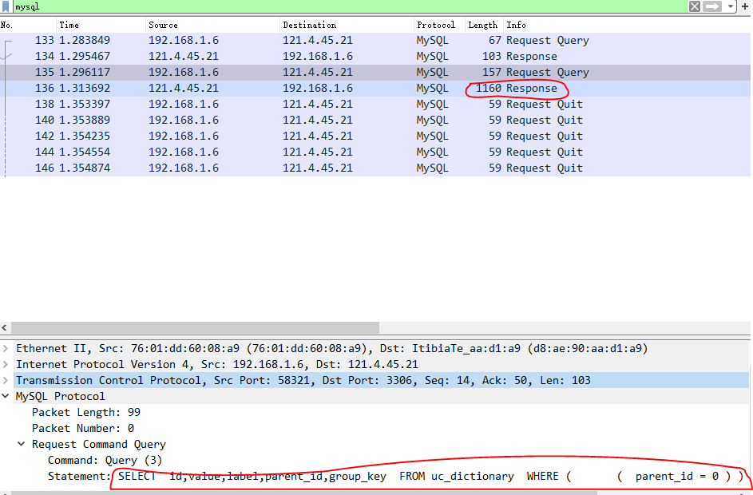
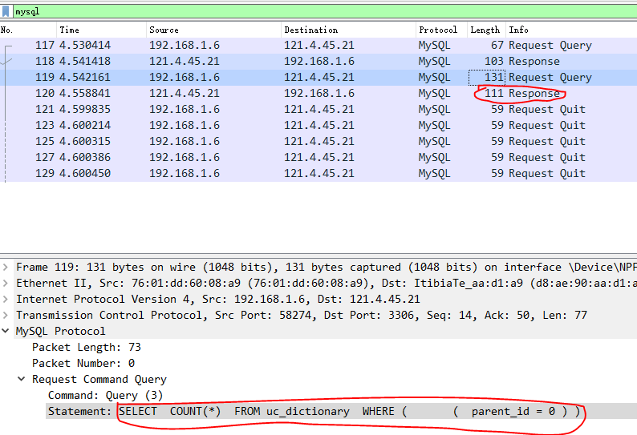

[TOC]


### 1. selectByExample(example).size() 替换为 selectCountByExample(example)

	```
	由 MySQL 去 count() 符合查询条件的数量而不是全查出来再计算由应用程序计算数量
	优化点：减少网络数据传输，减少 MySQL 查询时间(不一定，需要 explain 对比一下)
	```

---


### 2. SQL 查询的执行顺序


- `FROM/JOIN`和所有`ON`的查询条件
- `WHERE`
- `GROUP BY`
- `HAVING`
- `SELECT`(包括 window functions)
- `ORDER BY`
- `LIMIT`

> `注意：`[实际上数据库引擎会根据自己的优化调整此执行顺序](https://jvns.ca/blog/2019/10/03/sql-queries-don-t-start-with-select/)

- 示例

  ```xml
  <!-- 当查询条件包含了 where 中内容的时候，实际执行时间是要比不含 where 快的-->
  <select id="queryTaskAndOrder" parameterType="TaskDTO" resultType="TaskVo">
      SELECT
      task.*,
      IF(
      	(SELECT
      		task_order.id
      		FROM
      		task_order,
      		member
      		WHERE
      		task_order.task_id = task.id
      		AND member.id = task_order.member_id
      		AND ( task_order.member_name <> member.realname OR 				task_order.member_idcard <> member.idcard )
      		LIMIT 1
      	) IS NULL, 1, 0) AS realnameFlag
      FROM
      task
      <where>
          <if test="taskName != null and taskName !='' ">
              and task.task_name LIKE CONCAT(CONCAT('%', #{taskName, jdbcType=VARCHAR}),'%')
          </if>
      </where>
      order by
      <if test="taskType == null or taskType =='' ">
          realnameFlag ASC,
      </if>
      create_time DESC
  </select>
  ```

  

### 3. 小表 LEFT JOIN 大表/大表 RIGHT JOIN 小表 [About](https://www.jianshu.com/p/3a06b1814009)

### 4. 使用 GROUP BY 替换 DISTINCT

- DISTINCT

  ```sql
  # SELECT DISTINCT username FROM member
  ```

  - 普通字段

    `EXPLAIN 结果:`

    | id   | select_type | table  | partions | type    | possible_keys | key    | key_len | ref    | rows      | filtered   | Extra                |
    | ---- | ----------- | ------ | -------- | ------- | ------------- | ------ | ------- | ------ | --------- | ---------- | -------------------- |
    | 1    | SIMPLE      | member | (Null)   | **ALL** | (Null)        | (Null) | (Null)  | (Null) | **11787** | **100.00** | **Using  temporary** |

    

  - NORMAL 索引字段

    `EXPLAIN 结果:`**与加索引时 GROUP BY 的结果完全一样**

    | id   | select_type | table  | partions | type      | possible_keys | key          | key_len | ref    | rows     | filtered   | Extra                         |
    | ---- | ----------- | ------ | -------- | --------- | ------------- | ------------ | ------- | ------ | -------- | ---------- | ----------------------------- |
    | 1    | SIMPLE      | member | (Null)   | **range** | idx_username  | idx_username | 62      | (Null) | **2349** | **100.00** | **Using  index for group-by** |

- GROUP BY

  ```sql
  # SELECT username FROM member GROUP BY username
  ```

  - 普通字段

    `EXPLAIN 结果：` **相比 DISTINCT 多用了一个 filesort**

    | id   | select_type | table  | partions | type    | possible_keys | key    | key_len | ref    | rows      | filtered   | Extra                                |
    | ---- | ----------- | ------ | -------- | ------- | ------------- | ------ | ------- | ------ | --------- | ---------- | ------------------------------------ |
    | 1    | SIMPLE      | member | (Null)   | **ALL** | (Null)        | (Null) | (Null)  | (Null) | **11787** | **100.00** | **Using  temporary; Using filesort** |

    

  - NORMAL 索引字段

    `EXPLAIN 结果：`

    | id   | select_type | table  | partions | type      | possible_keys | key          | key_len | ref    | rows     | filtered   | Extra                         |
    | ---- | ----------- | ------ | -------- | --------- | ------------- | ------------ | ------- | ------ | -------- | ---------- | ----------------------------- |
    | 1    | SIMPLE      | member | (Null)   | **range** | idx_username  | idx_username | 62      | (Null) | **2349** | **100.00** | **Using  index for group-by** |

### 5. LIKE 模糊查询性能优化

- like 'xxx%' 可以用到索引而 '%xxx' 会全表扫描
- **LOCATE('xx', `field`) > 0 **| **POSITION('XX' IN `field`)** | **INSTR(`field`, 'xx')** | **CONCAT('%', 'XX', '%')** 等函数也会全表扫描，不走索引
- 5.6.4 版本以后的全文索引 FULLTEXT 对中文是无效的，可以通过增加一列中文拼音并对其添加全文索引实现全模糊查询
- [MySQL like 模糊查询性能优化](https://cloud.tencent.com/developer/article/1159624)


### 6. 深度分页的优化

> `背景:`

```
单表数据量超过 100w 时，limit 超过 100000，会导致全表扫描
```

- SELECT * FROM member WHERE create_time>'2021-02-07' ORDER BY create_time limit **1000,6**

| id   | select_type | table  | partions | type      | possible_keys   | key             | key_len | ref    | rows       | filtered   | Extra                     |
| ---- | ----------- | ------ | -------- | --------- | --------------- | --------------- | ------- | ------ | ---------- | ---------- | ------------------------- |
| 1    | SIMPLE      | member | (Null)   | **range** | idx_create_time | idx_create_time | 6       | (Null) | **257677** | **100.00** | **Using index condition** |

- SELECT * FROM member WHERE create_time>'2021-02-07' ORDER BY create_time limit **100000,6**

| id   | select_type | table  | partions | type    | possible_keys   | key    | key_len | ref    | rows       | filtered  | Extra                           |
| ---- | ----------- | ------ | -------- | ------- | --------------- | ------ | ------- | ------ | ---------- | --------- | ------------------------------- |
| 1    | SIMPLE      | member | (Null)   | **ALL** | idx_create_time | (Null) | (Null)  | (Null) | **552719** | **50.00** | **Using where; Using filesort** |

**`优化方案：`**

> 1. 使用上次分页的最大主键(需要是自增主键)值作为查询条件

- SELECT * FROM member WHERE create_time>'2021-02-07' AND **id > '616d2fe461e6c5fdec5a2ac0' **ORDER BY create_time limit **100000,6**  ----> **此方案不支持随机跳页**

| id   | select_type | table  | partions | type      | possible_keys           | key     | key_len | ref    | rows       | filtered  | Extra                           |
| ---- | ----------- | ------ | -------- | --------- | ----------------------- | ------- | ------- | ------ | ---------- | --------- | ------------------------------- |
| 1    | SIMPLE      | member | (Null)   | **range** | PRIMARY,idx_create_time | PRIMARY | 96      | (Null) | **301641** | **50.00** | **Using where; Using filesort** |

> 2. 使用覆盖索引的延迟关联

- SELECT * FROM member **INNER JOIN** (**SELECT id FROM member WHERE create_time>'2021-02-07' ORDER BY create_time limit 100000,6**) as t ON t.id=member.id

- `EXPLAIN` SELECT id FROM member WHERE create_time>'2021-02-07' ORDER BY create_time limit 100000,6

| id   | select_type | table  | partions | type      | possible_keys   | key             | key_len | ref    | rows       | filtered   | Extra                        |
| ---- | ----------- | ------ | -------- | --------- | --------------- | --------------- | ------- | ------ | ---------- | ---------- | ---------------------------- |
| 1    | SIMPLE      | member | (Null)   | **range** | idx_create_time | idx_create_time | 6       | (Null) | **301641** | **100.00** | **Using where; Using index** |

> 3. 使用索引覆盖的子查询(效果如上)

- SELECT * FROM member WHERE **id>=(SELECT id FROM member WHERE create_time>'2021-02-07' ORDER BY create_time LIMIT 100000,1) LIMIT 6**


### 7. Using filesort 的含义

> 当查询到的需要 sort 的数据大于 **SORT_BUFFER_SIZE** 的时候，就需要额外的**磁盘临时文件**来进行排序


### 8.SELECT ... IN(...)的优化

> IN 关联的字段如果是有顺序的，传入的列表**先做个排序再查询**会更好