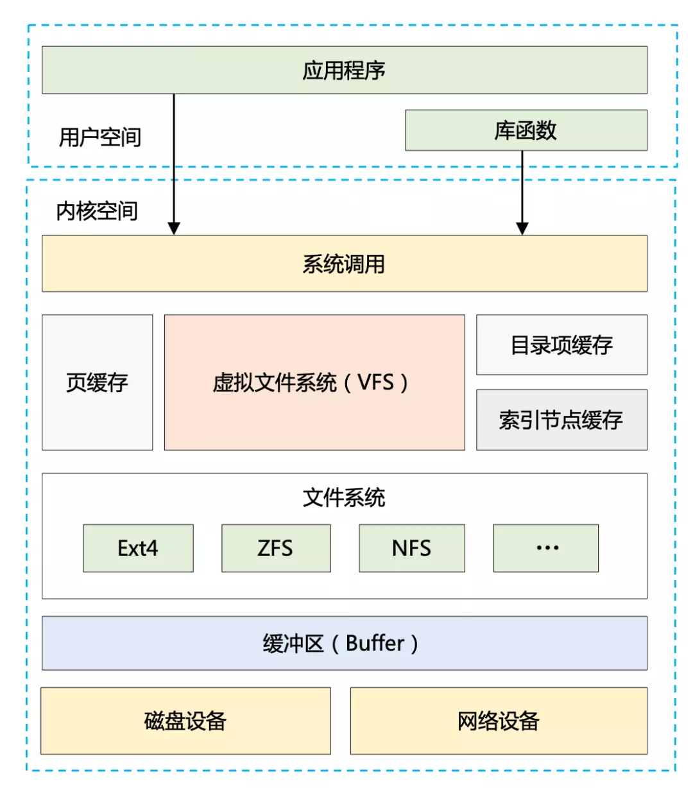

#### 高性能设计的【道】-- 计算和 IO

**计算层面：**

> 1. 让**更多的核**来参与计算：比如用多线程代替单线程、用集群代替单机等
> 2. **减少计算量**：比如用索引来取代全局扫描、用同步代替异步、通过限流来减少请求处理量、采用更高效的数据结构和算法

**IO 层面：**

> 1. **加快 IO 速度**：比如用磁盘顺序写代替随机写、用 NIO 代替 BIO、用性能更好的 SSD 代替机械硬盘等
> 2. **减少 IO 次数或者 IO 数据量**：比如借助系统缓存或者外部缓存、通过零拷贝技术减少 IO 复制次数、批量读写、数据压缩等