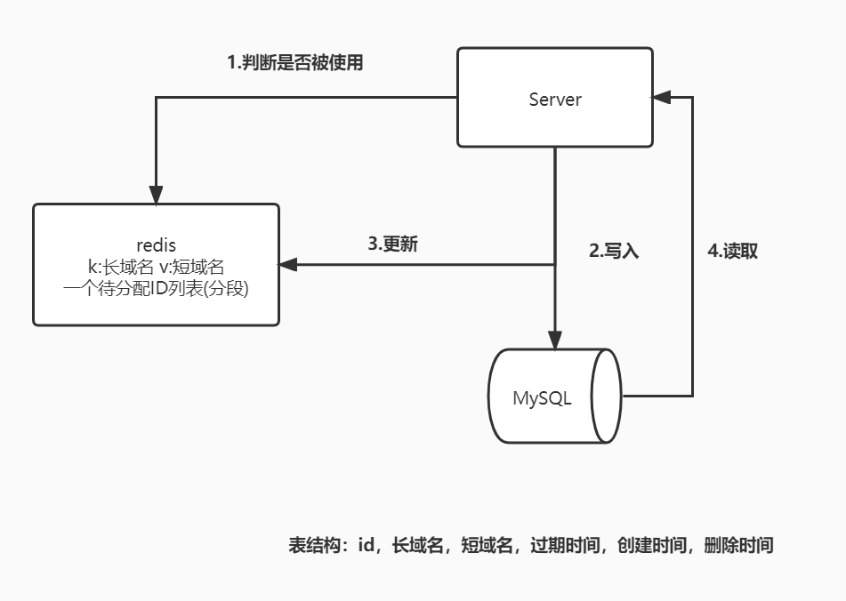

[TOC]

## 问题分析

> 设计一个短域名系统

- **输入**是什么

  > 一个冗长的域名，以及一个过期时间和一个自定义的别名

- **输出**是什么

  > 自定义别名或者随机生成的短域名，在过期时间到来前访问都可以被重定向到原始的冗长域名上

- **约束(需求性/系统指标类)**是什么

  - 过期后将失效
  - 短域名是唯一的
  - 支持自定义短域名，长度在 7 个字符(不含域名长度)，由 [0-9,a-z,A-Z] 62 位长等字符组成
  - QPS
    - 写 DAU = 100M --> QPS = 100M * 0.1(使用频率)/86400 = 1K --> 峰值 2K --> 预估值(增长) = 4K
    - 读 DAU = 100M --> QPS = 100M * 10/86400 = 115K --> 峰值 230K --> 预估值 460K
    - 这是一个**读多写少**的系统
  - 延迟：10ms 以内 (通常在 100ms - 200ms)
  - 存储：一条数据 100bytes/条 * 1500 * 60 * 60 * 24 * 365 = 20T/年
  - 可靠性：5 个 9(可运维性，可扩展性，迭代效率)
  - 安全性：防止被人爬取，盗用数据


## 方案设计 - 技术决策

### 可行解

```
1. 写接口
	a.输入长域名，判断是否曾经存储过，是的话不需要进一步存储
	b.生成一个从未使用过的短域名
	c.关联二者存储在持久化的 DB 中
2. 读接口
	a.获取短域名，判断是否有效，没有被存储过直接返回
	b.根据短域名查询长域名
	c.使用长域名通知客户端进行重定向
```

### 增加过期时间怎么处理？

```
1. 延迟删除 读取时判断过期时间决定是否删除，性能损失小，修改方便，存储空间利用效率低
2. 定时删除 定时器定时删除，存储空间利用率高，占用内存大，性能差
3. 轮询删除 后台逻辑周期性扫描全表清理过期元素，折中方案

由于延迟要求比较高，并且存储空间占用少，所以采用延迟删除。
在 db 中加入过期时间的时间戳，写入时计算读取时比较，如果过期就清除
```

### 如何保证短域名的唯一性？

```
1. 读时消重 返回的时候过滤掉重复元素(此处不适合，feed 流系统适合)
2. 写时消重 写时判断曾经写过避免重复写入(适合)
3. 唯一 ID 生成算法
4. UUID -> 截取 7 位有可能重复  pass
5. 哈希 -> MurmurHash 同样不能保证需要的长度截取
6. 自增 ID -> 62 位长，因此可以用 7 位 62 进制来生成唯一递增的 ID，利用数据库的自增主键

还要支持用户自定义？那需要一个索引(redis中-key:长域名+v:短域名)来记忆正在使用的 ID(过期删除时要更新索引)
维护一个待分配的 ID 列表段，为了防止大 key 可以分段存储，在数据过期或者自定义 ID 是进行更新
```



### 更优解

#### 吞吐量优化

```
1. 单机扛不住这个大的 QPS，需要水平扩展，因此需要 nginx 做负载均衡
2. 存储端优化吞吐量的方法无外乎分片、副本
```

#### 延迟优化

```
server 需要写 redis 与 mysql 需要三次网络调用，其延迟至少 100ms 以上，同时考虑短域名系统的全球化，
跨越过远的广域网络请求，延迟再增加 80ms，因此一次预估请求延迟在 200 ms

# 存储层
	1. 存储介质  数据表的业务逻辑简单，可以用 kv 存储，如 RocksDB，LevelDB，如果考虑数据分析的需求，
		可以将数据构建离线的 ELK 导入数仓
	2. 构建索引 写入时要判断长域名是否存在，因此要对长域名建立索引，读取时要根据短域名查询长域名因此也要
		在 redis 中建立索引
	3. 为了应对极高的写入 QPS，必须使用#分片存储#技术
# 缓存层
	1. 读多写少 适合缓存
	2. 对于判断长域名是否被存储过，以及短域名是否被分配过，可以构建 #布隆过滤器#
	3. 如果对延迟非常苛刻，完全可以使用 #本地缓存#，在本地构建一个 LRU 缓存来存储长短域名映射
	4. 短域名数据变化非常缓慢，可以考虑 #静态化# 技术，把数据发送给服务节点以文件的方式同步
# 业务层
	1. 通过 #尾号分片# 将 ID 生成器分布式化，基于 #预处理# 的思路可以分段缓存一部分未分配的短域名
	2. 分布式 ID 生成需要使用 zk 等组件处理 #数据一致性# 问题
	3. 使用 lua 脚本降低对 redis 的网络调用次数
# 拓扑层
	1. 就近访问机房
	2. 可以支持跨机房全球化的 #多重分片#，来应对同一地区 QPS 过高问题，使用 7 位数字中的首位进行一致性哈希
		(其哈希空间为 62 位)，后 6 位进行本机房内的 RocksGB 节点的分片
```

#### 可靠性优化

```
1. redis 等 kv 存储的集群模式部署
2. 提供跨机房级别的数据备份冗余，通过 kafka 与 binlog 的方式全量与增量的进行数据备份
3. 基于监控指标等阈值，来实现系统的熔断、限流、扩缩容等特性
```

#### 迭代效率，可运维性

```
1. 功能简单，没有迭代效率上的问题
2. 但是复杂的分布式软件必须保证可运维性，需要监控缓存的命中率，top 热点 URL 等
3. 监控 QPS 进行扩缩容，节省运维成本
```

#### 安全性

```
1. 如果使用自增 ID作为短域名，那么就有可能被人逐个遍历而被爬取
2. 使用 MurmurHash 算法转义为 7 位字符串(需要解决冲突，布隆过滤器)
3. 防止 DDOS 攻击等，要对 IP 限流和 IP 黑名单机制
```

### Bad Case 分析

```
1. 301 和 302 重定向的区别，301 永久重定向浏览器会缓存无法统计到访问次数，但会减少服务器压力
2. 分布式 ID 信号发生器，数据一致性以及跨机房同步等问题
```

