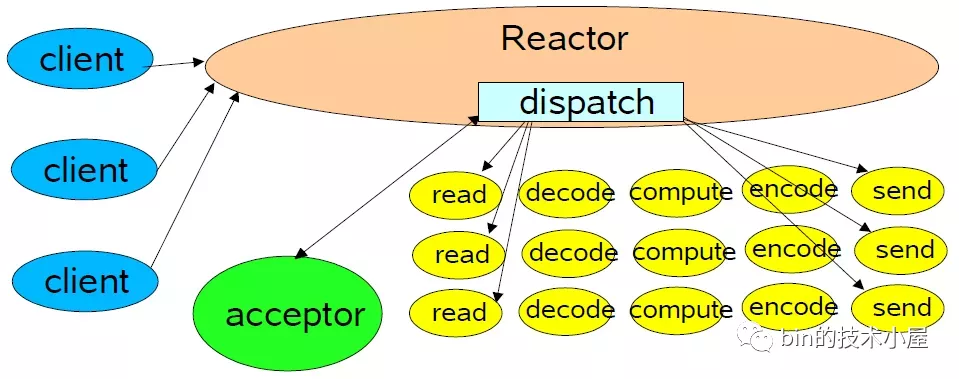
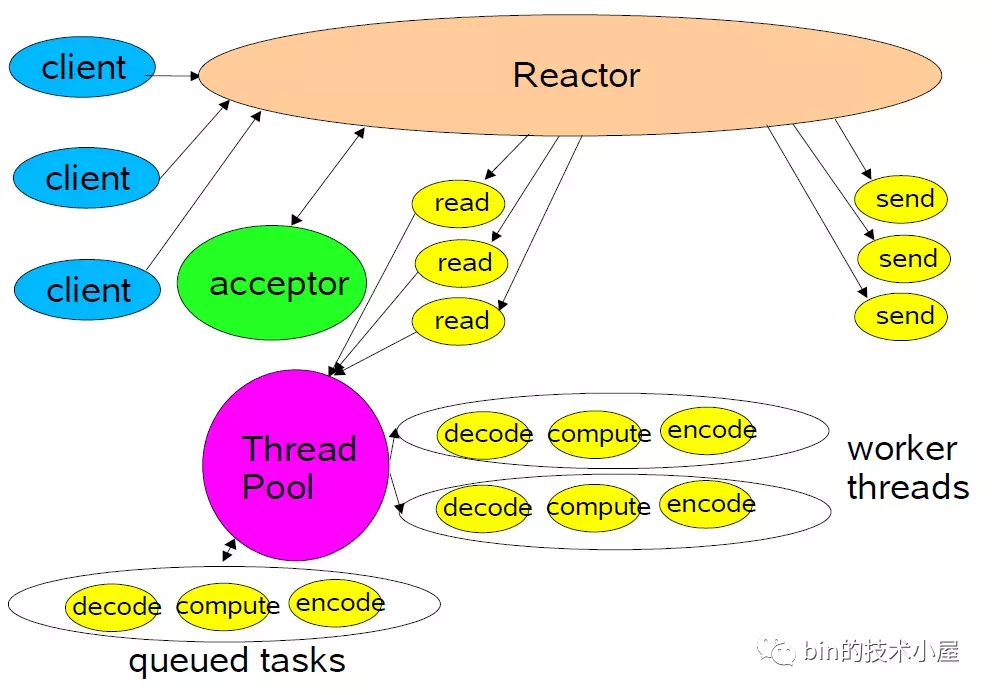
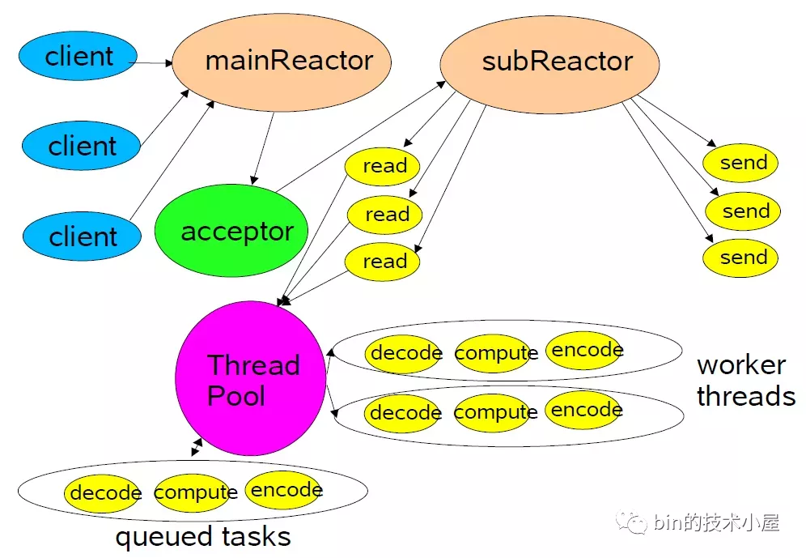
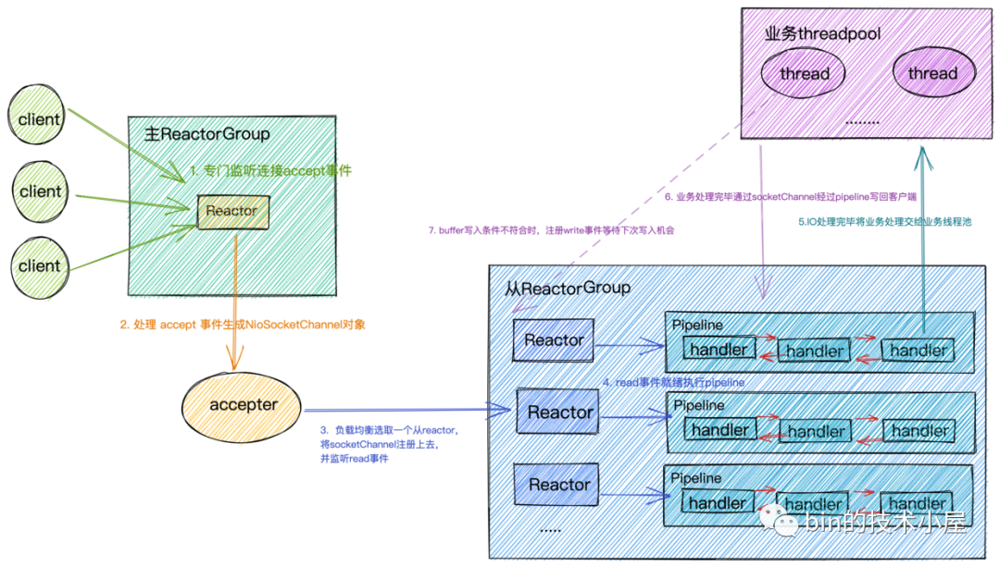

## Reactor 模型

> Reactor 是利用 NIO 对 IO线程 进行不同的分工：

- 使用 **IO多路复用模型** 比如 select,poll,epoll,kqueue ,进行 IO 事件的注册和监听。
- 将监听到 **就绪的IO事件** 分发 dispatch 到各个具体的处理 Handler 中进行相应的 IO事件处理 。


### 单 Reactor 单线程



- 单 Reactor 意味着只有一个 epoll 对象，用来监听所有的事件，比如 **连接事件** ， **读写事件**
- **单线程** 意味着只有一个线程来执行 **epoll_wait 获取 IO就绪 的 Socket** ，然后对这些就绪的 Socket 执行读写，以及后边的**业务处理也依然是这个线程**


### 单 Reacotr 多线程



- 这种模式下，也是只有一个 epoll 对象来监听所有的 IO事件 ，一个线程来调用 **epoll_wait** 获取 IO就绪 的 Socket
- 但是当 IO就绪事件 产生时，这些 IO事件 对应处理的业务 Handler ，我们是通过线程池来执行。这样相比 单Reactor单线程 模型提高了执行效率，充分发挥了多核CPU的优势


### 主从 Reactor 多线程



- 我们由原来的 单Reactor 变为了 多Reactor 。 主Reactor 用来优先 专门 做优先级最高的事情，也就是**迎接客人（ 处理连接事件 ）**，对应的处理 Handler 就是图中的 acceptor 
- 当创建好连接，建立好对应的 socket 后，在 acceptor 中**将要监听的 read事件 注册到 从Reactor 中，由 从Reactor 来监听 socket 上的 读写 事件**
- 最终将读写的业务逻辑处理交给线程池处理

> 注意：这里向 从Reactor 注册的只是 read事件 ，并没有注册 write事件 ，因为 read事件是由 epoll内核 触发的，而 write事件 则是由用户业务线程触发的（ 什么时候发送数据是由具体业务线程决定的 ），所以 write事件 理应是由 用户业务线程 去注册

> 用户线程注册 write事件 的时机是只有当用户发送的数据 **无法一次性** 全部写入 buffer
> 时，才会去注册 write事件 ，等待 buffer重新可写 时，继续写入剩下的发送数据、如果用户线程可以一股脑的将发送数据全部写入 buffer ，那么也就无需注册 write事件 到 从Reactor 中


## Netty 的 IO 模型



> 上述三种 Reactor模型 在 netty 中都是支持的，但是我们常用的是 **主从Reactor多线程模型 **

- Reactor 在 netty 中是以 **group** 的形式出现的， netty 中将 Reactor 分为两组，一组是 MainReactorGroup 也就是我们在编码中常常看到的 **EventLoopGroup bossGroup** ,另一组是 SubReactorGroup 也就是我们在编码中常常看到的 **EventLoopGroup workerGroup**
- MainReactorGroup 中通常只有**一个** Reactor ，专门负责做最重要的事情，也就是**监听连接 accept 事件**。当有连接事件产生时，在对应的处理 handler acceptor 中创建初始化相应的 **NioSocketChannel** （代表一个 Socket连接 ）。然后以 **负载均衡** 的方式在 SubReactorGroup 中选取一个 Reactor ，注册上去，监听 Read事件
- MainReactorGroup 中只有一个 Reactor 的原因是，通常我们服务端程序只会 绑定监听 一个端口，如果要 **绑定监听 多个端口，就会配置多个 Reactor**
- SubReactorGroup 中有多个 Reactor ，具体 Reactor 的个数可以由系统参数  -D io.netty.eventLoopThreads 指定。默认的 Reactor 的个数为 **CPU核数 * 2 。** **SubReactorGroup 中的 Reactor 主要负责监听 读写事件 ，每一个 Reactor 负责监听一组 socket连接** 。将全量的连接 **分摊** 在多个 Reactor 中
- **一个 Reactor 分配一个 IO线程** ，这个 IO线程 负责从 Reactor 中获取 IO就绪事件 ，执行 IO 调用获取IO数据 ，执行 **PipeLine**

> Socket连接 在创建后就被 固定的分配 给一个 Reactor ，所以一个 Socket连接 也只会被一个固定的 IO线程 执行，每个 Socket连接 分配一个独立的 PipeLine 实例，用来编排这个 Socket连接 上的 IO处理逻辑 。这种 无锁串行化 的设计的目的是为了防止多线程并发执行同一个socket连接上的 IO逻辑处理 ，防止出现 线程安全问题 。同时使系统吞吐量达到最大化

> 由于每个 Reactor 中只有一个 IO线程 ，这个 IO线程 既要执行 IO活跃Socket连接 对应的 PipeLine 中的 ChannelHandler ，又要从 Reactor 中获取 IO就绪事件 ，执行 IO调用 。所以 PipeLine 中 ChannelHandler 中执行的逻辑不能耗时太长，尽量将耗时的业务逻辑处理放入单独的业务线程池中处理，否则会影响其他连接的 IO读写 ，从而近一步影响整个服务程序的 IO吞吐

- 当 IO请求 在业务线程中完成相应的业务逻辑处理后，在业务线程中利用持有的 **ChannelHandlerContext 引用将响应数据在 PipeLine 中反向传播**，最终写回给客户端


### 配置单 Reactor 单线程

```java
EventLoopGroup eventGroup = new NioEventLoopGroup(1);
ServerBootstrap serverBootstrap = new ServerBootstrap();
serverBootstrap.group(eventGroup);
```


### 配置单 Reactor 多线程

```java
EventLoopGroup eventGroup = new NioEventLoopGroup();
ServerBootstrap serverBootstrap = new ServerBootstrap();
serverBootstrap.group(eventGroup);
```


### 配置主从 Reactor 多线程

```java
EventLoopGroup bossGroup = new NioEventLoopGroup(1);
EventLoopGroup workerGroup = new NioEventLoopGroup();
ServerBootstrap serverBootstrap = new ServerBootstrap();
serverBootstrap.group(bossGroup, workerGroup);
```

