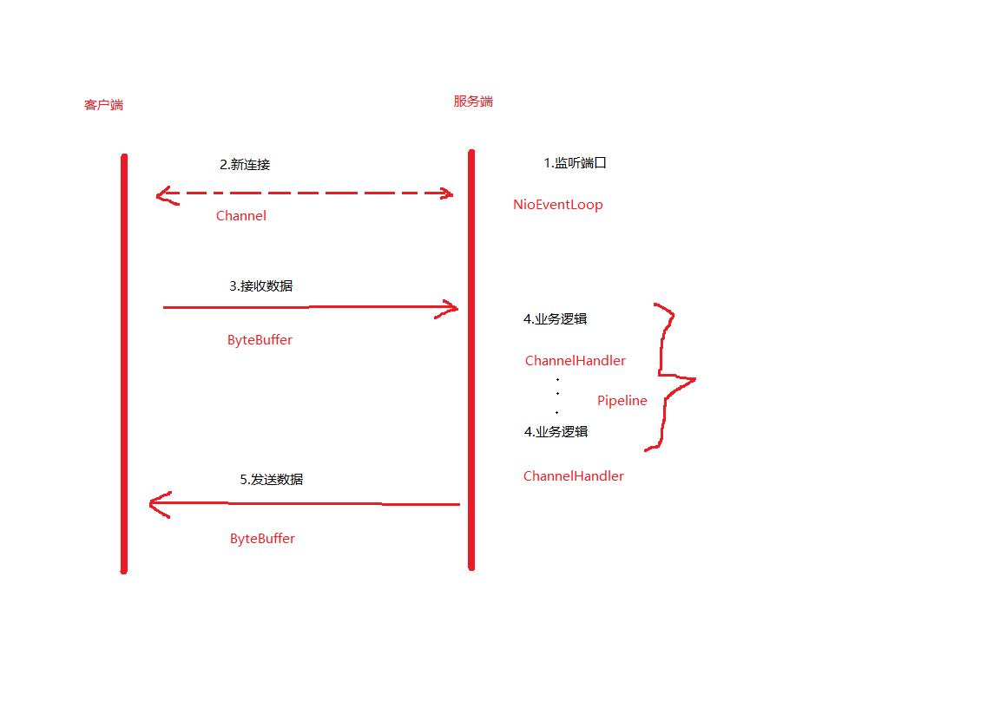

## 基本组件



*NioEventLoop*

```
NioEventLoop -> Thread(每个新连接新建一个处理线程的模型)
```

*Channel*

```
Channel -> Socket
```

*ByteBuffer*

*Pipeline*

```
Pipeline -> Logic Chain(逻辑处理链)
```

*ChannelHandler*

```
ChannelHandler -> Login(逻辑处理器)
```


## 服务端启动

**两个问题：**

```
1. 服务端的 socket 在哪里初始化？
2. 在哪里 accept 连接？
```

**启动过程：**

1. 创建服务端 Channel

   - 调用 JDK 底层API 创建 JDK Channel，然后包装成 Netty Channel，同时创建基本组件并绑定在其上

   - 代码入口：ChannelFuture f = serverBootstrap.bind(8888).sync();

     ```java
     1. AbstractBootstrap.bind()
     2. AbstractBootstrap.initAndRegister() // 初始化并注册
     3. ChannelFactory<T extends Channel>.newChannel() // 创建服务端 Channel
     ```

     

2. 初始化服务端 Channel

   - 初始化基本属性，添加一些逻辑处理器

3. 注册 Selector

   - 将底层 Channel 注册到事件轮询器 Selector 上，将 Netty Channel 作为 attachment 绑定到底层 Channel

4. 端口绑定

   - 调用 JDK 底层 API 实现对端口的绑定

