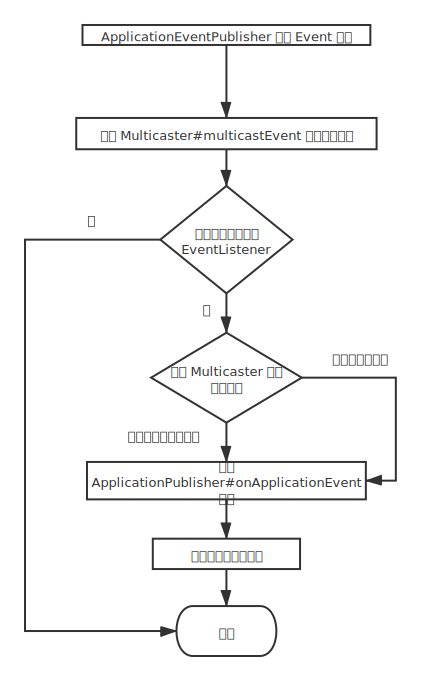

### 1. 简单使用

- **`ApplicationEventPublisher`** 发布事件

  ```java
  @Autowired
  ApplicationEventPublisher eventPublisher;
  
  // business code
  eventPublisher.publishEvent(msg);
  ```

- **`@EventListener`** 监听事件

  ```java
  @EventListener
  public void onApplicationEvent(PayloadApplicationEvent<LoginMsg> payload) {
      ValueOperations<String, String> ops = redisTemplate.opsForValue();
      ZSetOperations<String, String> zSet = redisTemplate.opsForZSet();
      LoginMsg loginMsg = payload.getPayload();
      String phone = loginMsg.getPhone();
      String openId = loginMsg.getOpenId();
      // 幂等校验 通过 redis 的 setnx 操作来进行幂等性保证
      Boolean absent = ops.setIfAbsent("login_add_integral_" + openId, phone);
      if (Boolean.FALSE.equals(absent)) {
          log.info("重复消费消息了哎");
      } else {
          ActivityDoubleTen doubleTen = activityService.selectOne(phone, openId);
          // 增加分享次数
          doubleTenMapper.shareCountIncrement(openId);
          // 加入到 redis 排行榜中
          zSet.add("zset", phone, doubleTen.newIntegral() + 10);
      }
  }
  ```

- **`@TransactionalEventListener`** 绑定事务操作监听事件

  > 例：可以在事务回滚后做一些补偿操作，@TransactionalEventListener(phase = TransactionPhase.AFTER_ROLLBACK)

  ```java
  @Async
  @TransactionalEventListener(phase = TransactionPhase.AFTER_COMMIT, fallbackExecution = true)
  public void changeServiceAdviser(PayloadApplicationEvent<CrmContract> event) {
      // phase = TransactionPhase.AFTER_COMMIT  在事务的什么阶段进行此操作
      // fallbackExecution = true 没有事务执行的时候是否还要执行此方法
      CrmContract contract = event.getPayload();
      updateBillServiceAdviser(contract.getContractNo(), contract.getServiceAdviser());
  }
  ```

- **`@Async`** 异步化事件监听器

- 实现 **`ApplicationListener`**

  ```java
  public class PayloadEventListener implements ApplicationListener {
      @Override
      public void onApplicationEvent(ApplicationEvent event) {
          // business logic
      }
  }
  ```

### 2. 流程图



### 3. 源码解析

- 初始化1：SpringApplication#run(String... args)   ConfigurableApplicationContext

```java
public ConfigurableApplicationContext run(String... args) {
	StopWatch stopWatch = new StopWatch();
	stopWatch.start();
	ConfigurableApplicationContext context = null;
	Collection<SpringBootExceptionReporter> exceptionReporters = new ArrayList<>();
	configureHeadlessProperty();
	SpringApplicationRunListeners listeners = getRunListeners(args);
	listeners.starting();
	try {
		ApplicationArguments applicationArguments = new DefaultApplicationArguments(args);
		ConfigurableEnvironment environment = prepareEnvironment(listeners, applicationArguments);
		configureIgnoreBeanInfo(environment);
		Banner printedBanner = printBanner(environment);
		context = createApplicationContext();
		exceptionReporters = getSpringFactoriesInstances(SpringBootExceptionReporter.class,
				new Class[] { ConfigurableApplicationContext.class }, context);
		prepareContext(context, environment, listeners, applicationArguments, printedBanner);
		refreshContext(context);
		afterRefresh(context, applicationArguments);
		stopWatch.stop();
		if (this.logStartupInfo) {
			new StartupInfoLogger(this.mainApplicationClass).logStarted(getApplicationLog(), stopWatch);
		}
		listeners.started(context);
		callRunners(context, applicationArguments);
	}
	catch (Throwable ex) {
		handleRunFailure(context, ex, exceptionReporters, listeners);
		throw new IllegalStateException(ex);
	}

	try {
		listeners.running(context);
	}
	catch (Throwable ex) {
		handleRunFailure(context, ex, exceptionReporters, null);
		throw new IllegalStateException(ex);
	}
	return context;
}
```

- 初始化2：AbstractApplicationContext#refresh()

```java
@Override
public void refresh() throws BeansException, IllegalStateException {
	synchronized (this.startupShutdownMonitor) {
		// Prepare this context for refreshing.
		// 刷新前准备 context
		prepareRefresh();

		// Tell the subclass to refresh the internal bean factory.
		// 通知子类 Context 刷新 BeanFactory
		ConfigurableListableBeanFactory beanFactory = obtainFreshBeanFactory();

		// Prepare the bean factory for use in this context.
		// 准备本 Context 要用到的 BeanFactory
		prepareBeanFactory(beanFactory);

		try {
			// Allows post-processing of the bean factory in context subclasses.
			// 后置处理
			postProcessBeanFactory(beanFactory);

			// Invoke factory processors registered as beans in the context.
			// 激活后置处理器
			invokeBeanFactoryPostProcessors(beanFactory);

			// Register bean processors that intercept bean creation.
			// 注册后置处理器
			registerBeanPostProcessors(beanFactory);

			// Initialize message source for this context.
			// 初始化 MessageSource
			initMessageSource();

			// Initialize event multicaster for this context.
			// 初始化事件广播器
			initApplicationEventMulticaster();

			// Initialize other special beans in specific context subclasses.
			// 初始化特定子类容器中的特定 bean
			onRefresh();

			// Check for listener beans and register them.
			// 检测并注册监听器
			registerListeners();

			// Instantiate all remaining (non-lazy-init) singletons.
			// 初始化所有单例(非懒加载的)bean
			finishBeanFactoryInitialization(beanFactory);

			// Last step: publish corresponding event.
			// 最后一步：发布相关事件
			finishRefresh();
		}

		catch (BeansException ex) {
			if (logger.isWarnEnabled()) {
				logger.warn("Exception encountered during context initialization - " +
						"cancelling refresh attempt: " + ex);
			}

			// Destroy already created singletons to avoid dangling resources.
			destroyBeans();

			// Reset 'active' flag.
			cancelRefresh(ex);

			// Propagate exception to caller.
			throw ex;
		}

		finally {
			// Reset common introspection caches in Spring's core, since we
			// might not ever need metadata for singleton beans anymore...
			resetCommonCaches();
		}
	}
}
```

- 初始化**广播器(ApplicationEventMulticaster)**：AbstractApplicationContext#`initApplicationEventMulticaster()`

```java
protected void initApplicationEventMulticaster() {
	ConfigurableListableBeanFactory beanFactory = getBeanFactory();
	if (beanFactory.containsLocalBean(APPLICATION_EVENT_MULTICASTER_BEAN_NAME)) {
        // 使用本地自定义的 ApplicationEventMulticater,需要将 bean 名称设置为 applicationEventMulticaster
		this.applicationEventMulticaster =
				beanFactory.getBean(APPLICATION_EVENT_MULTICASTER_BEAN_NAME, ApplicationEventMulticaster.class);
		if (logger.isTraceEnabled()) {
			logger.trace("Using ApplicationEventMulticaster [" + this.applicationEventMulticaster + "]");
		}
	}
	else {
        // 没有自定义的广播器就使用 SimpleApplicationEventMulticaster
		this.applicationEventMulticaster = new SimpleApplicationEventMulticaster(beanFactory);
        // 注册 bean
		beanFactory.registerSingleton(APPLICATION_EVENT_MULTICASTER_BEAN_NAME, this.applicationEventMulticaster);
		if (logger.isTraceEnabled()) {
			logger.trace("No '" + APPLICATION_EVENT_MULTICASTER_BEAN_NAME + "' bean, using " +
					"[" + this.applicationEventMulticaster.getClass().getSimpleName() + "]");
		}
	}
}
```

- 注册**监听器(ApplicationListener)**：AbstractApplicationContext#`registerListeners()`

```java
protected void registerListeners() {
	// Register statically specified listeners first.
	for (ApplicationListener<?> listener : getApplicationListeners()) {
		getApplicationEventMulticaster().addApplicationListener(listener);
	}

	// Do not initialize FactoryBeans here: We need to leave all regular beans
	// uninitialized to let post-processors apply to them!
	String[] listenerBeanNames = getBeanNamesForType(ApplicationListener.class, true, false);
	for (String listenerBeanName : listenerBeanNames) {
		getApplicationEventMulticaster().addApplicationListenerBean(listenerBeanName);
	}

	// Publish early application events now that we finally have a multicaster...
	Set<ApplicationEvent> earlyEventsToProcess = this.earlyApplicationEvents;
	this.earlyApplicationEvents = null;
	if (!CollectionUtils.isEmpty(earlyEventsToProcess)) {
		for (ApplicationEvent earlyEvent : earlyEventsToProcess) {
			getApplicationEventMulticaster().multicastEvent(earlyEvent);
		}
	}
}
```

