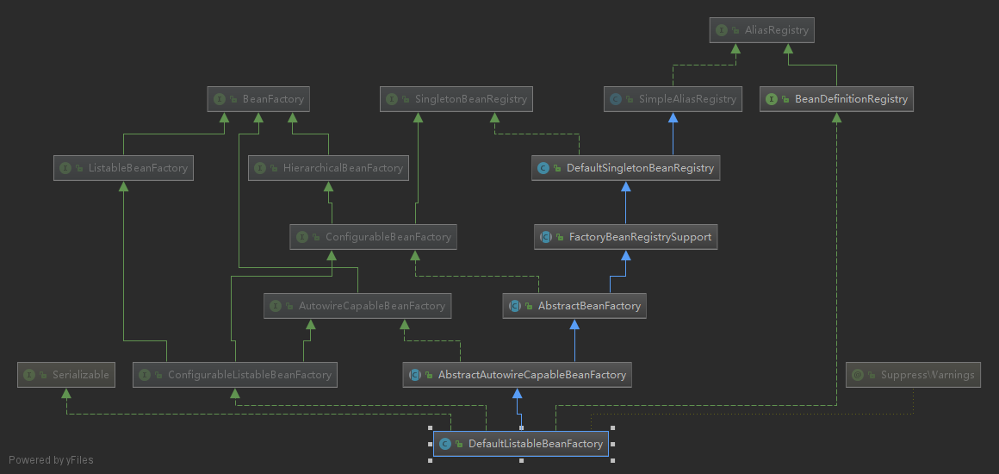
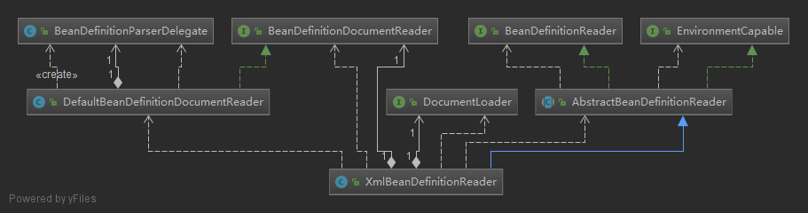
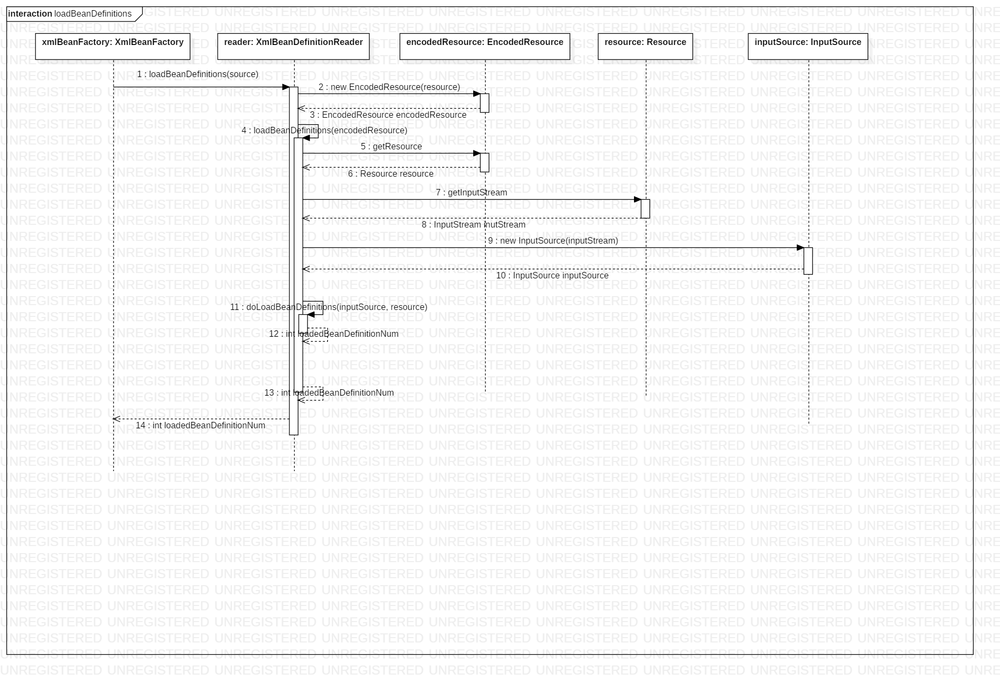

### 核心类介绍

#### 1. DefaultListableBeanFactory
		整个bean加载的核心部分，是Spring注册及加载bean的默认实现。XmlBeanFactory继承于它，不同是自定义了xml读取器XmlBeanDefinitionReader实现了个性化的BeanDefinitionReader读取。
        类签名 extends AbstractAutowireCapableBeanFactory implements ConfigurableListableBeanFactory, BeanDefinitionRegistry

	上图中各类的作用：
    AliasRegistry: 定义对于alias的简单操作
    SimpleAliasRegistry: 使用map对alias缓存
    SingletonBeanRegistry: 对单例的注册和获取
    BeanFactory: 获取bean和bean的各种属性
    DefaultSingletonBeanRegistry: SingletonBeanRegistry的实现
    HirarchicalBeanFactory: 在BeanFactory的基础上增加了对parentFactory的支持
    BeanDefinitionRegistry: 对BeanDefinition的各种增删改操作
    FactoryBeanRegistrySupport: 在DefaultSingletonBeanRegistry的基础上增加了对FactoryBean的特殊处理功能
    ConfigurableBeanFactory: 提供配置Factory的各种方法
    ListableBeanFactory: 根据各种条件获取bean的配置清单
    AbstractBeanFactory: 综合FactoryBeanRegistrySupport和ConfigurableBeanFactory的功能
    AutowireCapableBeanFactory: 提供创建bean、自动注入、初始化以及应用bean的后处理器
    AbstractAutowireCapableBeanFactory: 综合AbstractBeanFacroty和AutowireCapableBeanFatory
    ConfigurableListableBeanFactory: BeanFactory配置清单，指定忽略类型及接口等
    DefaultListableBeanFactory: 综合所有功能，主要是对bean注册后的处理

#### 2. XmlBeanDefinitionReader
	用于读取XML配置文件

	上图各类作用：
    ResourceLoader: 资源加载器，根据资源文件地址返回Resource（在AbstractBeanDefinitionReader中使用）
    BeanDefinitionReader: 定义资源文件读取并转换为BeanDefinition的各个功能
    EnvironmentCapable: 定义获取Environment方法
    DocumentLoader: 资源文件转换为Document
    AbstractBeanDefinitionReader: 对BeanDefinitionReader、EnvironmentCapable的功能进行实现
    BeanDefinitionDocumentReader: 定义读取Document并注册BeanDefinition
    BeanDefinitionParserDelegate: 定义解析Element的各种方法

#### 3. XmlBeanFactory
**分析 BeanFactory bf = new XmlBeanFactory(new ClassPathResource("text.xml"));**

	1） 配置文件封装
    	Resource接口封装底层资源，不同类型资源文件都有其实现：FileSystemResource、ClassPathResource、UrlResource、InputStreamResource、ByteArrayResource等
    2） 配置文件读取
    	Resource相关类对配置文件封装后，由XmlBeanDefinitionReader进行处理:this.reader.loadBeanDefinitions(resource)
    3） 加载Bean

		核心逻辑： doLoadBeanDefinitions(inputSource, encodedResource.getResource())，主要做了三件事：
        	A. 获取对XML文件的验证模式（DTD/XSD）
        	B. 加载XML文件，并得到对应的Document（DefaultDocumentLoader）
        	C. 根据返回的Document注册Bean信息