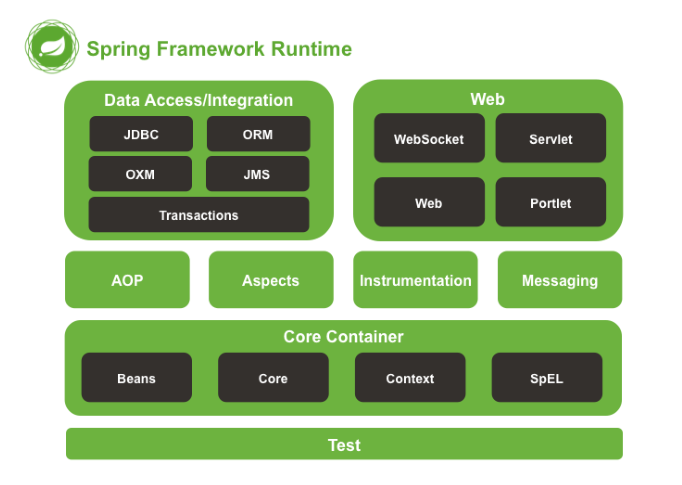

### 1.整体架构图

### 2. Core Container

	Core 模块
    	其他组件的基本核心
    Beans 模块
    	包含访问配置文件、创建和管理bean以及进行IOC/DI操作相关的所有类
    Context 模块
    	基于Core和Beans之上，继承了Beans的特性，为Spring核心提供了大量扩展，添加了对国际化、事件传播、资源加载和透明创建Context的支持
    SpEL(Expression Language) 模块
    	提供了强大的表达式语言，用于在运行时查询和操作对象

核心组件如何协同工作
	我们知道 Bean 包装的是 Object，而 Object 必然有数据，如何给这些数据提供生存环境就是 Context 要解决的问题，
    对 Context 来说他就是要发现每个 Bean 之间的关系，为它们建立这种关系并且要维护好这种关系。所以 Context 就是一个 Bean 关系的集合，
    这个关系集合又叫 Ioc 容器，一旦建立起这个 Ioc 容器后 Spring 就可以为你工作了。那 Core 组件又有什么用武之地呢？
    其实 Core 就是发现、建立和维护每个 Bean 之间的关系所需要的一些列的工具，从这个角度看来，Core 这个组件叫 Util 更能让你理解。
    [Spring 框架的设计理念与设计模式分析](https://www.ibm.com/developerworks/cn/java/j-lo-spring-principle/index.html)

### 3. Data Access/integration

    JDBC 模块
    	对JDBC的封装模块，提供了对关系数据库的访问
    ORM
    	提供了对hibernate5和JPA的集成
    OXM
    	java对象和XML文件的映射机制
    Transactions
    	简单而强大的事务管理功能，包括声明式事务和编程式事务
    JMS
    	提供了JMS集成框架，简化了JMS API的使用

### 4. Web

	为基于Web的程序提供了上下文

### 5. AOP

	# Aspects 模块提供了对 AspectJ 的集成支持
    # Instrumentation 模块提供了 class instrumentation 支持和 classloader 实现，使得可以在特定应用服务器上使用